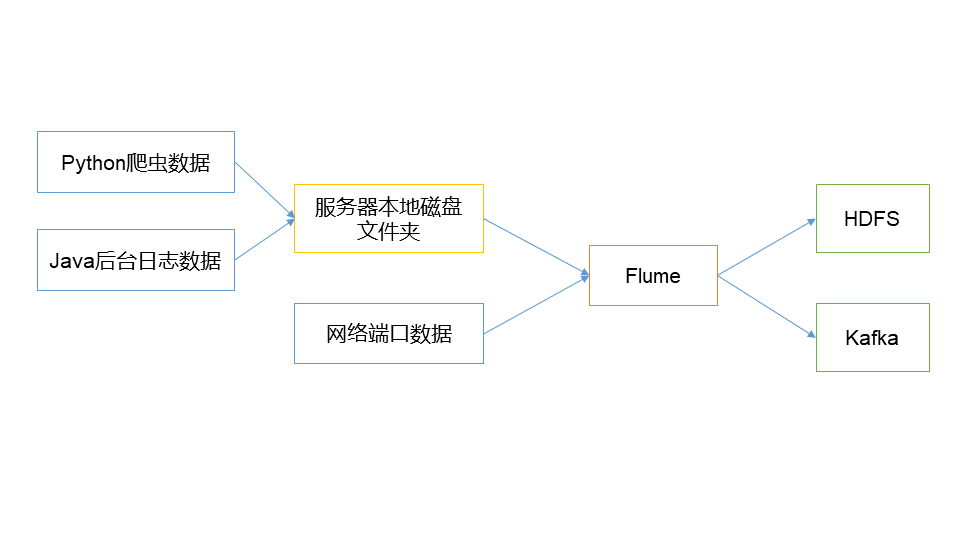

# TODO

* [ ] -
* [ ] flume配置文件正则 *2019-8-7 14:31:54*
* [ ] hive-hfds 官网参数 *2019-8-7 11:16:24*
* [ ] netcase 使用 *2019-8-7 10:03:11*


# 第1章 Flume概述

## 1.1 Flume定义

Flume是Cloudera提供的一个高可用的，高可靠的，分布式的**海量日志采集、聚合和传输的系统**。Flume基于流式架构，灵活简单。



Flume最主要的作用就是，实时读取服务器本地磁盘的谁，将数据写入到HDFS。

## 1.2 Flume基础架构


### 1.2.1 Agent

Agent是一个JVM进程，它以事件的形式将数据从源头送至目的。

Agent主要有3个部分组成，**Source**、**Channel**、**Sink**。

### 1.2.2 Source

Source是负责接收数据到Flume Agent的组件。Source组件可以处理各种类型、各种格式的日志数据，包括avro、thrift、exec、jms、spooling directory、netcat、sequence generator、syslog、http、legacy。

**avro** 两个flume的串联
**exec** 实时监控一个文件
**spooling directory** 监控一个目录
**netcat** 监控一个端口，两台节点间的数据传输

### 1.2.3 Sink

Sink不断地轮询Channel中的事件且批量地移除它们，并将这些事件批量写入到存储或索引系统、或者被发送到另一个Flume Agent。

Sink组件目的地包括hdfs、logger、avro、thrift、ipc、file、HBase、solr、自定义。

**hdfs** 文件存储目的地
**logger** 把采集到的数据打印为日志
**avro** 串联flume
**file** 区别于hdfs的文件存储端
**HBase** 非关系型数据库

### 1.2.4 Channel

**缓冲，解耦**

Channel是位于Source和Sink之间的缓冲区。因此，Channel允许Source和Sink运作在不同的速率上。Channel是线程安全的，可以同时处理几个Source的写入操作和几个Sink的读取操作。

Flume自带两种Channel：Memory Channel和File Channel。

**Memory Channel**是内存中的队列。Memory Channel在不需要关心数据丢失的情景下适用。如果需要关心数据丢失，那么Memory Channel就不应该使用，因为程序死亡、机器宕机或者重启都会导致数据丢失。

**File Channel**将所有事件写到磁盘。因此在程序关闭或机器宕机的情况下不会丢失数据。

File Channel更加可靠，重要数据存放在File Channel

### 1.2.5 Event

传输单元，Flume数据传输的基本单元，以Event的形式将数据从源头送至目的地。Event由**Header**和**Body**两部分组成，Header用来存放该event的一些属性，为K-V结构，Body用来存放该条数据，形式为字节数组。
一个agent在flume中的存在形式，传输过程数据被封装成一个event对象。


**Header** 中存放kv键值对
**Body** 中存放数据的字节数组

# 第2章 Flume快速入门

## 2.1 Flume安装部署

### 2.1.1 安装地址

[Flume官网地址](http://flume.apache.org/)

[文档查看地址](http://flume.apache.org/FlumeUserGuide.html)

[下载地址](http://archive.apache.org/dist/flume/)

### 2.1.2 安装部署

```powershell
scp ./apache-flume-1.7.0-bin.tar.gz tian@hadoop101:/opt/software/
```
```bash
tar -zxvf apache-flume-1.7.0-bin.tar.gz -C ../module/
mv apache-flume-1.7.0-bin flume
mv flume-env.sh.template flume-env.sh
vim flume-env.sh
# export JAVA_HOME=/opt/module/jdk1.8.0_144
```

## 2.2 Flume入门案例

### 2.2.1 监控端口数据官方案例

>**案例需求**
使用Flume监听一个端口，收集该端口数据，并打印到控制台。

>**需求分析**


>**实现步骤**
>
>```bash
># 安装netcat工具
>sudo yum install -y nc
># 判断4444端口是否被占用
>sudo netstat -tunlp | grep 4444
># 创建Flume Agent配置文件flume-netcat-logger.conf
>-- flume目录下创建job文件夹并进入job文件夹
>mkdir job
>cd job/
># job文件夹下创建Flume Agent配置文件flume-netcat-logger.conf
>vim flume-netcat-logger.conf
># 添加如下内容
>```
>
>```properties
># Name the components on this agent
>a1.sources = r1
>a1.sinks = k1
>a1.channels = c1
>
># Describe/configure the source
># The component type name, needs to be netcat
>a1.sources.r1.type = netcat 
># Host name or IP address to bind to
>a1.sources.r1.bind = hadoop201 
># Port # to bind to
>a1.sources.r1.port = 4444 
>
># Describe the sink
># The component type name, needs to be logger
>a1.sinks.k1.type = logger 
>
># Use a channel which buffers events in memory
># The component type name, needs to be memory
>a1.channels.c1.type = memory 
># The maximum number of events stored in the channel
>a1.channels.c1.capacity = 10000 
># The maximum number of events the channel will take from a source or give to a sink per transaction
>a1.channels.c1.transactionCapacity = 1000 
>
># Bind the source and sink to the channel
># one source may bind many channels
>a1.sources.r1.channels = c1 
>one sink can only bind one channel
>a1.sinks.k1.channel = c1
>```
>因为一个flume中可能有多个source和sink，所以需要指定source，sink分别与channel的关系。
>一个source可以对应多个channel
>一个sink只能对应一个channel
>
>[配置文件来源于官方手册](http://flume.apache.org/FlumeUserGuide.html)
>
>```bash
># 开启flume监听端口
># 写法一
>flume-ng agent --conf conf/ --name a1 --conf-file job/flume-netcat-logger.conf -Dflume.root.logger=INFO,console
># 写法二
>flume-ng agent -c conf/ -n a1 -f job/flume-netcat-logger.conf -Dflume.root.logger=INFO,console
>```
>参数说明
>```
>--conf/-c：表示配置文件存储在conf/目录
>--name/-n：表示给agent起名为a1
>--conf-file/-f：flume本次启动读取的配置文件是在job文件夹下的flume-telnet.conf文件。
>-Dflume.root.logger=INFO,console ：-D表示flume运行时动态修改flume.root.logger参数属性值，并将控制台日志打印级别设置为INFO级别。日志级别包括:log、info、warn、error。
>```
>```bash
># 使用netcat向本机的4444发送内容
>nc hadoo101 4444
>tian test
># ok
># 在Flume监听页面观察接收数据情况
>```

### 2.2.2 实时监控单个文件

> **需求**
> 实时监控Hive日志，并上传到HDFS中

> **需求分析**


> **实现步骤**
> 拷贝jar包到/opt/module/flume/lib/
>
> ```
> commons-configuration-1.6.jar
> hadoop-auth-2.7.2.jar
> hadoop-common-2.7.2.jar
> hadoop-hdfs-2.7.2.jar
> commons-io-2.4.jar
> htrace-core-3.1.0-incubating.jar
> ```
>
> ```bash
> vim flume-file-hdfs.conf
> ```
>
> ```properties
> # Name the components on this agent
> a2.sources = r2
> a2.sinks = k2
> a2.channels = c2
> 
> # Describe/configure the source
> # The component type name, needs to be exec
> a2.sources.r2.type = exec
> # The command to execute
> a2.sources.r2.command = tail -F /opt/module/datas/data.log
> # A shell invocation used to run the command. e.g. /bin/sh -c. 
> # Required only for commands relying on shell features like wildcards, 
> # back ticks, pipes etc.
> a2.sources.r2.shell = /bin/bash -c
> 
> # Describe the sink
> # The component type name, needs to be hdfs
> a2.sinks.k2.type = hdfs
> # HDFS directory path
> a2.sinks.k2.hdfs.path = hdfs://hadoop201:9000/flume/%Y%m%d/%H/%M
> # Name prefixed to files created by Flume in hdfs directory
> a2.sinks.k2.hdfs.filePrefix = logs-
> # Should the timestamp be rounded down 
> # (if true, affects all time based escape sequences except %t)
> a2.sinks.k2.hdfs.round = true
> # Rounded down to the highest multiple of this 
> # (in the unit configured using hdfs.roundUnit), less than cur
> a2.sinks.k2.hdfs.roundValue = 5
> # The unit of the round down value - second, minute or hour
> a2.sinks.k2.hdfs.roundUnit = minute
> # Use the local time (instead of the timestamp from the event header) 
> # while replacing the escape sequence
> a2.sinks.k2.hdfs.useLocalTimeStamp = true
> # number of events written to file before it is flushed to HDFS
> a2.sinks.k2.hdfs.batchSize = 100
> # Number of seconds to wait before rolling current file 
> # (0 = never roll based on time interval)
> a2.sinks.k2.hdfs.rollInterval = 10
> # Number of events written to file before it rolled 
> # (0 = never roll based on number of events)
> a2.sinks.k2.hdfs.rollSie = 134217700 # 128MB
> # File size to trigger roll, in bytes 
> # (0: never roll based on file size)
> a2.sinks.k2.hdfs.rollCount = 0
> # File format: currently SequenceFile, DataStream or CompressedStream 
> # (1)DataStream will not compress output file and please don’t set codeC 
> # (2)CompressedStream requires set hdfs.codeC with an available codeC
> a2.sinks.k2.hdfs.fileType = DataStream
> 
> # Use a channel which buffers events in memory
> a2.channels.c2.type = memory
> a2.channels.c2.capacity = 10000
> a2.channels.c2.transactionCapacity = 1000
> 
> # Bind the source and sink to the channel
> a2.sources.r2.channels = c2
> a2.sinks.k2.channel = c2
> ```
>
> ```bash
> # 使用工具自动生成日志文件到data.log
> java -jar /opt/module/jars/data-producer.jar /opt/module/datas/data.log
> # 运行flume
> flume-ng agent -c conf/ -n a1 -f job/exec-hdfs.conf
> # HDFS上查看生成的文件   
> ```

### 2.2.3 监控多个新文件

> **需求**
> 使用Flume监听整个目录的文件，并上传到HDFS

> **需求分析**


> **实现步骤**
>
> ```bash
> vim dir-hdfs.conf
> ```
>
> ```properties
> # Name the components on this agent
> a3.sources = r3
> a3.sinks = k3
> a3.channels = c3
> 
> # Describe/configure the source
> # The component type name, needs to be spooldir.
> a3.sources.r3.type = spooldir
> # The directory from which to read files from.
> a3.sources.r3.spoolDir = /opt/module/datas/flume/upload
> a3.sources.r3.fileSuffix = .COMPLETED
> # Regular expression specifying which files to include. 
> # It can used together with ignorePattern. 
> # a3.sources.r3.includePattern = \\S*\\.tmp
> # Regular expression specifying which files to ignore (skip). 
> # It can used together with includePattern. 
> # If a file matches both ignorePattern and includePattern regex, 
> # the file is ignored.
> a3.sources.r3.ignorePattern = \\S*\\.tmp
> 
> # Directory to store metadata related to processing of files. 
> # If this path is not an absolute path, 
> # then it is interpreted as relative to the spoolDir.
> a3.sources.r3.trackerDir = .flumespool
> 
> # Describe the sink
> a3.sinks.k3.type = hdfs
> a3.sinks.k3.hdfs.path = hdfs://hadoop201:9000/flume/upload/%Y%m%d/%H/%M
> a3.sinks.k3.hdfs.filePrefix = upload-
> a3.sinks.k3.hdfs.round = true
> a3.sinks.k3.hdfs.roundValue = 5
> a3.sinks.k3.hdfs.roundUnit = minute
> a3.sinks.k3.hdfs.useLocalTimeStamp = true
> a3.sinks.k3.hdfs.batchSize = 100
> a3.sinks.k3.hdfs.fileType = DataStream
> a3.sinks.k3.hdfs.rollInterval = 10
> a3.sinks.k3.hdfs.rollSize = 134217700
> a3.sinks.k3.hdfs.rollCount = 0
> 
> # Use a channel which buffers events in memory
> a3.channels.c3.type = memory
> a3.channels.c3.capacity = 10000
> a3.channels.c3.transactionCapacity = 1000
> 
> # Bind the source and sink to the channel
> a3.sources.r3.channels = c3
> a3.sinks.k3.channel = c3
> ```
>
> ```bash
> # 执行flume
> flume-ng agent -c conf/ -n a3 -f job/dir-hdfs.conf
> # 在upload文件夹增加文件
> mkdir upload
> vim dir-test.txt
> vim dir-test1.tmp
> # HDFS上查看数据
> ```

### 2.2.4 实时监控多个文件

Exec source适用于监控一个实时追加的文件，但不能保证数据不丢失；Spooldir Source能够保证数据不丢失，且能够实现断点续传，但延迟较高，不能实时监控；而Taildir Source既能够实现断点续传，又可以保证数据不丢失，还能够进行实时监控。

> **需求**
> 使用Flume监听整个目录的实时追加文件，并上传至HDFS

> **需求分析**


> **实现步骤**
>
> ```bash
> vim taildir-hdfs.conf
> ```
>
> ```properties
> # Name the components on this agent
> a4.sources = r4
> a4.sinks = k4
> a4.channels = c4
> 
> # Describe/configure the source
> # The component type name, needs to be TAILDIR.
> a4.sources.r4.type = TAILDIR
> # File in JSON format to record the inode, 
> # the absolute path and the last position of each tailing file.
> a4.sources.r4.positionFile = /opt/module/datas/flume/tail_dir.json
> # Space-separated list of file groups. 
> # Each file group indicates a set of files to be tailed.
> a4.sources.r4.filegroups = f1
> # Absolute path of the file group. 
> # Regular expression (and not file system patterns) can be used for filename only.
> a4.sources.r4.filegroups.f1 = /opt/module/datas/flume/upload/file.*
> 
> # Describe the sink
> a4.sinks.k4.type = hdfs
> a4.sinks.k4.hdfs.path = hdfs://hadoop201:9000/flume/upload/%Y%m%d/%H/%M
> a4.sinks.k4.hdfs.filePrefix = upload-
> a4.sinks.k4.hdfs.round = true
> a4.sinks.k4.hdfs.roundValue = 5
> a4.sinks.k4.hdfs.roundUnit = minute
> a4.sinks.k4.hdfs.useLocalTimeStamp = true
> a4.sinks.k4.hdfs.batchSize = 100
> a4.sinks.k4.hdfs.fileType = DataStream
> a4.sinks.k4.hdfs.rollInterval = 10
> a4.sinks.k4.hdfs.rollSize = 134217700
> a4.sinks.k4.hdfs.rollCount = 0
> 
> # Use a channel which buffers events in memory
> a4.channels.c4.type = memory
> a4.channels.c4.capacity = 10000
> a4.channels.c4.transactionCapacity = 1000
> 
> # Bind the source and sink to the channel
> a4.sources.r4.channels = c4
> a4.sinks.k4.channel = c4
> ```
> 
> ```bash
>flume-ng agent -c conf/ -n a4 -f job/taildir-hdfs.conf
> ```
> 
> ```bash
># 创建文件并持续追加
> mkdir upload
> echo hello >> upload/file1.txt
> echo hello >> upload/file1.txt
> echo hello >> upload/file1.txt
> # HDFS上查看数据
> ```

**Taildir说明**

​    Taildir Source维护了一个json格式的position File，其会定期的往position File中更新每个文件读取到的最新的位置，因此能够实现断点续传。Position File的格式如下：

```json
{"inode":2496272,"pos":12,"file":"/opt/module/flume/files/file1.txt"}
{"inode":2496275,"pos":12,"file":"/opt/module/flume/files/file2.txt"}
```

注：Linux中储存文件元数据的区域就叫做inode，每个inode都有一个号码，操作系统用inode号码来识别不同的文件，Unix/Linux系统内部不使用文件名，而使用inode号码来识别文件。

# 第3章 Flume进阶

## 3.1 Flume事务


## 3.2 Flume Agent内部原理


> **重要组件**
> **ChannelSelector**
> ChannelSelector的作用就是选出Event将要被发往哪个Channel。其共有两种类型，分别是Replicating（复制）和Multiplexing（多路复用）。
> **SinkProcessor**
> SinkProcessor共有三种类型，分别是DefaultSinkProcessor、LoadBalancingSinkProcessor和FailoverSinkProcessor
> DefaultSinkProcessor对应的是单个的Sink，LoadBalancingSinkProcessor和FailoverSinkProcessor对应的是Sink Group，LoadBalancingSinkProcessor可以实现负载均衡的功能，FailoverSinkProcessor可以实现故障转移的功能。

### 3.3.1 简单串联


这种模式是将多个flume顺序连接起来了，从最初的source开始到最终sink传送的目的存储系统。此模式不建议桥接过多的flume数量， flume数量过多不仅会影响传输速率，而且一旦传输过程中某个节点flume宕机，会影响整个传输系统。

### 3.3.2 复制和多路复用


Flume支持将事件流向一个或者多个目的地。这种模式可以将相同数据复制到多个channel中，或者将不同数据分发到不同的channel中，sink可以选择传送到不同的目的地。

### 3.3.3 负载均衡和故障转移


Flume支持使用将多个sink逻辑上分到一个sink组，sink组配合不同的SinkProcessor可以实现负载均衡和错误恢复的功能。

### 3.3.4 聚合


这种模式是我们最常见的，也非常实用，日常web应用通常分布在上百个服务器，大者甚至上千个、上万个服务器。产生的日志，处理起来也非常麻烦。用flume的这种组合方式能很好的解决这一问题，每台服务器部署一个flume采集日志，传送到一个集中收集日志的flume，再由此flume上传到hdfs、hive、hbase等，进行日志分析。

## 3.4 Flume企业开发案例

### 3.4.1 复制和多路复用

**案例需求**
使用Flume-1监控文件变动，Flume-1将变动内容传递给Flume-2，Flume-2负责存储到HDFS。同时Flume-1将变动内容传递给Flume-3，Flume-3负责输出到Local FileSystem。

**案例分析**


**实验步骤**

```bash
mkdir /opt/module/datas/flume
mkdir job/group1
vim job/group/file-flume.conf
vim job/group/hdfs-flume.conf
vim job/group/dir-flume.conf
```

```properties
# Name the components on this agent
a1.sources = r1
a1.sinks = k1 k2
a1.channels = c1 c2
a1.sources.r1.selector.type = replicating

# Describe/configure the source
a1.sources.r1.type = exec
a1.sources.r1.command = tail -F /opt/module/hive/logs/hive.log
a1.sources.r1.shell = /bin/bash -c

# Describe the sink
a1.sinks.k1.type = avro
a1.sinks.k1.hostname = hadoop101
a1.sinks.k1.port = 4141

a1.sinks.k2.type = avro
a1.sinks.k2.hostname = hadoop101
a1.sinks.k2.port = 4142

# Describe the channel
a1.channels.c1.type = memory
a1.channels.c1.capacity = 10000
a1.channels.c1.transactionCapacity = 1000

a1.channels.c2.type = memory
a1.channels.c2.capacity = 10000
a1.channels.c2.transactionCapacity = 1000

# Bind the source and sink to the channel
a1.sources.r1.channels = c1 c2
a1.sinks.k1.channel = c1
a1.sinks.k2.channel = c2
```

```properties
# Name the components on this agent
a2.sources = r1
a2.sinks = k1
a2.channels = c1

# Describe/configure the source
# source端的avro是一个数据接收服务
a2.sources.r1.type = avro
a2.sources.r1.bind = hadoop102
a2.sources.r1.port = 4141

# Describe the sink
a2.sinks.k1.type = hdfs
a2.sinks.k1.hdfs.path = hdfs://hadoop101:9000/flume2/%Y%m%d/%H
#上传文件的前缀
a2.sinks.k1.hdfs.filePrefix = flume2-
#是否按照时间滚动文件夹
a2.sinks.k1.hdfs.round = true
#多少时间单位创建一个新的文件夹
a2.sinks.k1.hdfs.roundValue = 1
#重新定义时间单位
a2.sinks.k1.hdfs.roundUnit = hour
#是否使用本地时间戳
a2.sinks.k1.hdfs.useLocalTimeStamp = true
#积攒多少个Event才flush到HDFS一次
a2.sinks.k1.hdfs.batchSize = 100
#设置文件类型，可支持压缩
a2.sinks.k1.hdfs.fileType = DataStream
#多久生成一个新的文件
a2.sinks.k1.hdfs.rollInterval = 600
#设置每个文件的滚动大小大概是128M
a2.sinks.k1.hdfs.rollSize = 134217700
#文件的滚动与Event数量无关
a2.sinks.k1.hdfs.rollCount = 0

# Describe the channel
a2.channels.c1.type = memory
a2.channels.c1.capacity = 10000
a2.channels.c1.transactionCapacity = 1000

# Bind the source and sink to the channel
a2.sources.r1.channels = c1
a2.sinks.k1.channel = c1
```

```properties
# Name the components on this agent
a3.sources = r1
a3.sinks = k1
a3.channels = c2

# Describe/configure the source
a3.sources.r1.type = avro
a3.sources.r1.bind = hadoop102
a3.sources.r1.port = 4142

# Describe the sink
a3.sinks.k1.type = file_roll
a3.sinks.k1.sink.directory = /opt/module/data/flume3

# Describe the channel
a3.channels.c2.type = memory
a3.channels.c2.capacity = 10000
a3.channels.c2.transactionCapacity = 1000

# Bind the source and sink to the channel
a3.sources.r1.channels = c2
a3.sinks.k1.channel = c2
```

```bash
flume-ng agent --conf conf/ --name a3 --conf-file job/group1/dir-flume.conf
flume-ng agent --conf conf/ --name a2 --conf-file job/group1/hdfs-flume.conf
flume-ng agent --conf conf/ --name a1 --conf-file job/group1/file-flume.con
start-dfs.sh
start-yarn.sh
java -jar /opt/module/jars/data-producer.jar /opt/module/datas/data.log
# 检查HDFS和本地目录
```

### 3.4.2 负载均衡和故障转移

**案例需求**
使用Flume1监控一个端口，其sink组中的sink分别对接Flume2和Flume3，采用FailoverSinkProcessor，实现故障转移的功能。

**需求分析**


**实现步骤**

```bash
mkdir job/group2
vim job/group2/netcat-flume.conf
vim job/group2/flume-console1.conf
vim job/group2/flume-console2.conf
```

```properties
# Name the components on this agent
a1.sources = r1
a1.channels = c1
a1.sinkgroups = g1
a1.sinks = k1 k2

# Describe/configure the source
a1.sources.r1.type = netcat
a1.sources.r1.bind = localhost
a1.sources.r1.port = 44444

a1.sinkgroups.g1.processor.type = failover
a1.sinkgroups.g1.processor.priority.k1 = 5
a1.sinkgroups.g1.processor.priority.k2 = 10
a1.sinkgroups.g1.processor.maxpenalty = 10000

# Describe the sink
a1.sinks.k1.type = avro
a1.sinks.k1.hostname = hadoop102
a1.sinks.k1.port = 4141

a1.sinks.k2.type = avro
a1.sinks.k2.hostname = hadoop102
a1.sinks.k2.port = 4142

# Describe the channel
a1.channels.c1.type = memory
a1.channels.c1.capacity = 1000
a1.channels.c1.transactionCapacity = 100

# Bind the source and sink to the channel
a1.sources.r1.channels = c1
a1.sinkgroups.g1.sinks = k1 k2
a1.sinks.k1.channel = c1
a1.sinks.k2.channel = c1
```

```properties
# Name the components on this agent
a2.sources = r1
a2.sinks = k1
a2.channels = c1

# Describe/configure the source
a2.sources.r1.type = avro
a2.sources.r1.bind = hadoop102
a2.sources.r1.port = 4141

# Describe the sink
a2.sinks.k1.type = logger

# Describe the channel
a2.channels.c1.type = memory
a2.channels.c1.capacity = 1000
a2.channels.c1.transactionCapacity = 100

# Bind the source and sink to the channel
a2.sources.r1.channels = c1
a2.sinks.k1.channel = c1
```

```prop
# Name the components on this agent
a3.sources = r1
a3.sinks = k1
a3.channels = c2

# Describe/configure the source
a3.sources.r1.type = avro
a3.sources.r1.bind = hadoop102
a3.sources.r1.port = 4142

# Describe the sink
a3.sinks.k1.type = logger

# Describe the channel
a3.channels.c2.type = memory
a3.channels.c2.capacity = 1000
a3.channels.c2.transactionCapacity = 100

# Bind the source and sink to the channel
a3.sources.r1.channels = c2
a3.sinks.k1.channel = c2

```

```bash
flume-ng agent --conf conf/ --name a3 --conf-file job/group2/flume-flume-console2.conf -Dflume.root.logger=INFO,console
flume-ng agent --conf conf/ --name a2 --conf-file job/group2/flume-flume-console1.conf -Dflume.root.logger=INFO,console
flume-ng agent --conf conf/ --name a1 --conf-file job/group2/flume-netcat-flume.conf
nc localhost 4444
# 查看console1和console2的打印日志
# killconsole2观察console3的控制台打印情况
jps -ml # 查看flume3进程
```

### 3.4.3 聚合

**案例需求**
hadoop102上的Flume-1监控文件/opt/module/group.log，
hadoop103上的Flume-2监控某一个端口的数据流，
Flume-1与Flume-2将数据发送给hadoop104上的Flume-3，Flume-3将最终数据打印到控制台。

**案例分析**


**实现步骤**

```bash
xsync /opt/module/flume/
mkdir job/group3 # 101
mkdir job/group3 # 102
mkdir job/group3 # 103
vim logger-flume1.conf
vim logger-flume2.conf
vim logger-flume3.conf
```

```properties
# Name the components on this agent
a1.sources = r1
a1.sinks = k1
a1.channels = c1

# Describe/configure the source
a1.sources.r1.type = exec
a1.sources.r1.command = tail -F /opt/module/group.log
a1.sources.r1.shell = /bin/bash -c

# Describe the sink
a1.sinks.k1.type = avro
a1.sinks.k1.hostname = hadoop104
a1.sinks.k1.port = 4141

# Describe the channel
a1.channels.c1.type = memory
a1.channels.c1.capacity = 10000
a1.channels.c1.transactionCapacity = 1000

# Bind the source and sink to the channel
a1.sources.r1.channels = c1
a1.sinks.k1.channel = c1
```

```properties
# Name the components on this agent
a2.sources = r1
a2.sinks = k1
a2.channels = c1

# Describe/configure the source
a2.sources.r1.type = netcat
a2.sources.r1.bind = hadoop103
a2.sources.r1.port = 44444

# Describe the sink
a2.sinks.k1.type = avro
a2.sinks.k1.hostname = hadoop104
a2.sinks.k1.port = 4141

# Use a channel which buffers events in memory
a2.channels.c1.type = memory
a2.channels.c1.capacity = 10000
a2.channels.c1.transactionCapacity = 1000

# Bind the source and sink to the channel
a2.sources.r1.channels = c1
a2.sinks.k1.channel = c1
```

```properties
# Name the components on this agent
a3.sources = r1
a3.sinks = k1
a3.channels = c1

# Describe/configure the source
a3.sources.r1.type = avro
a3.sources.r1.bind = hadoop104
a3.sources.r1.port = 4141

# Describe the sink
# Describe the sink
a3.sinks.k1.type = logger

# Describe the channel
a3.channels.c1.type = memory
a3.channels.c1.capacity = 10000
a3.channels.c1.transactionCapacity = 1000

# Bind the source and sink to the channel
a3.sources.r1.channels = c1
a3.sinks.k1.channel = c1
```

```bash
flume-ng agent --conf conf/ --name a3 --conf-file job/group3/flume3-flume-logger.conf -Dflume.root.logger=INFO,console # 103
flume-ng agent --conf conf/ --name a2 --conf-file job/group3/flume1-logger-flume.conf # 101
flume-ng agent --conf conf/ --name a1 --conf-file job/group3/flume2-netcat-flume.conf # 102
echo hello >> group.log # 102
telnet hadoop101 4444 # 101
# 检查hadoop103数据
```

## 3.5 自定义Interceptor


## 3.6 自定义Source


## 3.7 自定义Sink


## 3.8 Flume数据流监控

### 3.8.1 Ganglia的安装与部署


### 3.8.2 操作Flume测试监控


| 字段（图表名称）      | 字段含义                            |
| --------------------- | ----------------------------------- |
| EventPutAttemptCount  | source尝试写入channel的事件总数量   |
| EventPutSuccessCount  | 成功写入channel且提交的事件总数量   |
| EventTakeAttemptCount | sink尝试从channel拉取事件的总数量。 |
| EventTakeSuccessCount | sink成功读取的事件的总数量          |
| StartTime             | channel启动的时间（毫秒）           |
| StopTime              | channel停止的时间（毫秒）           |
| ChannelSize           | 目前channel中事件的总数量           |
| ChannelFillPercentage | channel占用百分比                   |
| ChannelCapacity       | channel的容量                       |

# 第4章 企业真实面试题（重点）

## 4.1 你是如何实现Flume数据传输的监控的

使用第三方框架Ganglia实时监控Flume。

## 4.2 Flume的Source，Sink，Channel的作用？你们Source是什么类型？

​       1、作用

（1）Source组件是专门用来收集数据的，可以处理各种类型、各种格式的日志数据，包括avro、thrift、exec、jms、spooling directory、netcat、sequence generator、syslog、http、legacy

（2）Channel组件对采集到的数据进行缓存，可以存放在Memory或File中。

（3）Sink组件是用于把数据发送到目的地的组件，目的地包括Hdfs、Logger、avro、thrift、ipc、file、Hbase、solr、自定义。

2、我公司采用的Source类型为：

（1）监控后台日志：exec

（2）监控后台产生日志的端口：netcat

Exec  spooldir

## 4.3 Flume的Channel Selectors

   

## 4.4 Flume参数调优

\1. Source

增加Source个（使用Tair Dir Source时可增加FileGroups个数）可以增大Source的读取数据的能力。例如：当某一个目录产生的文件过多时需要将这个文件目录拆分成多个文件目录，同时配置好多个Source 以保证Source有足够的能力获取到新产生的数据。

batchSize参数决定Source一次批量运输到Channel的event条数，适当调大这个参数可以提高Source搬运Event到Channel时的性能。

\2. Channel 

type 选择memory时Channel的性能最好，但是如果Flume进程意外挂掉可能会丢失数据。type选择file时Channel的容错性更好，但是性能上会比memory channel差。

使用file Channel时dataDirs配置多个不同盘下的目录可以提高性能。

Capacity 参数决定Channel可容纳最大的event条数。transactionCapacity 参数决定每次Source往channel里面写的最大event条数和每次Sink从channel里面读的最大event条数。**transactionCapacity需要大于Source和Sink的batchSize参数。**

\3. Sink 

增加Sink的个数可以增加Sink消费event的能力。Sink也不是越多越好够用就行，过多的Sink会占用系统资源，造成系统资源不必要的浪费。

batchSize参数决定Sink一次批量从Channel读取的event条数，适当调大这个参数可以提高Sink从Channel搬出event的性能。

## 4.5 Flume的事务机制

Flume的事务机制（类似数据库的事务机制）：Flume使用两个独立的事务分别负责从Soucrce到Channel，以及从Channel到Sink的事件传递。比如spooling directory source 为文件的每一行创建一个事件，一旦事务中所有的事件全部传递到Channel且提交成功，那么Soucrce就将该文件标记为完成。同理，事务以类似的方式处理从Channel到Sink的传递过程，如果因为某种原因使得事件无法记录，那么事务将会回滚。且所有的事件都会保持到Channel中，等待重新传递。

## 4.6 Flume采集数据会丢失吗?

根据Flume的架构原理，Flume是不可能丢失数据的，其内部有完善的事务机制，Source到Channel是事务性的，Channel到Sink是事务性的，因此这两个环节不会出现数据的丢失，唯一可能丢失数据的情况是Channel采用memoryChannel，agent宕机导致数据丢失，或者Channel存储数据已满，导致Source不再写入，未写入的数据丢失。

Flume不会丢失数据，但是有可能造成数据的重复，例如数据已经成功由Sink发出，但是没有接收到响应，Sink会再次发送数据，此时可能会导致数据的重复。