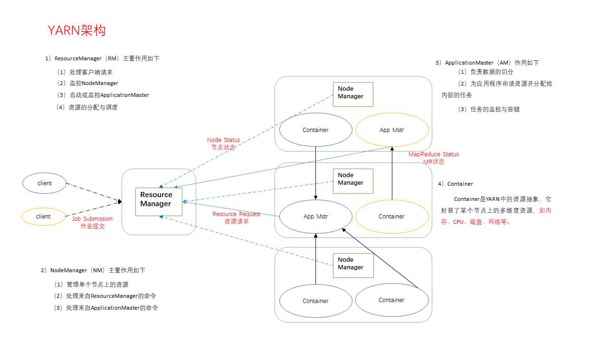
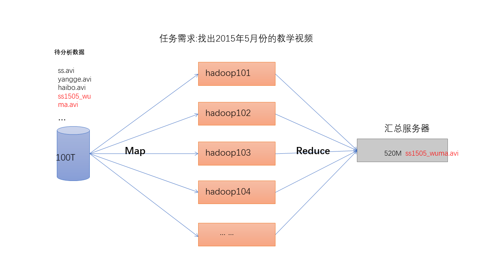

# Hadoop入门
## 一、大数据概览
### 1.大数据部门业务流程分析
产品需求
数据部门搭建数据平台、分析数据指标
数据可视化（报表展示、邮件发送、大屏幕展示）

### 2.大数据部门组织结构（重点）

#### 2.1 平台组
Hadoop、Flume、Kafka、HBase、Spark等框架平台搭建
集群性能监控
集群性能调优

#### 2.2 数据仓库组
ETL工程师-数据清洗
Hive工程师-数据分析、数据仓库建模

#### 2.3 数据挖掘组
算法工程师
推荐系统工程师
用户画像工程师

#### 2.4 报表开发组
JavaEE工程师

## 二、Hadoop框架和大数据生态

### 1.Hadoop优势
**高可靠性**Hadoop底层维护多个数据副本，所以即使Hadoop某个计算元素或存储出现故障，也不会导致数据的丢失
**高扩展性**在集群间分配任务数据，可方便的扩展数以千计的节点
**高效性**在MapReduce思想下，Hadoop时并行工作的，以加快任务处理速度
**高容错性**能够自动将失败的任务重新分配

### 2.Hadoop组成（面试重点）

#### **Hadoop1.x和Hadoop2.x区别**

>**Hadoop1.x组成**
MapReduce（计算+资源调度）
HDFS（数据存储）
Common（辅助工具）

>**Hadoop2.x组成**
MapReduce
Yarn
HDFS
Common

在Hadoop1.x时代，Hadoop中的MapReduce同时处理业务逻辑运算和资源的调度，耦合性较大，在Hadoop2.x时代，增加了Yarn。Yarn只负责资源的调度，MapReduce只负责运算。

#### 2.1 HDFS架构概述
HDFS（Hadoop Distributed File System）
**NameNode**(nn):存储文件的元数据，如文件名，文件目录结构，文件属性（生成时间、副本数、文件权限），以及每个文件的块列表和块的所在DataNode
**DataNode**(dn):在本地文件系统存储文件块数据，以及块数据的校验和
**Secondary NameNode**(2nn):用来监控HDFS状态的辅助后台程序，每隔一段时间获取HDFS元数据的快照。

#### 2.2 YARN架构概述
**ResourceManager**(RM)主要作用
处理客户端请求
监控NodeManager
启动或监控ApplicationMaster
资源的分配与调度
**NodeManager**(NM)主要作用
管理单个节点上的资源
处理来自ResourceManager的命令
处理来自ApplicationMaster的命令



#### 2.3 MapReduce架构概述
**Map**阶段并行处理输入数据
**Reduce**阶段对Map结果进行汇总



### 3.大数据生态体系


**1）Sqoop**：Sqoop是一款开源的工具，主要用于在Hadoop、Hive与传统的数据库(MySql)间进行数据的传递，可以将一个关系型数据库（例如 ：MySQL，Oracle 等）中的数据导进到Hadoop的HDFS中，也可以将HDFS的数据导进到关系型数据库中。
**2）Flume**：Flume是Cloudera提供的一个高可用的，高可靠的，分布式的海量日志采集、聚合和传输的系统，Flume支持在日志系统中定制各类数据发送方，用于收集数据；同时，Flume提供对数据进行简单处理，并写到各种数据接受方（可定制）的能力。
**3）Kafka**：Kafka是一种高吞吐量的分布式发布订阅消息系统，有如下特性：
（1）通过O(1)的磁盘数据结构提供消息的持久化，这种结构对于即使数以TB的消息存储也能够保持长时间的稳定性能。
（2）高吞吐量：即使是非常普通的硬件Kafka也可以支持每秒数百万的消息。
（3）支持通过Kafka服务器和消费机集群来分区消息。
（4）支持Hadoop并行数据加载。
**4）Storm**：Storm用于“连续计算”，对数据流做连续查询，在计算时就将结果以流的形式输出给用户。
**5）Spark**：Spark是当前最流行的开源大数据内存计算框架。可以基于Hadoop上存储的大数据进行计算。
**6）Oozie**：Oozie是一个管理Hdoop作业（job）的工作流程调度管理系统。
**7）Hbase**：HBase是一个分布式的、面向列的开源数据库。HBase不同于一般的关系数据库，它是一个适合于非结构化数据存储的数据库。
**8）Hive**：Hive是基于Hadoop的一个数据仓库工具，可以将结构化的数据文件映射为一张数据库表，并提供简单的SQL查询功能，可以将SQL语句转换为MapReduce任务进行运行。 其优点是学习成本低，可以通过类SQL语句快速实现简单的MapReduce统计，不必开发专门的MapReduce应用，十分适合数据仓库的统计分析。
**10）R语言**：R是用于统计分析、绘图的语言和操作环境。R是属于GNU系统的一个自由、免费、源代码开放的软件，它是一个用于统计计算和统计制图的优秀工具。
**11）Mahout**：Apache Mahout是个可扩展的机器学习和数据挖掘库。
**12）ZooKeeper**：Zookeeper是Google的Chubby一个开源的实现。它是一个针对大型分布式系统的可靠协调系统，提供的功能包括：配置维护、名字服务、 分布式同步、组服务等。ZooKeeper的目标就是封装好复杂易出错的关键服务，将简单易用的接口和性能高效、功能稳定的系统提供给用户。

### 4.推荐系统框架


## 三、Hadoop运行环境搭建（开发重点）
### 1.虚拟机

```bash
#修改配置
vim /etc/udev/rules.d/70-persistent-net.rules
#删除第一个配置，把第二个的eth1改成eth0，copy ATTR{address}
vim /etc/sysconfig/network-scripts/ifcfg-eth0
#修改HWADDR为刚才复制的内容
#修改IP地址
vim /etc/sysconfig/network #修改主机名
vim /etc/hosts #修改hosts文件

#创建用户并授权
ll /home/ #查看所有用户目录
userdel -r tian #级联删除用户
useradd tian
passwd tian
id tian #查看用户
vim /etc/sudoers #
#tian ALL=(ALL)    NOPASSWD:ALL
sudo chown tian:tian module/ soft/ -R
```
```
DEVICE=eth0
HWADDR=00:0c:29:cc:ca:bd #修改
TYPE=Ethernet
UUID=5acab641-18f5-4e2a-b705-b168980da744
ONBOOT=yes
NM_CONTROLLED=yes
BOOTPROTO=static
IPADDR=192.168.2.100 #修改
PREFIX=24
GATEWAY=192.168.2.2
DNS1=192.168.2.2 
```

### 2.JDK
如果JDK版本低于1.8则卸载重装
JDK环境变量配置
```
#JAVA_HOME
export JAVA_HOME=/opt/module/jdk1.8.0_144
export PATH=$PATH:$JAVA_HOME/bin
```
### 3.Hadoop
Hadoop环境变量配置
```
##HADOOP_HOME
export HADOOP_HOME=/opt/module/hadoop-2.7.2
export PATH=$PATH:$HADOOP_HOME/bin
export PATH=$PATH:$HADOOP_HOME/sbin
```

### 4.Hadoop目录结构
**bin**存放对Hadoop相关服务（HDFS,YARN）进行操作的脚本
**etc**Hadoop的配置文件目录，存放Hadoop的配置文件
**lib**存放Hadoop的本地库（对数据进行压缩解压缩功能）
**sbin**存放启动或停止Hadoop相关服务的脚本
**share**存放Hadoop的依赖jar包、文档、和官方案例

重点配置文件


***视频14***

## 四、Hadoop运行模式

Hadoop运行模式包括：本地模式、伪分布式模式以及完全分布式模式。
[Hadoop官方网站](http://hadoop.apache.org/)

### 1.本地运行模式

```bash
hadoop fs -mkdir /opt/module/myData #创建文件夹
hadoop fs -put LICENSE.txt /opt/module/myData/ #上传文件
hadoop fs -ls /opt/module/myData/ #查看文件
hadoop fs -get /opt/module/myData/LICENSE.txt  /home/tian #获取文件
```
#### 1.1 官方Grep案例

```bash
cd /opt/module/hadoop-2.7.2
mkdir input #创建输入文件夹
cp etc/hadoop/*.xml input #拷贝所有配置文件到input文件夹
bin/hadoop jar share/hadoop/mapreduce/hadoop-mapreduce-examples-2.7.2.jar grep input output 'dfs[a-z.]+' #执行share目录下的mapreduce程序
cat output/* #查看输出结果
```

#### 1.2 官方WordCount案例

```bash
cd /opt/module/hadoop-2.7.2
mkdir wcinput
cd wcinput
vim wc.input #写入内容
vim tset.c #写入内容
cd /opt/module/hadoop-2.7.2
#执行woldcount
hadoop jar share/hadoop/mapreduce/hadoop-mapreduce-example-2.7.2.jar wordcout wcinput wcoutput
cat wcoutput/part-r-00000 #查看输出
```
### 2.伪分布式运行模式

#### 2.1 启动HDFS并进行MapReduce程序

>分析
配置集群
启动、测试集群增删查
执行WordCount案例

**配置集群**

```bash
#配置：hadoop-env.sh
echo $JAVA_HOME #按需要获取并修改JDK安装路径
vim etc/hadoop/hadoop-env.sh #添加JAVA_HOME
vim etc/hadoop/core-site.xml #配置：core-site.xml
vim etc/hadoop/hdfs-site.xml #配置：hdfs-site.xml
```

```xml
<!-- 指定HDFS中NameNode的地址 -->
<property>
<name>fs.defaultFS</name>
    <value>hdfs://hadoop100:9000</value>
</property>

<!-- 指定Hadoop运行时产生文件的存储目录 -->
<property>
	<name>hadoop.tmp.dir</name>
	<value>/opt/module/hadoop-2.7.2/data/tmp</value>
</property>
```

```xml
<!-- 指定HDFS副本的数量 -->
<property>
	<name>dfs.replication</name>
	<value>1</value>
</property>
```

**启动集群**
```bash
bin/hdfs namenode -format #格式化NameNode，只在第一次启动时格式化
sbin/hadoop-daemon.sh start namenode #启动namenode
sbin/hadoop-daemon.sh start datanode #启动datanode
```

**查看集群**
```bash
jps #jdk命令，查看是否启动了namenode datanode
ls /opt/module/hadoop-2.7.2/logs #查看log日志，解决遇到的bug
cat hadoop-tian-datanode-hadoop101.log
```
[web端查看HDFS文件系统](http://tian:50070/dfshealth.html#tab-overview)
[如果不能查看点击这里](http://www.cnblogs.com/zlslch/p/6604189.html)

>***注意***
格式化NameNode，会产生新的集群id,导致NameNode和DataNode的集群id不一致，集群找不到已往数据。
所以，格式NameNode时，一定要先删除data数据和log日志，然后再格式化NameNode。
```bash
cat data/tmp/dfs/name/current/VERSION #查看namenode的CID
cat data/tmp/dfs/data/current/VERSION #查看datanode的CID
```
**操作集群**
```bash
#在HDFS文件系统上创建一个input文件夹
cd /opt/module/hadoop-2.7.2
bin/hdfs dfs -mkdir -p /user/tian/input
#将测试文件内容上传到文件系统上
bin/hdfs dfs -put wcinput/wc.input /user/tian/input/
#查看上传的文件是否正确
bin/hdfs dfs -ls  /user/tian/input/
bin/hdfs dfs -cat  /user/tian/ input/wc.input
#运行MapReduce程序
bin/hadoop jar share/hadoop/mapreduce/hadoop-mapreduce-examples-2.7.2.jar wordcount /user/tian/input/ /user/tian/output
#查看输出结果
bin/hdfs dfs -cat /user/tian/output/*
#将测试文件下载到本地
hdfs dfs -get /user/tian/output/part-r-00000 ./wcoutput/
#删除输出结果
hdfs dfs -rm -r /user/tian/output
```
#### 2.2 启动YARN并运行MapReduce程序

>分析
配置集群在YARN上运行MR
启动、测试集群增、删、查
在YARN上执行WordCount案例

**配置集群**

```bash
#配置：yarn-env.sh
echo $JAVA_HOME #按需要获取并修改JDK安装路径
vim etc/hadoop/yarn-env.sh #添加JAVA_HOME
source etc/hadoop/yarn-env.sh
#配置core-site.xml
vim etc/hadoop/core-site.xml
```
```xml
<!-- 配置yarn-site.xml -->
<!-- Reducer获取数据的方式 -->
<property>
 		<name>yarn.nodemanager.aux-services</name>
 		<value>mapreduce_shuffle</value>
</property>

<!-- 指定YARN的ResourceManager的地址 -->
<property>
<name>yarn.resourcemanager.hostname</name>
<value>hadoop100</value>
</property>
```
```bash
#对mapred-site.xml.template重新命名为mapred-site.xml
mv mapred-site.xml.template mapred-site.xml
vi mapred-site.xml
```
```xml
<!-- 指定MR运行在YARN上 -->
<property>
		<name>mapreduce.framework.name</name>
		<value>yarn</value>
</property>
```
**启动集群**
```bash
#启动前保证namenode和datanode已经启动
#启动ResourceManager
hadoop-2.7.2]$ sbin/yarn-daemon.sh start resourcemanager
#启动NodeManager
hadoop-2.7.2]$ sbin/yarn-daemon.sh start nodemanager
```

**集群操作**

[Web页面查看YARN](http://hadoop100:8088/cluster)

```bash
#删除文件系统的output文件
hadoop-2.7.2]$ bin/hdfs dfs -rm -R /user/tian/output
#启动mapreduce
bin/hadoop jar share/hadoop/mapreduce/hadoop-mapreduce-examples-2.7.2.jar wordcount /user/tian/input  /user/tian/output
#查看运行结果
hadoop-2.7.2]$ bin/hdfs dfs -cat /user/tian/output/*
```

#### 2.3 配置历史服务器

查看程序的历史运行情况，需要配置一下历史服务器

```bash
#配置mapred-site.xml
vi mapred-site.xml
#启动历史服务器
sbin/mr-jobhistory-daemon.sh start historyserver
jps #查看历史服务器是否启动
```
```xml
<!-- 历史服务器端地址 -->
<property>
<name>mapreduce.jobhistory.address</name>
<value>hadoop100:10020</value>
</property>
<!-- 历史服务器web端地址 -->
<property>
    <name>mapreduce.jobhistory.webapp.address</name>
    <value>hadoop100:19888</value>
</property>
```

[查看JobHistory](http://hadoop100:19888/jobhistory)

#### 2.4 配置日志的聚集

>**概念**：应用运行完成以后，将程序运行日志信息上传到HDFS系统上。
**优点**：可以方便的查看到程序运行详情，方便开发调试。
**注意**：开启日志聚集功能，需要重新启动NodeManager 、ResourceManager和HistoryManager。

**开启步骤**
```bash
vim yarn-site.xml
```
```xml
<!-- 日志聚集功能 -->
<property>
<name>yarn.log-aggregation-enable</name>
<value>true</value>
</property>

<!-- 日志保留时间设置7天 -->
<property>
<name>yarn.log-aggregation.retain-seconds</name>
<value>604800</value>
</property>
```
```bash
#重启NodeManager 、ResourceManager和HistoryServer
sbin/yarn-daemon.sh stop resourcemanager
sbin/yarn-daemon.sh stop nodemanager
sbin/mr-jobhistory-daemon.sh stop historyserver
sbin/yarn-daemon.sh start resourcemanager
sbin/yarn-daemon.sh start nodemanager
sbin/mr-jobhistory-daemon.sh start historyserver

#删除HDFS上已经存在的输出文件
bin/hdfs dfs -rm -R /user/tian/output

#执行WordCount程序
hadoop jar share/hadoop/mapreduce/hadoop-mapreduce-examples-2.7.2.jar wordcount /user/tian/input /user/tian/output
```

[Web查看日志](http://hadoop100:19888/jobhistory)

#### 2.5 配置文件说明

Hadoop配置文件分两类：默认配置文件和自定义配置文件，只有用户想修改某一默认配置值时，才需要修改自定义配置文件，更改相应属性值。

**默认配置文件**

要获取的默认文件	|	文件存放在Hadoop的jar包中的位置
:-:|:-:
[core-default.xml] |	hadoop-common-2.7.2.jar/ core-default.xml
[hdfs-default.xml]|	hadoop-hdfs-2.7.2.jar/ hdfs-default.xml
[yarn-default.xml]|	hadoop-yarn-common-2.7.2.jar/ yarn-default.xml
[mapred-default.xml]|	hadoop-mapreduce-client-core-2.7.2.jar/ mapred-default.xml

自定义配置文件
*core-site.xml*、*hdfs-site.xml*、*yarn-site.xml*、*mapred-site.xml*四个配置文件存放在$HADOOP_HOME/etc/hadoop这个路径上，用户可以根据项目需求重新进行修改配置。


### 3.完全分布式运行模式（开发重点）

>**分析**
准备3台客户机（关闭防火墙、静态ip、主机名称）
安装JDK
配置环境变量
安装Hadoop
配置环境变量
配置集群
单点启动
配置ssh
群起并测试集群

### 3.1 准备虚拟机


### 3.2 编写集群分发脚本xsync

**scp**
scp可以实现服务器与服务器之间的数据拷贝
```bash
###语法
scp -r $pdir/$fname $user@hadoop$host:$pdir/$fname
#在hadoop101上，将hadoop101中/opt/module目录下的软件拷贝到hadoop102上
scp -r /opt/module  root@hadoop102:/opt/module
#在hadoop103上，将hadoop101服务器上的/opt/module目录下的软件拷贝到hadoop103上
sudo scp -r tian@hadoop101:/opt/module root@hadoop103:/opt/module
#在hadoop103上操作将hadoop101中/opt/module目录下的软件拷贝到hadoop104上
scp -r tian@hadoop101:/opt/module root@hadoop104:/opt/module
###注意：拷贝过来的/opt/module目录，别忘了在hadoop102、hadoop103、hadoop104上修改所有文件的，所有者和所有者组。sudo chown tian:tian -R /opt/module

#将hadoop101中/etc/profile文件拷贝到hadoop102的/etc/profile上。
sudo scp /etc/profile root@hadoop102:/etc/profile
#将hadoop101中/etc/profile文件拷贝到hadoop103的/etc/profile上。
sudo scp /etc/profile root@hadoop103:/etc/profile
#将hadoop101中/etc/profile文件拷贝到hadoop104的/etc/profile上。
sudo scp /etc/profile root@hadoop104:/etc/profile
###注意：拷贝过来的配置文件别忘了source一下/etc/profile
```

**rsync**
rsync主要用于备份和镜像。具有速度快、避免复制相同内容和支持符号链接的优点
**rsync和scp区别**：用rsync做文件的复制要比scp的速度快，rsync只对差异文件做更新。scp是把所有文件都复制过去
```bash
#语法
#命令   选项参数   要拷贝的文件路径/名称    目的用户@主机:目的路径/名称
rsync -av $pdir/$fname $user@hadoop$host:$pdir/$fname
```
选项|功能
:-:|:-:
-a|归档拷贝
-v|显示复制过程

```bash
#把hadoop101机器上的/opt/software目录同步到hadoop102服务器的root用户下的/opt/目录
rsync -av /opt/software/ hadoop102:/opt/software
```

**xsync**
>**需求**循环复制文件到所有节点的相同目录下

>**需求分析**
rsync命令原始拷贝：rsync -av /opt/module root@hadoop103:/opt/
期望脚本：xsync要同步的文件名称
说明：在/home/tian/bin这个目录下存放的脚本，tian用户可以在系统任何地方直接执行

```bash
a）在/home/tian目录下创建bin目录，并在bin目录下xsync创建文件，文件内容如下：
mkdir bin
cd bin/
touch xsync
vi xsync #在该文件中编写如下代码
#---------------------------------------------------------------
#!/bin/bash
#1 获取输入参数个数，如果没有参数，直接退出
pcount=$#
if ((pcount==0)); then
echo no args;
exit;
fi

#2 获取文件名称
p1=$1
fname=`basename $p1`
echo fname=$fname

#3 获取上级目录到绝对路径
pdir=`cd -P $(dirname $p1); pwd`
echo pdir=$pdir

#4 获取当前用户名称
user=`whoami`

#5 循环
for((host=103; host<105; host++)); do
        echo ------------------- hadoop$host ------------------- 
        rsync -av $pdir/$fname $user@hadoop$host:$pdir
done
#----------------------------------------------------------------
#修改脚本 xsync 具有执行权限
chmod 777 xsync
#调用脚本形式：xsync 文件名称
xsync /home/tian/bin
#注意：如果将xsync放到/home/tian/bin目录下仍然不能实现全局使用，可以将xsync移动到/usr/local/bin目录下。
```
***视频07***

### 3.3 集群配置

**集群部署规划**
-|hadoop101|hadoop102|hadoop103
:-:|:-|:-|:-
**HDFS**|NameNode<br>DataNode|DataNode|SecondaryNameNode<br>DataNode
**YARN**|NodeManager|ResourceManager<br>NodeManager|NodeManager

**配置集群**

>**注意**
人为均衡多个服务器的负载
***视频09***

```bash
#配置核心core-site.xml
vim core-site.xml
#配置hadoop-env.sh
echo $JAVA_HOME
vim hadoop-env.sh #添加JAVA_HOME
#配置hdfs-site.xml
vim hdfs-site.xml
#YARN配置文件
vim yarn-env.sh #添加JAVA_HOME
vi yarn-site.xml 
#MapReduce配置文件
vim mapred-env.sh #添加JAVA_HOME
cp mapred-site.xml.template mapred-site.xml #重命名
vim mapred-site.xml
```
```xml
<!-- core-site.xml -->
<!-- 指定HDFS中NameNode的地址 -->
<property>
		<name>fs.defaultFS</name>
      <value>hdfs://hadoop101:9000</value>
</property>

<!-- 指定Hadoop运行时产生文件的存储目录 -->
<property>
		<name>hadoop.tmp.dir</name>
		<value>/opt/module/hadoop-2.7.2/data/tmp</value>
</property>
```
```xml
<!-- hdfs-site.xml -->
<property>
		<name>dfs.replication</name>
		<value>3</value>
</property>

<!-- 指定Hadoop辅助名称节点主机配置 -->
<property>
      <name>dfs.namenode.secondary.http-address</name>
      <value>hadoop103:50090</value>
</property>
```
```xml
<!-- yarn-site.xml  -->
<!-- Reducer获取数据的方式 -->
<property>
        <name>yarn.nodemanager.aux-services</name>
        <value>mapreduce_shuffle</value>
</property>

<!-- 指定YARN的ResourceManager的地址 -->
<property>
        <name>yarn.resourcemanager.hostname</name>
        <value>hadoop102</value>
</property>
```
```xml
<!-- mapred-site.xml -->
<!-- 指定MR运行在Yarn上 -->
<property>
        <name>mapreduce.framework.name</name>
        <value>yarn</value>
</property>
```
```bash
#在集群上分发配置好的Hadoop配置文件
xsync /opt/module/hadoop-2.7.2/
#查看文件分发情况
cat /opt/module/hadoop-2.7.2/etc/hadoop/core-site.xml
```

### 3.4 集群单点启动

```bash
#如果集群是第一次启动，需要格式化NameNode
hdfs namenode -format
#在hadoop101上启动NameNode
hadoop-daemon.sh start namenode
jps
#3461 NameNode
#在hadoop101、hadoop102以及hadoop103上分别启动DataNode
hadoop-daemon.sh start datanode
jps
#3461 NameNode
#3608 Jps
#3561 DataNode
hadoop-daemon.sh start datanode
jps
#3190 DataNode
#3279 Jps
hadoop-daemon.sh start datanode
jps
#3237 Jps
#3163 DataNode
```
***视频10***

### 3.5 ssh免密登录

```bash
#生成公钥和私钥：
ssh-keygen -t rsa #三次回车
#将公钥拷贝到要免密登录的目标机器上
ssh-copy-id hadoop100
ssh-copy-id hadoop101
ssh-copy-id hadoop102
ssh-copy-id hadoop103
ssh-copy-id hadoop104
ssh-copy-id hadoop105
ssh-copy-id hadoop106
```

.ssh子文件 | 描述
:-:|:-
known_hosts |	记录ssh访问过计算机的公钥(public key)
id_rsa |	生成的私钥
id_rsa.pub|	生成的公钥
authorized_keys|	存放授权过得无密登录服务器公钥


### 3.6 群起集群


**配置slaves**
```bash
##配置slaves
vim /opt/module/hadoop-2.7.2/etc/hadoop/slaves
```

```
hadoop101
hadoop102
hadoop103
```
***注意***：该文件中添加的内容结尾不允许有空格，文件中不允许有空行。
```bash
#同步所有节点配置文件
xsync slaves
```

**启动集群**
```bash
#如果集群是第一次启动，需要格式化NameNode（注意格式化之前，一定要先停止上次启动的所有namenode和datanode进程，然后再删除data和log数据）
bin/hdfs namenode -format #101
#启动HDFS
sbin/start-dfs.sh #101
jps #102
#4166 NameNode
#4482 Jps
#4263 DataNode
jps #102
#3218 DataNode
#3288 Jps
jps #103
#3221 DataNode
#3283 SecondaryNameNode
#3364 Jps
#启动YARN
sbin/start-yarn.sh #102
```
***注意***：NameNode和ResourceManger如果不是同一台机器，不能在NameNode上启动 YARN，应该在ResouceManager所在的机器上启动YARN。

[Web端查看SecondaryNameNode](http://hadoop103:50090/status.html)

**集群基本测试**
```bash
#上传文件到集群
#上传小文件
hdfs dfs -mkdir -p /user/tian/input
hdfs dfs -put wcinput/wc.input /user/tian/input
#上传大文件
bin/hadoop fs -put /opt/software/hadoop-2.7.2.tar.gz  /user/tian/input
#上传文件后查看文件存放在什么位置
#查看HDFS文件存储路径
pwd
#/opt/module/hadoop-2.7.2/data/tmp/dfs/data/current/BP-938951106-192.168.10.107-1495462844069/current/finalized/subdir0/subdir0
#查看HDFS在磁盘存储文件内容
cat blk_1073741825
hadoop yarn
hadoop mapreduce 
tian
tian
#拼接
#-rw-rw-r--. 1 tian tian 134217728 5月  23 16:01 blk_1073741836
#-rw-rw-r--. 1 tian tian   1048583 5月  23 16:01 blk_1073741836_1012.meta
#-rw-rw-r--. 1 tian tian  63439959 5月  23 16:01 blk_1073741837
#-rw-rw-r--. 1 tian tian    495635 5月  23 16:01 blk_1073741837_1013.meta
cat blk_1073741836>>tmp.file
cat blk_1073741837>>tmp.file
tar -zxvf tmp.file
#下载
bin/hadoop fs -get /user/tian/input/hadoop-2.7.2.tar.gz ./
```

### 3.7 集群启停总结

```bash
###各个服务组件逐一启动/停止
#分别启动/停止HDFS组件
hadoop-daemon.sh  start / stop  namenode / datanode / secondarynamenode
#启动/停止YARN
yarn-daemon.sh  start / stop  resourcemanager / nodemanager

###各个模块分开启动/停止（配置ssh是前提）常用
#整体启动/停止HDFS
start-dfs.sh / stop-dfs.sh
#整体启动/停止YARN
start-yarn.sh / stop-yarn.sh
```

### 3.8 *集群时间同步

时间同步的方式：找一个机器，作为时间服务器，所有的机器与这台集群时间进行定时的同步，比如，每隔十分钟，同步一次时间。

>**时间服务器hadoop101**
检查ntp是否安装
>>修改ntp配置文件
修改1（授权192.168.1.0-192.168.1.255网段上的所有机器可以从这台机器上查询和同步时间）
修改2（集群在局域网中，不使用其他互联网上的时间）
添加3（当该节点丢失网络连接，依然可以采用本地时间作为时间服务器为集群中的其他节点提供时间同步）
>>
>修改/etc/sysconfig/ntpd 文件
>>让硬件时间与系统时间一起同步
>>
>重启ntp服务器
设置ntpd服务开机自启动

*Hadoop103定时去获取hadoop102时间服务器主机的时间*

>**其他服务器hadoop102**
在其他机器配置10分钟与时间服务器同步一次
修改任意机器时间
十分钟后查看机器是否与时间服务器同步

**时间服务器配置**（必须root用户）
```bash
#（1）检查ntp是否安装
rpm -qa|grep ntp
#ntp-4.2.6p5-10.el6.centos.x86_64
#fontpackages-filesystem-1.41-1.1.el6.noarch
#ntpdate-4.2.6p5-10.el6.centos.x86_64
#（2）修改ntp配置文件
vi /etc/ntp.conf
```

*修改内容如下*
```conf
#a）修改1（授权192.168.1.0-192.168.1.255网段上的所有机器可以从这台机器上查询和同步时间）
#restrict 192.168.1.0 mask 255.255.255.0 nomodify notrap为
restrict 192.168.1.0 mask 255.255.255.0 nomodify notrap
#b）修改2（集群在局域网中，不使用其他互联网上的时间）
server 0.centos.pool.ntp.org iburst
server 1.centos.pool.ntp.org iburst
server 2.centos.pool.ntp.org iburst
server 3.centos.pool.ntp.org iburst为
#server 0.centos.pool.ntp.org iburst
#server 1.centos.pool.ntp.org iburst
#server 2.centos.pool.ntp.org iburst
#server 3.centos.pool.ntp.org iburst
#c）添加3（当该节点丢失网络连接，依然可以采用本地时间作为时间服务器为集群中的其他节点提供时间同步）
server 127.127.1.0
fudge 127.127.1.0 stratum 10
```
```bash
#（3）修改/etc/sysconfig/ntpd 文件
vim /etc/sysconfig/ntpd #增加内容 SYNC_HWCLOCK=yes #让硬件时间与系统时间一起同步

#（4）重新启动ntpd服务
service ntpd status
#ntpd 已停
service ntpd start
#正在启动 ntpd：                                            [确定]
#（5）设置ntpd服务开机启动
chkconfig ntpd on
```


**其他机器配置**（必须root用户）

```bash
#在其他机器配置10分钟与时间服务器同步一次
crontab -e
#编写定时任务如下：
#*/10 * * * * /usr/sbin/ntpdate hadoop102
#（2）修改任意机器时间
date -s "2017-9-11 11:11:11"
#（3）十分钟后查看机器是否与时间服务器同步
date
#说明：测试的时候可以将10分钟调整为1分钟，节省时间
```

## 五、*Hadoop编译源码（面试重点）

### 1.前期准备
>**CentOS联网** 
配置CentOS能连接外网。Linux虚拟机ping www.baidu.com 是畅通的
注意：采用root角色编译，减少文件夹权限出现问题

>**jar包准备**(hadoop源码、JDK8、maven、ant 、protobuf)
（1）hadoop-2.7.2-src.tar.gz
（2）jdk-8u144-linux-x64.tar.gz
（3）apache-ant-1.9.9-bin.tar.gz（build工具，打包用的）
（4）apache-maven-3.0.5-bin.tar.gz
（5）protobuf-2.5.0.tar.gz（序列化的框架）

### 2.jar包安装

*注意*：所有操作必须在root用户下完成
```bash
1.	JDK解压、配置环境变量 JAVA_HOME和PATH，验证java-version(如下都需要验证是否配置成功)
[root@hadoop101 software] # tar -zxf jdk-8u144-linux-x64.tar.gz -C /opt/module/

[root@hadoop101 software]# vi /etc/profile
#JAVA_HOME：
export JAVA_HOME=/opt/module/jdk1.8.0_144
export PATH=$PATH:$JAVA_HOME/bin

[root@hadoop101 software]#source /etc/profile
验证命令：java -version
2.	Maven解压、配置  MAVEN_HOME和PATH
[root@hadoop101 software]# tar -zxvf apache-maven-3.0.5-bin.tar.gz -C /opt/module/

[root@hadoop101 apache-maven-3.0.5]# vi conf/settings.xml

<mirrors>
    <!-- mirror
     | Specifies a repository mirror site to use instead of a given repository. The repository that
     | this mirror serves has an ID that matches the mirrorOf element of this mirror. IDs are used
     | for inheritance and direct lookup purposes, and must be unique across the set of mirrors.
     |
<mirror>
       <id>mirrorId</id>
       <mirrorOf>repositoryId</mirrorOf>
       <name>Human Readable Name for this Mirror.</name>
       <url>http://my.repository.com/repo/path</url>
      </mirror>
     -->
        <mirror>
                <id>nexus-aliyun</id>
                <mirrorOf>central</mirrorOf>
                <name>Nexus aliyun</name>
                <url>http://maven.aliyun.com/nexus/content/groups/public</url>
        </mirror>
</mirrors>

[root@hadoop101 apache-maven-3.0.5]# vi /etc/profile
#MAVEN_HOME
export MAVEN_HOME=/opt/module/apache-maven-3.0.5
export PATH=$PATH:$MAVEN_HOME/bin

[root@hadoop101 software]#source /etc/profile
验证命令：mvn -version
3.	ant解压、配置  ANT _HOME和PATH
[root@hadoop101 software]# tar -zxvf apache-ant-1.9.9-bin.tar.gz -C /opt/module/

[root@hadoop101 apache-ant-1.9.9]# vi /etc/profile
#ANT_HOME
export ANT_HOME=/opt/module/apache-ant-1.9.9
export PATH=$PATH:$ANT_HOME/bin

[root@hadoop101 software]#source /etc/profile
验证命令：ant -version
4.	安装  glibc-headers 和  g++  命令如下
[root@hadoop101 apache-ant-1.9.9]# yum install glibc-headers
[root@hadoop101 apache-ant-1.9.9]# yum install gcc-c++
5.	安装make和cmake
[root@hadoop101 apache-ant-1.9.9]# yum install make
[root@hadoop101 apache-ant-1.9.9]# yum install cmake
6.	解压protobuf ，进入到解压后protobuf主目录，/opt/module/protobuf-2.5.0，然后相继执行命令
[root@hadoop101 software]# tar -zxvf protobuf-2.5.0.tar.gz -C /opt/module/
[root@hadoop101 opt]# cd /opt/module/protobuf-2.5.0/

[root@hadoop101 protobuf-2.5.0]#./configure 
[root@hadoop101 protobuf-2.5.0]# make 
[root@hadoop101 protobuf-2.5.0]# make check 
[root@hadoop101 protobuf-2.5.0]# make install 
[root@hadoop101 protobuf-2.5.0]# ldconfig 

[root@hadoop101 hadoop-dist]# vi /etc/profile
#LD_LIBRARY_PATH
export LD_LIBRARY_PATH=/opt/module/protobuf-2.5.0
export PATH=$PATH:$LD_LIBRARY_PATH

[root@hadoop101 software]#source /etc/profile
验证命令：protoc --version
7.	安装openssl库
[root@hadoop101 software]#yum install openssl-devel
8.	安装 ncurses-devel库
[root@hadoop101 software]#yum install ncurses-devel
到此，编译工具安装基本完成。
```

### 3.源码编译
```
1.	解压源码到/opt/目录
[root@hadoop101 software]# tar -zxvf hadoop-2.7.2-src.tar.gz -C /opt/
2.	进入到hadoop源码主目录
[root@hadoop101 hadoop-2.7.2-src]# pwd
/opt/hadoop-2.7.2-src
3.	通过maven执行编译命令
[root@hadoop101 hadoop-2.7.2-src]#mvn package -Pdist,native -DskipTests -Dtar
等待时间30分钟左右，最终成功是全部SUCCESS，如图2-42所示。
```


```
4.	成功的64位hadoop包在/opt/hadoop-2.7.2-src/hadoop-dist/target下
[root@hadoop101 target]# pwd
/opt/hadoop-2.7.2-src/hadoop-dist/target
1. 编译源码过程中常见的问题及解决方案
（1）MAVEN install时候JVM内存溢出
处理方式：在环境配置文件和maven的执行文件均可调整MAVEN_OPT的heap大小。
（详情查阅MAVEN 编译 JVM调优问题，如：http://outofmemory.cn/code-snippet/12652/maven-outofmemoryerror-method）
（2）编译期间maven报错。可能网络阻塞问题导致依赖库下载不完整导致，多次执行命令（一次通过比较难）：
[root@hadoop101 hadoop-2.7.2-src]#mvn package -Pdist,nativeN -DskipTests -Dtar
（3）报ant、protobuf等错误，插件下载未完整或者插件版本问题，最开始链接有较多特殊情况，同时推荐
```

## 六、常见错误与解决方案

#### 防火墙没关闭、或者没有启动YARN
```
INFO client.RMProxy: Connecting to ResourceManager at hadoop108/192.168.10.108:8032
```
##### 主机名称配置错误
#### IP地址配置错误
#### ssh没有配置好
#### root用户和tian两个用户启动集群不统一
#### 配置文件修改不细心
#### 未编译源码
```
Unable to load native-hadoop library for your platform... using builtin-java classes where applicable
17/05/22 15:38:58 INFO client.RMProxy: Connecting to ResourceManager at hadoop108/192.168.10.108:8032
```
#### 不识别主机名称
```
java.net.UnknownHostException: hadoop102: hadoop102
        at java.net.InetAddress.getLocalHost(InetAddress.java:1475)
        at org.apache.hadoop.mapreduce.JobSubmitter.submitJobInternal(JobSubmitter.java:146)
        at org.apache.hadoop.mapreduce.Job$10.run(Job.java:1290)
        at org.apache.hadoop.mapreduce.Job$10.run(Job.java:1287)
        at java.security.AccessController.doPrivileged(Native Method)
at javax.security.auth.Subject.doAs(Subject.java:415)
```
>**解决办法**
在/etc/hosts文件中添加192.168.1.102 hadoop102
主机名称不要起hadoop  hadoop000等特殊名称

#### DataNode和NameNode进程同时只能工作一个。

#### 执行命令不生效，粘贴word中命令时，遇到-和长–没区分开。导致命令失效
**解决办法**尽量不要粘贴word中代码。

#### jps错误
jps发现进程已经没有，但是重新启动集群，提示进程已经开启。
**原因**
在linux的根目录下/tmp目录中存在启动的进程临时文件，将集群相关进程删除掉，再重新启动集群。

#### jps不生效
>**原因**
全局变量hadoop java没有生效
**解决办法**
需要source /etc/profile文件。

#### 8088端口连接不上
```bash
vim /etc/hosts
```
注释掉如下代码
```
#127.0.0.1   localhost localhost.localdomain localhost4 localhost4.localdomain4
#::1         hadoop102
```

