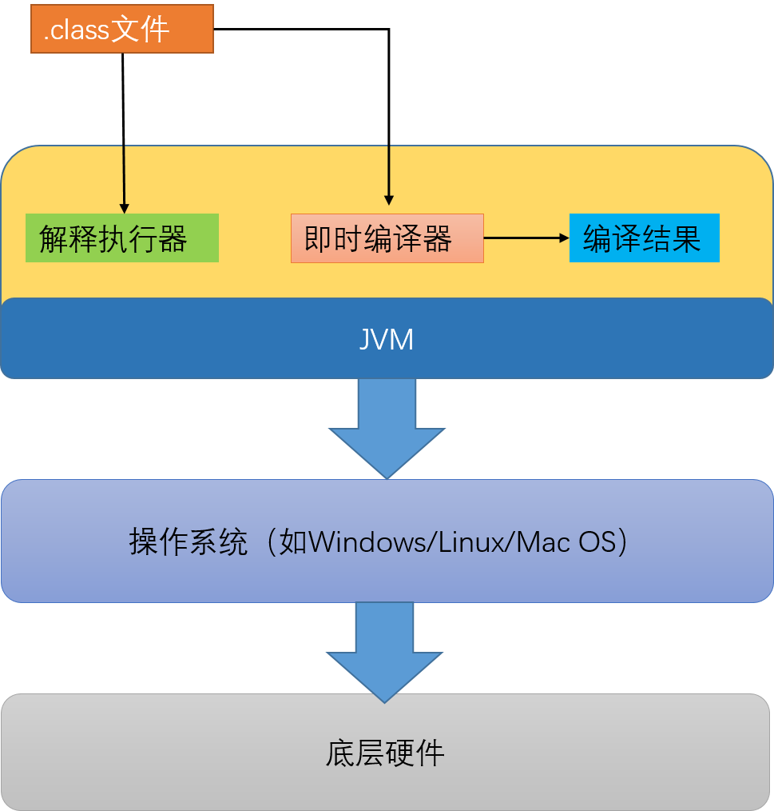
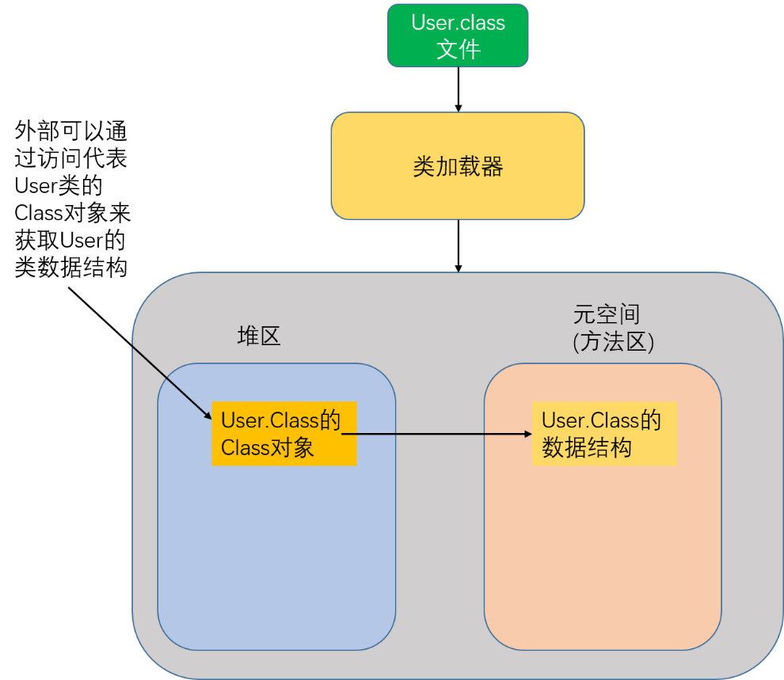
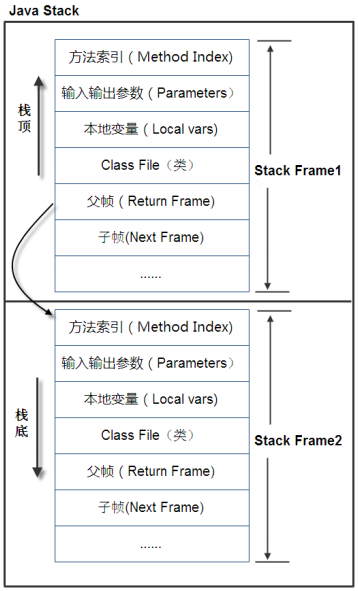
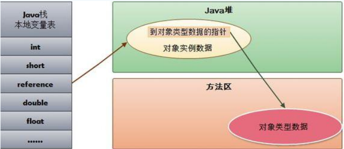
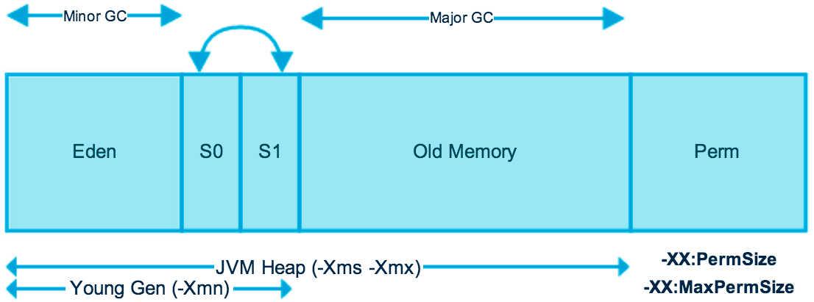
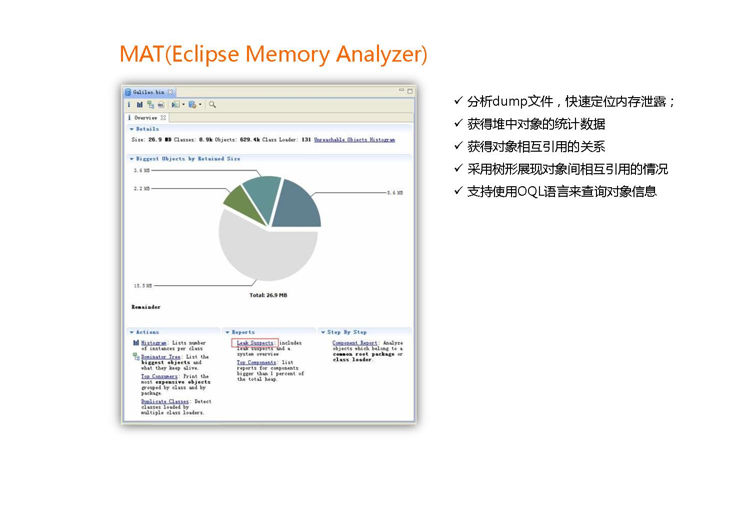
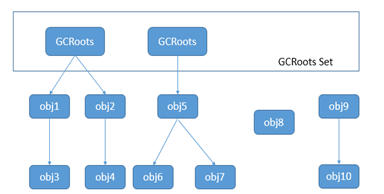
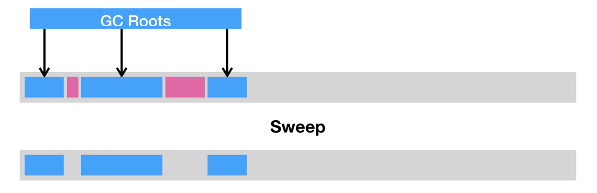
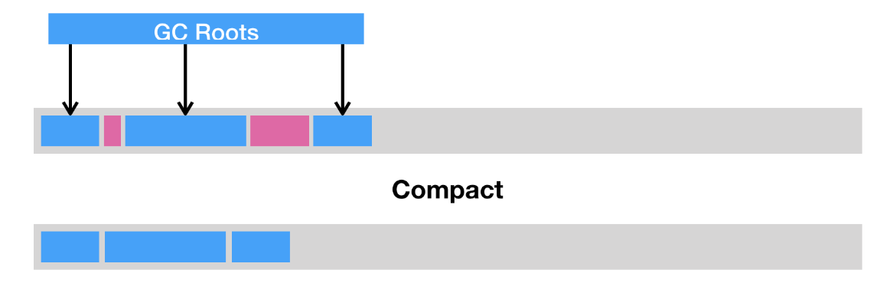
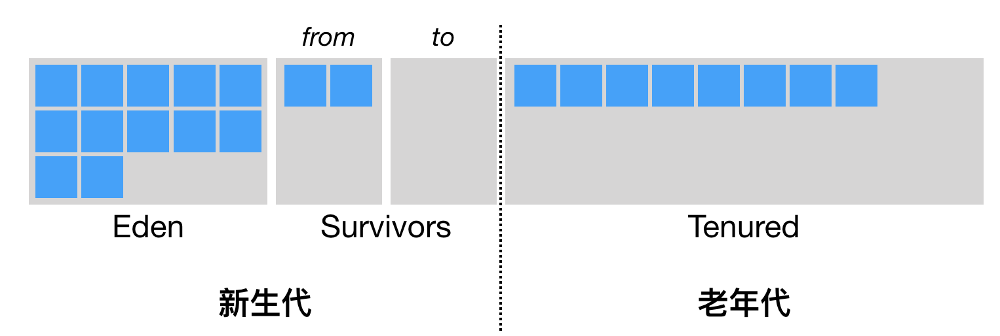

# JVM

# 一、JVM入门

## 0. JVM的常见问题

请谈谈你对JVM的理解?java8的虚拟机有什么更新？

什么是OOM？什么是StackOverflowError?有哪些方法分析？

JVM的常用参数调优你知道哪些？

内存快照抓取和MAT分析DUMP文件知道吗？

谈谈JVM中，对类加载器你的认识？

## 1. JVM的作用

想要运行一个Java代码，需要具备JRE环境。而JRE中，包括Java虚拟机及Java的核心类库。Java程序员通常安装的JDK，则已经包括了JRE，还附带了常用的开发和诊断工具。

在Java语言中，最重要的莫过于Java虚拟机。为什么需要有Java虚拟机呢？

Java 作为一门高级程序语言，它的语法非常复杂，抽象程度也很高。因此，直接在硬件上运行这种复杂的程序并不现实。所以呢，在运行 Java 程序之前，我们需要对其进行一番转换。

转换的过程为通过编译器将 Java 程序转换成该虚拟机所能识别的指令序列，也称 Java 字节码。Java虚拟机会将字节码，即class文件加载到JVM中。由JVM进行解释和执行。除了 Java 外，Scala、Clojure、Groovy，以及时下热门的 Kotlin，这些语言都可以运行在 Java 虚拟机之上


​                                                  

由上图可以看出，JVM是运行在操作系统之上的，它与硬件没有直接的交互。

## 2. 常见的JVM

**Sun Classis VM**: 世界上第一款商用的虚拟机，已经完全淘汰。

**HotSpot VM**： Sun JDK和OpenJDK中所带的虚拟机，也是目前使用范围最广的Java虚拟机。最初由一家名为“Longview Technologies”的小公司设计，后被Sun公司收购。

**Jrockit**: 由BEA公司开发的专注于服务器端应用的虚拟机。号称世界上最快的虚拟机。优势在于其垃圾收集器和MissionControl服务套件。BEA Jrockit Mission Control在2005年12月推出，它是一组以极低的开销来监控、管理和分析生产环境中的应用程序的工具。它包括三个独立的应用程序：内存泄露检测器（Memory Leak Detector），JVM运行时分析器（Runtime Analyzer）和管理控制台(Management Console)。

**J9** ：J9由IBM公司开发，曾广泛应用于IBM公司系统内部及IBM小型机上。现已经捐献给Eclipse基金会。

## 3. HotSpot虚拟机介绍

HotSpot VM，是Sun JDK和OpenJDK中所带的虚拟机，也是目前使用范围最广的Java虚拟机。

而它在最初并非由Sun公司开发，而是由一家名为“Longview Technologies”的小公司设计的。最初它并非是为Java语言而开发的，它来源于Strongtalk VM，而这款虚拟机中相当多的技术又是来源于一款支持Self语言实现“达到C语言50%以上的执行效率”的目标而设计的虚拟机。

Sun公司注意到了这款虚拟机在JIT编译上有许多优秀的理念和实际效果，在1997年收购了Longview Technologies公司，从而获得了HotSpot VM。HotSpot VM既继承了Sun之前两款商用虚拟机的优点（如前面提到的准确式内存管理），也有许多自己新的技术优势，

如它名称中的HotSpot指的就是它的热点代码探测技术。这种技术可以通过执行计数器找出最具有编译价值的代码，然后通知JIT编译器以方法为单位进行编译。如果一个方法被频繁调用，或方法中有效循环次数很多，将会分别触发标准编译和**OSR**（栈上替换）编译动作。

通过**编译器与解释器恰当地协同工作**，可以在最优化的程序响应时间与最佳执行性能中取得平衡，而且无须等待本地代码输出才能执行程序，即时编译的时间压力也相对减小，这样有助于引入更多的代码优化技术，输出质量更高的本地代码。

在2006年的JavaOne大会上，Sun公司宣布最终会把Java开源，并在随后的一年，陆续将JDK的各个部分（其中当然也包括了HotSpot VM）在GPL协议下公开了源码，并在此基础上建立了OpenJDK。这样，HotSpot VM便成为了Sun JDK和OpenJDK两个实现极度接近的JDK项目的共同虚拟机。

在2008年和2009年，Oracle公司分别收购了BEA公司和Sun公司，这样Oracle就同时拥有了两款优秀的Java虚拟机：JRockit VM和HotSpot VM。Oracle公司宣布在不久的将来（大约应在发布JDK 8的时候）会完成这两款虚拟机的整合工作，使之优势互补。整合的方式大致上是在HotSpot的基础上，移植JRockit的优秀特性，譬如使用JRockit的垃圾回收器与MissionControl服务，使用HotSpot的JIT编译器与混合的运行时系统。

## 4. JVM体系概览


Java 虚拟机将运行时内存区域划分为五个部分，分别为**方法区**、**堆**、**PC 寄存器**、**Java 方法栈**和**本地方法栈**。执行 Java 代码首先需要使用类加载器将它编译而成的 class 文件加载到 Java 虚拟机中。加载后的 Java 类会被存放于方法区（Method Area）中。实际运行时，虚拟机会执行方法区内的代码。

在虚拟机中，方法区和堆为线程共享，也是垃圾回收的重点照顾区域。栈空间为线程私有，基本不会出现垃圾回收。

Java 虚拟机将栈细分为面向 Java 方法的 Java 方法栈，面向本地方法（用 C++ 写的 native 方法）的本地方法栈，以及存放各个线程执行位置的 PC 寄存器(程序计数器)。

在运行过程中，每当调用进入一个 Java 方法，Java 虚拟机会在当前线程的 Java 方法栈中生成一个栈帧(栈的一片区域)，用以存放局部变量以及字节码的操作数。这个栈帧的大小是提前计算好的，而且 Java 虚拟机不要求栈帧在内存空间里连续分布。当退出当前执行的方法时，不管是正常返回还是异常返回，Java 虚拟机均会弹出当前线程的当前栈帧，并将之舍弃。

 

# 二、类加载器

## 1. 类加载器简介

​         类加载器，即ClassLoader,它负责加载class文件，class文件在文件开头有特定的文件标示，并且ClassLoader只负责class文件的加载，至于它是否可以运行，则由Execution Engine决定。


   

## 2. 类加载器分类

​         虚拟机自带的类加载器：

**启动类加载器**（Bootstrap）：主要负责加载jre中的最为基础、最为重要的类。如$JAVA_HOME/jre/lib/rt.jar等，以及由虚拟机参数 -Xbootclasspath 指定的类。由于它由C++代码实现，没有对应的java对象，因此在java中，尝试获取此类时，只能使用null来指代。

**扩展类加载器**（Extension），由Java代码实现，用于加载相对次要、但又通用的类，比如存放在 JRE 的 lib/ext 目录下 jar 包中的类，以及由系统变量 java.ext.dirs 指定的类。如$JAVA_HOME/jre/lib/ext/*.jar。

**应用程序类加载器**（AppClassLoader）,由Java代码实现， 它负责加载应用程序路径下的类。（这里的应用程序路径，便是指虚拟机参数 -cp/-classpath、系统变量 java.class.path 或环境变量 CLASSPATH 所指定的路径。）默认情况下，应用程序中包含的类便是由应用类加载器加载的。

**用户自定义的加载器**：Java.lang.ClassLoader的子类，用户可以定制类的加载方式。例如可以对 class 文件进行加密，加载时再利用自定义的类加载器对其解密。

除了BootStrap Class Loader，其他的类加载器，都是**Java.lang.ClassLoader**的**子类**。其他的类加载器都由加载**sum.misc.Launcher**类后得到。


   

 

测试如下：
```java
public class TestGetClassLoader {

    public static void main(String[] args) {
        System.out.println(TestGetClassLoader.class.getClassLoader());
        // sun.misc.Launcher$AppClassLoader@18b4aac2
        System.out.println(TestGetClassLoader.class.getClassLoader().getParent());
        // sun.misc.Launcher$ExtClassLoader@1edf1c96
        //null
        System.out.println(Object.class.getClassLoader());
        //java.lang.NullPointerException
        System.out.println(Object.class.getClassLoader().getParent());
    }
}
```


 

## 3. 类的加载过程

### 3.1 加载过程概述

从 class 文件到内存中的类，按先后顺序需要经过加载、链接以及初始化三大步骤。其中，链接过程中同样需要验证；而内存中的类没有经过初始化，同样不能使用。在Java中数据类型分为基本数据类型和引用数据类型。**基本数据类型**由虚拟机**预先定义**，**引用数据类型**则需要进行**类的加载**。


   

### 3.2 加载

加载，是指查找字节流，并且据此创建类的过程。

类加载器负责类的加载，除了BootStrap ClassLoader，其他的类加载器都由Java代码实现，因此需要先使用BootStrap ClassLoader将其他的类加载器加载到java虚拟机。再由这些类加载器加载其他类。类的加载需要遵守**双亲委派模型**。
**注意**：在 Java 虚拟机中，类的唯一性是由**类加载器实例**以及**类的全名**一同确定的。即便是同一串字节流，经由不同的类加载器加载，也会得到两个不同的类。在大型应用中，我们往往借助这一特性，来运行**同一个类的不同版本**。

加载的类在JVM中创建相应的类结构，类结构会存储在**元空间**(1.8之前称之为**方法区**)。

类加载器将.class文件加载至元空间后，会在堆中创建一个Java.lang.Class对象，用来封装类位于方法区内的数据结构，该Class对象是在加载类的过程中创建的，每个类都对应有一个Class类型的对象，**Class类的构造方法是私有的，只有JVM能够创建**。因此Class对象是反射的入口，使用该对象就可以获得目标类所关联的.class文件中具体的数据结构。

类加载的最终产物就是位于堆中的Class对象，该对象封装了类在方法区中的数据结构，并且向用户提供了访问方法区数据结构的接口，即Java反射的接口。



   

### 3.3 链接

加载后的类，如果没有链接，那么是暂时不能使用的。链接可分为验证、准备以及解析三个阶段。

**验证**指确保被加载类能够满足Java虚拟机的约束条件，防止字节码文件损坏或者被恶意注入。

**准备**阶段主要是在元空间(方法区)为加载类的静态字段分配内存，设置变量的初始化值。

**解析**阶段则主要将符号引用解析为实际的引用。如果符号引用指向一个未被加载的类，或者未被加载类的字段或方法，那么解析将触发这个类的加载。

### 3.4 初始化

类的初始化只有一次，类的初始化是不同于对象的初始化。

类加载的最后一步是初始化，如果直接赋值的静态字段被 final 所修饰，并且它的类型是基本类型或字符串时，该字段便会被 Java 编译器标记成常量值（ConstantValue）。初始化会为类的常量赋值，以及执行静态代码块中的方法。

当初始化一个类的时候，如果发现其父类还没有进行过初始化，则需要先触发其父类的初始化。

类在初始化时，会由编译器自动收集类中的所有变量的赋值语句和静态代码块，将这些合并为一个`<clinit>`方法，由上往下执行。

Java 虚拟机会通过加锁来确保类的初始化过程(clinit)仅被执行一次。

>类的初始化会在以下情况下**触发**
当虚拟机启动时，初始化用户指定的主类
当遇到用以新建目标类实例的 new 指令时，初始化 new 指令的目标类
当遇到调用静态方法的指令时，初始化该静态方法所在的类
当遇到访问静态字段的指令时，初始化该静态字段所在的类
子类的初始化会触发父类的初始化
一个接口定义了 default 方法，那么直接实现或者间接实现该接口的类的初始化，会触发该接口的初始化
使用反射 API 对某个类进行反射调用时，初始化这个类

```java
public class Singleton {
	private Singleton() {}
	private static class LazyHolder { 
		static final Singleton INSTANCE = new Singleton();
	}
	public static Singleton getInstance() {
		return LazyHolder.INSTANCE;
	}
}
```

这是一个单例延时初始化的案例，只有调用Singleton.getInstance 时，程序才会访问 LazyHolder.INSTANCE，才会触发对 LazyHolder 的初始化（对应第 4 种情况），继而新建一个 Singleton 的实例。
由于类初始化是**线程安全**的，并且仅被执行一次，因此程序可以确保多线程环境下有且仅有一个 Singleton 实例。

## 4. 双亲委派机制

双亲委派模型：每当一个类加载器接收到加载请求时，它会先将请求转发给父类加载器。在父类加载器没有找到所请求的类的情况下，该类加载器才会尝试去加载。

>**优势**：
①这采用双亲委派模式的是好处是Java类随着它的类加载器一起具备了一种带有优先级的层次关系，通过这种层级关可以**避免类的重复加载**，当父亲已经加载了该类时，就没有必要子ClassLoader再加载一次。
②其次是考虑到**安全**因素，防止java核心api中定义类型不会被用户恶意替换和篡改，从而引发错误。
```java
package java.lang;
public class String {
	public String() {
		System.out.println("自己伪造的String");
	}
	public static void main(String[] args) {
		System.out.println("自己伪造的String的main()");
	}
}
```
# 三、JVM的内存模型


灰色区绝对不会产生垃圾回收
黄色区一定会产生垃圾回收（九成以上产生在堆）

## 1. Execution Engine

Execution Engine执行引擎负责解释命令，提交操作系统执行。在 HotSpot 里面，将字节码翻译为机器码的翻译过程有两种形式：第一种是解释执行，即逐条将字节码翻译成机器码并执行；第二种是即时编译（Just-In-Time compilation，JIT），即将一个方法中包含的所有字节码编译成机器码后再执行。

前者的优势在于无需等待编译，而后者的优势在于实际运行速度更快。HotSpot 默认采用混合模式，综合了解释执行和即时编译两者的优点。它会先解释执行字节码，而后将其中反复执行的热点代码，以方法为单位进行即时编译。

 

## 2. Native Method Stack

​         在每个操作系统内部，都定义了很多本地方法库，例如windows中以.dll文件为主，Linux总以.so文件为主。

这些本地方法库中，定义了很多调用本地操作系统的方法，也称之为本地方法接口。

本地方法接口的作用是融合不同的编程语言为 Java 所用，它的初衷是融合 C/C++程序，Java 诞生的时候是 C/C++横行的时候，要想立足，必须有调用 C/C++程序，于是就在内存中专门开辟了一块区域处理标记为native的代码，它的具体做法是 Native Method Stack中登记 native方法，在Execution Engine 执行时加载native libraie（本地方法库）。

​         目前该方法使用的越来越少了，除非是与硬件有关的应用，比如通过Java程序驱动打印机或者Java系统管理生产设备，或者是使用Java语言开发安卓操作系统的硬件驱动等。

​         例如：
```java
public class Object {
    private static native void registerNatives();
    static {
        registerNatives();
    }	
public final native Class<?> getClass();
```
​ 
## 4. PC寄存器（程序计数器）

每个线程都有一个程序计数器，是线程私有的,就是一个指针，指向方法区中的方法字节码（用来存储指向下一条指令的地址,也即将要执行的指令代码），由执行引擎读取下一条指令，是一个**非常小**的内存空间，几乎可以忽略不记。
PC寄存器主要负责计数和调度。它可以看作是当前线程所执行的字节码的行号指示器。由于Java虚拟机的多线程是通过**线程轮流切换**并分配处理器执行时间的方式来实现的，一个处理器都只会执行一条线程中的指令。因此，为了线程**切换后能恢复到正确的执行位置**，每条线程都有一个独立的程序计数器，各个线程之间计数器互不影响，**独立存储**。程序计数器内存区域是虚拟机中**唯一**没有规定**OutOfMemoryError**情况的区域。

## 4. 方法区（Method Area）

方法区是被所有线程共享，所有字段和方法字节码，以及一些特殊方法如构造函数，接口代码也在此定义。简单说，所有定义的方法的信息都保存在该区域，此区属于共享区间。
**静态变量**+**常量**+**类信息**(构造方法/接口定义)+**运行时常量池**存在**方法区**中。
**实例变量**存在**堆内存**中,和方法区无关。
方法区是《Java虚拟机规范》中规定的一个概念，在**JDK1.7之前**，HotSpot使用**永久代**实现方法区。
**1.8**之后，由**元空间**实现。

 

## 5. 栈

### 5.1 栈的介绍

栈也叫栈内存，主管Java程序的运行，是在线程创建时创建，它的生命期是跟随线程的生命期，线程结束栈内存也就释放，对于栈来说不存在垃圾回收问题，只要线程一结束该栈就结束，生命周期和线程一致，是线程私有的。
一个线程中的每个方法在执行的同时都会创建一个栈帧（Stack Frame）用于存储局部变量表、操作数栈、动态链接、方法出口等信息。8种基本类型的变量+对象的引用变量+实例方法都是在函数的栈内存中分配。
在栈区域规定了两种异常状态：如果线程请求的栈深度大于虚拟机所允许的深度，则抛出StackOverflowError异常；如果虚拟机栈可以动态扩展，在扩展是无法申请到足够的内存，就会抛出OutOfMemoryError异常。

### 5.2 栈帧

一个线程的每个方法在调用时都会在栈上划分一块区域，用于存储方法所需要的变量等信息，这块区域称之为**栈帧**（stack frame）。栈由多个栈帧构成，好比一部电影由多个帧的画面构成。

### 5.3 栈运行原理

栈中的数据都是以栈帧（Stack Frame）为载体存在。在栈中，方法的调用顺序遵循“先进后出”/“后进先出”原则。

当一个方法A被调用时就产生了一个栈帧 F1，并被压入到栈中，A方法又调用了 B方法，于是产生栈帧 F2 也被压入栈，B方法又调用了 C方法，于是产生栈帧 F3 也被压入栈，……

执行完毕后，先弹出F3栈帧，再弹出F2栈帧，再弹出F1栈帧……


   
图示在一个栈中有两个栈帧：

栈帧 2是最先被调用的方法，先入栈，然后方法 2 又调用了方法1，栈帧 1处于栈顶的位置，栈帧 2 处于栈底，执行完毕后，依次弹出栈帧 1和栈帧 2，线程结束，栈释放。

每执行一个方法都会产生一个栈帧，保存到栈(后进先出)的顶部，顶部栈就是当前的方法，该方法执行完毕 后会自动将此栈帧出栈。

栈帧中主要保存3 类数据：

本地变量（Local Variables）:输入参数和输出参数以及方法内的变量；

栈操作（Operand Stack）:记录出栈、入栈的操作；

栈帧数据（Frame Data）:包括类文件、方法等等。

### 5.4 堆，栈，方法区的交互关系

   

​         HotSpot是使用指针的方式来访问对象，Java堆中会存放访问类元数据的地址，reference存储的就直接是对象的地址。

 

## 6. 堆

### 6.1 逻辑设计

​         堆是java虚拟机所管理的内存中最大的一块，是被所有线程共享的一块内存区域，在虚拟机启动时创建。堆内存的大小是可以调节的（通过 -Xmx 和 -Xms 控制）。

所有的对象实例以及数组都要在堆上分配。

如果堆中没有内存完成实例分配，并且堆也无法再扩展时，将会抛出OutOfMemoryError异常。

​         java堆是垃圾收集器管理的主要区域，因此也被成为“GC堆”（Garbage Collected Heap）。

堆内存分为三部分：

​         Young Generation Space  新生区                    Young/New

​         Tenure generation space  养老区                    Old/ Tenure

​         Permanent Space        永久区（1.8后为元空间）    Perm

   

Java7之前的逻辑设计


### 6.2 物理设计

​        在 Java 中，堆被划分成两个不同的区域：新生代 ( Young )、老年代 ( Old )。新生代 ( Young ) 又被划分为三个区域：Eden、From Survivor、To Survivor。这样划分的目的是为了使 JVM 能够更好的管理堆内存中的对象，包括内存的分配以及回收


   

物理设计

新生代分为den区、s0区、s1区，s0和s1也被称为from和to区域，他们是两块大小相等并且可以互相角色的空间。绝大多数情况下，对象首先分配在eden区，在新生代回收后，如果对象还存活，则进入s0或s1区，之后每经过一次新生代回收，如果对象存活则它的年龄就加1，对象达到一定的年龄（默认15）后，则进入老年代。

 

### 6.3 永久区

​         永久存储区是一个常驻内存区域，用于存放JDK自身所携带的 Class,Interface 的元数据，也就是说它存储的是运行环境必须的类信息，被装载进此区域的数据是不会被垃圾回收器回收掉的，关闭 JVM 才会释放此区域所占用的内存。

如果出现java.lang.OutOfMemoryError: PermGen space，说明是Java虚拟机对永久代Perm内存设置不够。一般出现这种情况，都是程序启动需要加载大量的第三方jar包。例如：在一个Tomcat下部署了太多的应用。或者大量动态反射生成的类不断被加载，最终导致Perm区被占满。 

Jdk1.6及之前： 有永久代, 常量池1.6在方法区

Jdk1.7：       有永久代，但已经逐步“去永久代”，常量池1.7在堆

Jdk1.8及之后： 无永久代，常量池1.8在元空间

实际而言，方法区（Method Area）和堆一样，是各个线程共享的内存区域，它用于存储虚拟机加载的：类信息+普通常量+静态常量+编译器编译后的代码等等，虽然JVM规范将方法区描述为堆的一个逻辑部分，但它却还有一个别名叫做Non-Heap(非堆)，目的就是要和堆分开。

对于HotSpot虚拟机，很多开发者习惯将方法区称之为“永久代(Parmanent Gen)” ，但严格本质上说两者不同，或者说使用永久代来实现方法区而已，永久代是方法区(相当于是一个接口interface)的一个实现，jdk1.7的版本中，已经将原本放在永久代的字符串常量池移走。

常量池（Constant Pool）是方法区的一部分，Class文件除了有类的版本、字段、方法、接口等描述信息外，还有一项信息就是常量池，这部分内容将在类加载后进入方法区的运行时常量池中存放。

# 四、JVM参数设置

## 1.常见参数设置


   

1.7的堆结构

| 参数名              | 含义                                                         |
| ------------------- | ------------------------------------------------------------ |
| -XX:+PrintGC        | 每次触发GC的时候打印相关日志                                 |
| -XX:+UseSerialGC    | 串行回收                                                     |
| -XX:+PrintGCDetails | 更详细的GC日志                                               |
| -Xms                | 堆初始值(默认为物理内存的1/64)                               |
| -Xmx                | 堆最大可用值(默认为物理内存的1/4)                            |
| -Xmn                | 新生代堆最大可用值                                           |
| -XX:SurvivorRatio   | 用来设置新生代中eden空间和from/to空间的比例，默认为8         |
| -XX:NewRatio        | 配置新生代与老年代占比，默认1:2                              |
| -Xss                | 每个线程的堆栈大小，默认为1M，此值不能设置多大，否则会减少线程并发数。 |

VM初始分配的堆内存由-Xms指定，默认是物理内存的1/64；JVM最大分配的堆内存由-Xmx指定，默认是物理内存的1/4。默认空余堆内存小于40%时，JVM就会增大堆直到-Xmx的最大限制；

空余堆内存大于70%时，JVM会减少堆直到-Xms的最小限制。因此服务器一般设置-Xms、-Xmx 相等以避免在每次GC 后调整堆的大小。

 

查看当前JVM内存
```java
public static void main(String[] args) {
	System.out.print("最大内存");
	System.out.println(Runtime.getRuntime().maxMemory() / 1024.0 / 1024 + "M");
	System.out.print("当前可用内存");
	System.out.println(Runtime.getRuntime().freeMemory() / 1024.0 / 1024 + "M");
	System.out.print("当前申请内存");
	System.out.println(Runtime.getRuntime().totalMemory() / 1024.0 / 1024 + "M");
}
```

设置示例：

-Xms20m -Xmx20m -Xmn1m -XX:SurvivorRatio=2 -XX:+PrintGCDetails -XX:+UseSerialGC代表

堆内存初始化值20m,堆内存最大值20m，新生代最大值可用1m，eden空间和from/to空间的比例为2/1，打印详细的GC信息，使用串行GC回收器。

 

## 2.常见异常

### 2.1 OutOfMemoryError

错误原因: java.lang.OutOfMemoryError: Java heap space 堆内存溢出

解决办法:调大堆内存大小 
```java
// -Xms1m -Xmx10m -XX:+PrintGCDetails -XX:+HeapDumpOnOutOfMemoryError
//-XX:+HeapDumpOnOutOfMemoryError在当前项目下一旦发生OOM，将堆的快照抓取输出
List<Object> listObject = new ArrayList<>();
for (int i = 0; i < 10; i++) {
	System.out.println("i:" + i);
	Byte[] bytes = new Byte[1 * 1024 * 1024];
	listObject.add(bytes);
}
System.out.println("添加成功...");
```

### 2.2 StackOverflowError

错误原因: java.lang.StackOverflowError表示为栈内存溢出，一般产生于递归调用。

解决办法:设置线程最大调用深度

-Xss5m 设置最大调用深度
```java
public class Demo02 {
	private static int count;
	public static void count(){
		try {
			count++;
			count(); 
		} catch (Throwable e) {//catch Exception 捕捉不到异常
			System.out.println("最大深度:"+count);
			e.printStackTrace();
		}
	}
	public static void main(String[] args) {
		count();
	}
}
```


## 3. MAT

MAT为Ecplise Memory Analyzer，是一个内存快照分析器。



 [安装插件地址](http://download.eclipse.org/mat/1.9.0/update-site/)

# 五、GC

## 1. GC简介

JVM中的**Garbage Collection**简称**GC**，它会不定时去堆内存中清理不可达对象。

如果一个对象变成了不可达对象，这并不代表它会立刻被回收。在GC时，不可达的对象并不会立刻回收。

垃圾回收在一个Java程序中的执行是自动执行的，不受外界干预的。程序员唯一能做的就是通过调用System.gc() 方法来"建议"执行垃圾收集器，但其是否可以执行，什么时候执行却都是不可知的。这也是垃圾收集器的最主要的缺点。当然相对于它给程序员带来的巨大方便性而言，这个缺点是瑕不掩瑜的。

​
## 2. finalize()

Java技术使用finalize()方法在垃圾收集器将对象从内存中清除出去前，做必要的清理工作。

这个方法是由垃圾收集器在确定这个对象没有被引用时对这个对象调用的。它是在Object类中定义的，因此所有的类都继承了它。子类覆盖finalize()方法以整理系统资源或者执行其他清理工作。

## 3. GC的工作特点

在GC工程中，通过某种算法来对JVM中的内存区域进行检测，对检测到的不可达对象，进行垃圾回收。

理论上GC过程中会频繁收集Young区，很少收集Old区，基本不懂Perm区。

JVM在进行GC时，并非每次都对上面三个内存区域一起回收的，大部分时候回收的都是指新生代。因此GC按照回收的区域又分了两种类型，一种是普通GC（minor GC），一种是全局GC（major GC or Full GC）。

普通GC（minor GC）：只针对新生代区域的GC。 因为 Java 对象大多都具备朝生夕灭的特性，所以 Minor GC 非常频繁，一般回收速度也比较快。

全局GC（major GC or Full GC）：针对年老代的GC，经常会伴随至少一次的 Minor GC（但非绝对的，在 ParallelScavenge 收集器的收集策略里就有直接进行 Major GC 的策略选择过程） 。MajorGC 的速度一般会比 Minor GC 慢 10倍以上。

 

## 4. 标记不可达对象

### 4.1 引用计数法

引用计数法就是如果一个对象没有被任何引用指向，则可视之为垃圾。这种方法的缺点就是不能检测到循环指向的存在。

首先需要声明，至少主流的Java虚拟机里面都没有选用引用计数算法来管理内存。 

什么是引用计数算法：给对象中添加一个引用计数器，每当有一个地方引用它时，计数器值加1；当引用失效时，计数器值减1。任何时刻计数器值为0的对象就是不可能再被使用的。

主流的java虚拟机中没有使用引用计数法的最主要的原因是它很难解决对象之间相互循环引用的问题。

例如：
```java
public class MyObject {
	public Object ref;
	public String name;
	public static void main(String[] args) {
		MyObject myObject1 = new MyObject();
		MyObject myObject2 = new MyObject();
		myObject1.ref=myObject2;
		myObject2.ref=myObject1;
		myObject1=null;
		myObject2=null;
	}
}
```

将myObject1和myObject2赋值为null后，虚拟机依然无法回收，因为他们还相互指向和依赖。

 

### 4.2 GC ROOTS算法

根搜索算法的基本思路就是通过一系列名为”GC Roots”的对象作为起始点，从这些节点开始向下搜索，搜索所走过的路径称为引用链(Reference Chain)，当一个对象到GC Roots没有任何引用链相连时，则证明此对象是不可用的。

简单理解，可以理解为堆外指向堆内的引用。

以下对象可以选取GC ROOTS节点：

(1). 虚拟机栈（栈帧中的局部变量区，也叫做局部变量表）中引用的对象。

(2). 方法区中的类静态属性引用的对象。

(3). 方法区中常量引用的对象。

(4). 本地方法栈中JNI(Native方法)引用的对象。

 

示例：


   

## 5. 垃圾回收的三种方式

当标记完所有的存活对象时，我们便可以进行死亡对象的回收工作了。主流的基础回收方式可分为三种。

### 5.1 清除

第一种是清除（sweep），即把死亡对象所占据的内存标记为空闲内存，并记录在一个空闲列表（free list）之中。当需要新建对象时，内存管理模块便会从该空闲列表中寻找空闲内存，并划分给新建的对象。

   

​         清除这种回收方式的原理及其简单，但是有两个缺点。一是会造成内存碎片。由于 Java 虚拟机的堆中对象必须是连续分布的，因此可能出现总空闲内存足够，但是无法分配的极端情况。另一个则是分配效率较低。如果是一块连续的内存空间，那么我们可以通过指针加法（pointer bumping）来做分配。而对于空闲列表，Java 虚拟机则需要逐个访问列表中的项，来查找能够放入新建对象的空闲内存。

 

### 5.2 压缩

​         第二种是压缩（compact），即把存活的对象聚集到内存区域的起始位置，从而留下一段连续的内存空间。这种做法能够解决内存碎片化的问题，但代价是压缩算法的性能开销。


   

 

### 5.3 复制

第三种则是复制（copy），即把内存区域分为两等分，分别用两个指针 from 和 to 来维护，并且只是用 from 指针指向的内存区域来分配内存。当发生垃圾回收时，便把存活的对象复制到 to 指针指向的内存区域中，并且交换 from 指针和 to 指针的内容。复制这种回收方式同样能够解决内存碎片化的问题，但是它的缺点也极其明显，即堆空间的使用效率极其低下。


   

### 5.4 总结

​         回收死亡对象的内存共有三种方式，分别为：会造成内存碎片的清除、性能开销较大的压缩、以及堆使用效率较低的复制。当然，现代的垃圾回收器往往会综合上述几种回收方式，综合它们优点的同时规避它们的缺点。

## 6. 垃圾回收算法

### 6.1 设计思想

​         在Java的大部分应用场景下，对象的存活复合这样一个规律，即大部分的 Java 对象只存活一小段时间，而存活下来的小部分 Java 对象则会存活很长一段时间。

​         基于这样一个规律，在JVM中，使用**分代回收思想**来回收垃圾。简单来说，就是将堆空间划分为两代，分别叫做新生代和老年代。新生代用来存储新建的对象。当对象存活时间够长时，则将其移动到老年代。

​         Java 虚拟机可以给不同代使用不同的回收算法。对于新生代，我们猜测大部分的 Java 对象只存活一小段时间，那么便可以频繁地采用耗时较短的垃圾回收算法，让大部分的垃圾都能够在新生代被回收掉。

对于老年代，由于大部分的垃圾已经在新生代中被回收了，而在老年代中的对象有大概率会继续存活。一般在堆空间即将或者已经耗尽时，才会触发触发针对老年代的回收。这时候，Java 虚拟机往往需要做一次全堆扫描，耗时也将不计成本。（当然，现代的垃圾回收器都在并发收集的道路上发展，来避免这种全堆扫描的情况。）

 

### 6.2 堆的划分

​         Java 虚拟机将堆划分为新生代和老年代。其中，新生代又被划分为 Eden 区，以及两个大小相同的 Survivor 区。

 

默认情况下，Java 虚拟机采取的是一种动态分配的策略（对应 Java 虚拟机参数 -XX:+UsePSAdaptiveSurvivorSizePolicy），根据生成对象的速率，以及 Survivor 区的使用情况动态调整 Eden 区和 Survivor 区的比例。

当然，你也可以通过参数 -XX:SurvivorRatio 来固定这个比例。但是需要注意的是，其中一个 Survivor 区会一直为空，因此比例越低浪费的堆空间将越高。

   

 

### 6.3 GC的分类

JVM在进行GC时，并非每次都对上面三个内存区域一起回收的，大部分时候回收的都是指新生代。因此GC按照回收的区域又分了两种类型，一种是普通GC（minor GC），一种是全局GC（major GC or Full GC），

**新生代GC**（minor GC）：只针对新生代区域的GC。

**老年代GC**（major GC or Full GC）：针对老年代的GC，偶尔伴随对新生代的GC以及对永久代的GC。 一般情况下，当出现了 Major GC，经常会伴随至少一次的 Minor GC（但非绝对的，在 ParallelScavenge 收集器的收集策略里就有直接进行 Major GC 的策略选择过程）。

MajorGC 的速度一般会比 Minor GC 慢 10倍以上。

Minor GC触发机制：

当年轻代满时就会触发Minor GC，这里的年轻代满指的是Eden区满，Survivor满不会引发GCFull GC触发机制：

当年老代满时会引发Full GC，Full GC将会同时回收年轻代、年老代，当永久代满时也会引发Full GC，会导致Class、Method元信息的卸载

### 6.4 标记复制(Mark-Copying)算法

​         当我们调用 new 指令时，它会在 Eden 区中划出一块作为存储对象的内存。当 Eden 区的空间耗尽了怎么办？这个时候 Java 虚拟机便会触发一次 Minor GC，来收集新生代的垃圾。存活下来的对象，则会被送到 Survivor 区。

​         新生代共有两个 Survivor 区，我们分别用 from 和 to 来指代。其中 to 指向的 Survivior 区是空的。当发生 Minor GC 时，Eden 区和 from 指向的 Survivor 区中的存活对象会被复制到 to 指向的 Survivor 区中，然后交换 from 和 to 指针，以保证下一次 Minor GC 时，to 指向的 Survivor 区还是空的。

​         Java 虚拟机会记录 Survivor 区中的对象一共被来回复制了几次。如果一个对象被复制的次数为 15（对应虚拟机参数 -XX:+MaxTenuringThreshold），那么该对象将被晋升（promote）至老年代。另外，如果单个 Survivor 区已经被占用了 50%（对应虚拟机参数 -XX:TargetSurvivorRatio），那么较高复制次数的对象也会被晋升至老年代。

​         万一存活对象数量比较多，那么To域的内存可能不够存放，这个时候会借助老年代的空间。

​         因此Minor GC使用的则是标记-复制算法。将 Survivor 区中的老存活对象晋升到老年代，然后将剩下的存活对象和 Eden 区的存活对象复制到另一个 Survivor 区中。理想情况下，Eden 区中的对象基本都死亡了，那么需要复制的数据将非常少，因此采用这种标记 - 复制算法的效果极好。

### 6.5 标记清除(Mark-Sweep)算法

​         老年代一般是由标记清除或者是标记清除与标记整理的混合实现。

​         标记清除算法一般应用于老年代,因为老年代的对象生命周期比较长。该算法先对所有可访问的对象，做个标记再遍历堆，把未被标记的对象回收（标记活的）。

​         缺点：

①回收时，应用需要挂起，也就是stop the world，导致用户体验非常差劲

②由于需要遍历全堆对象，效率比较低（递归与全堆对象遍历）。

③造成内存碎片化

 

### 6.6 标记压缩(Mark--Compact)算法

   

​         标记清除算法和标记压缩算法非常相同，但是标记压缩算法在标记清除算法之上解决内存碎片化。

​         优点：解决内存碎片化问题。也消除了复制算法当中，内存减半的高额代价

缺点：效率低，压缩阶段，由于移动了可用对象，需要去更新引用。

### 6.7 标记清除压缩(Mark-Sweep-Compact)算法

​         标记清除压缩(Mark-Sweep-Compact)算法是标记清除算法和标记压缩算法的结合算法。其原理和标记清除算法一致，只不过会在多次GC后，进行一次Compact操作！

## 7. 垃圾回收器

### 7.1 串行回收和并行回收

串行回收: JDK1.5前的默认算法 缺点是只有一个线程，执行垃圾回收时程序停止的时间比较长。

并行回收: 多个线程执行垃圾回收适合于高吞吐量的系统，回收时系统会停止运行。

### 7.2 Serial收集器

串行收集器是最古老，最稳定以及效率高的收集器，是一个单线程的收集器，在进行垃圾收集时候，必须暂停其他所有的工作线程（Stop The World）直到它收集结束。

特点：CPU利用率最高，停顿时间即用户等待时间比较长。

适用场景：小型应用。

通过JVM参数-XX:+UseSerialGC可以使用串行垃圾回收器。

 

### 7.3 Parallel New收集器

​         **Parallel New**收集器其实就是Serial收集器的多线程版本。新生代并行，老年代串行；新生代采用复制算法、老年代采用标记-压缩

参数控制：-XX:+UseParNewGC  使用ParNew收集器

-XX:ParallelGCThreads 限制线程数量

 

### 7.4 Parallel Scavenge收集器

Parallel Scavenge收集器类似ParNew收集器，Parallel收集器更关注系统的吞吐量。可以通过参数来打开自适应调节策略，虚拟机会根据当前系统的运行情况收集性能监控信息，动态调整这些参数以提供最合适的停顿时间或最大的吞吐量；也可以通过参数控制GC的时间不大于多少毫秒或者比例；新生代复制算法、老年代标记-压缩，采用多线程来通过扫描并压缩堆。

特点：停顿时间短，回收效率高，对吞吐量要求高。

适用场景：大型应用，科学计算，大规模数据采集等。

通过JVM参数 XX:+USeParallel GC 打开并发标记扫描垃圾回收器。

 

### 7.5 cms收集器

CMS（Concurrent Mark Sweep）收集器是一种以获取最短回收停顿时间为目标的收集器。目前很大一部分的Java应用都集中在互联网站或B/S系统的服务端上，这类应用尤其重视服务的响应速度，希望系统停顿时间最短，以给用户带来较好的体验。从名字（包含“Mark Sweep”）上就可以看出CMS收集器是基于“标记-清除”算法实现的，它的运作过程相对于前面几种收集器来说要更复杂一些，整个过程分为4个步骤，包括： 

>**步骤**
初始标记（CMS initial mark）
并发标记（CMS concurrent mark）
并发预处理
重新标记（CMS remark）
并发清除（CMS concurrent sweep）
并发重置

其中初始标记、重新标记这两个步骤仍然需要“Stop The World”。初始标记仅仅只是标记一下GC Roots能直接关联到的对象，速度很快，并发标记阶段就是进行GC Roots Tracing的过程，而重新标记阶段则是为了修正并发标记期间，因用户程序继续运作而导致标记产生变动的那一部分对象的标记记录，这个阶段的停顿时间一般会比初始标记阶段稍长一些，但远比并发标记的时间短。 

   由于整个过程中耗时最长的并发标记和并发清除过程中，收集器线程都可以与用户线程一起工作，所以总体上来说，CMS收集器的内存回收过程是与用户线程一起并发地执行。

​    优点:并发收集、低停顿 

缺点：产生大量空间碎片、并发阶段会降低吞吐量

采用“标记-清除”算法实现，使用多线程的算法去扫描堆，对发现未使用的对象进行回收。

特点：响应时间优先，减少垃圾收集停顿时间。

适应场景：大型服务器等。

通过JVM参数 -XX:+UseConcMarkSweepGC设置

 

### 7.6 G1收集器

G1（Garbage First）是一个横跨新生代和老年代的垃圾回收器。实际上，它已经打乱了前面所说的堆结构，直接将堆分成极其多个区域。每个区域都可以充当 Eden 区、Survivor 区或者老年代中的一个。它采用的是标记-压缩算法，而且和 CMS 一样都能够在应用程序运行过程中并发地进行垃圾回收。G1 能够针对每个细分的区域来进行垃圾回收。在选择进行垃圾回收的区域时，它会优先回收死亡对象较多的区域。这也是 G1 名字的由来。

特点：支持很大的堆，高吞吐量

​                 --支持多CPU和垃圾回收线程

​                 --在主线程暂停的情况下，使用并行收集

​                 --在主线程运行的情况下，使用并发收集

实时目标：可配置在N毫秒内最多只占用M毫秒的时间进行垃圾回收

通过JVM参数 -XX:+UseG1GC 使用G1垃圾回收器

注意:  并发是指一个处理器同时处理多个任务。 

并行是指多个处理器或者是多核的处理器同时处理多个不同的任务。 

 

### 7.7 总结

针对新生代的垃圾回收器共有三个：**Serial**，**Parallel Scavenge** 和 **Parallel New**。这三个采用的都是标记-复制算法。其中，Serial 是一个单线程的，Parallel New 可以看成 Serial 的多线程版本。Parallel Scavenge 和 Parallel New 类似，但更加注重吞吐率。此外，Parallel Scavenge 不能与 CMS 一起使用。

针对老年代的垃圾回收器也有三个：**Serial Old** 和 **Parallel Old**，以及 **CMS**。Serial Old 和 Parallel Old 都是标记-压缩算法。同样，前者是单线程的，而后者可以看成前者的多线程版本。

CMS 采用的是标记-清除算法，并且是并发的。除了少数几个操作需要 Stop-the-world 之外，它可以在应用程序运行过程中进行垃圾回收。在并发收集失败的情况下，Java 虚拟机会使用其他两个压缩型垃圾回收器进行一次垃圾回收。由于 G1 的出现，CMS 在 Java 9 中已被废弃。

 
