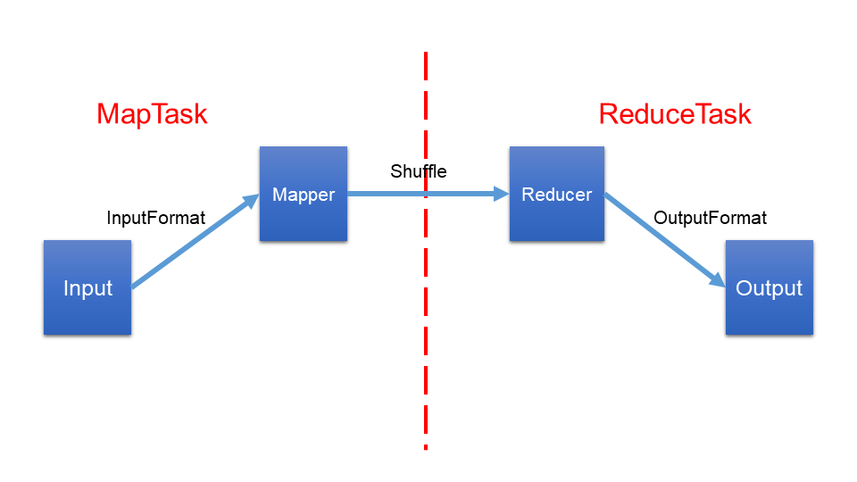
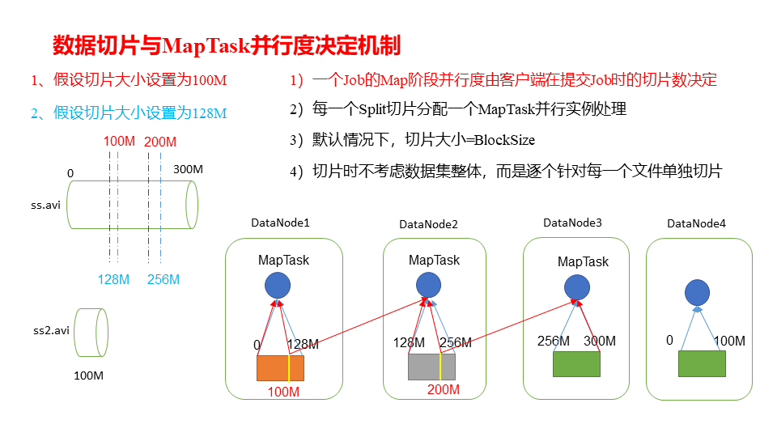
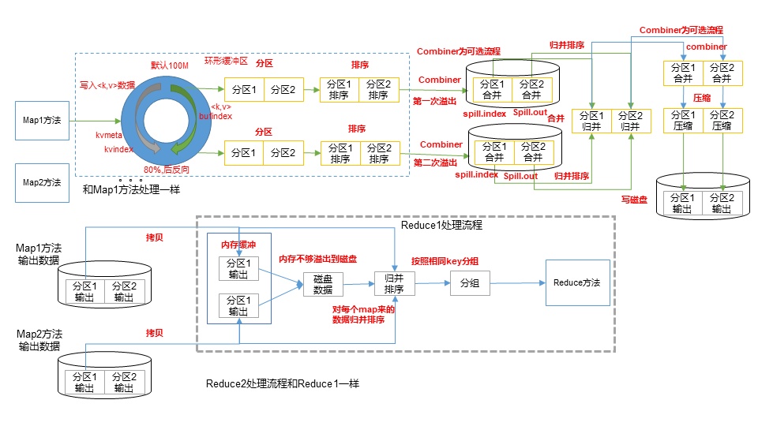
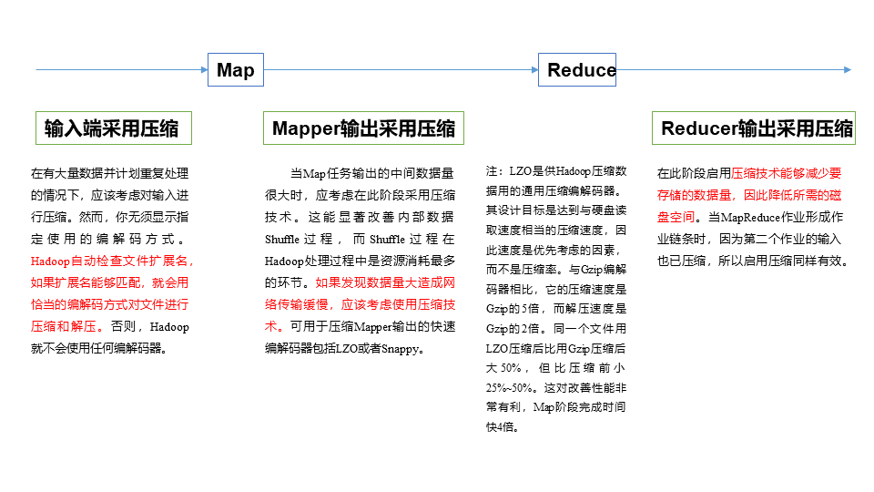

# TODO-List
* [ ] -
* [ ] **MapReduce扩展案例** *2019-7-27 16:00:45*
* [ ] **小文件解决方案>>开启JVM重用**  *2019-7-27 15:56:42*
* [ ] **Hadoop企业优化**  *2019-7-27 15:51:53*
* [ ] **空间复杂度，时间复杂度** *2019-7-27 14:59:29*
* [ ] **压缩测试类**  *2019-7-27 11:46:48*
* [ ] **ReduceTask-src**  *2019-7-26 15:19:33*
* [ ] **MapTask-src**  *2019-7-26 14:54:29*
* [ ] **OutputFormat >> IO流**  *2019-7-26 10:51:08*
* [ ] **分组排序Reducer中对values的迭代** *2019-7-26 09:12:03*
* [x] **Job submit >> debug src**  ***视频3***
* [x] **FileInputFormat split >> debug src**
* [x] **Xmind**  *2019-7-25 15:39:23*
* [x] **FileInputFormat** ***视频 4 5***
* [ ] **MapReduce测试 @ 集群**
* [x] **NLineInputFormat实现类的理解**  ***视频***
* [x] **KeyValueTextInputFormat & NLineInputFormat使用案例**
* [x] **自定义FileInputFormat** ***视频11*** *2019-7-23 15:58:32*
* [x] **自定义InputFormat调试** ***视频***
* [ ] **快速排序算法**  *2019-7-24 09:26:38*    
* [x] **Partition实操**  *2019-7-24 11:43:01*
* [x] **Combiner合并 视频**  *2019-7-24 14:49:10*
* [x] **GroupingComparator分组 视频**  *2019-7-24 15:16:26*
* [ ] **Shuffle-src**  *2019-7-24 15:50:36*
* [ ] **MapReduce工作流程图**  *2019-7-24 16:31:21*
* [x] **InputFormat数据输入**  *2019-7-25 01:12:40*
* [ ] **切片与MapTask并发度决定机制**  *2019-7-25 01:13:13*


# 一、MapReduce概述

## 1.定义

**MapReduce**是一个分布式运算程序的编程框架，使用户开发“基于Hadoop的数据分析应用”的核心框架。

**MapReduce**核心功能是将**用户编写的业务逻辑代码**和**自带默认组件**整合成一个完整的**分布式运算程序**，并运算在一个Hadoop集群上。


## 2.优缺点

### 2.1 优点

**易于编程**
简单的实现一些接口，就可以完成一个分布式程序。

**良好的扩展性**
可以在计算资源不足时通过简单的增加及其来扩展计算能力

**高容错性**
如果一个节点宕机，可以把计算任务转移到另一个节点上运行，不至于任务运行失败

**适合PB级以上海量数据的离线处理**
可以实现上千台服务器集群并发工作，提供数据处理能力。

### 2.2 缺点

**不擅长实时计算**
MapReduce无法像MySQL一样，在毫秒或秒级内返回结果

**不擅长流式计算**
流式计算的输入数据是动态的，而MapReduce的**输入数据集是静态的**，不能动态变化。这是因为MapReduce自身的设计特点决定了数据源必须的静态的。

**不擅长DAG(有向图)计算**
多个应用程序存在依赖关系，后一个应用程序的输入为前一个的输出。在这种情况下，MapReduce并不是不能做，而是使用后每个MapReduce作业的输出结果都会写入多磁盘，会造成大量的磁盘IO，导致性能非常的低下。

## 3.核心思想


>1）分布式的运算程序往往需要分成至少2个阶段。
2）第一个阶段的MapTask并发实例，完全并行运行，互不相干。
3）第二个阶段的ReduceTask并发实例互不相干，但是他们的数据依赖于上一个阶段的所有MapTask并发实例的输出。
4）MapReduce编程模型只能包含一个Map阶段和一个Reduce阶段，如果用户的业务逻辑非常复杂，那就只能多个MapReduce程序，串行运行。

**若干问题细节**
MapTask如何工作
ReduceTask如何工作
MapTask如何控制分区排序
MapTask和ReduceTask之间如何衔接

**总结**：分析WordCount数据流走向深入理解MapReduce核心思想。


## 4.进程

>完整的MapReduce程序在分布式运行时有三类**实例进程**
**MrAppMaster**负责整个程序的过程调度及状态协调
**MapTask**负责Map阶段的整个数据处理流程
**ReduceTask**负责Reduce阶段的整个数据流程处理


## 5.官方WordCount源码

采用反编译工具反编译源码，发现WordCount案例有Map类、Reduce类和驱动类。且数据类型是Hadoop自身封装的序列化类型。

```java
//driver


```

```java
//mapper

```

```java
//reducer


```

## 6.常用数据序列化类型

| Java类型 | Hadoop Writable类型 |
| :------: | :-----------------: |
| Boolean  |   BooleanWritable   |
|   Byte   |    ByteWritable     |
|   Int    |     IntWritable     |
|  Float   |    FloatWritabl     |
|   Long   |     LongWritabl     |
|  Double  |    DoubleWritabl    |
|  String  |      **Text**       |
|   Map    |     MapWritabl      |
|  Array   |    ArrayWritabl     |

## 7.Mapreduce编程规范

>**Mapper**
用户自定义的Mapper要继承自己的父类
Mapper的输入数据是KV对的形式(KV的类型可自定义)
Mapper的业务逻辑写在map()方法中
Mapper的输出数据时KV的形式(KV的类型可自定义)
map()方法(MapTask进程)对每一个<K,V>调用一次

>**Reducer**
用户自定义的Reduce要继承自己的父类
Reduce的输入数据类型对应Mapper的输出数据类型，也是KV
Reduce的业务逻辑写在reduce()方法中
ReduceTask进程对每一组相同k的<K,V>**组**调用一次reduce()方法

>**Driver**
相当于YARN集群的客户端，用于提交我们整个程序到YARN集群
和封装MapReduce程序相关运行参数的job对象

## 8.WordCount案例实操

### 8.1 需求

在给定的文本文件中统计输出每一个单词出现的总次数
**输入数据**
```
hello
hello world
MapReduce
Zookeeper Mapper
hello Hello World
tian
```
**期望输出数据**
```
hello   2
Hello   1
Mapper  1
MapReduce   1
tian    1
world   1
World   1
```

### 8.2 需求分析

>**Mapper**
将MapTask传给文本内容先转换成String
根据空格将这一行切分成单词
将单词输出成<K,V>

>**Reducer**
汇总key的个数
输出该key的总次数

>**Driver**
获取配置信息，获取job对象实例
指定本程序的jar包所在的本地路径
关联Mapper/Reducer业务类
指定Mapper输出数据的kv类型
指定最终输出的数据的kv类型
指定job的输入原始文件所在的目录
指定job的输出结果所在目录
提交作业

### 8.3 环境准备

创建Maven工程

在pom.xml中添加依赖
```xml
<dependencies>
		<dependency>
			<groupId>junit</groupId>
			<artifactId>junit</artifactId>
			<version>RELEASE</version>
		</dependency>
		<dependency>
			<groupId>org.apache.logging.log4j</groupId>
			<artifactId>log4j-core</artifactId>
			<version>2.8.2</version>
		</dependency>
		<dependency>
			<groupId>org.apache.hadoop</groupId>
			<artifactId>hadoop-common</artifactId>
			<version>2.7.2</version>
		</dependency>
		<dependency>
			<groupId>org.apache.hadoop</groupId>
			<artifactId>hadoop-client</artifactId>
			<version>2.7.2</version>
		</dependency>
		<dependency>
			<groupId>org.apache.hadoop</groupId>
			<artifactId>hadoop-hdfs</artifactId>
			<version>2.7.2</version>
		</dependency>
</dependencies>
```

src/main/resources目录下新建log4j.properties
```propeerties
log4j.rootLogger=INFO, stdout
log4j.appender.stdout=org.apache.log4j.ConsoleAppender
log4j.appender.stdout.layout=org.apache.log4j.PatternLayout
log4j.appender.stdout.layout.ConversionPattern=%d %p [%c] - %m%n
log4j.appender.logfile=org.apache.log4j.FileAppender
log4j.appender.logfile.File=target/spring.log
log4j.appender.logfile.layout=org.apache.log4j.PatternLayout
log4j.appender.logfile.layout.ConversionPattern=%d %p [%c] - %m%n
```

### 8.4 编写程序
Mapper
```java
package com.tian.mapreduce;
import java.io.IOException;
import org.apache.hadoop.io.IntWritable;
import org.apache.hadoop.io.LongWritable;
import org.apache.hadoop.io.Text;
import org.apache.hadoop.mapreduce.Mapper;

public class WordcountMapper extends Mapper<LongWritable, Text, Text, IntWritable>{
	
	Text k = new Text();
	IntWritable v = new IntWritable(1);
	
	@Override
	protected void map(LongWritable key, Text value, Context context)	throws IOException, InterruptedException {
		
		// 1 获取一行
		String line = value.toString();
		
		// 2 切割
		String[] words = line.split(" ");
		
		// 3 输出
		for (String word : words) {
			
			k.set(word);
			context.write(k, v);
		}
	}
}
```

Reducer
```java
package com.tian.mapreduce.wordcount;
import java.io.IOException;
import org.apache.hadoop.io.IntWritable;
import org.apache.hadoop.io.Text;
import org.apache.hadoop.mapreduce.Reducer;

public class WordcountReducer extends Reducer<Text, IntWritable, Text, IntWritable>{
    int sum;
    IntWritable v = new IntWritable();

	@Override
	protected void reduce(Text key, Iterable<IntWritable> values,Context context) throws IOException, InterruptedException {
		
		// 1 累加求和
		sum = 0;
		for (IntWritable count : values) {
			sum += count.get();
		}
		
		// 2 输出
       v.set(sum);
		context.write(key,v);
	}
}
```

Driver驱动类
```java
package com.tian.mapreduce.wordcount;
import java.io.IOException;
import org.apache.hadoop.conf.Configuration;
import org.apache.hadoop.fs.Path;
import org.apache.hadoop.io.IntWritable;
import org.apache.hadoop.io.Text;
import org.apache.hadoop.mapreduce.Job;
import org.apache.hadoop.mapreduce.lib.input.FileInputFormat;
import org.apache.hadoop.mapreduce.lib.output.FileOutputFormat;

public class WordcountDriver {

	public static void main(String[] args) throws IOException, ClassNotFoundException, InterruptedException {

		// 1 获取配置信息以及封装任务
		Configuration configuration = new Configuration();
		Job job = Job.getInstance(configuration);

		// 2 设置jar加载路径
		job.setJarByClass(WordcountDriver.class);

		// 3 设置map和reduce类
		job.setMapperClass(WordcountMapper.class);
		job.setReducerClass(WordcountReducer.class);

		// 4 设置map输出
		job.setMapOutputKeyClass(Text.class);
		job.setMapOutputValueClass(IntWritable.class);

		// 5 设置最终输出kv类型
		job.setOutputKeyClass(Text.class);
		job.setOutputValueClass(IntWritable.class);
		
		// 6 设置输入和输出路径
		FileInputFormat.setInputPaths(job, new Path(args[0]));
		FileOutputFormat.setOutputPath(job, new Path(args[1]));

		// 7 提交
		boolean result = job.waitForCompletion(true);

		System.exit(result ? 0 : 1);
	}
}
```

### 8.5 本地测试

在本地操作系统配置Hadoop环境
在编译器上运行程序


### 8.6 集群测试

用maven打jar包，需要添加的打包插件依赖

```xml
<build>
		<plugins>
			<plugin>
				<artifactId>maven-compiler-plugin</artifactId>
				<version>2.3.2</version>
				<configuration>
					<source>1.8</source>
					<target>1.8</target>
				</configuration>
			</plugin>
			<plugin>
				<artifactId>maven-assembly-plugin </artifactId>
				<configuration>
					<descriptorRefs>
						<descriptorRef>jar-with-dependencies</descriptorRef>
					</descriptorRefs>
					<archive>
						<manifest>
                        <!-- 需要修改 -->
							<mainClass>com.tian.MapReduce.WordcountDriver</mainClass>
						</manifest>
					</archive>
				</configuration>
				<executions>
					<execution>
						<id>make-assembly</id>
						<phase>package</phase>
						<goals>
							<goal>single</goal>
						</goals>
					</execution>
				</executions>
			</plugin>
		</plugins>
	</build>
```
**打包前注释掉已经确定的路径**

右键项目 -> maven -> update project

将程序打成jar包，然后拷贝到Hadoop集群中
步骤: 右键 -> Run as -> maven install
等待编译完成就会在项目的target文件夹中生成jar包，如果看不到，在项目上右键 -> Refresh 即可看到。修改不带依赖的jar包名称为 wc.jar 并拷贝该jar到Hadoop集群。

启动Hadoop集群


执行WordCount程序
```bash
hadoop jar  wc.jar
 com.tian.wordcount.WordcountDriver /user/tian/input /user/tian/output
```

# 二、Hadoop序列化

## 1.序列化概述

### 1.1 序列化概念
**序列化**就是把内存中的对象转换成字节序列(或其他数据传输协议)以便于存储到磁盘(持久化)和网络传输

**反序列化**就是将收到的字节序列(或其他数据传输协议)或者是磁盘的持久化数据，转换成内存中的对象

### 1.2 为什么序列化

使用序列化可以将内存中的对象存储到磁盘，还可以在远程计算机传输

### 1.3 为什么不用Java的序列化

Java序列化是一个重量级序列化框架(Serializable)，一个对象被序列化后，会附带很多额外的信息(各种校验信息，Header,继承体系等)，不便于网络中高效传输，所以Hadoop自己开发了一套序列化机制(Writable)。

>**Hadoop序列化特点**
**紧凑**高效使用内存空间
**快速**对俄数据的额外开销小
**可扩展**可随着通信协议的升级而升级
**互操作**支持多语言的交互


## 2.自定义bean对象实现序列化接口(Writable)

**实现bean对象序列化步骤**

必须实现Writable接口
反序列化时，需要反射调用空参构造器，所以必须使用空参构造
```java
public FlowBean() {
    super();
}
```
重写序列化方法
```java
@Override
public void write(DataOutput out) throws IOException {
	out.writeLong(upFlow);
	out.writeLong(downFlow);
	out.writeLong(sumFlow);
}
```
重写反序列化方法
```java
@Override
public void readFields(DataInput in) throws IOException {
	upFlow = in.readLong();
	downFlow = in.readLong();
	sumFlow = in.readLong();
}
```
注意反序列化的顺序和序列化的顺序完全一致
把结果显示在文件中，需要重写toString()，用"\t"分开，方便后续使用
如果需要将自定义的bean放在key中传输，则还需要实现Comparable接口，因为MapReduce框中的Shuffle过程要求对key必须能排序，详见排序案例

```java
@Override
public int compareTo(FlowBean o) {
	// 倒序排列，从大到小
	return this.sumFlow > o.getSumFlow() ? -1 : 1;
}
```
## 3.序列化案例实操

### 3.1 需求

统计每一个手机号耗费的总上行流量、下行流量、总流量
输入数据 phone_data.txt

```txt
1	13736230513	192.196.100.1	www.tian.com	2481	24681	200
2	13846544121	192.196.100.2			264	0	200
3 	13956435636	192.196.100.3			132	1512	200
4 	13966251146	192.168.100.1			240	0	404
5 	18271575951	192.168.100.2	www.tian.com	1527	2106	200
6 	84188413	192.168.100.3	www.tian.com	4116	1432	200
7 	13590439668	192.168.100.4			1116	954	200
8 	15910133277	192.168.100.5	www.hao123.com	3156	2936	200
9 	13729199489	192.168.100.6			240	0	200
10 	13630577991	192.168.100.7	www.shouhu.com	6960	690	200
11 	15043685818	192.168.100.8	www.baidu.com	3659	3538	200
12 	15959002129	192.168.100.9	www.tian.com	1938	180	500
13 	13560439638	192.168.100.10			918	4938	200
14 	13470253144	192.168.100.11			180	180	200
15 	13682846555	192.168.100.12	www.qq.com	1938	2910	200
16 	13992314666	192.168.100.13	www.gaga.com	3008	3720	200
17 	13509468723	192.168.100.14	www.qinghua.com	7335	110349	404
18 	18390173782	192.168.100.15	www.sogou.com	9531	2412	200
19 	13975057813	192.168.100.16	www.baidu.com	11058	48243	200
20 	13768778790	192.168.100.17			120	120	200
21 	13568436656	192.168.100.18	www.alibaba.com	2481	24681	200
22 	13568436656	192.168.100.19			1116	954	200
```
输入数据格式
```
7 	13560436666	120.196.100.99		1116		 954			200
id	手机号码		网络ip			上行流量  下行流量     网络状态码
```
期望输出格式
```
13560436666 		1116		      954 			2070
手机号码		    上行流量        下行流量		总流量
```

### 3.2 需求分析


### 3.3 编写MapReduce程序

**编写流量统计的Bean对象**
```java
package com.tian.mapreduce.flowsum;
import java.io.DataInput;
import java.io.DataOutput;
import java.io.IOException;
import org.apache.hadoop.io.Writable;

// 1 实现writable接口
public class FlowBean implements Writable{

	private long upFlow;
	private long downFlow;
	private long sumFlow;
	
	//2  反序列化时，需要反射调用空参构造函数，所以必须有
	public FlowBean() {
		super();
	}

	public FlowBean(long upFlow, long downFlow) {
		super();
		this.upFlow = upFlow;
		this.downFlow = downFlow;
		this.sumFlow = upFlow + downFlow;
	}
	
	//3  写序列化方法
	@Override
	public void write(DataOutput out) throws IOException {
		out.writeLong(upFlow);
		out.writeLong(downFlow);
		out.writeLong(sumFlow);
	}
	
	//4 反序列化方法
	//5 反序列化方法读顺序必须和写序列化方法的写顺序必须一致
	@Override
	public void readFields(DataInput in) throws IOException {
		this.upFlow  = in.readLong();
		this.downFlow = in.readLong();
		this.sumFlow = in.readLong();
	}

	// 6 编写toString方法，方便后续打印到文本
	@Override
	public String toString() {
		return upFlow + "\t" + downFlow + "\t" + sumFlow;
	}

	public long getUpFlow() {
		return upFlow;
	}

	public void setUpFlow(long upFlow) {
		this.upFlow = upFlow;
	}

	public long getDownFlow() {
		return downFlow;
	}

	public void setDownFlow(long downFlow) {
		this.downFlow = downFlow;
	}

	public long getSumFlow() {
		return sumFlow;
	}

	public void setSumFlow(long sumFlow) {
		this.sumFlow = sumFlow;
	}
}
```
**编写Mapper类**
```java
package com.tian.mapreduce.flowsum;
import java.io.IOException;
import org.apache.hadoop.io.LongWritable;
import org.apache.hadoop.io.Text;
import org.apache.hadoop.mapreduce.Mapper;

public class FlowCountMapper extends Mapper<LongWritable, Text, Text, FlowBean>{
	
	FlowBean v = new FlowBean();
	Text k = new Text();
	
	@Override
	protected void map(LongWritable key, Text value, Context context)	throws IOException, InterruptedException {
		
		// 1 获取一行
		String line = value.toString();
		
		// 2 切割字段
		String[] fields = line.split("\t");
		
		// 3 封装对象
		// 取出手机号码
		String phoneNum = fields[1];

		// 取出上行流量和下行流量
		long upFlow = Long.parseLong(fields[fields.length - 3]);
		long downFlow = Long.parseLong(fields[fields.length - 2]);

		k.set(phoneNum);
		v.set(downFlow, upFlow);
		
		// 4 写出
		context.write(k, v);
	}
}
```
**编写Reducer类**
```java
package com.tian.mapreduce.flowsum;
import java.io.IOException;
import org.apache.hadoop.io.Text;
import org.apache.hadoop.mapreduce.Reducer;

public class FlowCountReducer extends Reducer<Text, FlowBean, Text, FlowBean> {

	@Override
	protected void reduce(Text key, Iterable<FlowBean> values, Context context)throws IOException, InterruptedException {

		long sum_upFlow = 0;
		long sum_downFlow = 0;

		// 1 遍历所用bean，将其中的上行流量，下行流量分别累加
		for (FlowBean flowBean : values) {
			sum_upFlow += flowBean.getUpFlow();
			sum_downFlow += flowBean.getDownFlow();
		}

		// 2 封装对象
		FlowBean resultBean = new FlowBean(sum_upFlow, sum_downFlow);
		
		// 3 写出
		context.write(key, resultBean);
	}
}
```

**编写Driver驱动类**

```java
package com.tian.FlowCount;

import org.apache.hadoop.conf.Configuration;
import org.apache.hadoop.fs.Path;
import org.apache.hadoop.io.Text;
import org.apache.hadoop.mapreduce.Job;
import org.apache.hadoop.mapreduce.lib.input.FileInputFormat;
import org.apache.hadoop.mapreduce.lib.output.FileOutputFormat;

public class FlowCountDriver {

	public static void main(String[] args) throws Exception {

		// 输入输出路径需要根据自己电脑上实际的输入输出路径设置
		args = new String[] { "d:/git/hadoop/input/phone_data.txt", 
				"d:/git/hadoop/output2" };

		// 1 获取配置信息，或者job对象实例
		Configuration configuration = new Configuration();
		Job job = Job.getInstance(configuration);

		// 6 指定本程序的jar包所在的本地路径
		job.setJarByClass(FlowCountDriver.class);

		// 2 指定本业务job要使用的mapper/Reducer业务类
		job.setMapperClass(FlowCountMapper.class);
		job.setReducerClass(FlowCountReducer.class);

		// 3 指定mapper输出数据的kv类型
		job.setMapOutputKeyClass(Text.class);
		job.setMapOutputValueClass(FlowBean.class);

		// 4 指定最终输出的数据的kv类型
		job.setOutputKeyClass(Text.class);
		job.setOutputValueClass(FlowBean.class);

		// 5 指定job的输入原始文件所在目录
		FileInputFormat.setInputPaths(job, new Path(args[0]));
		FileOutputFormat.setOutputPath(job, new Path(args[1]));

		// 7 将job中配置的相关参数，以及job所用的java类所在的jar包， 提交给yarn去运行
		boolean result = job.waitForCompletion(true);
		System.exit(result ? 0 : 1);
	}
}
```

***视频***

# 三、MapReduce框架原理

## 1.InputFormat数据输入



### 1.1 切片与MapTask并行度决定机制

>**问题引出**
>MapTask的并行度决定Map阶段的并发度，进而影响整个进程的处理速度

> **MapTask并行度决定机制**
> **数据块：**Block是HDFS物理上把数据分成一块一块。
> **数据切片：**数据切片只是在逻辑上对输入进行分片，并不会在磁盘上将其切分成片进行存储。



### 1.2 Job提交流程源码和切片源码详解


**Job提交流程源码解析**

```java
job.waitForCompletion(true); //提交job，调用submit()方法
    submit();
        ensureState(JobState.DEFINE); //确定Job的状态
        setUseNewAPI(); //设置新的API
        connect();
            return new Cluster(getConfiguration()); //创建并返回cluster对象
                /**
                创建cluster对象，判断是本地运行还是yarn运行
                最终获取不同的Runner   (LocalJobRunner or YarnRunner)
                */
                /*
                String framework =
                    conf.get(MRConfig.FRAMEWORK_NAME, MRConfig.LOCAL_FRAMEWORK_NAME);
                if (!MRConfig.LOCAL_FRAMEWORK_NAME.equals(framework)) {
                    return null;
                }
                conf.setInt(JobContext.NUM_MAPS, 1);
                return new LocalJobRunner(conf);
                */
                initialize(jobTrackAddr, conf); 
                    return new LocalJobRunner(conf);
        return submitter.submitJobInternal(Job.this, cluster);
            checkSpecs(job); //判断输出路径是否存在，存在则抛异常
            JobSubmissionFiles.getStagingDir(cluster, conf); //创建临时目录用于存放切片和job信息，当前工程所在分区根目录的tmp文件夹
                fs.mkdirs(stagingArea, new FsPermission(JOB_DIR_PERMISSION));
            submitClient.getNewJobID(); //生成一个jobID
            new Path(jobStagingArea, jobId.toString()); //根据jobID再临时目录下创建目录
            copyAndConfigureFiles(job, submitJobDir); //
            /**
             * 具体见下述切片机制源码解析
             */
            writeSplits(job, submitJobDir); //临时目录中写入切片信息
                /**
                * 通过反射获取input实例，默认使用的FileInputFormat是TextInputFormat
                */
                ReflectionUtils.newInstance(job.getInputFormatClass(), conf);
                input.getSplits(job); //获取切片信息
                    long minSize = Math.max(getFormatMinSplitSize(), getMinSplitSize(job));  // 1
                    long maxSize = getMaxSplitSize(job); // Long类型的最大值
                    for (FileStatus file: files){} // 迭代
                        file.getBlockSize();  //本地块大小区别于集群，32MB
                        return Math.max(minSize, Math.min(maxSize, blockSize)); //获取切片大小
                        /**
                        * 调大minSize可增加切片大小
                        * 调小maxSize可减小切片大小
                        */
                        while (((double) bytesRemaining)/splitSize > SPLIT_SLOP){}//文件大小切片后剩余如果是切片大小的1.1倍则继续切片
                splits.toArray(new InputSplit[splits.size()]); //从splits的值可以验证出文件仍旧是以块的形式存在的，切片只是逻辑行为
            writeConf(conf, submitJobFile); //写入配置信息
            submitClient.submitJob(jobId, submitJobDir.toString(),job.getCredentials()); // 生成状态信息
            jtFs.delete(submitJobDir, true); // 删除临时目录内的切片和配置信息
```

**FileInputFormat切片源码解析**

>程序先找到存储数据的目录
>开始遍历处理（规划切片）目录下的每一个文件
>遍历第一个文件ss.txt
>
>```
>获取文件大小fs.sezeOf(ss.txt)
>计算切片大小computeSplitSize(Math.max(minSize,Math.min(maxSize,blockSize))) = blocksize = 128M
>默认情况写切片大小=blocksize
>开始切片
>将切片信息写到一个切片规划文件中
>整个切片的核心过程再getSplit()方法中完成
>InputSplit只记录了切片的元数据信息，如起始位置，长度以及所在的节点列表等
>```
>
>提交切片规划文件到yarn上，yarn上的MrAppMaster就可以根据切片规划文件开始计算开启的MapTask个数

### 1.3 FileInputFormat切片机制

> **切片机制**
> 简单的按照文件的内容长度进行切片
> 切片太小，默认等于BlockSize
> 欺骗时不考虑数据集整体，而是逐个针对每一个文件单独切片

> **案例分析**
>
> 输入数据有两个文件
>
> > file1.txt – 320MB    
> > file2.txt – 10MB
>
> 经过FileInputFormat的切片机制运算后，形成的切片
>
> > file1.txt.split1 – 0~128MB
> > file1.txt.split2 – 128~256MB
> > file1.txt.split3 – 256~320MB
> > file2.txt.split1 – 0~10MB

**FileInputFormat切片大小的参数配置**

> **源码中计算切片大小的公式**
>
> ```java
> Math.max(minSize,Math.min(maxSize,blockSize));
> mapreduce.input.fileinputformat.split.minsize = 1;//默认值为1
> mapreduce.input.fileinputformat.split.maxsize = Long.MAXValue;//默认值Long.MAXValue	
> /* 因此，默认情况下，切片大小=blocksize */
> ```

> **切片大小设置**
> maxsize(切片最大值):参数如果调的必blockSize小，则会让切片变小，而且就等于配置的这个参数的值。
> minsize(切片最大值):参数调的比blockSize大，则可以让切片变得比blockSize还大。

> **获取切片信息API**
>
> ```java
> String name = inputSplit.getPath().getName();//获取切片的文件名称
> FileSplit inputSplit = (FileSplit) context.getInputSplit();//根据文件类型获取切片信息
> ```
>


***视频04***

***视频05***


### 1.4 CombineTextInputFormat切片机制

框架默认的**TextInputFormat**切片机制是对任务按文件规划切片，<u>不管文件多小，都会是一个单独的切片</u>，都会交给一个MapTask，这样如果有<u>大量小文件</u>，就会产生<u>大量的MapTask</u>，处理效率极其低下。

**应用场景**
用于<u>小文件过多</u>的场景，可以将多个小文件从<u>逻辑上</u>规划到一个切片中，这样多个小文件交给<u>一个MapTask</u>处理。

**虚拟存储切片最大值设置**

```java
CombineTextInputFormat.setMaxInputSplitSize(job, 4194304);// 4m
```

***注意***：虚拟存储切片最大值设置最好根据实际的小文件大小情况来设置具体的值。

**切片机制**
生成切片过程包括：<u>虚拟存储</u>过程和<u>切片</u>过程二部分。

> **虚拟存储过程**
将输入目录下所有文件大小，依次和设置的setMaxInputSplitSize值比较，如果不大于设置的最大值，逻辑上划分一个块。如果输入文件大于设置的最大值且大于两倍，那么以最大值切割一块；当剩余数据大小超过设置的最大值且不大于最大值2倍，此时将文件均分成2个虚拟存储块（防止出现太小切片）。
例如setMaxInputSplitSize值为4M，输入文件大小为8.02M，则先逻辑上分成一个4M。剩余的大小为4.02M，如果按照4M逻辑划分，就会出现0.02M的小的虚拟存储文件，所以将剩余的4.02M文件切分成（2.01M和2.01M）两个文件。

>**切片过程**
判断虚拟存储的文件大小是否大于setMaxInputSplitSize值，大于等于则单独形成一个切片。
如果不大于则跟下一个虚拟存储文件进行合并，共同形成一个切片。
测试举例：有4个小文件大小分别为1.7M、5.1M、3.4M以及6.8M这四个小文件，则虚拟存储之后形成6个文件块，大小分别为：
1.7M，（2.55M、2.55M），3.4M以及（3.4M、3.4M）
最终会形成3个切片，大小分别为：
(1.7+2.55）M，（2.55+3.4）M，（3.4+3.4）M

[**合并小文件逻辑**](link/merge-tiny-file.docx)

### 1.5 CombineTextInputFormat案例实操

> **需求**将输入的大量小文件合并成一个切片统一处理
> 输入数据:准备4个小文件
> 期望:一个切片处理4个文件

> **实现过程**
> 不做任何处理，运行WordCount案例程序，控制台日志观察切片个数为4
>
> ```
> number of splits:4
> ```
>
> 在WordCountDriver中添加代码，运行程序并观察切片个数
>
> ```java
> // 如果不设置InputFormat，它默认用的是TextInputFormat.class
> job.setInputFormatClass(CombineTextInputFormat.class);
> 
> //虚拟存储切片最大值设置4m
> CombineTextInputFormat.setMaxInputSplitSize(job, 4194304);
> ```
>
> ```
> number of splits:3
> ```
>
> 在WordCountDriver中添加代码，运行程序并观察切片个数
>
> ```java
> // 如果不设置InputFormat，它默认用的是TextInputFormat.class
> job.setInputFormatClass(CombineTextInputFormat.class);
> 
> //虚拟存储切片最大值设置20m
> CombineTextInputFormat.setMaxInputSplitSize(job, 20971520);
> ```
>
> ```
> number of splits:1
> ```

### 1.6 FileInputFormat实现类

> **TextInputFormat**
> TextInputFormat是<u>默认</u>的FileInputFormat实现类。按行读取每天记录
> <u>Key</u>是存储该行整个文件中的起始字节偏移量，<u>LongWritable</u>
> <u>Value</u>是行的内容，不包括任何终止符(换行符和回车符)，<u>Text</u>

Value是行的内容，不包括任何终止符(换行符和回车符)，Text类型

> **KeyValueTextInputFormat**
> 每一行均为一条记录，分隔符为key , value，可以通过在驱动类中设置分隔符，默认分隔符为“\t”
> <u>不改变切片规则</u>
> <u>key</u>为分隔符前的内容，<u>Text</u>
> <u>value</u>为分隔符后的所有内容，<u>Text</u>

> **NLineInputFormat**
> map进程处理的<u>InputSplit不再按Block块划分</u>，而是按NlineInputFormat指定的行数N来划分
> 即输入文件的总行数/N=切片数，如果不整除，切片数=商+1
> <u>Key</u>和<u>Value</u>类型与<u>TextInputFormat</u>类型一致

***视频***

### 1.7 KeyValueTextInputFormat使用案例

>**需求**统计输入文件中每一行的第一个单词相同的行数
>输入数据
>```
>banzhang ni hao
>xihuan hadoop banzhang
>banzhang ni hao
>xihuan hadoop banzhang
>```
>期望结果数据
>```
>banzhang 2
>xihuan 2
>```

>**需求分析**
>Map
>
>```
>设置key和value<banzhang,1>
>写出
>```
>Reduce
>```
><banzhang,1>
><banzhang,1>
>汇总
>写出
>```
>Driver
>```java
>//设置切割符
>conf.set(KeyValueLineRecordReader.KEY_VALUE_SEPERATOR," ");
>//设置输入格式
>job.setInputFormatClass(KeyValueTextInputFormat.class);
>```

>**代码实现**
>编写Mapper类
>```java
>package com.tian.mapreduce.KeyValueTextInputFormat;
>import java.io.IOException;
>import org.apache.hadoop.io.LongWritable;
>import org.apache.hadoop.io.Text;
>import org.apache.hadoop.mapreduce.Mapper;
>
>public class KVTextMapper extends Mapper<Text, Text, Text, LongWritable>{
>	
>// 1 设置value
>   LongWritable v = new LongWritable(1);  
>    
>	@Override
>	protected void map(Text key, Text value, Context context)
>			throws IOException, InterruptedException {
>
>// banzhang ni hao
>        
>        // 2 写出
>        context.write(key, v);  
>	}
>}
>```
>编写Reducer类
>```java
>package com.tian.mapreduce.KeyValueTextInputFormat;
>import java.io.IOException;
>import org.apache.hadoop.io.LongWritable;
>import org.apache.hadoop.io.Text;
>import org.apache.hadoop.mapreduce.Reducer;
>
>public class KVTextReducer extends Reducer<Text, LongWritable, Text, LongWritable>{
>	
>    LongWritable v = new LongWritable();  
>    
>	@Override
>	protected void reduce(Text key, Iterable<LongWritable> values,	Context context) throws IOException, InterruptedException {
>		
>		 long sum = 0L;  
>
>		 // 1 汇总统计
>        for (LongWritable value : values) {  
>            sum += value.get();  
>        }
>         
>        v.set(sum);  
>         
>        // 2 输出
>        context.write(key, v);  
>	}
>}
>```
>编写Driver类
>```java
>package com.tian.mapreduce.keyvaleTextInputFormat;
>import java.io.IOException;
>import org.apache.hadoop.conf.Configuration;
>import org.apache.hadoop.fs.Path;
>import org.apache.hadoop.io.LongWritable;
>import org.apache.hadoop.io.Text;
>import org.apache.hadoop.mapreduce.Job;
>import org.apache.hadoop.mapreduce.lib.input.FileInputFormat;
>import org.apache.hadoop.mapreduce.lib.input.KeyValueLineRecordReader;
>import org.apache.hadoop.mapreduce.lib.input.KeyValueTextInputFormat;
>import org.apache.hadoop.mapreduce.lib.output.FileOutputFormat;
>
>public class KVTextDriver {
>
>	public static void main(String[] args) throws IOException, ClassNotFoundException, InterruptedException {
>		
>		Configuration conf = new Configuration();
>		// 设置切割符
>	conf.set(KeyValueLineRecordReader.KEY_VALUE_SEPERATOR, " ");
>		// 1 获取job对象
>		Job job = Job.getInstance(conf);
>		
>		// 2 设置jar包位置，关联mapper和reducer
>		job.setJarByClass(KVTextDriver.class);
>		job.setMapperClass(KVTextMapper.class);
>job.setReducerClass(KVTextReducer.class);
>				
>		// 3 设置map输出kv类型
>		job.setMapOutputKeyClass(Text.class);
>		job.setMapOutputValueClass(LongWritable.class);
>
>		// 4 设置最终输出kv类型
>		job.setOutputKeyClass(Text.class);
>job.setOutputValueClass(LongWritable.class);
>		
>		// 5 设置输入输出数据路径
>		FileInputFormat.setInputPaths(job, new Path(args[0]));
>		
>		// 设置输入格式
>	job.setInputFormatClass(KeyValueTextInputFormat.class);
>		
>		// 6 设置输出数据路径
>		FileOutputFormat.setOutputPath(job, new Path(args[1]));
>		
>		// 7 提交job
>		job.waitForCompletion(true);
>	}
>}
>```


### 1.8 NLineInputFormat使用案例

> **需求**对每个单词进行个数统计，要求根据每个输入文件的行数来规定输出多少个切片。此案例要求每三行放入一个切片中。
>
> **输入数据**
>
> ```
> banzhang ni hao
> xihuan hadoop banzhang
> banzhang ni hao
> xihuan hadoop banzhang
> banzhang ni hao
> xihuan hadoop banzhang
> banzhang ni hao
> xihuan hadoop banzhang
> banzhang ni hao
> xihuan hadoop banzhang banzhang ni hao
> xihuan hadoop banzhang
> ```
>
> **期望输出数据**
>
> ```
> Number of splits:4
> ```

> **需求分析**
> Map
>
> ```
> 获取一行
> 切割
> 循环写出
> ```
>
> Reduce
>
> ```
> 汇总
> 输出
> ```
>
> Dirver
>
> ```java
> //设置每个切片InputSplit中划分三条记录
> NLineInputFormat.setNumLinesPerSplit(job,3);
> ```

> **代码实现**
> 编写Mapper类
>
> ```java
> package com.tian.mapreduce.nline;
> import java.io.IOException;
> import org.apache.hadoop.io.LongWritable;
> import org.apache.hadoop.io.Text;
> import org.apache.hadoop.mapreduce.Mapper;
> 
> public class NLineMapper extends Mapper<LongWritable, Text, Text, LongWritable>{
> 	
> 	private Text k = new Text();
> 	private LongWritable v = new LongWritable(1);
> 	
> 	@Override
> 	protected void map(LongWritable key, Text value, Context context)	throws IOException, InterruptedException {
> 		
> 		 // 1 获取一行
>         String line = value.toString();
>         
>         // 2 切割
>         String[] splited = line.split(" ");
>         
>         // 3 循环写出
>         for (int i = 0; i < splited.length; i++) {
>         	
>         	k.set(splited[i]);
>         	
>            context.write(k, v);
>         }
> 	}
> }
> ```
>
> 编写Reducer类
>
> ```java
> package com.tian.mapreduce.nline;
> import java.io.IOException;
> import org.apache.hadoop.io.LongWritable;
> import org.apache.hadoop.io.Text;
> import org.apache.hadoop.mapreduce.Reducer;
> 
> public class NLineReducer extends Reducer<Text, LongWritable, Text, LongWritable>{
> 	
> 	LongWritable v = new LongWritable();
> 	
> 	@Override
> 	protected void reduce(Text key, Iterable<LongWritable> values,	Context context) throws IOException, InterruptedException {
> 		
>         long sum = 0l;
> 
>         // 1 汇总
>         for (LongWritable value : values) {
>             sum += value.get();
>         }  
>         
>         v.set(sum);
>         
>         // 2 输出
>         context.write(key, v);
> 	}
> }
> ```
>
> 编写Driver类
>
> ```java
> package com.tian.mapreduce.nline;
> import java.io.IOException;
> import java.net.URISyntaxException;
> import org.apache.hadoop.conf.Configuration;
> import org.apache.hadoop.fs.Path;
> import org.apache.hadoop.io.LongWritable;
> import org.apache.hadoop.io.Text;
> import org.apache.hadoop.mapreduce.Job;
> import org.apache.hadoop.mapreduce.lib.input.FileInputFormat;
> import org.apache.hadoop.mapreduce.lib.input.NLineInputFormat;
> import org.apache.hadoop.mapreduce.lib.output.FileOutputFormat;
> 
> public class NLineDriver {
> 	
> 	public static void main(String[] args) throws IOException, URISyntaxException, ClassNotFoundException, InterruptedException {
> 		
> // 输入输出路径需要根据自己电脑上实际的输入输出路径设置
> args = new String[] { "e:/input/inputword", "e:/output1" };
> 
> 		 // 1 获取job对象
> 		 Configuration configuration = new Configuration();
>         Job job = Job.getInstance(configuration);
>         
>         // 7设置每个切片InputSplit中划分三条记录
>         NLineInputFormat.setNumLinesPerSplit(job, 3);
>           
>         // 8使用NLineInputFormat处理记录数  
>         job.setInputFormatClass(NLineInputFormat.class);  
>           
>         // 2设置jar包位置，关联mapper和reducer
>         job.setJarByClass(NLineDriver.class);  
>         job.setMapperClass(NLineMapper.class);  
>         job.setReducerClass(NLineReducer.class);  
>         
>         // 3设置map输出kv类型
>         job.setMapOutputKeyClass(Text.class);  
>         job.setMapOutputValueClass(LongWritable.class);  
>         
>         // 4设置最终输出kv类型
>         job.setOutputKeyClass(Text.class);  
>         job.setOutputValueClass(LongWritable.class);  
>           
>         // 5设置输入输出数据路径
>         FileInputFormat.setInputPaths(job, new Path(args[0]));  
>         FileOutputFormat.setOutputPath(job, new Path(args[1]));  
>           
>         // 6提交job
>         job.waitForCompletion(true);  
> 	}
> }
> ```
>
> 

### 1.9 自定义InputFormat

在企业开发中，Hadoop框架自带的InputFormat类型不能满足所有应用场景，需要自定义InputFormat来解决问题

>**自定义InputFormat步骤**
>自定义类继承FileInputFormat
>重写RecordReader，实现一次读取一个完整文件
>在输出时使用SequenceFileOutPutFormat输出并合并文件

### 1.10 自定义InputFormat案例实操

无论HDFS还是MapReduce，在处理小文件时效率都非常低，但又难免面临处理大量小文件的场景，此时，就需要有相应解决方案。可以自定义InputFormat实现小文件的合并。

> **需求**
> 将多个小文件合并成一个SequenceFile文件（SequenceFile文件是Hadoop用来存储二进制形式的key-value对的文件格式），SequenceFile里面存储着多个文件，存储的形式为文件路径+名称为key，文件内容为value。
> 输入数据
>
> ```one.txt
> yongpeng weidong weinan
> sanfeng luozong xiaoming
> ```
> ```two.txt
> longlong fanfan
> mazong kailun yuhang yixin
> longlong fanfan
> mazong kailun yuhang yixin
> ```
> ```three.txt
> shuaige changmo zhenqiang 
> dongli lingu xuanxuan
> ```
>
> 期望输出
>
> ```
> //字节码文件
> ```

> **需求分析**
> 自定义类继承FileInputFormat
>
> ```
> 重写isSplitable()方法，返回false表示文件不可切割
> 重写creatRecordReader()，创建自定义RecordReader对象，并初始化
> ```
>
> 重写RecorderReader，实现一次读取一个完整的文件封装为KV
>
> ```
> 采用IO流一次读取一个文件输出到value中，因为设置了不可切片，最终把文件封装到了value中
> 获取文件路径信息+名称，并设置key
> ```
>
> 设置Driver
>
> ```java
> //设置输入的inputFormat
> job.setInputFormatClass(WholeFileInputFormat.class);
> //设置输出的outputFormat
> job.setOutputFormatClass(SequenceFileOutputFormat.class);
> ```

> **程序实现**
> 自定义InputFormat
>
> ```java
> package com.tian.mapreduce.inputformat;
> import java.io.IOException;
> import org.apache.hadoop.fs.Path;
> import org.apache.hadoop.io.BytesWritable;
> import org.apache.hadoop.io.NullWritable;
> import org.apache.hadoop.mapreduce.InputSplit;
> import org.apache.hadoop.mapreduce.JobContext;
> import org.apache.hadoop.mapreduce.RecordReader;
> import org.apache.hadoop.mapreduce.TaskAttemptContext;
> import org.apache.hadoop.mapreduce.lib.input.FileInputFormat;
> 
> // 定义类继承FileInputFormat
> public class WholeFileInputformat extends FileInputFormat<Text, BytesWritable>{
> 	
> 	@Override
> 	protected boolean isSplitable(JobContext context, Path filename) {
> 		return false;
> 	}
> 
> 	@Override
> 	public RecordReader<Text, BytesWritable> createRecordReader(InputSplit split, TaskAttemptContext context)	throws IOException, InterruptedException {
> 		
> 		WholeRecordReader recordReader = new WholeRecordReader();
> 		recordReader.initialize(split, context);
> 		
> 		return recordReader;
> 	}
> }
> 
> ```
>
> 自定义RecordReader类
>
> ```java
> package com.tian.mapreduce.inputformat;
> import java.io.IOException;
> import org.apache.hadoop.conf.Configuration;
> import org.apache.hadoop.fs.FSDataInputStream;
> import org.apache.hadoop.fs.FileSystem;
> import org.apache.hadoop.fs.Path;
> import org.apache.hadoop.io.BytesWritable;
> import org.apache.hadoop.io.IOUtils;
> import org.apache.hadoop.io.NullWritable;
> import org.apache.hadoop.mapreduce.InputSplit;
> import org.apache.hadoop.mapreduce.RecordReader;
> import org.apache.hadoop.mapreduce.TaskAttemptContext;
> import org.apache.hadoop.mapreduce.lib.input.FileSplit;
> 
> public class WholeRecordReader extends RecordReader<Text, BytesWritable>{
> 
> 	private Configuration configuration;
> 	private FileSplit split; //便于别的方法调用
> 	
> 	private boolean isProgress= true;
> 	private BytesWritable value = new BytesWritable();
> 	private Text k = new Text();
> 
> /**
>     * 初始化
>     * InputSplit split : 当前的切片对象 FileSplit
>     * TaskAttemptContext Context : 上下文对象，包含多种需要的信息
> */
> 	@Override
> 	public void initialize(InputSplit split, TaskAttemptContext context) throws IOException, InterruptedException {
> 		
> 		this.split = (FileSplit)split;
> 		configuration = context.getConfiguration();
> 	}
> /*
>     * key : 文件路径 + 文件名
>     * value : 文件中的内容
> *
> */
> 	@Override
> 	public boolean nextKeyValue() throws IOException, InterruptedException {
> 		
> 		if (isProgress) {
> 
> 			// 1 定义缓存区
> 			byte[] contents = new byte[(int)split.getLength()];
> 			
> 			FileSystem fs = null;
> 			FSDataInputStream fis = null;
> 			
>          try {
>              // 2 获取文件系统
>              Path path = split.getPath();
>              fs = path.getFileSystem(configuration);
>              fis = fs.open(path);
>              // 5 输出文件内容
>              value.set(contents, 0, contents.length);
>              // 6 获取文件路径及名称
>              String name = split.getPath().toString();
>              // 7 设置输出的key值
>              k.set(name);
> 
>          } catch (Exception e) {
> 
>          }finally {
>              IOUtils.closeStream(fis);
>          }
>              isProgress = false;
>              return true;
> 		}
> 		
> 		return false;
> 	}
> 
> 	@Override
> 	public Text getCurrentKey() throws IOException, InterruptedException {
> 		return k;
> 	}
> 
> 	@Override
> 	public BytesWritable getCurrentValue() throws IOException, InterruptedException {
> 		return value;
> 	}
> 
> 	@Override
> 	public float getProgress() throws IOException, InterruptedException {
> 		return 0;
> 	}
> 
> 	@Override
> 	public void close() throws IOException {
> 	}
> }
> ```
>
> 编写SequenceFileMapper类处理流程
>
> ```java
> package com.tian.mapreduce.inputformat;
> import java.io.IOException;
> import org.apache.hadoop.io.BytesWritable;
> import org.apache.hadoop.io.NullWritable;
> import org.apache.hadoop.io.Text;
> import org.apache.hadoop.mapreduce.Mapper;
> import org.apache.hadoop.mapreduce.lib.input.FileSplit;
> 
> /**
> * key : 文件路径
> * value : 文件的内容
> */
> public class SequenceFileMapper extends Mapper<Text, BytesWritable, Text, BytesWritable>{
> 	
> 	@Override
> 	protected void map(Text key, BytesWritable value,			Context context)		throws IOException, InterruptedException {
> 
> 		context.write(key, value);
> 	}
> }
> ```
>
> 编写SequenceFileReducer类处理流程
>
> ```java
> package com.tian.mapreduce.inputformat;
> import java.io.IOException;
> import org.apache.hadoop.io.BytesWritable;
> import org.apache.hadoop.io.Text;
> import org.apache.hadoop.mapreduce.Reducer;
> 
> public class SequenceFileReducer extends Reducer<Text, BytesWritable, Text, BytesWritable> {
> 
> 	@Override
> 	protected void reduce(Text key, Iterable<BytesWritable> values, Context context)		throws IOException, InterruptedException {
> 
> 		context.write(key, values.iterator().next());
>         //或者使用迭代
> 	}
> }
> ```
> 编写SequenceFileDriver类处理流程
>
> ```java
> package com.tian.mapreduce.inputformat;
> import java.io.IOException;
> import org.apache.hadoop.conf.Configuration;
> import org.apache.hadoop.fs.Path;
> import org.apache.hadoop.io.BytesWritable;
> import org.apache.hadoop.io.Text;
> import org.apache.hadoop.mapreduce.Job;
> import org.apache.hadoop.mapreduce.lib.input.FileInputFormat;
> import org.apache.hadoop.mapreduce.lib.output.FileOutputFormat;
> import org.apache.hadoop.mapreduce.lib.output.SequenceFileOutputFormat;
> 
> public class SequenceFileDriver {
> 
> 	public static void main(String[] args) throws IOException, ClassNotFoundException, InterruptedException {
> 		
>         // 输入输出路径需要根据自己电脑上实际的输入输出路径设置
>         args = new String[] { "e:/input/inputinputformat", "e:/output1" };
>         // 1 获取job对象
>         Configuration conf = new Configuration();
>         Job job = Job.getInstance(conf);
>         // 2 设置jar包存储位置、关联自定义的mapper和reducer
>         job.setJarByClass(SequenceFileDriver.class);
>         job.setMapperClass(SequenceFileMapper.class);
>         job.setReducerClass(SequenceFileReducer.class);
>         // 7 设置输入的自定义inputFormat
>         job.setInputFormatClass(WholeFileInputformat.class);
>         // 8 设置输出的outputFormat
>         job.setOutputFormatClass(SequenceFileOutputFormat.class);
>         // 3 设置map输出端的kv类型
>         job.setMapOutputKeyClass(Text.class);
>         job.setMapOutputValueClass(BytesWritable.class);
>         // 4 设置最终输出端的kv类型
>         job.setOutputKeyClass(Text.class);
>         job.setOutputValueClass(BytesWritable.class);
>         // 5 设置输入输出路径
>         FileInputFormat.setInputPaths(job, new Path(args[0]));
>         FileOutputFormat.setOutputPath(job, new Path(args[1]));
>         // 6 提交job
>         boolean result = job.waitForCompletion(true);
>         System.exit(result ? 0 : 1);
> 	}
> }
> ```


**自定义InputFormat Debug**


## 2.MapReduce工作流程


map – 66.7%
sort – 33.3%
copy – 
sort –
reduce – 

mapper读取数据后通过context对象写数据到环形缓冲区
环形缓冲区中存储内容达到阈值80%后，
数据经过快排后从内存溢写到磁盘
磁盘中的文件经过归并排序后合并成一个文件
reducer合并后的单个文件

>kvindex


>bufindex


2．流程详解

上面的流程是整个MapReduce最全工作流程，但是Shuffle过程只是从第7步开始到第16步结束，具体Shuffle过程详解，如下：
1）MapTask收集我们的map()方法输出的kv对，放到内存缓冲区中
2）从内存缓冲区不断溢出本地磁盘文件，可能会溢出多个文件
3）多个溢出文件会被合并成大的溢出文件
4）在溢出过程及合并的过程中，都要调用Partitioner进行分区和针对key进行排序
5）ReduceTask根据自己的分区号，去各个MapTask机器上取相应的结果分区数据
6）ReduceTask会取到同一个分区的来自不同MapTask的结果文件，ReduceTask会将这些文件再进行合并（归并排序）
7）合并成大文件后，Shuffle的过程也就结束了，后面进入ReduceTask的逻辑运算过程（从文件中取出一个一个的键值对Group，调用用户自定义的reduce()方法）


3．注意
Shuffle中的缓冲区大小会影响到MapReduce程序的执行效率，原则上说，缓冲区越大，磁盘io的次数越少，执行速度就越快。
缓冲区的大小可以通过参数调整，参数：io.sort.mb默认100M。
4．源码解析流程

```java
context.write(k, NullWritable.get());
	output.write(key, value);
		collector.collect(key, value,partitioner.getPartition(key, value, partitions));
			HashPartitioner();
	collect()
		close()
			collect.flush()
				sortAndSpill()
					sort()   QuickSort
				mergeParts();
		
			collector.close();
```

## 3.Shuffle机制

### 3.1 Shuffle机制



### 3.2 Partition分区

>**问题引出**
要求将统计结果按照条件输出到不同文件中(分区)，如将统计结果按照手机归属地输出到不同文件中(分区)

>**默认Partition分区**
>
>```java
>public class CustomPartitioner extends Partitioner<Text, FlowBean> {
>	@Override
>	public int getPartition(Text key, FlowBean value, int numPartitions){
>		//控制分区代码逻辑
>		// ...
>		return partition;
>	}
>}
>```
>
>默认分区时根据key的hashCode对ReduceTask个数取模得到的，用户没法控制key存储到那个分区

>**自定义Partitioner步骤**
>自定义一个类继承Partitioner，重写getPartition()方法
>
>```java
>public class CustomPartitioner extends Partitioner<Text, FlowBean> {
> 	@Override
>	public int getPartition(Text key, FlowBean value, int numPartitions) {
>          // 控制分区代码逻辑
>    … …
>		return partition;
>	}
>}
>```
>
>在Job驱动中，设置自定义Partition
>
>```java
>job.setPartitionerClass(CustomPartition.class);
>```
>
>根据自定义Partition的逻辑设置相应数量的ReduceTask
>
>```java
>job.setNumReduceTasks(5);
>```

>**分区总结**
如果ReduceTask的数量 > getPartition结果数，则会多产生几个空的输出文件part-r000xx;
如果1 < ReduceTask < GetPartition接过书，则有一部分分区数据无处安放，会Exception;
若果ReduceTask的数量 = 1，则不管MapTask端输出多少个分区文件，最终结果都会交给一个ReduceTask，最终也只会产生一个结果文件part-r-00000;
分区号从零开始，逐一累加

>**案例分析**
>若自定义分区数为5
>
>```java
>job.setNumReduceTasks(1); //会正常运行，只不过会产生一个输出文件
>job.setNumReduceTasks(2); //会报错
>job.setNumReduceTasks(6); //大于5，程序会正常运行，产生空文件
>```
### 3.3 Partition分区案例实操

>**需求**
>将统计结果按照手机归属地不同省份输出到不同文件中
>**数据输入**
>
>```phone_data.txt
>1	13736230513	192.196.100.1	www.tian.com	2481	24681	200
>2	13846544121	192.196.100.2			264	0	200
>3 	13956435636	192.196.100.3			132	1512	200
>4 	13966251146	192.168.100.1			240	0	404
>5 	18271575951	192.168.100.2	www.tian.com	1527	2106	200
>6 	84188413	192.168.100.3	www.tian.com	4116	1432	200
>7 	13590439668	192.168.100.4			1116	954	200
>8 	15910133277	192.168.100.5	www.hao123.com	3156	2936	200
>9 	13729199489	192.168.100.6			240	0	200
>10 	13630577991	192.168.100.7	www.shouhu.com	6960	690	200
>11 	15043685818	192.168.100.8	www.baidu.com	3659	3538	200
>12 	15959002129	192.168.100.9	www.tian.com	1938	180	500
>13 	13560439638	192.168.100.10			918	4938	200
>14 	13470253144	192.168.100.11			180	180	200
>15 	13682846555	192.168.100.12	www.qq.com	1938	2910	200
>16 	13992314666	192.168.100.13	www.gaga.com	3008	3720	200
>17 	13509468723	192.168.100.14	www.qinghua.com	7335	110349	404
>18 	18390173782	192.168.100.15	www.sogou.com	9531	2412	200
>19 	13975057813	192.168.100.16	www.baidu.com	11058	48243	200
>20 	13768778790	192.168.100.17			120	120	200
>21 	13568436656	192.168.100.18	www.alibaba.com	2481	24681	200
>22 	13568436656	192.168.100.19			1116	954	200
>```
**期望输出**
手机号136、137、138、139开头都分别放到一个独立的4个文件中，其他开头的放到一个文件中。

>**需求分析**
>**增加一个ProvincePartition分区**
>
>```
>136		分区0
>137		分区1
>138		分区2
>139		分区3
>其他	分区4
>```

> **Driver驱动类**
>
> ```java
> //指定自定义数据分区
> job.setPartitionerClass(ProvincePartitioner.class);
> //同时指定象印数量的reduceTask
> job.setNumReduceTasks(5);
> ```
> ***ReduceTask数量设置只能为1或不小于分区个数***
> 当设置为1时所有结果写入到同一个文件part-r-00000
> 当等于分区数时，每个结果写到相应的文件中
> 当大于分区数时，结果写入到相应文件的中，多出相差个数的空文件
> 当设置为其他值时，运行报错。

>**在FlowCount案例中增加分区类**
>
>```java
>package com.tian.mapreduce.flowsum;
>import org.apache.hadoop.io.Text;
>import org.apache.hadoop.mapreduce.Partitioner;
>
>public class ProvincePartitioner extends Partitioner<Text, FlowBean> {
>
>	@Override
>	public int getPartition(Text key, FlowBean value, int numPartitions) {
>
>		// 1 获取电话号码的前三位
>		String preNum = key.toString().substring(0, 3);
>		
>		int partition = 4;
>		
>		// 2 判断是哪个省
>		if ("136".equals(preNum)) {
>			partition = 0;
>		}else if ("137".equals(preNum)) {
>			partition = 1;
>		}else if ("138".equals(preNum)) {
>			partition = 2;
>		}else if ("139".equals(preNum)) {
>			partition = 3;
>		}
>
>		return partition;
>	}
>}
>```

>**在驱动函数中增加自定义数据分区设置和ReduceTask设置**
>
>```java
>package com.tian.mapreduce.flowsum;
>import java.io.IOException;
>import org.apache.hadoop.conf.Configuration;
>import org.apache.hadoop.fs.Path;
>import org.apache.hadoop.io.Text;
>import org.apache.hadoop.mapreduce.Job;
>import org.apache.hadoop.mapreduce.lib.input.FileInputFormat;
>import org.apache.hadoop.mapreduce.lib.output.FileOutputFormat;
>
>public class FlowsumDriver {
>
>	public static void main(String[] args) throws IllegalArgumentException, IOException, ClassNotFoundException, InterruptedException {
>
>		// 输入输出路径需要根据自己电脑上实际的输入输出路径设置
>		args = new String[]{"e:/output1","e:/output2"};
>
>		// 1 获取配置信息，或者job对象实例
>		Configuration configuration = new Configuration();
>		Job job = Job.getInstance(configuration);
>
>		// 2 指定本程序的jar包所在的本地路径
>		job.setJarByClass(FlowsumDriver.class);
>
>		// 3 指定本业务job要使用的mapper/Reducer业务类
>		job.setMapperClass(FlowCountMapper.class);
>		job.setReducerClass(FlowCountReducer.class);
>
>		// 4 指定mapper输出数据的kv类型
>		job.setMapOutputKeyClass(Text.class);
>		job.setMapOutputValueClass(FlowBean.class);
>
>		// 5 指定最终输出的数据的kv类型
>		job.setOutputKeyClass(Text.class);
>		job.setOutputValueClass(FlowBean.class);
>
>		// 8 指定自定义数据分区
>		job.setPartitionerClass(ProvincePartitioner.class);
>
>		// 9 同时指定相应数量的reduce task
>		job.setNumReduceTasks(5);
>		
>		// 6 指定job的输入原始文件所在目录
>		FileInputFormat.setInputPaths(job, new Path(args[0]));
>		FileOutputFormat.setOutputPath(job, new Path(args[1]));
>
>		// 7 将job中配置的相关参数，以及job所用的java类所在的jar包， 提交给yarn去运行
>		boolean result = job.waitForCompletion(true);
>		System.exit(result ? 0 : 1);
>	}
>}
>```
### 3.4 WritableComparable排序

**排序**是MapReduce框架中最重要的操作之一

MapTask和ReduceTask均会对数据按照key排序，该操作属于Hadoop的默认行为，任何应用程序中的数据均会被排序，而不管逻辑上是否需要。

默认排序是按照字典顺序排序，且实现该排序的方法是快速排序

对于MapTask，它会将处理的结果暂时放到环形缓冲区中，当环形缓冲区使用率达到一定阈值后，再对缓冲区中的数据进行一次快速排序，并将这些有序数据溢写到磁盘上，而当数据处理完毕后，它会对磁盘上所有文件进行归并排序。

对于ReduceTask，它从每个MapTask上远程拷贝相应的数据文件，如果文件大小超过一定阈值，则溢写磁盘上，否则存储在内存中。如果磁盘上文件数目达到一定阈值，则进行一次归并排序以生成一个更大文件；如果内存中文件大小或者数目超过一定阈值，则进行一次合并后将数据溢写到磁盘上。当所有数据拷贝完毕后，ReduceTask统一对内存和磁盘上的所有数据进行一次归并排序。

>**排序分类**
**部分排序**
MapReduce根据输入记录的键对数据集排序，保证<u>输出的每个文件内部有序</u>
**全排序**
<u>最终输出结果只有一个文件，且文件内部有序</u>,实现方式是只设置一个ReduceTask。但该方法在处理大型文件时效率极低，因为一台及其处理所有文件，完全丧失了MapReduce所提供的并行架构。
**辅助排序**(GroupingComparator分组)
在Reduce端对key进行分组，应用于:在接收的key为bean对象时，向让一个或几个字段相同(全部字段比较不同)的key进行到同一个reduce方法时，可以采用分组排序。
**二次排序**
在自定义排序过程中，如果comparatorTo中的判断条件为两个即为二次排序。

>**自定义排序WritableComparable**
>**分析原理**
>bean对象作为key传输，需要实现WritableComparable接口重写compareTo方法，就可以实现排序
>
>？？？？？？？？？？？？？？？？
>```java
>package com.tian.mapreduce.flowsum;
>import java.io.IOException;
>import org.apache.hadoop.conf.Configuration;
>import org.apache.hadoop.fs.Path;
>import org.apache.hadoop.io.Text;
>import org.apache.hadoop.mapreduce.Job;
>import org.apache.hadoop.mapreduce.lib.input.FileInputFormat;
>import org.apache.hadoop.mapreduce.lib.output.FileOutputFormat;
>
>public class FlowsumDriver {
>
>	public static void main(String[] args) throws IllegalArgumentException, IOException, ClassNotFoundException, InterruptedException {
>
>		// 输入输出路径需要根据自己电脑上实际的输入输出路径设置
>		args = new String[]{"e:/output1","e:/output2"};
>
>		// 1 获取配置信息，或者job对象实例
>		Configuration configuration = new Configuration();
>		Job job = Job.getInstance(configuration);
>
>		// 2 指定本程序的jar包所在的本地路径
>		job.setJarByClass(FlowsumDriver.class);
>
>		// 3 指定本业务job要使用的mapper/Reducer业务类
>		job.setMapperClass(FlowCountMapper.class);
>		job.setReducerClass(FlowCountReducer.class);
>
>		// 4 指定mapper输出数据的kv类型
>		job.setMapOutputKeyClass(Text.class);
>		job.setMapOutputValueClass(FlowBean.class);
>
>		// 5 指定最终输出的数据的kv类型
>		job.setOutputKeyClass(Text.class);
>		job.setOutputValueClass(FlowBean.class);
>
>		// 8 指定自定义数据分区
>		job.setPartitionerClass(ProvincePartitioner.class);
>
>		// 9 同时指定相应数量的reduce task
>		job.setNumReduceTasks(5);
>		
>		// 6 指定job的输入原始文件所在目录
>		FileInputFormat.setInputPaths(job, new Path(args[0]));
>		FileOutputFormat.setOutputPath(job, new Path(args[1]));
>
>		// 7 将job中配置的相关参数，以及job所用的java类所在的jar包， 提交给yarn去运行
>		boolean result = job.waitForCompletion(true);
>		System.exit(result ? 0 : 1);
>	}
>}
>```

### 3.5 WritableComparable排序案例实操(全排序)

> **需求**
> 根据案例FlowCount产生的结果再次对总流量进行排序
> **输入数据**
>
> ```
> 1	13736230513	192.196.100.1	www.tian.com	2481	24681	200
> 2	13846544121	192.196.100.2			264	0	200
> 3 	13956435636	192.196.100.3			132	1512	200
> 4 	13966251146	192.168.100.1			240	0	404
> 5 	18271575951	192.168.100.2	www.tian.com	1527	2106	200
> 6 	84188413	192.168.100.3	www.tian.com	4116	1432	200
> 7 	13590439668	192.168.100.4			1116	954	200
> 8 	15910133277	192.168.100.5	www.hao123.com	3156	2936	200
> 9 	13729199489	192.168.100.6			240	0	200
> 10 	13630577991	192.168.100.7	www.shouhu.com	6960	690	200
> 11 	15043685818	192.168.100.8	www.baidu.com	3659	3538	200
> 12 	15959002129	192.168.100.9	www.tian.com	1938	180	500
> 13 	13560439638	192.168.100.10			918	4938	200
> 14 	13470253144	192.168.100.11			180	180	200
> 15 	13682846555	192.168.100.12	www.qq.com	1938	2910	200
> 16 	13992314666	192.168.100.13	www.gaga.com	3008	3720	200
> 17 	13509468723	192.168.100.14	www.qinghua.com	7335	110349	404
> 18 	18390173782	192.168.100.15	www.sogou.com	9531	2412	200
> 19 	13975057813	192.168.100.16	www.baidu.com	11058	48243	200
> 20 	13768778790	192.168.100.17			120	120	200
> 21 	13568436656	192.168.100.18	www.alibaba.com	2481	24681	200
> 22 	13568436656	192.168.100.19			1116	954	200
> ```
> **第一次输出的结果**
>
> ```
> part-r-00000
> ```
>
> **期望输出数据**
>
> ```
> 13509468723	7335	110349	117684
> 13736230513	2481	24681	27162
> 13956435636	132		1512	1644
> 13846544121	264		0		264
> ... ...
> ```

> **需求分析**
> FlowBean实现WritableComparable重写compareTo方法
>
> ```java
> @Override
> publci int compareTo(FlowBean o) {
>     //倒序排列，按照总流量从大到小
>     return this.sumFlow > o.getSumFlow() ? -1 : 1;
> }
> ```
>
> Redecer类
>
> ```java
> //循环输出，避免总流量相同的情况
> for (Text text : values) {
>     context.write(text,key);
> }
> ```
>
> Mapper类
>
> ```java
> context.write(bean,手机号);
> ```

> **代码实现**
> FlowBean对象在需求1基础上增加了比较功能
>
> ```java
> package com.tian.mapreduce.sort;
> import java.io.DataInput;
> import java.io.DataOutput;
> import java.io.IOException;
> import org.apache.hadoop.io.WritableComparable;
> 
> public class FlowBean implements WritableComparable<FlowBean> {
> 
> 	private long upFlow;
> 	private long downFlow;
> 	private long sumFlow;
> 
> 	// 反序列化时，需要反射调用空参构造函数，所以必须有
> 	public FlowBean() {
> 		super();
> 	}
> 
> 	public FlowBean(long upFlow, long downFlow) {
> 		super();
> 		this.upFlow = upFlow;
> 		this.downFlow = downFlow;
> 		this.sumFlow = upFlow + downFlow;
> 	}
> 
> 	public void set(long upFlow, long downFlow) {
> 		this.upFlow = upFlow;
> 		this.downFlow = downFlow;
> 		this.sumFlow = upFlow + downFlow;
> 	}
> 	public long getSumFlow() {
> 		return sumFlow;
> 	}
> 
> 	public void setSumFlow(long sumFlow) {
> 		this.sumFlow = sumFlow;
> 	}	
> 
> 	public long getUpFlow() {
> 		return upFlow;
> 	}
> 
> 	public void setUpFlow(long upFlow) {
> 		this.upFlow = upFlow;
> 	}
> 
> 	public long getDownFlow() {
> 		return downFlow;
> 	}
> 
> 	public void setDownFlow(long downFlow) {
> 		this.downFlow = downFlow;
> 	}
> 
> 	/**
> 	 * 序列化方法
> 	 * @param out
> 	 * @throws IOException
> 	 */
> 	@Override
> 	public void write(DataOutput out) throws IOException {
> 		out.writeLong(upFlow);
> 		out.writeLong(downFlow);
> 		out.writeLong(sumFlow);
> 	}
> 
> 	/**
> 	 * 反序列化方法 注意反序列化的顺序和序列化的顺序完全一致
> 	 * @param in
> 	 * @throws IOException
> 	 */
> 	@Override
> 	public void readFields(DataInput in) throws IOException {
> 		upFlow = in.readLong();
> 		downFlow = in.readLong();
> 		sumFlow = in.readLong();
> 	}
> 
> 	@Override
> 	public String toString() {
> 		return upFlow + "\t" + downFlow + "\t" + sumFlow;
> 	}
> 
> 	@Override
> 	public int compareTo(FlowBean bean) {
> 		
> 		int result;
> 		
> 		// 按照总流量大小，倒序排列
> 		if (sumFlow > bean.getSumFlow()) {
> 			result = -1;
> 		}else if (sumFlow < bean.getSumFlow()) {
> 			result = 1;
> 		}else {
> 			result = 0;
> 		}
> 
> 		return result;
> 	}
> }
> ```
>
> 编写Mapper类
>
> ```java
> package com.tian.mapreduce.sort;
> import java.io.IOException;
> import org.apache.hadoop.io.LongWritable;
> import org.apache.hadoop.io.Text;
> import org.apache.hadoop.mapreduce.Mapper;
> 
> public class FlowCountSortMapper extends Mapper<LongWritable, Text, FlowBean, Text>{
> 
> 	FlowBean bean = new FlowBean();
> 	Text v = new Text();
> 
> 	@Override
> 	protected void map(LongWritable key, Text value, Context context)	throws IOException, InterruptedException {
> 
> 		// 1 获取一行
> 		String line = value.toString();
> 		
> 		// 2 截取
> 		String[] fields = line.split("\t");
> 		
> 		// 3 封装对象
> 		String phoneNbr = fields[0];
> 		long upFlow = Long.parseLong(fields[1]);
> 		long downFlow = Long.parseLong(fields[2]);
> 		
> 		bean.set(upFlow, downFlow);
> 		v.set(phoneNbr);
> 		
> 		// 4 输出
> 		context.write(bean, v);
> 	}
> }
> ```
>
> 编写Reducer类
>
> ```java
> package com.tian.mapreduce.sort;
> import java.io.IOException;
> import org.apache.hadoop.io.Text;
> import org.apache.hadoop.mapreduce.Reducer;
> 
> public class FlowCountSortReducer extends Reducer<FlowBean, Text, Text, FlowBean>{
> 
> 	@Override
> 	protected void reduce(FlowBean key, Iterable<Text> values, Context context)	throws IOException, InterruptedException {
> 		
> 		// 循环输出，避免总流量相同情况
> 		for (Text text : values) {
> 			context.write(text, key);
> 		}
> 	}
> }
> ```
>
> 编写Driver类
>
> ```java
> package com.tian.mapreduce.sort;
> import java.io.IOException;
> import org.apache.hadoop.conf.Configuration;
> import org.apache.hadoop.fs.Path;
> import org.apache.hadoop.io.Text;
> import org.apache.hadoop.mapreduce.Job;
> import org.apache.hadoop.mapreduce.lib.input.FileInputFormat;
> import org.apache.hadoop.mapreduce.lib.output.FileOutputFormat;
> 
> public class FlowCountSortDriver {
> 
> 	public static void main(String[] args) throws ClassNotFoundException, IOException, InterruptedException {
> 
> 		// 输入输出路径需要根据自己电脑上实际的输入输出路径设置
> 		args = new String[]{"e:/output1","e:/output2"};
> 
> 		// 1 获取配置信息，或者job对象实例
> 		Configuration configuration = new Configuration();
> 		Job job = Job.getInstance(configuration);
> 
> 		// 2 指定本程序的jar包所在的本地路径
> 		job.setJarByClass(FlowCountSortDriver.class);
> 
> 		// 3 指定本业务job要使用的mapper/Reducer业务类
> 		job.setMapperClass(FlowCountSortMapper.class);
> 		job.setReducerClass(FlowCountSortReducer.class);
> 
> 		// 4 指定mapper输出数据的kv类型
> 		job.setMapOutputKeyClass(FlowBean.class);
> 		job.setMapOutputValueClass(Text.class);
> 
> 		// 5 指定最终输出的数据的kv类型
> 		job.setOutputKeyClass(Text.class);
> 		job.setOutputValueClass(FlowBean.class);
> 
> 		// 6 指定job的输入原始文件所在目录
> 		FileInputFormat.setInputPaths(job, new Path(args[0]));
> 		FileOutputFormat.setOutputPath(job, new Path(args[1]));
> 		
> 		// 7 将job中配置的相关参数，以及job所用的java类所在的jar包， 提交给yarn去运行
> 		boolean result = job.waitForCompletion(true);
> 		System.exit(result ? 0 : 1);
> 	}
> }
> ```

### 3.6 WritableComparable排序案例实操(区内排序)

> **需求**
> 要求每个省份手机号输出的文件中按照总流量内部排序

> **需求分析**
> 基于前一个需求，增加自定义分区类，分区按照省份手机号设置
> **输入数据**
>
> ```
> 13509468723	7335	110349	117684
> 13975057813	11058	48243	59301
> 13568436656	3597	25635	29232
> 13736230513	2481	24681	27162
> 18390173782	9531	2412	11943
> 13630577991	6960	690	7650
> 15043685818	3659	3538	7197
> 13992314666	3008	3720	6728
> 15910133277	3156	2936	6092
> 13560439638	918	4938	5856
> 84188413	4116	1432	5548
> 13682846555	1938	2910	4848
> 18271575951	1527	2106	3633
> 15959002129	1938	180	2118
> 13590439668	1116	954	2070
> 13956435636	132	1512	1644
> 13470253144	180	180	360
> 13846544121	264	0	264
> 13966251146	240	0	240
> 13768778790	120	120	240
> 13729199489	240	0	240
> ... ...
> ```
>
> **期望输出**
>
> ```part-r-00000
> 13630577991	6960	690	7650
> 13682846555	1938	2910	4848
> ```
> ```part-r-00001
> 13736230513	2481	24681	27162
> 13768778790	120	120	240
> 13729199489	240	0	240
> ```
> ```part-r-00002
> 13846544121	264	0	264
> ```
> ```part-r-00003
> 13975057813	11058	48243	59301
> 13992314666	3008	3720	6728
> 13956435636	132	1512	1644
> 13966251146	240	0	240
> ```
> ```part-r-00004
> 13509468723	7335	110349	117684
> 13568436656	3597	25635	29232
> 18390173782	9531	2412	11943
> 15043685818	3659	3538	7197
> 15910133277	3156	2936	6092
> ... ...
> ```

> **案例实操**
> 增加自定义分区类，因为kv颠倒，所以不能直接使用上一个案例中的分区类
>
> ```java
> package com.tian.mapreduce.sort;
> import org.apache.hadoop.io.Text;
> import org.apache.hadoop.mapreduce.Partitioner;
> 
> public class ProvincePartitioner extends Partitioner<FlowBean, Text> {
> 
> 	@Override
> 	public int getPartition(FlowBean key, Text value, int numPartitions) {
> 		
> 		// 1 获取手机号码前三位
> 		String preNum = value.toString().substring(0, 3);
> 		
> 		int partition = 4;
> 		
> 		// 2 根据手机号归属地设置分区
> 		if ("136".equals(preNum)) {
> 			partition = 0;
> 		}else if ("137".equals(preNum)) {
> 			partition = 1;
> 		}else if ("138".equals(preNum)) {
> 			partition = 2;
> 		}else if ("139".equals(preNum)) {
> 			partition = 3;
> 		}
> 
> 		return partition;
> 	}
> }
> ```
>
> 在驱动类中增加分区类
>
> ```java
> // 加载自定义分区类
> job.setPartitionerClass(ProvincePartitioner.class);
> 
> // 设置Reducetask个数
> job.setNumReduceTasks(5);
> ```

### 3.7 Combiner合并

1. Combiner是MR程序中Mapper和Reducer之外的一种组件

2. Combiner组件的父类是Reducer

3. Combiner和Reducer的区别在于运行的位置
   Combiner是在每一个MapTask所在的运行节点
   Reducer是接收全局所有Mapper的输出结果

4. Combiner的意义就是对每一个MapTask的输出进行局部汇总，以减小网络传输量

5. Combiner能够应用的前提是不能影响最终的业务逻辑，而且Combiner输出kv应该跟Reducer的输入kv类型要对应起来

   ```java
   
   ```

6. 自定义Combiner实现步骤

   > 自定义一个Combiner继承Reducer，重写Reduce方法
   >
   > ```java
   > public class WordcountCombiner extends Reducer<Text, IntWritable, Text,IntWritable>{
   > 
   > 	@Override
   > 	protected void reduce(Text key, Iterable<IntWritable> values,Context context) throws IOException, InterruptedException {
   > 
   >         // 1 汇总操作
   > 		int count = 0;
   > 		for(IntWritable v :values){
   > 			count += v.get();
   > 		}
   > 
   >         // 2 写出
   > 		context.write(key, new IntWritable(count));
   > 	}
   > }
   > ```
   >
   > 在Job驱动类中设置
   >
   > ```java
   > job.setCombinerClass(WordcountCombiner.class);
   > ```


### 3.8 Combiner合并案例实操

1. 需求
   统计过程中对每一个MapTask的输出进行局部汇总，以减小网络传输量即采用Combiner功能

   > 数据输入
   >
   > ```
   > banzhang ni hao
   > xihuan hadoop banzhang
   > banzhang ni hao
   > xihuan hadoop banzhang
   > ```

   > 期望输出
   >
   > Combine输出数据多，输出时经过合并，输出数据降低

2. 需求分析

   > 方案一
   > 增加一个WordCountCombiner类继承Reducer
   > 在WordCountCombiner中统计单词汇总，将统计结果输出

   > 方案二
   > 将WordCountReducer作为Combiner在WordCountDriver驱动类中指定
   >
   > ```java
   > job.setCombinerClass(WordCountReducer.class);
   > ```

3. 实操--方案一

   > 增加一个WordCountCombiner类继承Reducer
   >
   > ```java
   > package com.tian.mr.combiner;
   > import java.io.IOException;
   > import org.apache.hadoop.io.IntWritable;
   > import org.apache.hadoop.io.Text;
   > import org.apache.hadoop.mapreduce.Reducer;
   > 
   > public class WordcountCombiner extends Reducer<Text, IntWritable, Text, IntWritable>{
   > 
   > IntWritable v = new IntWritable();
   > 
   > 	@Override
   > 	protected void reduce(Text key, Iterable<IntWritable> values, Context context) throws IOException, InterruptedException {
   > 
   >         // 1 汇总
   > 		int sum = 0;
   > 
   > 		for(IntWritable value :values){
   > 			sum += value.get();
   > 		}
   > 
   > 		v.set(sum);
   > 
   > 		// 2 写出
   > 		context.write(key, v);
   > 	}
   > }
   > ```

   > 在WordCountDriver驱动类中指定Combiner
   >
   > ```java
   > // 指定需要使用combiner，以及用哪个类作为combiner的逻辑
   > job.setCombinerClass(WordcountCombiner.class)
   > ```

4. 实操--方案二

   > 将WordCountReducer作为Combiner在WordCountDriver驱动类中指定
   >
   > ```java
   > // 指定需要使用Combiner，以及用哪个类作为Combiner的逻辑
   > job.setCombinerClass(WordcountReducer.class);
   > 
   > ```
   >
   > 运行程序比较使用Combiner前后的区别

### 3.9 GroupingComparator分组(辅助排序)

对Reduce阶段的数据根据某一个或者几个字段进行分组。
分组排序步骤:

1. 自定义类继承WritableComparator

2. 重写compare()方法

   ```java
   @Override
   public int compare(WritableComparable a, WritableComparable b) {
   		// 比较的业务逻辑
   		return result;
   }
   ```

3. 创建一个构造将比较对象的类传给父类

   ```java
   protected OrderGroupingComparator() {
   		super(OrderBean.class, true);
   }
   ```

### 3.10 GroupingComparator分组案例实操


1. 需求
   有如下订单数据
   
   | 订单id  | 商品id | 成交金额 |
   | ------- | ------ | -------- |
   | 0000001 | Pdt_01 | 222.8    |
   | Pdt_02  | 33.8   |          |
   | 0000002 | Pdt_03 | 522.8    |
   | Pdt_04  | 122.4  |          |
   | Pdt_05  | 722.4  |          |
   | 0000003 | Pdt_06 | 232.8    |
   | Pdt_02  | 33.8   |          |
   
   求出每一个订单中最贵的商品
   
   > 输入数据
   >
   > ```
   > 0000001	Pdt_01	222.8
   > 0000002	Pdt_05	722.4
   > 0000001	Pdt_02	33.8
   > 0000003	Pdt_06	232.8
   > 0000003	Pdt_02	33.8
   > 0000002	Pdt_03	522.8
   > 0000002	Pdt_04	122.4
   > ```
   
   > 期望输出数据
   >
   > ```
   > 1	222.8
   > 2	722.4
   > 3	232.8
   > ```

2. 需求分析
   利用“订单id和成交金额”作为key，可以将Map阶段读取到的所有订单数据按照id升序排序，如果id相同再按照金额降序排序，发送到Reduce。

   在Reduce端利用groupingComparator将订单id相同的kv聚合成组，然后取第一个即是该订单中最贵商品，

   > **MapTask**
   > Map中处理的事情
   >
   > ```
   > 获取一行
   > 切割出每个字段
   > 一行封装成bean对象
   > ```
   >
   > 二次排序
   >
   > ```
   > 先根据订单id排序
   > 如果订单id相同再根据价格降序排序
   > ```

   > **ReduceTask**
   > 辅助排序
   >
   > ```
   > 对Map端拉取过得数据再次进行排序，
   > 只要订单id相同就认为是相同的key
   > ```
   >
   > Reduce方法只把一组key的每一个写出去
   >
   > ```
   > 第一次调用reduce方法
   > 0000001
   > 22.8	33.8
   > 第二次调用reduce方法
   > 0000002
   > 722.4	522.8
   > 		222.8
   > 第三次调用reduce方法
   > 0000003
   > 232.8	33.8
   > ```

3. 代码实现

   > 定义订单信息类OrderBean类
   >
   > ```java
   > package com.tian.mapreduce.order;
   > import java.io.DataInput;
   > import java.io.DataOutput;
   > import java.io.IOException;
   > import org.apache.hadoop.io.WritableComparable;
   > 
   > public class OrderBean implements WritableComparable<OrderBean> {
   > 
   > 	private int order_id; // 订单id号
   > 	private double price; // 价格
   > 
   > 	public OrderBean() {
   > 		super();
   > 	}
   > 
   > 	public OrderBean(int order_id, double price) {
   > 		super();
   > 		this.order_id = order_id;
   > 		this.price = price;
   > 	}
   > 
   > 	@Override
   > 	public void write(DataOutput out) throws IOException {
   > 		out.writeInt(order_id);
   > 		out.writeDouble(price);
   > 	}
   > 
   > 	@Override
   > 	public void readFields(DataInput in) throws IOException {
   > 		order_id = in.readInt();
   > 		price = in.readDouble();
   > 	}
   > 
   > 	@Override
   > 	public String toString() {
   > 		return order_id + "\t" + price;
   > 	}
   > 
   > 	public int getOrder_id() {
   > 		return order_id;
   > 	}
   > 
   > 	public void setOrder_id(int order_id) {
   > 		this.order_id = order_id;
   > 	}
   > 
   > 	public double getPrice() {
   > 		return price;
   > 	}
   > 
   > 	public void setPrice(double price) {
   > 		this.price = price;
   > 	}
   > 
   > 	// 二次排序
   > 	@Override
   > 	public int compareTo(OrderBean o) {
   > 
   > 		int result;
   > 
   > 		if (order_id > o.getOrder_id()) {
   > 			result = 1;
   > 		} else if (order_id < o.getOrder_id()) {
   > 			result = -1;
   > 		} else {
   > 			// 价格倒序排序
   > 			result = price > o.getPrice() ? -1 : 1;
   > 		}
   > 
   > 		return result;
   > 	}
   > }
   > ```

   > 编写OrderSortMapper类
   >
   > ```java
   > package com.tian.mapreduce.order;
   > import java.io.IOException;
   > import org.apache.hadoop.io.LongWritable;
   > import org.apache.hadoop.io.NullWritable;
   > import org.apache.hadoop.io.Text;
   > import org.apache.hadoop.mapreduce.Mapper;
   > 
   > public class OrderMapper extends Mapper<LongWritable, Text, OrderBean, NullWritable> {
   > 
   > 	OrderBean k = new OrderBean();
   > 	
   > 	@Override
   > 	protected void map(LongWritable key, Text value, Context context) throws IOException, InterruptedException {
   > 		
   > 		// 1 获取一行
   > 		String line = value.toString();
   > 		
   > 		// 2 截取
   > 		String[] fields = line.split("\t");
   > 		
   > 		// 3 封装对象
   > 		k.setOrder_id(Integer.parseInt(fields[0]));
   > 		k.setPrice(Double.parseDouble(fields[2]));
   > 		
   > 		// 4 写出
   > 		context.write(k, NullWritable.get());
   > 	}
   > }
   > ```

   > 编写OrderSortGroupingComparator类
   >
   > ```java
   > package com.tian.mapreduce.order;
   > import org.apache.hadoop.io.WritableComparable;
   > import org.apache.hadoop.io.WritableComparator;
   > 
   > public class OrderGroupingComparator extends WritableComparator {
   > 
   > 	protected OrderGroupingComparator() {
   >      //
   > 		super(OrderBean.class, true);
   > 	}
   > 
   > 	@Override
   > 	public int compare(WritableComparable a, WritableComparable b) {
   > 
   > 		OrderBean aBean = (OrderBean) a;
   > 		OrderBean bBean = (OrderBean) b;
   > 
   > 		int result;
   > 		if (aBean.getOrder_id() > bBean.getOrder_id()) {
   > 			result = 1;
   > 		} else if (aBean.getOrder_id() < bBean.getOrder_id()) {
   > 			result = -1;
   > 		} else {
   > 			result = 0;
   > 		}
   > 
   > 		return result;
   > 	}
   > }
   > ```
> ```
> 
> ```

   > 编写OrderSortReducer类
   >
   > ```java
   > package com.tian.mapreduce.order;
   > import java.io.IOException;
   > import org.apache.hadoop.io.NullWritable;
   > import org.apache.hadoop.mapreduce.Reducer;
   > 
   > public class OrderReducer extends Reducer<OrderBean, NullWritable, OrderBean, NullWritable> {
   > 
   > 	@Override
   > 	protected void reduce(OrderBean key, Iterable<NullWritable> values, Context context)		throws IOException, InterruptedException {
   >      //没有迭代则会自动过滤重复数据，如果想要处理所有数据可使用foreach迭代
   > 		context.write(key, NullWritable.get());
   > 	}
   > }
   > ```

   > 编写OrderSortDriver类
   >
   > ```java
   > package com.tian.mapreduce.order;
   > import java.io.IOException;
   > import org.apache.hadoop.conf.Configuration;
   > import org.apache.hadoop.fs.Path;
   > import org.apache.hadoop.io.NullWritable;
   > import org.apache.hadoop.mapreduce.Job;
   > import org.apache.hadoop.mapreduce.lib.input.FileInputFormat;
   > import org.apache.hadoop.mapreduce.lib.output.FileOutputFormat;
   > 
   > public class OrderDriver {
   > 
   > 	public static void main(String[] args) throws Exception, IOException {
   > 
   > // 输入输出路径需要根据自己电脑上实际的输入输出路径设置
   > 		args  = new String[]{"e:/input/inputorder" , "e:/output1"};
   > 
   > 		// 1 获取配置信息
   > 		Configuration conf = new Configuration();
   > 		Job job = Job.getInstance(conf);
   > 
   > 		// 2 设置jar包加载路径
   > 		job.setJarByClass(OrderDriver.class);
   > 
   > 		// 3 加载map/reduce类
   > 		job.setMapperClass(OrderMapper.class);
   > 		job.setReducerClass(OrderReducer.class);
   > 
   > 		// 4 设置map输出数据key和value类型
   > 		job.setMapOutputKeyClass(OrderBean.class);
   > 		job.setMapOutputValueClass(NullWritable.class);
   > 
   > 		// 5 设置最终输出数据的key和value类型
   > 		job.setOutputKeyClass(OrderBean.class);
   > 		job.setOutputValueClass(NullWritable.class);
   > 
   > 		// 6 设置输入数据和输出数据路径
   > 		FileInputFormat.setInputPaths(job, new Path(args[0]));
   > 		FileOutputFormat.setOutputPath(job, new Path(args[1]));
   > 
   > 		// 8 设置reduce端的分组
   > 		job.setGroupingComparatorClass(OrderGroupingComparator.class);
   > 
   > 		// 7 提交
   > 		boolean result = job.waitForCompletion(true);
   > 		System.exit(result ? 0 : 1);
   > 	}
   > }
   > ```

### 3.11 Shuffle init 源码

```java
org.apache.hadoop.mapred.MapTask //关键类
    public void run(final JobConf job, final TaskUmbilicalProtocol umbilical){} //
        conf.getNumReduceTasks() != 0 //ReduceTask个数不为零
            mapPhase = getProgress().addPhase("map", 0.667f); // map 阶段
            sortPhase  = getProgress().addPhase("sort", 0.333f); // 快排
        runNewMapper(job, splitMetaInfo, umbilical, reporter); //调用runNewMapper
            new NewTrackingRecordReader<INKEY,INVALUE>(split, inputFormat, reporter, taskContext); //
                inputFormat.createRecordReader(split, taskContext);
            // get an output object
            job.getNumReduceTasks() != 0 //ReduceTask个数不为零
                new NewOutputCollector(taskContext, job, umbilical, reporter);
                    
                    /**
                     * 获取缓冲区并调用init方法
                     */
                    collector = createSortingCollector(job, reporter); //获取collector，缓冲区
                        /**
                         * String MAP_OUTPUT_COLLECTOR_CLASS_ATTR = "mapreduce.job.map.output.collector.class"
                         */
                        clazz.asSubclass(MapOutputCollector.class);
                            //判断类型 MapOutputBuffer
                            if (clazz.isAssignableFrom(this))
                                return (Class<? extends U>) this;
                            else
                                throw new ClassCastException(this.toString());
                        ReflectionUtils.newInstance(subclazz, job);//反射获取对象
                        collector.init(context); // 关键方法，缓冲区初始化

                    partitions = jobContext.getNumReduceTasks(); //获取分区数
```

## 4.MapTask工作机制


## 5.ReduceTask工作机制


## 6.OutputFormat数据输出

OutputFormat时MapReduce输出的基类，所有实现MapReduce输出都实现了OutputFormat接口

### 6.1 OutputFormat接口实现类

> **TextInputFormat**
> 默认的输出格式，把每条记录写为文本行，键值可以是任意类型，最终TextOutputFormat会调用toString()方法把他们转为字符串。

> **SequentceFileOutputFormat**
> 作为MapReduce任务的输入，这种输出格式，格式紧凑，很容易被压缩。

> **自定义OutputFormat**
> 根据用户需求，自定义实现输出。

### 6.2 自定义OutputFormat

> **使用场景**
> 为了实现控制最终文件的输出路径和格式，可以自定义OutputFormat
> 如，要在MapReduce程序中根据数据的不同输出两类结果到不同目录，
> 这类灵活的输出需求就可以通过自定义OutputFormat实现

> **自定义OutputFormat步骤**
> 自定义类继承FileOutputFormat
> 重写RecordWriter，具体改写输出数据的方法writer()

### 6.3 自定义OutputFormat案例实操

> **需求**
> 过滤输入的log日志，包含tian的网站输出到指定目录的tian.log文件，不包含tian的文件输入到other.log
> **输入数据**
>
> ```log.txt
> http://www.baidu.com
> http://www.google.com
> http://cn.bing.com
> http://www.tian.com
> http://www.sohu.com
> http://www.sina.com
> http://www.sin2a.com
> http://www.sin2desa.com
> http://www.sindsafa.com
> ```
>
> **期望输出**
>
> ```tian.log
> http://www.tian.com
> ```
>
> ```other.log
> http://cn.bing.com
> http://www.baidu.com
> http://www.google.com
> http://www.sin2a.com
> http://www.sin2desa.com
> http://www.sina.com
> http://www.sindsafa.com
> http://www.sohu.com
> ```

> **需求分析**
>
> ```
> 自定义一个OutputFormat类
> 创建类继承RecordWriter
> 出啊你啊两个文件的输出流:tianOut,otherOut
> 如果输出数据包含tian，输出到tianOut流，如果不包含tian，输出到otherOut流
> 将自定义的输出格式组件设置到job中
> ```

> **案例实操**
>
> 编写FilterMapper类
>
> ```java
> package com.tian.mapreduce.outputformat;
> import java.io.IOException;
> import org.apache.hadoop.io.LongWritable;
> import org.apache.hadoop.io.NullWritable;
> import org.apache.hadoop.io.Text;
> import org.apache.hadoop.mapreduce.Mapper;
> 
> public class FilterMapper extends Mapper<LongWritable, Text, Text, NullWritable>{
> 	
> 	@Override
> 	protected void map(LongWritable key, Text value, Context context)	throws IOException, InterruptedException {
> 
> 		// 写出
> 		context.write(value, NullWritable.get());
> 	}
> }
> ```
>
> 编写FilterReducer类
>
> ```java
> package com.tian.mapreduce.outputformat;
> import java.io.IOException;
> import org.apache.hadoop.io.NullWritable;
> import org.apache.hadoop.io.Text;
> import org.apache.hadoop.mapreduce.Reducer;
> 
> public class FilterReducer extends Reducer<Text, NullWritable, Text, NullWritable> {
> 	Text k = new Text();
> 	@Override
> 	protected void reduce(Text key, Iterable<NullWritable> values, Context context)		throws IOException, InterruptedException {
>         // 1 获取一行
>         String line = key.toString();
>         // 2 拼接
>         line = line + "\r\n";
>         // 3 设置key
>         k.set(line);
>         // 4 输出
>         context.write(k, NullWritable.get());
> 	}
> }
> ```
>
> 自定义OutputFormat类
> ```java
> package com.tian.mapreduce.outputformat;
> import java.io.IOException;
> import org.apache.hadoop.io.NullWritable;
> import org.apache.hadoop.io.Text;
> import org.apache.hadoop.mapreduce.RecordWriter;
> import org.apache.hadoop.mapreduce.TaskAttemptContext;
> import org.apache.hadoop.mapreduce.lib.output.FileOutputFormat;
> 
> public class FilterOutputFormat extends FileOutputFormat<Text, NullWritable>{
> 
> 	@Override
> 	public RecordWriter<Text, NullWritable> getRecordWriter(TaskAttemptContext job)			throws IOException, InterruptedException {
> 
> 		// 创建一个RecordWriter
> 		return new FilterRecordWriter(job);
> 	}
> }
> 
> ```
>
> 编写RecordWriter
>
> ```java
> package com.tian.mapreduce.outputformat;
> import java.io.IOException;
> import org.apache.hadoop.fs.FSDataOutputStream;
> import org.apache.hadoop.fs.FileSystem;
> import org.apache.hadoop.fs.Path;
> import org.apache.hadoop.io.NullWritable;
> import org.apache.hadoop.io.Text;
> import org.apache.hadoop.mapreduce.RecordWriter;
> import org.apache.hadoop.mapreduce.TaskAttemptContext;
> 
> public class FilterRecordWriter extends RecordWriter<Text, NullWritable> {
> 
> 	FSDataOutputStream tianOut = null;
> 	FSDataOutputStream otherOut = null;
> 
> 	public FilterRecordWriter(TaskAttemptContext job) {
> 
> 		// 1 获取文件系统
> 		FileSystem fs;
> 
> 		try {
> 			fs = FileSystem.get(job.getConfiguration());
> 
> 			// 2 创建输出文件路径
> 			Path tianPath = new Path("e:/tian.log");
> 			Path otherPath = new Path("e:/other.log");
> 
> 			// 3 创建输出流
> 			tianOut = fs.create(tianPath);
> 			otherOut = fs.create(otherPath);
> 		} catch (IOException e) {
> 			e.printStackTrace();
> 		}
> 	}
> 
> 	@Override
> 	public void write(Text key, NullWritable value) throws IOException, InterruptedException {
> 
> 		// 判断是否包含“tian”输出到不同文件
> 		if (key.toString().contains("tian")) {
> 			tianOut.write(key.toString().getBytes());
> 		} else {
> 			otherOut.write(key.toString().getBytes());
> 		}
> 	}
> 
> 	@Override
> 	public void close(TaskAttemptContext context) throws IOException, InterruptedException {
> 
> 		// 关闭资源
> IOUtils.closeStream(tianOut);
> 		IOUtils.closeStream(otherOut);	}
> }
> ```
>
> 编写FilterDriver类
>
> ```java
> package com.tian.mapreduce.outputformat;
> import org.apache.hadoop.conf.Configuration;
> import org.apache.hadoop.fs.Path;
> import org.apache.hadoop.io.NullWritable;
> import org.apache.hadoop.io.Text;
> import org.apache.hadoop.mapreduce.Job;
> import org.apache.hadoop.mapreduce.lib.input.FileInputFormat;
> import org.apache.hadoop.mapreduce.lib.output.FileOutputFormat;
> 
> public class FilterDriver {
> 
> 	public static void main(String[] args) throws Exception {
> 
> // 输入输出路径需要根据自己电脑上实际的输入输出路径设置
> args = new String[] { "e:/input/inputoutputformat", "e:/output2" };
> 
> 		Configuration conf = new Configuration();
> 		Job job = Job.getInstance(conf);
> 
> 		job.setJarByClass(FilterDriver.class);
> 		job.setMapperClass(FilterMapper.class);
> 		job.setReducerClass(FilterReducer.class);
> 
> 		job.setMapOutputKeyClass(Text.class);
> 		job.setMapOutputValueClass(NullWritable.class);
> 		
> 		job.setOutputKeyClass(Text.class);
> 		job.setOutputValueClass(NullWritable.class);
> 
> 		// 要将自定义的输出格式组件设置到job中
> 		job.setOutputFormatClass(FilterOutputFormat.class);
> 
> 		FileInputFormat.setInputPaths(job, new Path(args[0]));
> 
> 		// 虽然我们自定义了outputformat，但是因为我们的outputformat继承自fileoutputformat
> 		// 而fileoutputformat要输出一个_SUCCESS文件，所以，在这还得指定一个输出目录
> 		FileOutputFormat.setOutputPath(job, new Path(args[1]));
> 
> 		boolean result = job.waitForCompletion(true);
> 		System.exit(result ? 0 : 1);
> 	}
> }
> ```


## 7.Join多种应用

## 7.1 Reduce Join

> **Map端**
> 为来自不同表或文件的kv对打标签以区别来源记录的不通过，然后用连接字段作为key，
> 其余部分和新家的标志作为value，最后进行输出

> **Reduce端**
> 在Reduce端以连接字段作为key的分组已经完成，我么你只需要在每一个分组中将那些来源于不同文件的记录(在map阶段已经打标签)分开，最后进行合并

> **缺点**
> 合并的操作是在Reduce阶段完成，Reduce端处理的压力太大，Map节点的运算负载很低，资源利用率不高，且在Reduce节点极易产生数据倾斜

> **解决方案**
> Map端实现数据合并Combiner

## 7.2 Reduce Join案例实操

> **需求**
> 将商品信息表中的数据根据商品pid合并到订单数据表中
> **输入数据**
>
> ```order.txt
> 1001	01	1
> 1002	02	2
> 1003	03	3
> 1004	01	4
> 1005	02	5
> 1006	03	6
> ```
>
> ```pd.txt
> 01	小米
> 02	华为
> 03	格力
> ```
> **期望输出**
> ```
> 1001	小米	1	
> 1001	小米	1	
> 1002	华为	2	
> 1002	华为	2	
> 1003	格力	3	
> 1003	格力	3	
> ```

订单数据表
| id   | pid | amount |
| ---- | --- | ------ |
| 1001 | 01  | 1      |
| 1002 | 02  | 2      |
| 1003 | 03  | 3      |
| 1004 | 01  | 4      |
| 1005 | 02  | 5      |
| 1006 | 03  | 6      |
商品信息表

| pid | pname |
| --- | ----- |
| 01  | 小米  |
| 02  | 华为  |
| 03  | 格力  |


最终输出形式

| id   | pname | amount |
| ---- | ----- | ------ |
| 1001 | 小米  | 1      |
| 1004 | 小米  | 4      |
| 1002 | 华为  | 2      |
| 1005 | 华为  | 5      |
| 1003 | 格力  | 3      |
| 1006 | 格力  | 6      |

> **需求分析**
> 通过将关联条件作为Map输出的key，将两表满足Join条件的数据并携带数据所来源的文件信息，发往同一个ReduceTask，在Reduce中进行数据的串联，
> **Map端处理**
>
> ```
> 获取输入文件类型
> 获取输入数据
> 不同文件分别处理
> 封装Bean对象输出
> ```
>
> **Reduce端**
>
> ```
> reduce方法缓存订单数据集合和产品表，然后合并
> ```

> **代码实现**
> 创建商品和订单合并后的Bean类
>
> ```java
> package com.tian.reducejoin;
> 
> import org.apache.hadoop.io.WritableComparable;
> 
> import java.io.DataInput;
> import java.io.DataOutput;
> import java.io.IOException;
> 
> public class OrderBean implements WritableComparable<OrderBean> {
>     private String id;
>     private String pid;
>     private int amount;
>     private String pname;
> 
>     @Override
>     public String toString() {
>         return id + "\t" + pname + "\t" + amount;
>     }
> 
>     public String getId() {
>         return id;
>     }
> 
>     public void setId(String id) {
>         this.id = id;
>     }
> 
>     public String getPid() {
>         return pid;
>     }
> 
>     public void setPid(String pid) {
>         this.pid = pid;
>     }
> 
>     public int getAmount() {
>         return amount;
>     }
> 
>     public void setAmount(int amount) {
>         this.amount = amount;
>     }
> 
>     public String getPname() {
>         return pname;
>     }
> 
>     public void setPname(String pname) {
>         this.pname = pname;
>     }
> 
>     //按照Pid分组，组内按照pname排序，有pname的在前
>     @Override
>     public int compareTo(OrderBean o) {
>         int compare = this.pid.compareTo(o.pid);
>         if (compare == 0) {
>             return o.getPname().compareTo(this.getPname());
>         } else {
>             return compare;
>         }
>     }
> 
>     @Override
>     public void write(DataOutput out) throws IOException {
>         out.writeUTF(id);
>         out.writeUTF(pid);
>         out.writeInt(amount);
>         out.writeUTF(pname);
>     }
> 
>     @Override
>     public void readFields(DataInput in) throws IOException {
>         id = in.readUTF();
>         pid = in.readUTF();
>         amount = in.readInt();
>         pname = in.readUTF();
>     }
> }
> ```
>
> 编写TableMapper
>
> ```java
> package com.tian.reducejoin;
> 
> import org.apache.hadoop.io.LongWritable;
> import org.apache.hadoop.io.NullWritable;
> import org.apache.hadoop.io.Text;
> import org.apache.hadoop.mapreduce.Mapper;
> import org.apache.hadoop.mapreduce.lib.input.FileSplit;
> 
> import java.io.IOException;
> 
> public class OrderMapper extends Mapper<LongWritable, Text, OrderBean, NullWritable> {
> 
>     private String filename;
> 
>     private OrderBean order = new OrderBean();
> 
>     @Override
>     protected void setup(Context context) throws IOException, InterruptedException {
>         
>         //获取切片文件名
>         FileSplit fs = (FileSplit) context.getInputSplit();
>         filename = fs.getPath().getName();
>     }
> 
>     @Override
>     protected void map(LongWritable key, Text value, Context context) throws IOException, InterruptedException {
>         String[] fields = value.toString().split("\t");
>         
>         //对不同数据来源分开处理
>         if ("order.txt".equals(filename)) {
>             order.setId(fields[0]);
>             order.setPid(fields[1]);
>             order.setAmount(Integer.parseInt(fields[2]));
>             order.setPname("");
>         } else {
>             order.setPid(fields[0]);
>             order.setPname(fields[1]);
>             order.setAmount(0);
>             order.setId("");
>         }
> 
>         context.write(order, NullWritable.get());
>     }
> }
> ```
>
> **编写TableReducer**
>
> ```java
> package com.tian.reducejoin;
> 
> import org.apache.hadoop.io.NullWritable;
> import org.apache.hadoop.mapreduce.Reducer;
> 
> import java.io.IOException;
> import java.util.Iterator;
> 
> public class OrderReducer extends Reducer<OrderBean, NullWritable, OrderBean, NullWritable> {
> 
>     @Override
>     protected void reduce(OrderBean key, Iterable<NullWritable> values, Context context) throws IOException, InterruptedException {
>         
>         //第一条数据来自pd，之后全部来自order
>         Iterator<NullWritable> iterator = values.iterator();
>         
>         //通过第一条数据获取pname
>         iterator.next();
>         String pname = key.getPname();
>         
>         //遍历剩下的数据，替换并写出
>         while (iterator.hasNext()) {
>             iterator.next();
>             key.setPname(pname);
>             context.write(key,NullWritable.get());
>         }
>     }
> }
> ```
>
> **编写TableDriver**
>
> ```java
> package com.tian.reducejoin;
> 
> import org.apache.hadoop.conf.Configuration;
> import org.apache.hadoop.fs.Path;
> import org.apache.hadoop.io.NullWritable;
> import org.apache.hadoop.mapreduce.Job;
> import org.apache.hadoop.mapreduce.lib.input.FileInputFormat;
> import org.apache.hadoop.mapreduce.lib.output.FileOutputFormat;
> 
> import java.io.IOException;
> 
> public class OrderDriver {
>     public static void main(String[] args) throws IOException, ClassNotFoundException, InterruptedException {
>         Job job = Job.getInstance(new Configuration());
>         job.setJarByClass(OrderDriver.class);
> 
>         job.setMapperClass(OrderMapper.class);
>         job.setReducerClass(OrderReducer.class);
>         job.setGroupingComparatorClass(OrderComparator.class);
> 
>         job.setMapOutputKeyClass(OrderBean.class);
>         job.setMapOutputValueClass(NullWritable.class);
> 
>         job.setOutputKeyClass(OrderBean.class);
>         job.setOutputValueClass(NullWritable.class);
> 
>         FileInputFormat.setInputPaths(job, new Path("d:\\input"));
>         FileOutputFormat.setOutputPath(job, new Path("d:\\output"));
> 
>         boolean b = job.waitForCompletion(true);
> 
>         System.exit(b ? 0 : 1);
> 
>     }
> }
> ```
>

## 7.3 Map Join

> **使用场景**
> 使用于一张表十分小，一张表十分大的场景
> **优点**
> 在Map端缓存多张表，提前处理业务逻辑，这样增加Map端业务，减少Reduce端数据的压力，尽可能的减少数据倾斜
> **DistributedCache**
>
> ```java
> //在Maper的setup阶段，将文件读取到缓存集合中
> //在驱动函数中加载缓存
> //缓存普通文件到Task运行节点
> job.addCacheFile(new URI("file://e:/cache/pd.txt"));
> ```

## 7.4 Map Join案例实操

> **需求**
> 与Reduce Join案例一致

> **需求分析**
> DistributedCacheDriver缓存文件
>
> ```java
> //1 加载缓存数据
> job.addCacheFile(new URI("file:///e:cache/pd.txt"));
> //2 Map端join的逻辑不需要Reduce阶段，设置ReduceTask数量为0
> job.setNumReduceTasks(0);
> ```
>
> 读取缓存的文件数据
>
> ```java
> setup()方法中
> //获取缓存的文件
> //循环读取缓存文件一行
> //切割
> //缓存数据到集合
> //关流
> 
> map方法中
> //获取一行
> //截取
> //获取订单id
> //获取商品名称
> //拼接
> //写出
> ```

> **实现代码**
>
> Mapper读取缓存的文件
>
> ```java
> package com.tian.mapjoin;
> 
> import org.apache.commons.lang.StringUtils;
> import org.apache.hadoop.fs.FSDataInputStream;
> import org.apache.hadoop.fs.FileSystem;
> import org.apache.hadoop.fs.Path;
> import org.apache.hadoop.io.IOUtils;
> import org.apache.hadoop.io.LongWritable;
> import org.apache.hadoop.io.NullWritable;
> import org.apache.hadoop.io.Text;
> import org.apache.hadoop.mapreduce.Mapper;
> 
> import java.io.BufferedReader;
> import java.io.IOException;
> import java.io.InputStreamReader;
> import java.net.URI;
> import java.util.HashMap;
> import java.util.Map;
> 
> public class MjMapper extends Mapper<LongWritable, Text, Text, NullWritable> {
> 
>     //pd表在内存中的缓存
>     private Map<String, String> pMap = new HashMap<>();
> 
>     private Text line = new Text();
> 
>     //任务开始前将pd数据缓存进PMap
>     @Override
>     protected void setup(Context context) throws IOException, InterruptedException {
>         
>         //从缓存文件中找到pd.txt
>         URI[] cacheFiles = context.getCacheFiles();
>         Path path = new Path(cacheFiles[0]);
> 
>         //获取文件系统并开流
>         FileSystem fileSystem = FileSystem.get(context.getConfiguration());
>         FSDataInputStream fsDataInputStream = fileSystem.open(path);
> 
>         //通过包装流转换为reader
>         BufferedReader bufferedReader = new BufferedReader(
>                 new InputStreamReader(fsDataInputStream, "utf-8"));
> 
>         //逐行读取，按行处理
>         String line;
>         while (StringUtils.isNotEmpty(line = bufferedReader.readLine())) {
>             String[] fields = line.split("\t");
>             pMap.put(fields[0], fields[1]);
>         }
> 
>         //关流
>         IOUtils.closeStream(bufferedReader);
> 
>     }
> 
>     @Override
>     protected void map(LongWritable key, Text value, Context context) throws IOException, InterruptedException {
>         String[] fields = value.toString().split("\t");
> 
>         String pname = pMap.get(fields[1]);
> 
>         line.set(fields[0] + "\t" + pname + "\t" + fields[2]);
> 
>         context.write(line, NullWritable.get());
> 
>     }
> }
> ```
>
> 
>
> Driver中添加缓存文件
>
> ```java
> package test;
> import java.net.URI;
> import org.apache.hadoop.conf.Configuration;
> import org.apache.hadoop.fs.Path;
> import org.apache.hadoop.io.NullWritable;
> import org.apache.hadoop.io.Text;
> import org.apache.hadoop.mapreduce.Job;
> import org.apache.hadoop.mapreduce.lib.input.FileInputFormat;
> import org.apache.hadoop.mapreduce.lib.output.FileOutputFormat;
> 
> public class DistributedCacheDriver {
> 
> 	public static void main(String[] args) throws Exception {
> 		
> // 0 根据自己电脑路径重新配置
> args = new String[]{"e:/input/inputtable2", "e:/output1"};
> 
> // 1 获取job信息
> 		Configuration configuration = new Configuration();
> 		Job job = Job.getInstance(configuration);
> 
> 		// 2 设置加载jar包路径
> 		job.setJarByClass(DistributedCacheDriver.class);
> 
> 		// 3 关联map
> 		job.setMapperClass(DistributedCacheMapper.class);
> 		
> // 4 设置最终输出数据类型
> 		job.setOutputKeyClass(Text.class);
> 		job.setOutputValueClass(NullWritable.class);
> 
> 		// 5 设置输入输出路径
> 		FileInputFormat.setInputPaths(job, new Path(args[0]));
> 		FileOutputFormat.setOutputPath(job, new Path(args[1]));
> 
> 		// 6 加载缓存数据
> 		job.addCacheFile(new URI("file:///e:/input/inputcache/pd.txt"));
> 		
> 		// 7 Map端Join的逻辑不需要Reduce阶段，设置reduceTask数量为0
> 		job.setNumReduceTasks(0);
> 
> 		// 8 提交
> 		boolean result = job.waitForCompletion(true);
> 		System.exit(result ? 0 : 1);
> 	}
> }
> ```
>
> 

## 8.计数器应用

​        Hadoop为每个作业维护若干内置计数器，以描述多项指标。例如，某些计数器记录已处理的字节数和记录数，使用户可监控已处理的输入数据量和已产生的输出数据量。

> **计数器API**
>
> ```java
> /* 采用枚举的方式统计计数 */
> enum MyCounter{MALFORORMED, NORMAL}
> //对枚举定义的自定义计数器加1
> context.getCounter(MyCounter.MALFORORMED).increment(1);
> /* 采用计数器组、计数器名称的方式统计 */
> context.getCounter("counterGroup", "counter").increment(1);
> //组名和计数器名称可自定义，尽量做到见名知意
> /*计数器结果在程序运行后的控制台查看*/
> ```
>
> **计数器案例实操** 详见数据清洗案例

## 9.数据清洗(ETL)

在运行核心业务MapReduce程序之前，往往要先对数据进行清洗，清理掉不符合用户要求的数据。清理的过程往往只需要运行Mapper程序，不需要运行Reduce程序。

### 9.1 数据清洗案例实操-简单解析版

> **需求**
> 去除日志中字段个数小于11的日志
> **输入数据**
>
> ```log
> //日志内容过多，略
> ```
>
> **期望输出**
> 每行字段长度均大于11

> **需求分析**
> 在Map阶段对输入的数据根据规则进行过滤清洗

> **代码实现**
> LogMapper
>
> ```java
> package com.tian.mapreduce.weblog;
> import java.io.IOException;
> import org.apache.hadoop.io.LongWritable;
> import org.apache.hadoop.io.NullWritable;
> import org.apache.hadoop.io.Text;
> import org.apache.hadoop.mapreduce.Mapper;
> 
> public class LogMapper extends Mapper<LongWritable, Text, Text, NullWritable>{
> 	
> 	Text k = new Text();
> 	
> 	@Override
> 	protected void map(LongWritable key, Text value, Context context) throws IOException, InterruptedException {
> 		
> 		// 1 获取1行数据
> 		String line = value.toString();
> 		
> 		// 2 解析日志
> 		boolean result = parseLog(line,context);
> 		
> 		// 3 日志不合法退出
> 		if (!result) {
> 			return;
> 		}
> 		
> 		// 4 设置key
> 		k.set(line);
> 		
> 		// 5 写出数据
> 		context.write(k, NullWritable.get());
> 	}
> 
> 	// 2 解析日志
> 	private boolean parseLog(String line, Context context) {
> 
> 		// 1 截取
> 		String[] fields = line.split(" ");
> 		
> 		// 2 日志长度大于11的为合法
> 		if (fields.length > 11) {
> 
> 			// 系统计数器
> 			context.getCounter("map", "true").increment(1);
> 			return true;
> 		}else {
> 			context.getCounter("map", "false").increment(1);
> 			return false;
> 		}
> 	}
> }
> ```
>
> LogDriver
>
> ```java
> package com.tian.mapreduce.weblog;
> import org.apache.hadoop.conf.Configuration;
> import org.apache.hadoop.fs.Path;
> import org.apache.hadoop.io.NullWritable;
> import org.apache.hadoop.io.Text;
> import org.apache.hadoop.mapreduce.Job;
> import org.apache.hadoop.mapreduce.lib.input.FileInputFormat;
> import org.apache.hadoop.mapreduce.lib.output.FileOutputFormat;
> 
> public class LogDriver {
> 
> 	public static void main(String[] args) throws Exception {
> 
> // 输入输出路径需要根据自己电脑上实际的输入输出路径设置
>         args = new String[] { "e:/input/inputlog", "e:/output1" };
> 
> 		// 1 获取job信息
> 		Configuration conf = new Configuration();
> 		Job job = Job.getInstance(conf);
> 
> 		// 2 加载jar包
> 		job.setJarByClass(LogDriver.class);
> 
> 		// 3 关联map
> 		job.setMapperClass(LogMapper.class);
> 
> 		// 4 设置最终输出类型
> 		job.setOutputKeyClass(Text.class);
> 		job.setOutputValueClass(NullWritable.class);
> 
> 		// 设置reducetask个数为0
> 		job.setNumReduceTasks(0);
> 
> 		// 5 设置输入和输出路径
> 		FileInputFormat.setInputPaths(job, new Path(args[0]));
> 		FileOutputFormat.setOutputPath(job, new Path(args[1]));
> 
> 		// 6 提交
> 		job.waitForCompletion(true);
> 	}
> }
> ```

### 9.2 数据清洗案例实操-复杂解析版

> **需求**
> 对Web访问日志中的各字段识别切分，去除日志中不合法的记录
> **输入数据**
> log内容过多，略
> **期望输出**
> 都是合法的数据

> **代码实现**
>
> 自定义bean用于记录日志中数据字段
>
> ```java
> package com.tian.mapreduce.log;
> 
> public class LogBean {
> 	private String remote_addr;// 记录客户端的ip地址
> 	private String remote_user;// 记录客户端用户名称,忽略属性"-"
> 	private String time_local;// 记录访问时间与时区
> 	private String request;// 记录请求的url与http协议
> 	private String status;// 记录请求状态；成功是200
> 	private String body_bytes_sent;// 记录发送给客户端文件主体内容大小
> 	private String http_referer;// 用来记录从那个页面链接访问过来的
> 	private String http_user_agent;// 记录客户浏览器的相关信息
> 
> 	private boolean valid = true;// 判断数据是否合法
> 
> 	public String getRemote_addr() {
> 		return remote_addr;
> 	}
> 
> 	public void setRemote_addr(String remote_addr) {
> 		this.remote_addr = remote_addr;
> 	}
> 
> 	public String getRemote_user() {
> 		return remote_user;
> 	}
> 
> 	public void setRemote_user(String remote_user) {
> 		this.remote_user = remote_user;
> 	}
> 
> 	public String getTime_local() {
> 		return time_local;
> 	}
> 
> 	public void setTime_local(String time_local) {
> 		this.time_local = time_local;
> 	}
> 
> 	public String getRequest() {
> 		return request;
> 	}
> 
> 	public void setRequest(String request) {
> 		this.request = request;
> 	}
> 
> 	public String getStatus() {
> 		return status;
> 	}
> 
> 	public void setStatus(String status) {
> 		this.status = status;
> 	}
> 
> 	public String getBody_bytes_sent() {
> 		return body_bytes_sent;
> 	}
> 
> 	public void setBody_bytes_sent(String body_bytes_sent) {
> 		this.body_bytes_sent = body_bytes_sent;
> 	}
> 
> 	public String getHttp_referer() {
> 		return http_referer;
> 	}
> 
> 	public void setHttp_referer(String http_referer) {
> 		this.http_referer = http_referer;
> 	}
> 
> 	public String getHttp_user_agent() {
> 		return http_user_agent;
> 	}
> 
> 	public void setHttp_user_agent(String http_user_agent) {
> 		this.http_user_agent = http_user_agent;
> 	}
> 
> 	public boolean isValid() {
> 		return valid;
> 	}
> 
> 	public void setValid(boolean valid) {
> 		this.valid = valid;
> 	}
> 
> 	@Override
> 	public String toString() {
> 
> 		StringBuilder sb = new StringBuilder();
> 		sb.append(this.valid);
> 		sb.append("\001").append(this.remote_addr);
> 		sb.append("\001").append(this.remote_user);
> 		sb.append("\001").append(this.time_local);
> 		sb.append("\001").append(this.request);
> 		sb.append("\001").append(this.status);
> 		sb.append("\001").append(this.body_bytes_sent);
> 		sb.append("\001").append(this.http_referer);
> 		sb.append("\001").append(this.http_user_agent);
> 		
> 		return sb.toString();
> 	}
> }
> ```
>
> Mapper
>
> ```java
> package com.tian.mapreduce.log;
> import java.io.IOException;
> import org.apache.hadoop.io.LongWritable;
> import org.apache.hadoop.io.NullWritable;
> import org.apache.hadoop.io.Text;
> import org.apache.hadoop.mapreduce.Mapper;
> 
> public class LogMapper extends Mapper<LongWritable, Text, Text, NullWritable>{
> 	Text k = new Text();
> 	
> 	@Override
> 	protected void map(LongWritable key, Text value, Context context)	throws IOException, InterruptedException {
> 
> 		// 1 获取1行
> 		String line = value.toString();
> 		
> 		// 2 解析日志是否合法
> 		LogBean bean = parseLog(line);
> 		
> 		if (!bean.isValid()) {
> 			return;
> 		}
> 		
> 		k.set(bean.toString());
> 		
> 		// 3 输出
> 		context.write(k, NullWritable.get());
> 	}
> 
> 	// 解析日志
> 	private LogBean parseLog(String line) {
> 
> 		LogBean logBean = new LogBean();
> 		
> 		// 1 截取
> 		String[] fields = line.split(" ");
> 		
> 		if (fields.length > 11) {
> 
> 			// 2封装数据
> 			logBean.setRemote_addr(fields[0]);
> 			logBean.setRemote_user(fields[1]);
> 			logBean.setTime_local(fields[3].substring(1));
> 			logBean.setRequest(fields[6]);
> 			logBean.setStatus(fields[8]);
> 			logBean.setBody_bytes_sent(fields[9]);
> 			logBean.setHttp_referer(fields[10]);
> 			
> 			if (fields.length > 12) {
> 				logBean.setHttp_user_agent(fields[11] + " "+ fields[12]);
> 			}else {
> 				logBean.setHttp_user_agent(fields[11]);
> 			}
> 			
> 			// 大于400，HTTP错误
> 			if (Integer.parseInt(logBean.getStatus()) >= 400) {
> 				logBean.setValid(false);
> 			}
> 		}else {
> 			logBean.setValid(false);
> 		}
> 		
> 		return logBean;
> 	}
> }
> ```
>
> Driver
>
> ```java
> package com.tian.mapreduce.log;
> import org.apache.hadoop.conf.Configuration;
> import org.apache.hadoop.fs.Path;
> import org.apache.hadoop.io.NullWritable;
> import org.apache.hadoop.io.Text;
> import org.apache.hadoop.mapreduce.Job;
> import org.apache.hadoop.mapreduce.lib.input.FileInputFormat;
> import org.apache.hadoop.mapreduce.lib.output.FileOutputFormat;
> 
> public class LogDriver {
> 	public static void main(String[] args) throws Exception {
> 		
> // 1 获取job信息
> 		Configuration conf = new Configuration();
> 		Job job = Job.getInstance(conf);
> 
> 		// 2 加载jar包
> 		job.setJarByClass(LogDriver.class);
> 
> 		// 3 关联map
> 		job.setMapperClass(LogMapper.class);
> 
> 		// 4 设置最终输出类型
> 		job.setOutputKeyClass(Text.class);
> 		job.setOutputValueClass(NullWritable.class);
> 
> 		// 5 设置输入和输出路径
> 		FileInputFormat.setInputPaths(job, new Path(args[0]));
> 		FileOutputFormat.setOutputPath(job, new Path(args[1]));
> 
> 		// 6 提交
> 		job.waitForCompletion(true);
> 	}
> }
> ```

## 10.MapReduce开发总结

# 四、Hadoop数据压缩


## 1.概述

>**压缩概述**
压缩技术能够有效减少底层存储系统（HDFS）读写字节数。压缩提高了网络带宽和磁盘空间的效率。在运行MR程序时，I/O操作、网络数据传输、 Shuffle和Merge要花大量的时间，尤其是数据规模很大和工作负载密集的情况下，因此，使用数据压缩显得非常重要。
鉴于磁盘I/O和网络带宽是Hadoop的宝贵资源，数据压缩对于节省资源、最小化磁盘I/O和网络传输非常有帮助。可以在任意MapReduce阶段启用压缩。不过，尽管压缩与解压操作的CPU开销不高，其性能的提升和资源的节省并非没有代价。

>**压缩策略**
压缩是提高Hadoop运行效率的一种优化策略。
通过对Mapper、Reducer运行过程的数据进行压缩，以减少磁盘IO，提高MR程序运行速度。
注意：采用压缩技术减少了磁盘IO，但同时增加了CPU运算负担。所以，压缩特性运用得当能提高性能，但运用不当也可能降低性能。

>**压缩基本原则**
运算密集型的job，少用压缩
IO密集型的job，多用压缩

## 2.MR支持的压缩编码

*map支持的压缩算法*

*Hadoop引入的编码解码器*

*压缩性能的比较*


[链接](http://google.github.io/snappy/)

On a single core of a Core i7 processor in 64-bit mode, Snappy compresses at about 250 MB/sec or more and decompresses at about 500 MB/sec or more.


## 3.压缩方式选择

### 3.1 Gzip压缩

>**优点**
压缩率比较高,而且压缩解压缩速度快,Hadoop本身支持,在应用中处理Gzip格式的文件和直接处理文一样,大部分Linux系统都自带Gzip命令，使用方便

>**缺点**
不支持split

>**应用场景**
当每个文件压缩后在130M以内(一个块的大小)，都可以考虑用Gzip压缩格式，例如某一天或者一个小时的日志压缩成一个Gzip文件。


### 3.2 Bzip2压缩

>**优点**
支持split，具有很高的压缩率，比Gzip压缩率都高，Hadoop本身自带，使用方便。

>**缺点**
压缩/解压速度慢

>**应用场景**
适合对速度要求不高，但需要较高的压缩率的时候，或者输出之后的数据比较大，处理之后的数据需要压缩存档减少磁盘从空间并且以后数据使用较少的情况，或者对单个大文件的文本文件或想压缩减少存储空间，同时又需要支持split，而且兼容之前的应用程序的情况。

### 3.3 Lzo压缩

>**优点**
压缩解压缩速度比较快，合理的压缩率，支持split，是Hadoop中最流行的压缩格式，可以在Linux系统下安装lzop命令，使用方便。

>**缺点**
压缩率比Gzip低，Hadoop不自带，需要额外安装，在应用中对Lzo格式的文件需要做一些特殊处理(为了支持split需要建索引，还需要指定InputFormat为Lzo格式)。

>**应用场景**
一个很大的文本文件，压缩之后还大于200M以上的可以考虑，而且单个文件越大，Lzo优点越明显。

### 3.4 Snappy压缩

>**优点**
高速压缩速度和合理的压缩率

>**缺点**
不支持split，压缩率比Gzip低，Hadoop不自带，需要额外安装

>**应用场景**
MapReduce作业的Map输出的数据比较大的时候，作为Map到Reduce的中间数据的压缩格式，或者作为一个MapReduce作业的输出和另外一个MapReduce作业的速度。


## 4.压缩位置选择



## 5.压缩参数配置

*压缩参数配置*


## 6.压缩实操案例

### 6.1 数据流的压缩和解压缩

CompressionCode有连个办法可以轻松的压缩或解压缩数据
要想对正在被写入一个输出流的数据进行压缩，我们可以使用createOutputStream(OutputStreamout)方法创建一个CompressionOutputStream,将其以压缩格式写入底层的数据流。
相反，要想对输入流读取来的数据进行解压缩，则调用createInputStream(InputStreamin)函数，从而获得一个CompressorionInputStream，从而底层的读取未压缩的数据。


| 压缩方式 | 全类名                                     |
| :------: | :----------------------------------------- |
| DEFLATE  | org.apache.hadoop.io.compress.DefaultCodec |
|   gzip   | org.apache.hadoop.io.compress.GzipCodec    |
|  bzip2   | org.apache.hadoop.io.compress.BZip2Codec   |

```java
package com.atguigu.mapreduce.compress;
import java.io.File;
import java.io.FileInputStream;
import java.io.FileNotFoundException;
import java.io.FileOutputStream;
import java.io.IOException;
import org.apache.hadoop.conf.Configuration;
import org.apache.hadoop.fs.Path;
import org.apache.hadoop.io.IOUtils;
import org.apache.hadoop.io.compress.CompressionCodec;
import org.apache.hadoop.io.compress.CompressionCodecFactory;
import org.apache.hadoop.io.compress.CompressionInputStream;
import org.apache.hadoop.io.compress.CompressionOutputStream;
import org.apache.hadoop.util.ReflectionUtils;

public class TestCompress {

	public static void main(String[] args) throws Exception {
		compress("e:/hello.txt","org.apache.hadoop.io.compress.BZip2Codec");
//		decompress("e:/hello.txt.bz2");
	}

	// 1、压缩
	private static void compress(String filename, String method) throws Exception {
		
		// （1）获取输入流
		FileInputStream fis = new FileInputStream(new File(filename));
		
		Class codecClass = Class.forName(method);
		
		CompressionCodec codec = (CompressionCodec) ReflectionUtils.newInstance(codecClass, new Configuration());
		
		// （2）获取输出流
		FileOutputStream fos = new FileOutputStream(new File(filename + codec.getDefaultExtension()));
		CompressionOutputStream cos = codec.createOutputStream(fos);
		
		// （3）流的对拷
		IOUtils.copyBytes(fis, cos, 1024*1024*5, false);
		
        // （4）关闭资源
                cos.close();
                fos.close();
        fis.close();
	}

	// 2、解压缩
	private static void decompress(String filename) throws FileNotFoundException, IOException {
		
		// （0）校验是否能解压缩
		CompressionCodecFactory factory = new CompressionCodecFactory(new Configuration());

		CompressionCodec codec = factory.getCodec(new Path(filename));
		
		if (codec == null) {
			System.out.println("cannot find codec for file " + filename);
			return;
		}
		
		// （1）获取输入流
		CompressionInputStream cis = codec.createInputStream(new FileInputStream(new File(filename)));
		
		// （2）获取输出流
		FileOutputStream fos = new FileOutputStream(new File(filename + ".decoded"));
		
		// （3）流的对拷
		IOUtils.copyBytes(cis, fos, 1024*1024*5, false);
		
		// （4）关闭资源
		cis.close();
		fos.close();
	}
}
```

### 6.2 Map输出端采用压缩

即使你的MapReduce的输入输出文件都是未压缩的文件，你仍然可以对Map任务的中间结果输出做压缩，因为它要写在硬盘并且通过网络传输到Reduce节点，对其压缩可以提高很多性能，这些工作只要设置两个属性即可，我们来看下代码怎么设置。

提供的Hadoop源码支持的压缩格式有Bzip2Codec DefaultCodec

按照业务逻辑编写Mapper和Reducer子类，不需要额外变更
```java
package com.atguigu.mapreduce.compress;
import java.io.IOException;
import org.apache.hadoop.io.IntWritable;
import org.apache.hadoop.io.LongWritable;
import org.apache.hadoop.io.Text;
import org.apache.hadoop.mapreduce.Mapper;

public class WordCountMapper extends Mapper<LongWritable, Text, Text, IntWritable>{

Text k = new Text();
	IntWritable v = new IntWritable(1);

	@Override
	protected void map(LongWritable key, Text value, Context context)throws IOException, InterruptedException {

		// 1 获取一行
		String line = value.toString();

		// 2 切割
		String[] words = line.split(" ");

		// 3 循环写出
		for(String word:words){
k.set(word);
			context.write(k, v);
		}
	}
}
```
```java
package com.atguigu.mapreduce.compress;
import java.io.IOException;
import org.apache.hadoop.io.IntWritable;
import org.apache.hadoop.io.Text;
import org.apache.hadoop.mapreduce.Reducer;

public class WordCountReducer extends Reducer<Text, IntWritable, Text, IntWritable>{

	IntWritable v = new IntWritable();

	@Override
	protected void reduce(Text key, Iterable<IntWritable> values,
			Context context) throws IOException, InterruptedException {
		
		int sum = 0;

		// 1 汇总
		for(IntWritable value:values){
			sum += value.get();
		}
		
        v.set(sum);

        // 2 输出
		context.write(key, v);
	}
}
```
Driver如下
```java
package com.atguigu.mapreduce.compress;
import java.io.IOException;
import org.apache.hadoop.conf.Configuration;
import org.apache.hadoop.fs.Path;
import org.apache.hadoop.io.IntWritable;
import org.apache.hadoop.io.Text;
import org.apache.hadoop.io.compress.BZip2Codec;	
import org.apache.hadoop.io.compress.CompressionCodec;
import org.apache.hadoop.io.compress.GzipCodec;
import org.apache.hadoop.mapreduce.Job;
import org.apache.hadoop.mapreduce.lib.input.FileInputFormat;
import org.apache.hadoop.mapreduce.lib.output.FileOutputFormat;

public class WordCountDriver {

	public static void main(String[] args) throws IOException, ClassNotFoundException, InterruptedException {

		Configuration configuration = new Configuration();

		// 开启map端输出压缩
	configuration.setBoolean("mapreduce.map.output.compress", true);
		// 设置map端输出压缩方式
	configuration.setClass("mapreduce.map.output.compress.codec", BZip2Codec.class, CompressionCodec.class);

		Job job = Job.getInstance(configuration);

		job.setJarByClass(WordCountDriver.class);

		job.setMapperClass(WordCountMapper.class);
		job.setReducerClass(WordCountReducer.class);

		job.setMapOutputKeyClass(Text.class);
		job.setMapOutputValueClass(IntWritable.class);

		job.setOutputKeyClass(Text.class);
		job.setOutputValueClass(IntWritable.class);

		FileInputFormat.setInputPaths(job, new Path(args[0]));
		FileOutputFormat.setOutputPath(job, new Path(args[1]));

		boolean result = job.waitForCompletion(true);

		System.exit(result ? 1 : 0);
	}
}
```
### 6.3 Reduce输出端采用压缩

基于WordCount案例，Mapper和Reducer子类同上
修改驱动
```java
package com.atguigu.mapreduce.compress;
import java.io.IOException;
import org.apache.hadoop.conf.Configuration;
import org.apache.hadoop.fs.Path;
import org.apache.hadoop.io.IntWritable;
import org.apache.hadoop.io.Text;
import org.apache.hadoop.io.compress.BZip2Codec;
import org.apache.hadoop.io.compress.DefaultCodec;
import org.apache.hadoop.io.compress.GzipCodec;
import org.apache.hadoop.io.compress.Lz4Codec;
import org.apache.hadoop.io.compress.SnappyCodec;
import org.apache.hadoop.mapreduce.Job;
import org.apache.hadoop.mapreduce.lib.input.FileInputFormat;
import org.apache.hadoop.mapreduce.lib.output.FileOutputFormat;

public class WordCountDriver {

	public static void main(String[] args) throws IOException, ClassNotFoundException, InterruptedException {
		
		Configuration configuration = new Configuration();
		
		Job job = Job.getInstance(configuration);
		
		job.setJarByClass(WordCountDriver.class);
		
		job.setMapperClass(WordCountMapper.class);
		job.setReducerClass(WordCountReducer.class);
		
		job.setMapOutputKeyClass(Text.class);
		job.setMapOutputValueClass(IntWritable.class);
		
		job.setOutputKeyClass(Text.class);
		job.setOutputValueClass(IntWritable.class);
		
		FileInputFormat.setInputPaths(job, new Path(args[0]));
		FileOutputFormat.setOutputPath(job, new Path(args[1]));
		
		// 设置reduce端输出压缩开启
		FileOutputFormat.setCompressOutput(job, true);
		
		// 设置压缩的方式
	    FileOutputFormat.setOutputCompressorClass(job, BZip2Codec.class); 
//	    FileOutputFormat.setOutputCompressorClass(job, GzipCodec.class); 
//	    FileOutputFormat.setOutputCompressorClass(job, DefaultCodec.class); 
	    
		boolean result = job.waitForCompletion(true);
		
		System.exit(result?1:0);
	}
}
```
# 五、Yarn资源调度

Yarn是一个资源调度平台，负责为运算程序提供服务器运算资源，相当于一个分布式的操作系统平台，而MapReduce等运算程序则相当于运行于操作系统之上的应用程序。

## 1.基本架构

YARN主要由ResourceManager、NodeManager、ApplicationMaster和Container等组件构成，


## 2.工作机制


>**工作机制详解**
MR程序提交到客户端所在的节点。
YarnRunner向ResourceManager申请一个Application。
RM将该应用程序的资源路径返回给YarnRunner。
该程序将运行所需资源提交到HDFS上。
程序资源提交完毕后，申请运行mrAppMaster。
RM将用户的请求初始化成一个Task。
其中一个NodeManager领取到Task任务。
该NodeManager创建容器Container，并产生MRAppmaster。
Container从HDFS上拷贝资源到本地。
MRAppmaster向RM 申请运行MapTask资源。
RM将运行MapTask任务分配给另外两个NodeManager，另两个NodeManager分别领取任务并创建容器。
MR向两个接收到任务的NodeManager发送程序启动脚本，这两个NodeManager分别启动MapTask，MapTask对数据分区排序。
MrAppMaster等待所有MapTask运行完毕后，向RM申请容器，运行ReduceTask。
ReduceTask向MapTask获取相应分区的数据。
程序运行完毕后，MR会向RM申请注销自己。


## 3.作业提交全过程

**Yarn作业提交过程**


>作业提交全过程详解
（1）作业提交
第1步：Client调用job.waitForCompletion方法，向整个集群提交MapReduce作业。
第2步：Client向RM申请一个作业id。
第3步：RM给Client返回该job资源的提交路径和作业id。
第4步：Client提交jar包、切片信息和配置文件到指定的资源提交路径。
第5步：Client提交完资源后，向RM申请运行MrAppMaster。
（2）作业初始化
第6步：当RM收到Client的请求后，将该job添加到容量调度器中。
第7步：某一个空闲的NM领取到该Job。
第8步：该NM创建Container，并产生MRAppmaster。
第9步：下载Client提交的资源到本地。
（3）任务分配
第10步：MrAppMaster向RM申请运行多个MapTask任务资源。
第11步：RM将运行MapTask任务分配给另外两个NodeManager，另两个NodeManager分别领取任务并创建容器。
（4）任务运行
第12步：MR向两个接收到任务的NodeManager发送程序启动脚本，这两个NodeManager分别启动MapTask，MapTask对数据分区排序。
第13步：MrAppMaster等待所有MapTask运行完毕后，向RM申请容器，运行ReduceTask。
第14步：ReduceTask向MapTask获取相应分区的数据。
第15步：程序运行完毕后，MR会向RM申请注销自己。
（5）进度和状态更新
YARN中的任务将其进度和状态(包括counter)返回给应用管理器, 客户端每秒(通过mapreduce.client.progressmonitor.pollinterval设置)向应用管理器请求进度更新, 展示给用户。
（6）作业完成
除了向应用管理器请求作业进度外, 客户端每5秒都会通过调用waitForCompletion()来检查作业是否完成。时间间隔可以通过mapreduce.client.completion.pollinterval来设置。作业完成之后, 应用管理器和Container会清理工作状态。作业的信息会被作业历史服务器存储以备之后用户核查。

**MapReduce作业提交过程**


>

## 4.资源调度器

[资源调度器.doc](link/Capacity-Scheduler.docx)

目前，Hadoop作业调度器主要有三种：FIFO、Capacity Scheduler和Fair Scheduler。Hadoop2.7.2默认的资源调度器是Capacity Scheduler。

具体设置详见：yarn-default.xml文件

```xml
<property>
    <description>The class to use as the resource scheduler.</description>
    <name>yarn.resourcemanager.scheduler.class</name>
<value>org.apache.hadoop.yarn.server.resourcemanager.scheduler.capacity.CapacityScheduler</value>
</property>
```


## 5.容量调度器多队列提交案例

### 5.1 需求

### 5.2 配置多队列的容量调度器

### 5.3 向Hive队列提交任务

## 6.任务的推测执行

# 六、Hadoop企业执行

## 1.MapReduce跑的慢的原因

## 2.MapReduce优化方法

### 2.1 数据输入

### 2.2 Map阶段

### 2.3 Reduce阶段

### 2.4 I/O传输

### 2.5 数据倾斜问题

### 2.6 常用的调优参数

## 3.HDFS小文件优化

### 3.1 HDFS小文件弊端

### 3.2 HDFS小文件解决方案

# 七、MapReduce扩展案例

## 1.倒排索引案例(多job串联)

## 2.TopN案例

## 3.找博客共同好友案例

# 八、常见错误及解决方案
