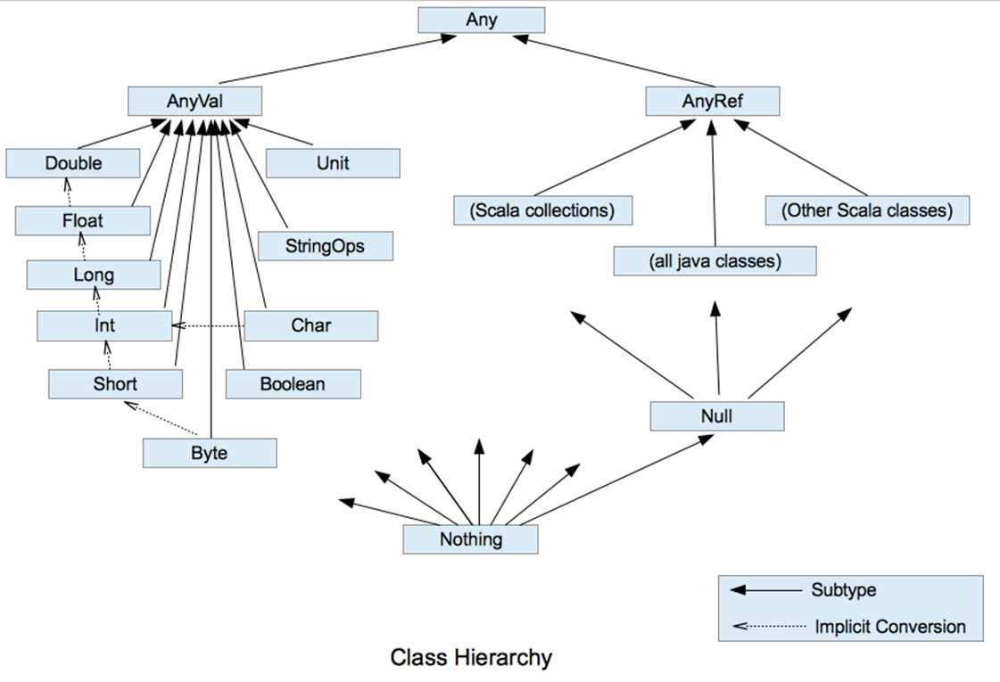
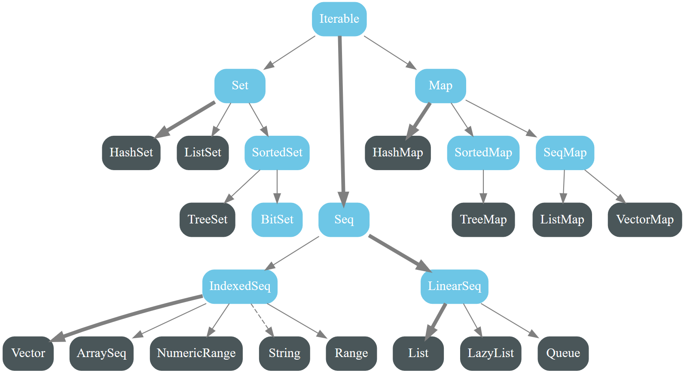
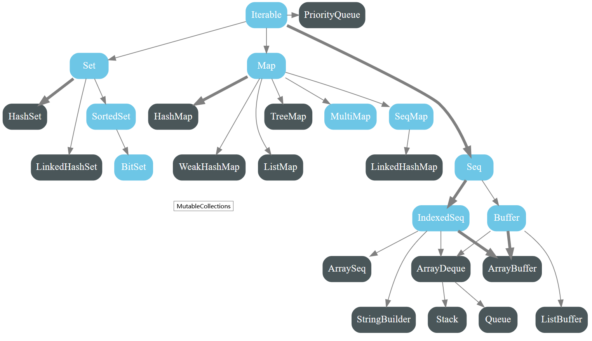

# 一、变量和数据类型
## 1.声明和初始化
```scala
// 变量声明时必须进行初始化
var a:Int = 10 // ;可以选择性忽略
val b:Int = 10 // 常量，重新赋值时编译报错
var c = false //变量类型推断为Boolean
```
<!-- TODO 不能进行类型推断的场景 -->

>**说明**
在实际开发中，虽然定义变量的场景很多，但我们很少为变量重新赋值，而是当作常量来用，所以在使用scala编程时有限使用val，即能用常量的地方不用变量。

## 2.标识符命名规则与规范
标识符(变量，常量，对象名，方法名或函数名)
1. java的规则在scala通用
   标识符由字母、数字、下划线和$组成
   不使用数字开头
2. 支持使用运算符作为变量名
   `+ - ++ --`
   scala中没有传统意义的运算符，所有的运算本质上是方法(函数)
3. 使用``定义变量名
   ```scala
   var ` ` = 10 // 使用``定义变量名为空格
   var `type` = 10 // 定义变量名为关键字type
   ```
   在``内可以使用一切符号构成变量名

```scala
/* scala中的输出方式 */
System.out.println("Hello World!")
println("Hello World!")
printf("Hello World!")
//使用占位符的方式确定输入参数
var a = 20
var b = 20.1
var c = "Hello World!"
printf("print %d %f %.2f $s",a,b,b,c)
// print 20 20.100000 20.10 Hello World!
// 字符模板输出
val s =
    s"""
        |select
        |	name,
        |	age,
        |	sex
        |from user
        |where name='${name}' and age=${age + 2}
    """.stripMargin
val ss = s"age = ${a}"
println(s)
println(ss)
/* scala读取键盘输入 */
val line = StdIn.readLine("input please:")
println(line)
```

```c
%d // 十进制有符号整数
%u // 十进制无符号整数
%f // 浮点数
%s // 字符串
%c // 单个字符
%p // 指针的值
%e // 指数形式的浮点数
%x, %X // 无符号以十六进制表示的整数
%0 // 无符号以八进制表示的整数
%g // 自动选择合适的表示法
```

## 3.数据类型


>**说明**
scala中的**StringOps**是对java中的string的增强补充
scala可以对代码进行**隐式转换**，当Java中某个类型的对象没有某个方法时就调用scala中的方法
**Unit**作为方法的返回值类型，表示该方法没有返回值，Unit作为一种数据类型只有一个值(一对圆括号)，可以声明Unit类型的变量
**Null**类型只有一个值null，Null是任意类型的子类，null可以复制给任何一种引用类型的变量
所有引用类型有个共同的父类**Object**
**Nothing**是其他任意类型(包括数据类型和引用类型)的子类，主要用于帮助方法返回值的推导，Nothing的象征意义大于实际意义

>**数值类型自动转换**
scala支持java中的自动类型提升
scala中的自动类型提升`val a:Int = 10.6.toInt`
其他方法与之同理，toSting toDouble toByte...

 * scala中可以省略调用方法时的`.`，如果没有参数或参数只有一个则可以省略括号

# 二、运算符
```
经典除法 10 / 3 = 3
真除 10 / 3 = 3.333333
```

>**算术运算符**
scala中出列没有自加自减和三元运算符外其他算术运算符和java相同
scala没有真正意义的运算符，都是通过方法来实现

```scala
val i:Int = 2 + 3
val j:Int = 2.+(3) //运算符的本质是方法
```

>**比较运算符**
scala中的`==`和java中的`equals`更接近
scala使用`eq()`方法实现java中的`==`

 * 其他运算符和java一致
 * scala通过if判断的简写形式实现代替三元运算符
 * 在scala中所有的语法结构都有值

```scala
val max = if(m>n) m else n
```

# 三、流程控制
## 1.分支结构
 * scala中使用模式匹配的方式实现`switch-case`
 * 在scala中所有的语法结构都有值
 * 语法结构的值为结构中有效代码的最后一行

```scala
if(m > n){
    //block1
}else if{
    //block2
}else{
    //block3
}
val j = if(3 < 2) 10 else if(3 < 1) 20 else 30
// if结构的值为有效代码(实际运行经过的代码)中最后一行
```

## 2.循环
### 2.0 Array
```scala
var arr0 = Array(10,20,30,40) //自动推断数据类型为元素共同祖先
var arr1 = Array[Int](10,20,30,40) //泛型
arr(1) //使用圆括号确定索引
```

### 2.1 while & do-while
 * 同java

### 2.2 for
 * scala中的for循环严格意义上是对序列的遍历

#### 2.2.0 循环与序列
```scala
val s = "abcd"
for(c <- s){ // 循环遍历字符串
    println(c.getClass.getSimpleName)
}
// 1~10 //左闭又闭
1 to 10
// 1~9
1 until 9 //左闭右开
0 to arr.length - 1
0 until arr.length

val arr = Array(10,20,30)
for (i <- arr){
    println(i)
}
for (i <- 0 to (arr.length -1)){
    println(arr(i))
}
for (i <- 0 until arr.length){ //效果同上
    println(arr(i))
}
```

#### 2.2.1 循环守卫
```scala
for (m <- 1 to 100 if m % 2 == 1){ //只有奇数进入循环
    println(m)
}
```

#### 2.2.2 循环步长
```scala
for (i <- 1 to (100,2)){ //按步长为2递增
    println(i)
}
for (i <- 100 to (1,-1)){ //递减
    println(i)
}
for (i <- 1 to 100 reverse){ //反向
    println(i)
}
```

#### 2.2.3 跳出循环
 * 在scala中没有循环的break关键字
 * 通过抛出异常并`try-catch`的方法使循环结束
 * 也可把循环放进方法使用return跳出方法从而跳出循环

```scala
package com.tian.preview.day01

import scala.util.control.Breaks
import scala.util.control.Breaks._

/**
 * @author tian
 *         2019/9/3 20:43
 */
object BreakDemo {
    /**
  在scala中没有循环的break关键字
  通过抛出异常并`try-catch`的方法使循环结束
  也可把循环放进方法使用return跳出方法从而跳出循环
  @param args
     */
    def main(args: Array[String]): Unit = {
        // 原生try-catch
        try {
            for (i <- 1 to 100) {
                println(i)
                if (i == 10) throw new NullPointerException
            }
        } catch {
            case e =>
        }
        println("done")
        // 通过调用方法进行简化
        Breaks.breakable(
            for (i <- 1 to 100) {
                println(i)
                if (i == 10) Breaks.break()
            }
        )
        println("done")
        // 导包后还可简化为
        breakable { // 本质上是try-catch,变圆括号为大括号
            for (i <- 1 to 10){
                println(i)
                if (i == 5) break // 本质是在抛出异常，Break.break的缩写
            }
        }
        println("done")
    }
}

```

#### 2.2.4 循环嵌套
```scala
//输出九九乘法表
for (i <- 1 to 9) {
    for (j <- 1 to i) {
        print(s"$j * $i = ${j * i}\t")
    }
    println()
}

//使用for的嵌套
for (i <- 1 to 9; j <- 1 to i) {
    print(s"$j * $i = ${j * i}\t")
    if (j == i) println()
}
```

#### 2.2.4 for推导
```scala
//使用for推导输出序列中每个数的三次方
val arr: immutable.IndexedSeq[Int] = for(i <- 1 to 5) yield i*i*i
println(arr)
//序列中的每个元素加3
println((1 to 4).map(_ + 3))
```

# 四、函数式编程
 * 函数可以当作一个值进行传递--高阶函数
 * scala把函数式编程和面向对象变成完美的融合到了一起

## 1.基本语法

>**语法说明**
函数体内可以没有`return`，自动把代码最后一行的值返回
返回值类型省略后根据最后一行代码的值进行`类型推导`
当没有省略return时必须写明返回值类型
省略`=`时表示函数返回`Unit`，无论函数体怎么定义，这时无论函数体如何return，都是返回Unit，这种函数被成为过程
*具体简写规则见至简规则*

>**纯函数**
**特点**:不产生副作用(控制台打印、修改外部变量的值、数据落盘)，引用透明(函数的返回值只和形参有关，和其他值无关)
**优点**:天然的支持高并发，计算速度快(计算的结果直接放进缓存)

>**过程**
与纯函数相反，只有副作用没有返回值的函数

### 1.1 函数的定义
```scala
def foo(a:Int,b:Int):Int = {//函数签名确定函数名，形参列表，返回值类型
    //函数体内编写具体的实现方法
    return a + b
}

def foo2(a:Int,b:Int) = { //省略返回值类型，自动推断
    a + b //省略return，自动返回函数中最后执行的一行语句
}

def foo3(a:Int,b:Int) = {// 错误演示
    return a + b // 当return没有省略时，返回值类型也不能省略
}

def fun1():Unit = {
    print ("Hello fun!")
}
// 简写
def fun1() = {
    print ("Hello fun!")
}
def fun1() = print("Hello fun!")
def fun1 = print("Hello fun!")
```
 * 具体的简写规则见至简原则

### 1.2 可变形参
```scala
//可变参量
def add1(arr: Int*) = {
    var sum = 0
    for (elem <- arr) {
        sum += elem
    }
    sum
}

//可变参量出于形参列表的最后
def add2(a: Double, b: Int, arr: Int*) = {
    var sum = 0
    for (elem <- arr) {
        sum += elem
    }
    sum * a + b
}
```

### 1.3 形参默认值、命名参量
 * 在定义函数时可以为形参指定默认值，调用函数时若没有传入该参数则使用默认值
 * 调用参数时，可以直接指定传入实参对应的形参的名称，有了命名参量，参量顺序没有要求

```scala
def f1(a: Int, b: Int, c: Int = 3) = a + b + c
val m = f1(1,2) // c为默认值3
val n = f1(c = 1, b = 2, a = 2) //通过命令参量传值，可以不考虑顺序
def f2(a: Int, b: Int = 3, c: Int = 4) = a + b + c
val x = f2(3, c = 2) //f2的三个参量中有两个是默认值，传入两个参数，必须通过命名参量确定
def f3(a: Int, b: Int = 2, c: Int) = a + b + c
val y = f3(1, c = 2) // b有形参默认值，不指定命名参量，只传入两个默认第二个仍为b
```

```scala
//求指定范围内的质数的和

def sumPrime(start: Int, end: Int) = {
    var sum = 0
    for (n <- start to end) {
        if (isPrime(n)) sum += n
    }
    sum
}

def isPrime(num: Int): Boolean = {
    for (i <- 2 until num) {
        if (num % i != 0) return false
    }
    true
}
```

### 1.4 惰性函数
 * 只在第一次被调用时执行

<!-- TODO 执行实际说明 -->
```scala
lazy val a0 = {
    println("a...")
    10
}

def main(args: Array[String]): Unit = {
    println(a0)
    println(a0)
}

// 执行时机
val a = 10 //第一次加载object时执行
lazy val b = 10 //第一次调用b时执行
def c = 10 //每次调用时执行
```

## 2.至简原则
```scala
//0.标准写法
def f0(s: String): String = {
    return s + "String"
}

//1.return可以省略，scala使用函数体的最后一行代码作为返回值
//注:如果return没有省略，那么返回值类型也不能省略，同f0
def f1(s: String): String = {
    s + "String"
}

//2.返回值的类型如果可以推断(根据方法体的最后一行代码)出来，也可以省略
def f2(s: String) = {
    s + "String"
}

//3.如果函数体只有一行代码，也可以省略花括号
def f3(s: String) = s + "String"

//4.如果函数没有参数列表，那么小括号可以省略(调用时必须也省略)
def f4 = "String"

val a = f4

//5.如果函数签名明确了返回值为Unit，return不生效
def f5: Unit = return 10
val b = f5 //Unit

//6.如果省略等号，则自动推断返回值为Unit，这时return也不生效
def f6 {
    print("Hello World!")
    return 10
}

//7.如果不关心函数名，只关心逻辑关系，则可省略函数名(和def) -- 匿名函数
val f = (s: String) => return s + "String"
```

## 3.高阶函数
 * 在函数式编程里，除了函数的定义、调用，还能进行函数传递

```scala
// 函数传递
def fun1() = print("fun1")
val f = fun1 _ // 没有调用函数，知识把函数传递(赋值)给f
f() // 传递(赋值)后的变量可以用于调用函数
```

>**高阶函数**
一个函数可以接收一个函数作为参数，或者可以返回一个函数，
这样的函数就是高阶函数(高阶算子)

```scala
def main(args:Array[String]):Unit = {
    print(fun(add)) // 6
}
def add(a:Int,b:Int) = a + b
def fun(n:(Int,Int) => Int) = n(2,4)
```

<!-- TODO 接口回调 -->

## 4.匿名函数
```scala
def main(args: Array[String]): Unit = {
operation(Array(1, 2, 3), (ele: Int) => { //传入的参数为匿名函数
    print(ele) // 匿名函数的函数体
})
// 简写形式
operation(Array(1, 2, 3), i => print(i)) // 函数体只有一行语句省略大括号
operation(Array(1, 2, 3), print(_)) // 每个参数只使用一次，省略参数的说明
}

def operation(arr: Array[Int], op: Int => Unit) =
    for (i <- arr) op(i)
```

```scala
package com.tian.review.day02.highfun

/**
 * 通过高阶函数实现map reduce filter
 *
 * @author tian
 *         2019/9/4 20:51
 */
object HighDemo3 {
    def main(args: Array[String]): Unit = {
        val arr1 = map[Int, String](Array(1, 2, 3, 4), _ + "a")
        val arr2 = map[Int, Int](Array(1, 2, 3, 4), _ + 1)
        val arr3 = map[Char, Int](Array('a', 'b', 'c', 'd'), _.toInt)
        val num1 = reduce[Int](Array(1, 2, 3, 4), _ + _) // 求和
        val str1 = reduce[String](Array("aa", "bb", "cc", "dd"), _ + _) // 拼接
        val arr4 = filter[Int](Array(1, 2, 3, 4), _ % 2 == 0) // 判断每一位是不是偶数
    }

    /**
     * map端对一个数组的每个元素进行操作
     *
     * @param arr 传入的数组
     * @param op  操作函数
     * @tparam T 传入数组的泛型
     * @tparam S 传出数组的泛型
     * @return 经过op操作后得到的数组
     */
    def map[T, S](arr: Array[T], op: T => S) = {
        for (i <- arr) yield op(i) //迭代，使每个元素传入函数
    }

    /**
     * 聚合
     * 使用操作函数对每个元素和上次操作结果(迭代)
     *
     * @param arr 传入的数组
     * @param op  操作函数
     * @tparam T 传入数组的泛型，
     *           tparam S 操作函数返回的泛型
     */
    //  泛型有问题，待解决(可以使用foldLeft解决)
    // def reduce[T, S](arr: Array[T], op: (S, T) => S) = {
    def reduce[T](arr: Array[T], op: (T, T) => T) = {
        var init = arr(0)
        for (index <- 1 until arr.length) op(init, arr(index)) //递归
        init
    }

    /**
     * 迭代数组的元素，使每个传入迭代函数
     *
     * @param arr 传入数组
     * @param op  过滤函数
     * @tparam T 数组泛型
     */
    def filter[T](arr: Array[T], op: T => Boolean) = for (n <- arr) yield op(n)
}
```

## 5.闭包与柯里化
>**说明**
java程序中内部类无法访问局部变量
因为java中没有闭包
闭包可以延长局部变量的声明周期

>**闭包**
如果一个函数访问了他的外部(局部变量的值)，那么这个函数和他所处的环境，成为闭包，闭包是函数式编程的标配

>**柯里化**
把一个参数列表的多个参数，变成多个参数列表
`def add(a:Int)(b:Int) = a + b`

```java
public static void main(String[] args) {
    int i = 10;
    // i = 20;
    new Thread() {
        @Override
        public void run() {
            System.out.println(i);
        }
    };
}
```
```scala
def main(args: Array[String]): Unit = {
    //写法演进
    //        val add4: Int => Int = add(4)
    val add4 = add(4)
    val add45 = add4(5)
    val num45 = add(4)(5)
}
def add(a: Int) = (b: Int) => a + b
def add1(a: Int, b: Int) = a + b
//柯里化
def add2(a: Int)(b: Int) = a + b
```

## 6.递归
 * 递归就是自己调用自己

>**递归满足的条件**
设置了终止条件
逐渐靠近终止条件

 * 递归导致的方法调用次数过多可能会造成栈溢出

```scala
//定义方法通过递归完成阶乘的计算
def factorial(a: Int): Int = {
    if (a == 1) a
    else a * factorial(a - 1)
}
```

## 7.控制抽象

### 7.1 值调用与名调用
>**值调用**
传递的是一个表达式的计算结果

>**名调用**
传递的是一行代码或者一个完整的表达式，只会在每次调用时计算

```java
// java中是值调用
int a = 3
int b = 4
int c = a + b
boolean boo = if(c == 7) //把a + b这个表达式传入，每次计算c的值
```

```scala
//验证scala的名调用
def main(args: Array[String]): Unit = {
    def f = () => {
        println("a...")
        10
    }
    println(f())
    foo(f())
    foo2(f())
}

def foo(a: => Int) = { //名调用
    println(a)
    println(a)
    println(a)
}

def foo2(a: Int) = { //值调用
    println(a)
    println(a)
    println(a)
}
```

### 7.2 名调用的使用方法
```scala
def main(args: Array[String]): Unit = {
    //既然名调用是传递一段代码，那就用代码块作为传参
    foo({
        println("a...")
        10 //为了返回值满足语法要求
    })
    foo{ //省略小括号
        println("a...")
        10
    }
    foo2 {
        println("a...")
    }
}

def foo(a: => Int) = {
    println(a)
}

//实际使用时，因为传入的是代码块，往往不限制类型，即Unit
def foo2(a: => Unit) = {
    println(a) // ()
}
```

### 7.3 名调用的具体案例
```scala
//编写函数，使一段代码能够运行在子线程上
def main(args: Array[String]): Unit = {
    threadFun{
        println(Thread.currentThread().getName)
        for (elem <- 1 to 100 if elem % 2 == 0) println("Hello")
    }

    threadFun{
        println("Hello World!")
        for (elem <- 1 to 100 if elem % 2 == 1) println("World!")
    }
}

def threadFun(f: => Unit) ={
    new Thread() {
        override def run(): Unit = f
    }.start()
}
```
```scala
//结合名调用、递归和柯里化写一个类似于while的语法结构
def main(args: Array[String]): Unit = {
    var a = 10
    var b = 10
    while2(a > 0) {
        println(a)
        a -= 1
    }
    while (b > 0) {
        println(b)
        b -= 1
    }
}

def while2(boo: Boolean)(f: => Unit): Unit = {
    if (boo) {
        f
        while2(boo)(f) //通过递归完成循环
    }
}
```

# 五、面向对象
 * scal的面向对象和java中的面向对象思想相同，知识在语法上有所精简
 * 在做面向对象分析阶段是先有对象，然后是对象的属性特征归类
 * 在具体程序的实现时是先定义类，再根据类创建对象
## 0. Scala包

### 0.1 包的声明
 * scala中除了能够使用java中声明包的方式外还可以使用包语句
 * 通过包语句声明子包，可以嵌套多层，子包调用父包中的内容不需要导包

```scala
package com.tian.onclass.day03.pck
object PckDemo1{
    def main(args:Array[String]):Unit = {

    }
}
//package com.tian.onclass.day03.pck.sub
package sub{
    class B
    class C
    package sub1{
        class D
        class A {
            def foo:Unit = {
                val b: B = null //使用父包中的内容
            }
        }
    }
}
```

### 0.2 导包
 * 使用java中的导包方式，则当前文件中的所有类都可以使用
 * 局部导入(在使用的时候导入)
 * 通配符导入
 * 类别名解决类的重名问题
 * 屏蔽类，排除包中的某个类

```scala
package com.tian.onclass.day03.pck

import java.util
import java.util.{ArrayList => JAL} //别名
import java.util._ //通配符导包
import java.util.{ArrayList => _, _} //屏蔽类ArrayList
import java.util.{ArrayList, List} //导入包中的ArrayList和List类

object PckDemo1 {
    import java.util.ArrayList // 局部导包
    def main(args: Array[String]): Unit = {
        import java.util.ArrayList // 局部导包
        new util.ArrayList[String]()
    }
}
```
### 0.3 默认导包
 * java中`java.lang`自动导入
 * scala中自动导入`java.lang._`、`scala._`和`scala.Predef._`
 * 使用通配符导入object中的静态内容后可以不使用对象就直接调用

```scala
object PckDemo {
    def main(args: Array[String]): Unit = {
        println("aaa")
        import scala.math._ //导入对象中的静态内容
        abs(11 + Pi)
        val user = new User
        user.foo()
        user.foo1()
        import user._
        foo()
        foo1()
    }
}

class User{
    def foo() = {}
    def foo1() = {}
}
```

## 1.类和对象(封装)

### 1.1 类的编写

```scala
class User(var name: String, val age: Int, gender: Char,@BeanProperty addr:String) {
    /*
    从函数式编程的角度来看，是声明了函数了参量
    从面向对象的角度来看，上面的语句同时声明了类，和属性(公有私有，getter，setter)，构造器
    当使用var时表示公有属性，提供name方法作用同getter，name_$eq方法作用同setter
    当使用val时表示私有属性，不提供name_$eq只提供name方法供调用
    当没有具体指明val或var，则表示这是私有属性，没有公共的name,name_$eq方法完成set和get
    当使用@BeanProperty注解修饰时，scala会按照val或var约束额外提供复合JavaBean标准的setter和getter
     */
    def foo() ={
        println(name) //闭包，从函数式编程的角度，调用外部变量
        println(this.name) //使用this表示从面向对象的角度，调用属性
    }
    def foo2() = {
        val name = "aaa"
        println(name) //调用的是内部定义的name
        println(this.name) //调用的是属性值(外部变量)name，闭包
    }
}

class Person(var name: String) //如果一个类中没有内容，可以省略大括号
```

### 1.2 对象
```scala
object ObjDemo1 {
    def main(args: Array[String]): Unit = {
        // 声明user为val，属性可变更，val的意义在于内存位置不变，即不可被赋值为其他对象
        val user = new User("wangwu", 20, 'f', "Shenzhen")
        println(user.name) // 实际调用的是name方法
        user.name = "lisi" //实际调用的是name_$eq方法
        println(user.name)
        val user2 = new User("zhangsan", 30, 'm', "Guangzhou")
        //        user = user2
    }
}
```

### 1.3 构造器
 * 可以通过参数默认值的方式实现传不同个数的参量完成对象的创建
 * 但这本质上不是java中构造器的重载，不能从根本上实现构造器重载的效果

```scala
class User(var name:String, val age:Int, sex:String = "f")
```

 * scala支持构造函数的重载
 * 其他构造函数使用def this() {} 的方式重载，不能写返回值和等号
 * scala中的构造函数有主和辅之分
 * 主构造函数只能有一个，形参自动成为类的属性
 * 辅构造函数首行必须调用主构造函数，可以有多个
 * 当调用辅构造时，本质上还是会调用到主构造
 * 辅助构造之间互相调用时，只能后面调用前面的

```scala
def main(args: Array[String]): Unit = {
    new User("aa", 20, "f")
}
class User(var name: String, val age: Int, sex: String) {//sex会被编译器优化掉
    var a:Int = 0
    val b:String = ""
    // 对应java类中的构造代码块，在创建对象时执行
    println("Hello")
    println("World")
    // 静态代码块写在伴生object中
    def this() { // 构造函数的重载
        this("lisi", 20, "f") //这种写法要求必须调用被重载的构造函数
    }
    def this(name: String) {
        this("wangwu", 20, "f")
    }
    def this(a: Int) { // 辅助构造函数的参量不会成为属性，只是函数局部的常量
        this()
    }
    def this(e: Char) {
        this("10") //辅助构造之间互相调用时，只能后面调用前面的
    }
}
```

## 2.继承和多态

### 2.1 继承性
 * scala和java一样也是单继承
 * 覆写遵循规则:两同(方法名，形参列表)，两小(返回值类型，抛出异常的类型)，一大(权限修饰符)

```scala
class Persion{
    def say():Unit = {
        println("person say...")
    }
}

class Stu extends Person{
    override def say():Unit = {
        println("stu say...")
    }
    def eat():Unit = {}
    println("stu eat...")
}

class A3(val n:Int)
class B3() extends A3(100)//必须传值给父类的主构造
```

>**方法的覆写**
必须添加override关键字

>**属性的覆写**
val可以覆写val和没有参数的def
var只能覆写抽象的var

```scala
object ExtendsDemo2 {
    def main(args: Array[String]): Unit = {
        val b = new B1
        println(b.a)
        println(b.b)
        println(b.n)
    }
}

abstract class A1 {
    def n = 10
    var a: Int
    val b = 20
}

class B1 extends A1 {
    //    override def n: Int = 100
    override val n = 100
    override var a = 100
    override val b = 200
}
```

 * 在继承时只有子类的主构造才有权利调用父类的构造器

```scala
// 继承案例
class Point(val x: Double, val y: Double) {
    def distance(other: Point) =
        math.sqrt((this.x - other.x) * (this.x - other.x)
            + (this.y - other.y) * (this.y - other.y))
}

class Circle(override val x: Double, override val y: Double, val r: Double)
    extends Point(x, y) {
    def area = math.Pi * r * r
}
```

### 2.2 多态性
 * 编译时类型和运行时类型不一致就是多态
 * 多态就是父类的引用指向子类的实例

 * 编译能否通过看编译时类型
 * 执行的具体表现看运行时类型

 * java中属性没有多态，但是scala有多态
 * 在scala中调用属性本质上是调用方法，方法有多态，所以在scala中也有多态

### 2.3 抽象类
 * property包含fields和method

```scala
abstract class Human(val name:String){
    val age:Int = 0 //无法从外部传参
    var addr:String = _ //让jvm赋值为默认值
    var sex:String //抽象字段，只声明，不初始化，只能在抽象类和接口中使用
    def say(a:Int):Int //抽象方法，只有签名没有实现，不写返回值类型时为Unit
    val a:Int //常量也可以是抽象的
}
class Person2(override val name:String,override val age:Int)extends Human(name) {
    override var sex: String = _
    override def say(a: Int): Int = 10
    override val a: Int = 10
}
```

### 2.4 类型判断和转换

```scala
object TypeDemo {
    def main(args: Array[String]): Unit = {
        val b: A6 = new B6
        println(b.isInstanceOf[B6])
        println(b.isInstanceOf[A6])
        //        b.f0
        b.asInstanceOf[B6].f0 //类型转换后调用函数
    }
}

class A6

class B6 extends A6 {
    def f0 = println("bbbb")
}
```

### * 类的别名
```scala
class TypeDemo2 {
    def main(args: Array[String]): Unit = {
        type P = aojaosigjaoisgaoijg
        val p = new P
        println(p.isInstanceOf[P])
        println(p.isInstanceOf[aojaosigjaoisgaoijg])
        println(p.getClass.getSimpleName)
    }
}
class aojaosigjaoisgaoijg
// true
// true
// aojaosigjaoisgaoijg
```

## 3.权限修饰符
 * 在Java中权限修饰符修饰的方法，如不在同一个包的类继承后只能通过`super.foo()`访问
 * 在scala中有三种权限修饰符 默认、protected、private

>**默认**
类似于public，但是没有public关键字

>**protected**
只能子父类访问，只是同包不能访问

>**private**
定制private包，对指定包开放权限

```scala
class A5{
    //指定包以及它的子包都可以访问
    private[modifier] def foo() = {}
    foo()
}
class B5 extends A5{
    val a = new A5
    a.foo() //定制后才能访问
}
```

## 4.伴生
 * java中不够面向对象的元素:基本类型、静态
 * scala中通过对象object实现静态的效果，同时解决了单例问题

>**伴生类和伴生对象**
名字相同的`object`和`class`
在同一个文件
可以访问对方的私有成员

```scala
object SingleDemo {
    def main(args: Array[String]): Unit = {
        val dog = new Dog("red")
        dog.speak()
        val dog1 = Dog //调用了apply()方法
        val dog2 = Dog("white")
    }
}

class Dog(val color: String) {
    def speak() = println("dog speak...")
    Dog.foo() //可以访问对方的私有成员
}

object Dog {
    private def foo() = println("private dog foo...")
    def apply(color: String): Dog = new Dog(color)
}
```

```scala
sealed abstract class Father //sealed修改只能在该文件中继承
object A extends Father //单例对象，通过继承限制类
object B //单例对象，也叫独立对象
```

## 5.工厂类
```scala
package com.tian.review.day03.single

import scala.collection.mutable

/**
 * 工厂类
 *
 * @author tian
 *         2019/9/9 18:30
 */
object Marker {
    val markers = mutable.Map(
        "red" -> new Marker("red"),
        "blue" -> new Marker("blue"),
        "yellow" -> new Marker("yellow")
    )
    def getMarker(color:String) ={
        markers.getOrElseUpdate(color,new Marker(color))
    }
    def main(args: Array[String]): Unit = {
        println(Marker.getMarker("red"))
        println(Marker.getMarker("yellow"))
        println(Marker.getMarker("blue"))
    }
}

class Marker private (val color:String){ //私有化构造器
    println(s"$color marker")
    override def toString: String = s"$color"
}
```

## 6.trait
<!-- TODO trait部分视频，待补全 -->
 * 在java1.8之前接口中有常量和抽象方法，在1.8之后又添加了默认方法
 * scala中没有接口的概念，而是使用trait(特质)来实现

### 6.1 trait的声明和混入
```scala
object TraitDemo1 {
    def main(args: Array[String]): Unit = {
        val usb = new HuaWeiUsb
        usb.print()
    }
}

class HuaWeiUsb extends Usb with Console { //特质混入
    //重写抽象方法
    override def insert(): Unit = println("huawei usb insert...")
    override def work: Unit = println("huawei usb work...")
    override def discard(): Unit = println("huawei usb discard...")
    override def display: Unit = println("huawei usb display...")
    override def print(): Unit = { //调用方法
        insert()
        work
        discard()
        display
    }
}

trait Test0 {
    val a = 10
    var b = 20
    var c: Int //抽象
    def foo = {} //默认方法
    def foo1: Int //抽象方法
}

trait Usb {
    def insert()
    def work
    def discard():Unit
    def display:Unit
}

trait Console {
    def print(): Unit
}
```

### 6.2 多混入时的执行顺序

### 6.3 trait继承类

### 6.4 自身混入

### 6.5 动态叠加


# 六、集合
 * scala可直接使用java的集合
 * scala提供了两套集合:可变和不可变
 * 优先使用不可变，且默认情况下都是不可变的

[官方文档说明](https://docs.scala-lang.org/overviews/collections-2.13/overview.html#inner-main)

>**immutable不可变**



>**mutable可变**



## 1.Array
### 1.1 定长数组

 * 定长数组底层就是java的数组
 * 通过初始化元素的个数直接确定数组的长度

#### 1.1.1 数组的定义
```scala
//val arr = new Array[Int](10) //默认为十个0
val arr = Array(1, 2, 3)
arr(0) = 100
println(arr(0))
println(arr(arr.length - 1))
println(arr.size)
var arr2 = Array(20, 30, 40)
println(arr2)
arr2 :+= 20 //对于不可变数组而言是添加后成为一个新的数组并赋值
println(arr2)
```
#### 1.1.2 多维数组
```scala
val array = Array.ofDim[Int](2, 3)
for (arr <- array) {
    for (elem <- arr) {
        println(elem)
    }
}
```
### 1.2 ArrayBuffer
 * 可变数组ArrayBuffer


## 2.List


## 3.Tuple

## 4.Queue


## 5.Stack


## 6.Map

## 7.Set

## 8.高阶算子
### 8.1 map


### 8.2 flatMap


### 8.3 filter


### 8.4 reduce


### 8.5 foldLeft

### 8.6 groupBy


### 8.7 sort

<!-- TODO word 7.7 集合常用函数 -->
```
ArrayDemo1
ArrayBufferDemo1
ArrayDemo2 多维数组
ListDemo
TupleDemo
QueueDemo
StackDemo
StackTest
MapDemo
SetDemo1
ForeachDemo
MapDemo
FlatMapDemo
FilterDemo
ReduceDemo
FoldLeftDemo1
FoldLeftDemo2 - WordCount
```


https://zhenchao125.github.io/


# 七、隐式转换

```scala
implicit def double2Int(d:Double) = d.toInt
val a:Int = 10.2 //自动寻找implicit修饰的传参只有Double返回Int的函数
println(a)
```

## 1.隐式转换函数


## 2.隐式类


## 3.隐式参数与隐式值

# 八、模式匹配


