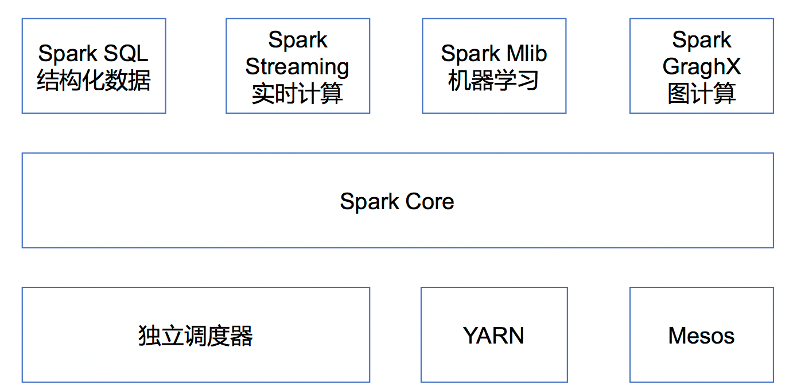
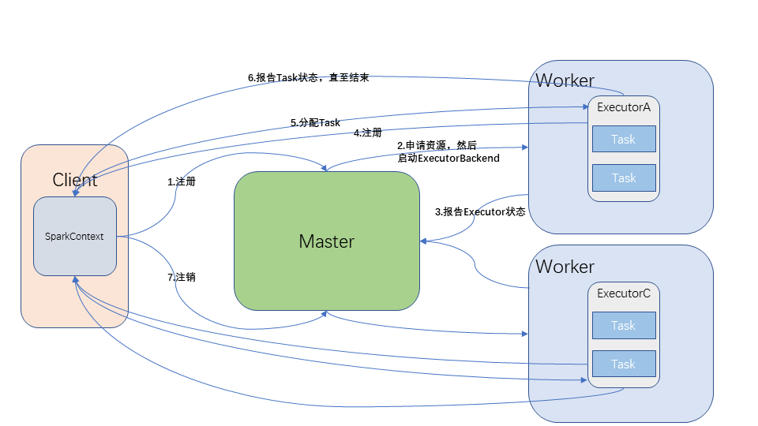

# :black_nib:概述

## 1.概念
**Spark** 是一个快速(基于内存), 通用, 可扩展的集群计算引擎
并且 Spark 目前已经成为 Apache 最活跃的开源项目, 有超过 1000 个活跃的贡献者

## 2.特点

>**快速**

>**易用**

>**通用**

>**可融合性**

## 3.模块


>**集群管理器(Cluster Manager)**
Hadoop YARN 国内使用最广泛
Apache Mesos 国内使用较少，国外使用较多
Standalone Spark自带的资源调度器，需要在集群中的每个节点配置Spark

>**Spark Core**
实现了 Spark 的基本功能，包含任务调度、内存管理、错误恢复、与存储系统交互等模块。SparkCore 中还包含了对弹性分布式数据集(Resilient Distributed DataSet，简称RDD)的API定义

>**Spark Streaming**
是 Spark 提供的对实时数据进行流式计算的组件。提供了用来操作数据流的 API，并且与 Spark Core 中的 RDD API 高度对应

>**Spark MLlib**
提供常见的机器学习 (ML) 功能的程序库。包括分类、回归、聚类、协同过滤等，还提供了模型评估、数据导入等额外的支持功能。


# 一、运行模式
 * 版本选型:v2.1.1(当前主流)

spark-submit 用于发布应用程序
spark-shell 用于快速验证
spark context 整个spark的入口
spark session spark会话

## 0.环境搭建

```bash
tar -zxvf spark-2.1.1-bin-hadoop2.7.tgz -C /opt/module/
mv spark-2.1.1-bin-hadoop2.7 spark-local
# 官方迭代求π案例
bin/spark-submit \
--class org.apache.spark.examples.SparkPi \
--executor-memory 1G \
--total-executor-cores 2 \
./examples/jars/spark-examples_2.11-2.1.1.jar \
100
# 另一种写法
bin/spark-submit \
--class org.apache.spark.examples.SparkPi \
--master local[2] \
./examples/jars/spark-examples_2.11-2.1.1.jar 100
# zsh需要把local[2]加上引号:'local[2]'
# 快捷方式
bin/run-example SparkPi 100
```

>**语法**

<!-- TODO 脚本语法介绍 -->

## 1.Local模式
```bash
# 在input目录下准备文件做wordcount
vim input/1.txt
vim input/2.txt
vim input/3.txt
bin/spark-shell # 进入交互式命令窗口
```
```scala
// wordcount 案例
val rdd = sc.textFile("./input").flatMap(_.split("\\W+")).map((_,1)).reduceByKey(_ + _) //转元组后相同的word累加
rdd.collect //查看结果

sc.textFile("./input").flatMap(_.split("\\W+")).map((_,1)).reduceByKey(_ + _).collect
```
Spark shell application UI
http://hadoop102:4040

## 2.Standalone模式
### 2.1 集群角色
 * Master和Worker时两种永久工作的守护进程

#### 2.1.1 Master
* 特有资源调度系统的Leader，掌管整个集群的资源信息了私欲Yarn框架中的ResourceManager

>**作用**
监听Worker是否正常工作
Master对Worker、Application等的管理(接收Worker的注册并管理所有Worker，接收Client提交的Application，调度等待的Application并向Worker提交)

#### 2.1.2 Worker
 * Spark特有资源调度系统的Slave，有多个，每个Slave掌管所在节点的资源信息，类似于Yarn框架中的NodeManager

>**作用**
通过RegisterWorker注册到Master
定时发送心跳给Master
根据Master发送的Application的配置进程环境，并启动ExecutorBackend(执行Task所需的临时进程)
 * 每个Worker上可能有多个ExecutorBackend，每个ExecutorBackend可能有多个Task

#### 2.1.3 Dirver(驱动器)
 * Spark的驱动器是执行开发程序中的main方法线程
 * 用来创建SparkContext、RDD、以及进行RDD的转化操作和行动操作代码执行
 * Driver默认运行在客户端

>**作用**
将用户程序转化为作业(job)
在Executor之间调度任务(Task)
跟踪Executor的执行情况
通过UI展示运行状况

#### 2.1.4 Executor(执行器)
 * Spark Executor是一个工作节点，负责在Spark作业中运行任务，人物件相互独立

>**作用**
负责运行组成Spark应用的任务，并将状态信息返回给驱动程序
通过自身的块管理器(Block Manager)为用户程序中要求缓存的RDD提供内存式存储

#### 总结
Master 和 Worker 是 Spark 的守护进程，即 Spark 在特定模式下正常运行所必须的进程。Driver 和 Executor 是临时程序，当有具体任务提交到 Spark 集群才会开启的程序。

### 2.2 搭建Standalone模式
```bash
cp -r spark spark-standalone
cd conf/
cp spark-env.sh.template spark-env.sh
vim spark-env.sh
cp slave.template slaves
vim slaves
xsync /opt/module/spark-standalone/
```
```properties
SPARK_MASTER_HOST=hadoop102
SPARK_MASTER_PORT=7077 # 默认端口就是7077, 可以省略不配
```
```
hadoop102
hadoop103
hadoop104
```
Web查看Spark集群情况
http://hadoop102:8080


### 2.3 案例
```bash
# standalone运行官方计算π案例
bin/spark-submit \
--class org.apache.spark.examples.SparkPi \
--master spark://hadoop102:7077 \
--executor-memory 1G \
--total-executor-cores 6 \
--executor-cores 2 \
./examples/jars/spark-examples_2.11-2.1.1.jar 100
```
>**语法**
<!-- TODO 脚本语法 -->

 * 在哪个节点启动脚本就在哪个位置启动master进程，根据slaves配置的节点启动slave进程


```bash
# 集群模式启动spark-shell
bin/spark-shell \
--master spark://hadoop102:7077
```
```scala
//wordcount
sc.textFile("input/").flatMap(_.split(" ")).map((_,1)).reduceByKey(_+_).collect
```
 * 每个worker节点上要有相同的文件夹:input/, 否则会报文件不存在的异常，但是最终有结果(这是spark的容错能力，可以使用正常的节点来代替异常的节点执行任务)

### 2.4 历史服务器
 * 应用程序UI `hadoop:4040` 在`Spark-shell`程序执行结束后就瞬间消失了，为了记录过程，我们需要配置历史服务器

```bash
cp spark-defaults.conf.template spark-defaults.conf
vim spark-defaults.conf
vim spark-env.sh
# 
xsync /opt/module/spark-standalone/conf/
# 先启动hdfs
# 启动历史服务
sbin/start-history-server.sh
```
```conf
spark.master                     spark://hadoop102:7077
spark.eventLog.enabled           true
spark.eventLog.dir               hdfs://hadoop102:9000/spark-job-log
```
```sh
export SPARK_HISTORY_OPTS="-Dspark.history.ui.port=18080 -Dspark.history.retainedApplications=30 -Dspark.history.fs.logDirectory=hdfs://hadoop102:9000/spark-job-log"
```
 * hdfs://hadoop102:9000/spark-job-log 目录必须提前存在, 名字随意

```bash
# 执行任务，查看历史服务
bin/spark-submit \
--class org.apache.spark.examples.SparkPi \
--master spark://hadoop102:7077 \
--executor-memory 1G \
--total-executor-cores 6 \
./examples/jars/spark-examples_2.11-2.1.1.jar 100
```

历史服务器UI地址
http://hadoop102:18080

`--deploy-mode`参数的设置
`--deploy-mode client` 设置driver运行在客户端，默认
`--deploy-mode cluster` 设置driver运行在集群

<!-- TODO 视频 -->

### 2.5 HA
 * 只有一个master时会有单点故障问题
 * 可以启动多个 master, 先启动的处于 Active 状态, 其他的都处于 Standby 状态

<!-- TODO Status Recovering -->

```bash
vim spark-env.sh
xsync spark-env.sh
# 先启动zk
# 启动spark-standalone
sbin/start-all.sh # hadoop102
sbin/start-master.sh # hadoop103
# 分别通过8080端口查看两个节点的master状态
# 杀死hadoop102的master再次查看两个节点master状态
```
```sh
# 注释掉如下内容：
#SPARK_MASTER_HOST=hadoop102
#SPARK_MASTER_PORT=7077

# 添加上如下内容：
export SPARK_DAEMON_JAVA_OPTS="-Dspark.deploy.recoveryMode=ZOOKEEPER -Dspark.deploy.zookeeper.url=hadoop102:2181,hadoop103:2181,hadoop104:2181 -Dspark.deploy.zookeeper.dir=/spark"
```

### 2.6 Standalone工作模式


## 3.Yarn模式
### 3.1 概述
 * Spark客户端直接连接Yarn，不需要额外构建Spark集群。有yarn-client和yarn-cluster两种模式，主要区别在于：Driver程序的运行节点
 * yarn-client：Driver程序运行在客户端，适用于交互、调试，希望立即看到app的输出
 * yarn-cluster：Driver程序运行在由ResourceManager启动的APPMaster

**Yarn运行模式**


### 3.2 配置
```bash
vim yarn-site.xml
vim spark-env.sh
# YARN_CONF_DIR=/opt/module/hadoop-2.7.2/etc/hadoop
xsync /opt/module/hadoop-2.7.2/etc/hadoop/yarn-site.xml
```
```xml
<!--是否启动一个线程检查每个任务正使用的物理内存量，如果任务超出分配值，则直接将其杀掉，默认是true -->
    <property>
            <name>yarn.nodemanager.pmem-check-enabled</name>
            <value>false</value>
    </property>
    <!--是否启动一个线程检查每个任务正使用的虚拟内存量，如果任务超出分配值，则直接将其杀掉，默认是true -->
    <property>
            <name>yarn.nodemanager.vmem-check-enabled</name>
            <value>false</value>
    </property>
```

### 3.3 案例
```bash
bin/spark-submit \
--class org.apache.spark.examples.SparkPi \
--master yarn \
--deploy-mode client \
./examples/jars/spark-examples_2.11-2.1.1.jar \
100
```

### 3.4 日志服务
```bash
vim spark-defaults.conf
# 重启历史服务器

# 提交任务到yarn执行
bin/spark-submit \
--class org.apache.spark.examples.SparkPi \
--master yarn \
--deploy-mode client \
./examples/jars/spark-examples_2.11-2.1.1.jar \
100
# 从web端查看Yarn日志
```
```conf
spark.yarn.historyServer.address=hadoop102:18080
spark.history.ui.port=18080
```

## * Mesos
 * 使用较少，略

# 三、案例实操
## 1.编写WordCount
Maven工程WordCount
```xml
<dependencies>
    <dependency>
        <groupId>org.apache.spark</groupId>
        <artifactId>spark-core_2.11</artifactId>
        <version>2.1.1</version>
    </dependency>
</dependencies>
<build>
    <plugins>
        <!-- 打包插件, 否则 scala 类不会编译并打包进去 -->
        <plugin>
            <groupId>net.alchim31.maven</groupId>
            <artifactId>scala-maven-plugin</artifactId>
            <version>3.4.6</version>
            <executions>
                <execution>
                    <goals>
                        <goal>compile</goal>
                        <goal>testCompile</goal>
                    </goals>
                </execution>
            </executions>
        </plugin>
    </plugins>
</build>
```
```scala
object WordCount {
    def main(args: Array[String]): Unit = {
        //1.初始化spark context
        val conf = new SparkConf()
            .setAppName("WordCount")
        //.setMaster("local[*]") //上传jar包在服务器运行不能设置
        val sc = new SparkContext(conf)

        //2.转换
        val rdd = sc.textFile(args(0)) //手动传入路径
            .flatMap(_.split("\\W+"))
            .map((_, 1))
            .reduceByKey(_ + _)

        //3.行动
        val result = rdd.collect()
        result.foreach(println)

        //4.关闭上下文
        sc.stop()
    }
}
```

## 2.测试

### 2.1 Linux服务器测试
```bash
bin/spark-submit \
--class com.tian.day01.WordCount \
--master yarn input/spark-core-1.0-SNAPSHOT.jar
```

### 2.2 Idea本地测试