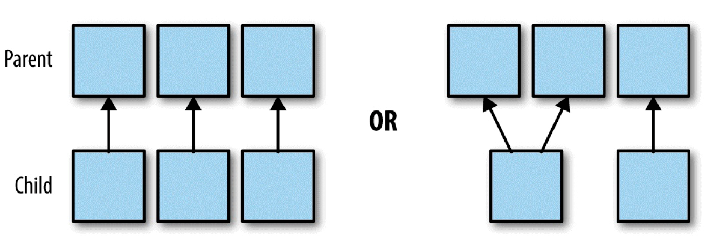
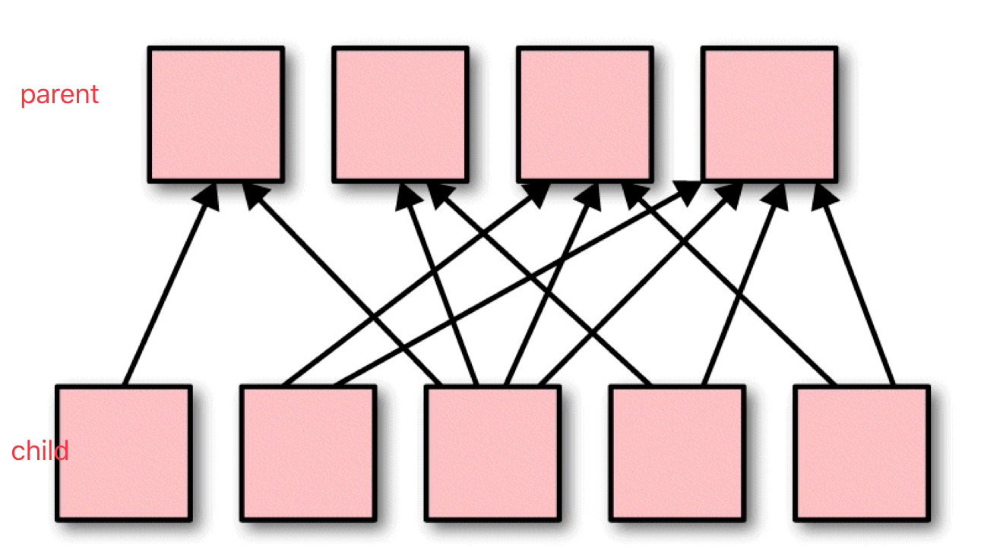
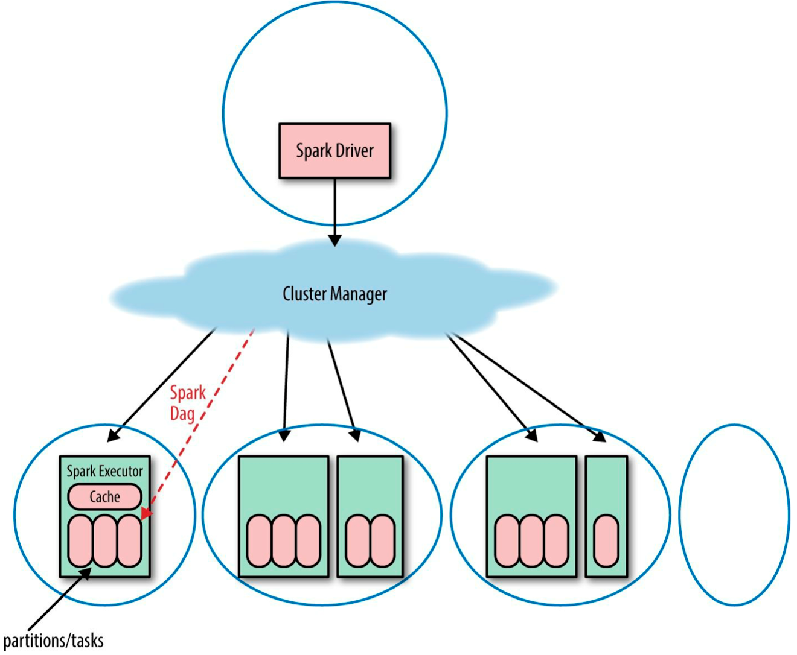
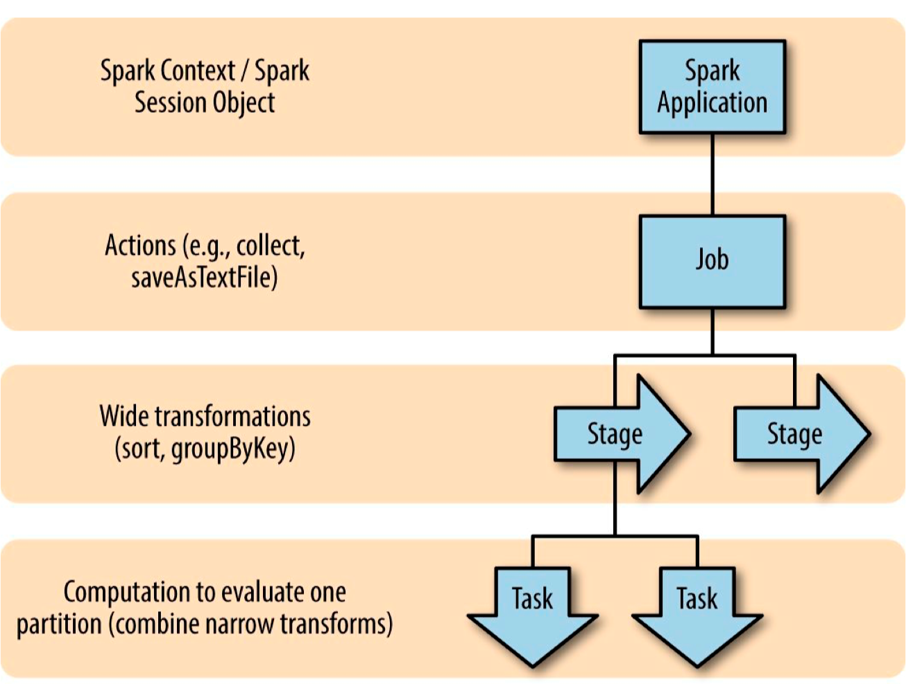
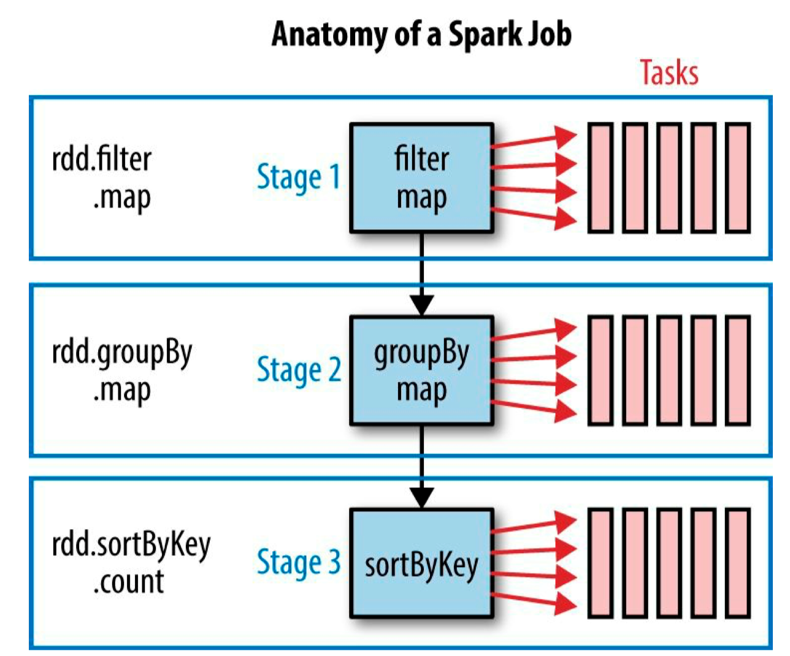

# 一、RDD概述
## 1.概念
Resilient Distributed Dataset弹性分布式数据集，是Spark中最基本的数据抽象
在代码中是一个抽象类，是一个弹性，可变，可分区，元素可并行计算的集合

## 2.特点
### 2.1 弹性
弹性存储:内存和磁盘的自动切换
弹性容错:丢失数据可以自动恢复
弹性计算:计算出错重试机制
弹性分片:可根据需要重新分片k

### 2.2 分区
对数据进行切片

### 2.3 只读
保证程序很少的bug
RDD是只读的，如果需要改变RDD中的数据，只能在现有RDD的基础上创建新的RDD
RDD的转换可以通过丰富的算子来实现，算子分为两类

>**transformation**
用来将RDD进行转化，构建RDD的血缘关系，如collect
collect是把数据拉到driver的内存

>**action**
用来触发RDD计算，得到RDD的相关计算结果后者保存RDD数据到文件系统中

 * transformation是懒执行，返回的是一个RDD
 * action是实际执行

### 2.4 依赖(血缘)
RDDs通过操作算子进行转换，转换得到的新RDD包含了从其他RDDs衍生所必须的信息，RDDs之间维护着这种血缘关系，也称为依赖


>**窄依赖**
RDDs 之间分区是一一对应的

>**宽依赖**
下游 RDD 的每个分区与上游 RDD(也称之为父RDD)的每个分区都有关，是多对多的关系

### 2.5 缓存
如果在应用程序中多次使用同一个RDD，

### 2.6 checkpoint
长时间的迭代会使血缘关系变得很复杂，在迭代过程出错时需要很负责的血缘关系重建，

## 3.属性

### 3.1 A list of partition

### 3.2 A function of computing each split

### 3.3 A list of dependences on RDDs

### 3.4 Optionally, a Patition for key-value RDDs(e.g. to say the RDDs  is hash-partitioned)

### 3.5 Optionally, a list of preferred locations to compute each split on(e.g. block locations for an HDFS file)

# 二、RDD编程
## 1.RDD编程模型
```scala
//获取sc
val conf = new SparkConf().setAppName("Practice").setMaster("local[2]")
val sc = new SparkContext(conf)
//转换
val rdd1 = sc.parallelize(Array("hello", "hello", "world", "scala"))
val rdd2 = rdd1.map(x => {
    println(x)
    (x, 1)
})
//行动
rdd2.collect.foreach(println)
//关闭上下文
sc.stop()
```
### 1.1 转换(transformation)
RDD编程的核心部分

### 1.2 行动(action)
action可以是向应用程序返回结果(count, collect等)，或者是向存储系统保存数据(saveAsTextFile等)

## 2.RDD创建
### 2.1 创建RDD的途径
1. 通过标准的scala集合来得到
2. 从外部存储得到
3. 从其他RDD转换得到

### 2.2 CreateRDD
```scala
object CreateRDD {
    def main(args: Array[String]): Unit = {
        val conf = new SparkConf().setAppName("CreateRDD").setMaster("local[2]")
        val sc = new SparkContext(conf)
        //1. 通过标准的scala集合得到RDD
        val list1 = List(20, 30, 40, 40, 50)
        val rdd = sc.parallelize(list1)
        val list2 = sc.makeRDD(list1) //效果同上，对有些集合会有优化
        rdd.collect().foreach(println)
        //2. 通过外部存储得到RDD
        val linesRDD = sc.textFile("e:/test.txt") //存放一行数据
        //3. 从其他RDD转换得到
        sc.stop()
    }
}
```

## 3.RDD转换算子
`RDD[value]` 单value
`RDD[key,value]` kv类型

### 3.1 单value类型
#### 3.1.1 map(func)
 * 和集合的高阶算子map相同
 * `func:T => U`

```scala
val rdd2 = rdd1.map(x => x * x)
```

#### 3.1.2 mapPartitions(func)
 * func的传参和返回值都是iterator
 * `func:Iterator<T> => Iterator<U>`

```scala
val rdd2 = rdd1.mapPartition(it => it.map(x => x * x))
```

**分区的确定**
start = i * length / numSlices
end = (i + 1) * length / numSlices
[start, end)
<!-- TODO 源码 -->
经过transformation后分区数不变

#### 3.1.3 mapPartitionsWithIndex(func)
 * func的传参是index和iterator组成的tuple2，返回值仍为iterator
 * `func:(Int,Iterator<T>) => Iterator<U>`

```scala
val rdd2 = rdd1.mapPartitionWithIndex((index,it) => it.map((index,_)))
```

#### 3.1.4 flatMap(func)
 * 和集合高阶算子的flatMap相同

```scala
val rdd2 = rdd1.flatMap(_.split("\\W+"))
```

#### 3.1.5 glom()

```scala
//Return an RDD created by coalescing all elements within each partition into an array.
val rdd2 = rdd1.glom()
rdd2.collect.foreach(x => println(x.mkString(",")))
```

#### 3.1.6 filter(func)

```scala
val rdd2 = rdd1.filter(_ % 2 == 0)
val rdd3 = rdd1.filter(x => (x & 1) == 1)
```

#### 3.1.7 groupBy(func)

```scala
val rdd2 = rdd1
    .groupBy(_ % 2 == 1)
    .map {
        case (k, iterator) => (k, iterator.sum)
    }
```

#### 3.1.8 sample(withReplacement, fraction, seed)
 * scala会自动生成seed值，如果传入则必须保证互不相同
 * seed为固定值会导致抽样的结果相同

```scala
val rdd2 = rdd1.sample(false, 0.5)
```

#### 3.1.9 distinct([numTasks])
 * 自定义类需要提供Ordering类型隐式值

```scala
//def distinct(numPartitions: Int)(implicit ord: Ordering[T] = null)
val rdd2 = rdd1.distinct() //不传参时使用集合长度distinct(partitions.length)
val rdd3 = rdd1.distinct(4)
```

#### 3.1.10 coalesce(numPartitions)
 * 改变分区数，只支持减少，默认不支持增加
 * 且这个减少分区，不会shuffle

```scala
val rdd1 = sc.parallelize(Array(20, 30, 40, 50, 20, 50), 4)
val rdd2 = rdd1.coalesce(2)
println(rdd1.getNumPartitions)
println(rdd2.getNumPartitions)
```

#### 3.1.11 repartition(numPartitions)
```scala
//coalesce(numPartitions, shuffle = true)，本质上调用coalesce
val rdd2 = rdd1.repartition(10)
```

#### 3.1.12 sortBy(func,[ascending], [numTasks])

```scala
object RDDSortBy {
    implicit val ord: Ordering[User] = new Ordering[User] {
        override def compare(x: User, y: User): Int = x.age - y.age
    }

    def main(args: Array[String]): Unit = {
        val conf: SparkConf = new SparkConf().setAppName("Practice").setMaster("local[2]")
        val sc = new SparkContext(conf)
        val rdd1 = sc.parallelize(Array(20, 30, 40, 50, 20, 50))
        //自定义类需要提供隐式值Ordering
        val rdd2 = rdd1.sortBy(x => x, true) //一定会shuffle
        val rdd3 = rdd1.sortBy(x => x, ascending = false) //降序
        rdd2.collect.foreach(println)
        val rddU1 = sc.parallelize(Array(User(20, "a"), User(20, "b"), User(50, "c")))
        val rddU2 = rddU1.sortBy(user => (user.age, user.name))
        val rddU3 = rddU1.sortBy(user => user) //需要提供隐式值ord: Ordering[User]
        println(rddU2.collect.mkString(","))
        sc.stop()
    }
}

case class User(age: Int, name: String)
```

#### 3.1.13 pipe(command, [envVars])
 * 每个分区执行一次command

>**作用**
管道，针对每个分区，把 RDD 中的每个数据通过管道传递给shell命令或脚本，返回输出的RDD。一个分区执行一次这个命令. 如果只有一个分区, 则执行一次命令

>**注意**
脚本要放在 worker 节点可以访问到的位置


>**实现步骤**
```bash
# 编写脚本
vim pipe.sh
```
```sh
echo "hello"
while read line;do
    echo ">>>"$line
done
```
```scala
// 创建一个只有1个分区的RDD
scala> val rdd1 = sc.parallelize(Array(10,20,30,40), 1)
rdd1: org.apache.spark.rdd.RDD[Int] = ParallelCollectionRDD[0] at parallelize at <console>:24

scala> rdd1.pipe("./pipe.sh").collect
res1: Array[String] = Array(hello, >>>10, >>>20, >>>30, >>>40)

//创建有两个分区的RDD
scala> val rdd1 = sc.parallelize(Array(10,20,30,40), 2)
rdd1: org.apache.spark.rdd.RDD[Int] = ParallelCollectionRDD[3] at parallelize at <console>:24

scala> rdd1.pipe("./pipe.sh").collect
res2: Array[String] = Array(hello, >>>10, >>>20, hello, >>>30, >>>40)
```

>**总结**
每个分区执行一次脚本, 但是每个元素算是标准输入中的一行

### 3.2 双value交互
<!-- TODO 交互后分区数的变化 -->
#### 3.2.1 union(otherDataset)
 * 并集

```scala
val rdd3 = rdd1.union(rdd2)
val rdd4 = rdd1 ++ rdd2 //同上
```

#### 3.2.2 subtract (otherDataset)
 * 差集
 * 重新分区(hash分区)，有shuffle

```scala
val rdd5 = rdd1.subtract(rdd2)
```

#### 3.2.3 intersection(otherDataset)
 * 交集

```scala
val rdd6 = rdd1.intersection(rdd2)
```

#### 3.2.4 cartesian(otherDataset)
 * 笛卡尔积，结果是两配对的元组长度为两个集合长度乘积

```scala
val rdd7 = rdd1.cartesian(rdd2)
```

#### 3.2.5 zip(otherDataset)
 * 拉链
 * 要求两个RDD的分区数相同，每个分区内的元素个数对应相同
 * 按照集合索引一一对应组成元组

```scala
val rdd8 = rdd1.zip(rdd2)
```

##### zip拓展
```scala
//和集合高级算子的zipWithIndex()相同
val rdd9 = rdd1.zipWithIndex() 
//只要求分区数相同
val rdd10 = rdd1.zipPartitions(rdd2)((it1, it2) => it1.zip(it2))
val rdd11 = rdd1.zipPartitions(rdd2)((it1, it2) => it1.zipAll(it2, 100, 200))
```

### 3.3 key-value

#### 3.3.0 partitioner
 * 对于只存储value类型的RDD不需要分区器
 * 只有存储kv类型的才会需要分区器

##### 3.3.0.0 查看RDD的分区
```scala
// value RDD 的分区器
val rdd1 = sc.parallelize(Array(10))
rdd1.partitioner //查看分区器
// Option[org.apache.spark.Partitioner] = None
val rdd2 = sc.parallelize(Array(("hello", 1), ("world", 1)))
rdd2.partitioner
//Option[org.apache.spark.Partitioner] = None
val rdd3 = rdd1.partitionBy(new HashPartitioner(3))
rdd3.partitioner
//Option[org.apache.spark.Partitioner] = Some(org.apache.spark.HashPartitioner@3)
```
##### 3.3.0.1 HashPartitioner
 * 对于给定的key，计算其hashCode，并除以分区的个数取余，如果余数小于 0，则用余数+分区的个数（否则加0），最后返回的值就是这个key所属的分区ID。

<!-- TODO Code -->

##### 3.3.0.2 RangePartitioner
 * HashPartitioner可能导致数据倾斜，极端情况下某个分区拥有RDD的全部数据

>**RangePartitioner作用**
将一定范围内的数映射到某一个分区内，尽量保证每个分区中数据量的均匀，而且分区与分区之间是有序的，一个分区中的元素肯定都是比另一个分区内的元素小或者大，但是分区内的元素是不能保证顺序的。简单的说就是将一定范围内的数映射到某一个分区内

>**RangePartitioner实现过程**
先从整个 RDD 中抽取出样本数据，将样本数据排序，计算出每个分区的最大 key 值，形成一个Array[KEY]类型的数组变量 rangeBounds
判断key在rangeBounds中所处的范围，给出该key值在下一个RDD中的分区id下标；该分区器要求 RDD 中的 KEY 类型必须是可以排序的

水塘抽样
Partitioner
binarySearch

##### 3.3.0.3 自定义分区器
 * 继承`org.apache.spark.Partitioner`
 * 重写方法，`numPartitions` `getPartition(key)` `equals` `hashCode`

```scala
object MyPartitioner {
    def main(args: Array[String]): Unit = {
        val conf: SparkConf = new SparkConf().setAppName("Practice").setMaster("local[2]")
        val sc = new SparkContext(conf)
        val rdd1 = sc.parallelize(Array(20, 31, 40, 51, 20, 50))
        val rdd2 = rdd1.map((_, null)) //先转为kv形式，partitionBy只能用于kv形式的RDD，
        val rdd3 = rdd2.partitionBy(new MyPartitioner(2)).map(_._1)
        rdd3.glom().collect.foreach(x => println(x.mkString(",")))
    }
}
class MyPartitioner(var partitionNum: Int) extends Partitioner {
    override def numPartitions: Int = partitionNum
    override def getPartition(key: Any): Int = { //按照奇偶分区
        val k = key.asInstanceOf[Int]
        (k % 2).abs
    }
    override def hashCode(): Int = super.hashCode()
    override def equals(obj: Any): Boolean = super.equals(obj)
}
```

#### 3.3.1 partitionBy
 * 对kv形式的RDD的重新分区
 * 只能用于kv形式的RDD

```scala
// 当之前的rdd没有分区器时，使用传入的分区器，分区器内传入分区数
val rdd2 = rdd1.partitionBy(new HashPartitioner(3))
```

#### 3.3.2 groupByKey()
 * 只能用于kvRDD

```scala
val rdd1 = sc.parallelize(Array("hello", "hello", "world", "hello", "tian", "hello"))
val rdd2 = rdd1.map((_, 1)).groupByKey //变为kv形式
val rdd3 = rdd2.map {
    case (key, valueIt) => (key, valueIt.sum)
}
```


#### 3.3.3 reduceByKey(func, [numTasks])
 * 把key相同的value放在一起进行reduce
 * 默认使用hash分区
 * 可以传入分区数
 * 在shuffle前进行预聚合，从而提升性能
 * 而groupBy只是分区，之后就shuffle
 * 业务允许时优先使用reduceByKey
 * 要求预聚合的逻辑和最终聚合逻辑一致

```scala
val rdd3 = rdd2.reduceByKey(_ + _) //wordCount
val rdd4 = rdd2.reduceByKey(_ + _, 3) //传入分区数，默认使用hash分区
```

#### 3.3.4 aggregateByKey(zeroValue)(seqOp, combOp, [numTasks])
 * 零值类似foldLeft，
 * 第一个函数为预聚合逻辑(分区内聚合操作)，
 * 第二个函数为分区间聚合操作
 * 宽依赖

```scala
def aggregateByKey[U: ClassTag](zeroValue: U)(seqOp: (U, V) => U, combOp: (U, U) => U): RDD[(K, U)]
```
```scala
rdd1.aggregateByKey(0)(_ + _, _ + _) //两次聚合逻辑相同
rdd1.aggregateByKey(Int.MinValue)(math.max, _ + _) //分区内和分区间聚合逻辑不同
rdd1.aggregateByKey( //同时返回最大值和最小值
    (Int.MinValue, Int.MaxValue))((maxMin, v) => (maxMin._1.max(v), maxMin._2.min(v)),
    (maxMin1, maxMin2) => (maxMin1._1 + maxMin2._1, maxMin1._2 + maxMin2._2)
)
rdd1.aggregateByKey((Int.MinValue, Int.MaxValue))(//偏函数写法
    {
        case ((max, min), v) => (max.max(v), min.min(v))
    },
    {
        case ((max1, min1), (max2, min2)) => (max1 + max2, min1 + min2)
    }
)
```

#### 3.3.5 foldByKey
 * 如果分区内和分区间聚合逻辑相同可使用foldByKey替换aggregateByKey
 * 如果又不需要零值，则可以使用reduceByKey替换foldByKey

```scala
rdd2.aggregateByKey(0)(_ + _, _ + _) //两次聚合逻辑相同
val rdd4 = rdd2.foldByKey(0)(_ + _) //效果同上
```

#### 3.3.6 combineByKey[C]
 * combineByKey与aggregateByKey相比，零值不写明可经过第一次计算得到
 * 需要手动指明数据类型

```scala
rdd1.combineByKey( //累加
    v => v,
    //v => v + 10 //对每个分区都会加一下
    (last: Int, v: Int) => last + v,
    (v1: Int, v2: Int) => v1 + v2
)
rdd1.combineByKey( //求平均值
    v => (v, 1),
    (sumCount: (Int, Int), v: Int) => (sumCount._1 + v, sumCount._2 + v),
    (sumCount1: (Int, Int), sumCount2: (Int, Int)) => (sumCount1._1 + sumCount2._1, sumCount1._2 + sumCount2._2)
).mapValues(sumCount => sumCount._1.toDouble / sumCount._2)
```

#### 3.3.7 sortByKey
 * sortByKey是整体排序，使用较少
 * 默认升序，排序后分区默认为原始分区
 * sortBy底层还是调用了sortByKey
 * scala自己的排序要把所有数据读进内存，容易发生OOM
 * spark的sortBy算子有shuffle过程，不会产生OOM

```scala
rdd1.sortByKey()
rdd1.sortByKey(false, 4)
rdd1.sortBy(x => x)
```

#### 3.3.8 mapValues
 * map过程中没有操作key，只操作了value，可使用mapValues

```scala
rdd1.aggregateByKey((0, 0))(
    {
        case ((sum, count), v) => (sum + v, count + 1)
    },
    {
        case ((sum1, count1), (sum2, count2)) => (sum1 + sum2, count1 + count2)
    }
).map({ //map过程中没有操作key，只操作了value，可使用mapValues
    case (k, (sum, count)) => (k, sum.toDouble / count)
}) //返回每个key对应的value平均值
rdd1.aggregateByKey((0, 0))(
    {
        case ((sum, count), v) => (sum + v, count + 1)
    },
    {
        case ((sum1, count1), (sum2, count2)) => (sum1 + sum2, count1 + count2)
    }
).mapValues { //只对value进行map
    case (sum, count) => sum.toDouble / count
} //同上
```

#### 3.3.9 join(otherDataset, [numTasks])
 * 返回的RDD元素为元组

```scala
val rdd1 = sc.parallelize(Array((1, "a"), (2, "b"), (3, "c")))
val rdd2 = sc.parallelize(Array((1, "A"), (2, "B"), (3, "C")))
val rdd3 = rdd1.join(rdd2) //内连接
rdd1.leftOuterJoin(rdd2) //左外连接，对于没有的值使用None补充
rdd1.rightOuterJoin(rdd2) //右外连接
rdd1.fullOuterJoin(rdd2)
```


#### 3.3.10 cogroup(otherDataset, [numTasks])
 * `RDD[(K,V)]` 和 `RDD[(K,W)]`
```scala
val rdd1 = sc.parallelize(Array((1, "a"), (2, "b"), (3, "c")))
val rdd2 = sc.parallelize(Array((1, "A"), (2, "B"), (3, "C")))
val rdd3 = rdd1.cogroup(rdd2)
```

### 3.4 案例

#### 3.4.1 数据结构
时间戳，省份，城市，用户，广告，字段使用空格分割。
1516609143867 6 7 64 16
1516609143869 9 4 75 18
1516609143869 1 7 87 12下载数据

#### 3.4.2 需求
 * 统计出每一个省份广告被点击次数的 TOP3

#### 3.4.3 需求分析
```
...
=> RDD[((province, ads), 1)] reduceByKey
=> RDD[((province, ads), count)] map
=> RDD[(province, (ads, count))] groupByKey
=> RDD[(province, List[(ads, count)])]
```

#### 3.4.4 具体实现

```scala
def main(args: Array[String]): Unit = {
    val conf = new SparkConf().setAppName("Practice").setMaster("local[2]")
    val sc = new SparkContext(conf)
    val line = sc.textFile("file://" + ClassLoader.getSystemResource("agent.log"))
    val rdd1 = line.map(line => {
        val words = line.split(" ")
        // RDD[((province, ads), 1)]
        ((words(1), words(4)), 1)
    })
    val rdd2 = rdd1.reduceByKey(_ + _).map({ // RDD[((province, ads), count)]
        // RDD[(province, (ads, count))]
        case ((province, ads), count) => (province, (ads, count))
    })
    val rdd3 = rdd2.groupByKey() // RDD[(province, Iterable[(ads, count)])]
        .map({ //RDD[(province, List[(ads, count)])]
            case (province, listIt) => (province, listIt.toList.sortBy(-_._2).take(3)) //排序，取前三
        }).sortByKey() //按照省份排序
    rdd3.collect.foreach(println)
    sc.stop()
}
```

## 4.RDD行动算子
 * 转换算子在行动算子之前不会被执行

### 4.1 countByKey
 * 结果存放map值

```scala
val rdd1 = sc.parallelize(Array("hello", "hello", "world", "scala"))
val rdd2 = rdd1.map(x => {
    println(x)
    (x, 1)
}) //转换算子在行动算子之前不会被执行
val rdd3 = rdd2.reduceByKey(_ + _)
val rdd4 = rdd2.countByKey() //计算每个key个数，和value值无关
val rdd5 = rdd2.countByValue() //计算每个value个数
```

### 4.2 foreach
 * 行动算子foreach是`org.apache.spark.rdd.RDD.foreach`
 * 和scala集合中的`scala.collection.IndexedSeqOptimized.foreach`不同
 * 集群模式下直接调用RDD.foreach不会显示输出
 * RDD.foreach可以把数据写入到外部存储(jdbc,hive,hdfs,hbase...)

```scala
val rdd1 = sc.parallelize(Array("hello", "hello", "world", "scala"))
rdd1.collect.foreach(println) //在driver输出
rdd1.foreach(println) //在executor输出
```

 * 使用RDD.foreach写数据，每次写入都会创建一个连接，所以很少使用
 * map操作也可以往外部写入，但是不安全，每次行动算子都会触发该map操作的执行
 * 所以map不能和外界有任何数据的写入写出
 * 使用foreachPartition与RDD.foreach相比可以减少连接，
 * 但是foreachPartition会把数据一次全部加载到内存导致OOM

```scala
rdd1.foreachPartition(it => { //每个分区连接一次
    it.foreach(???)
    it.toList //会把数据一次全部加载到内存导致OOM，缺点
})
```

### 4.3 reduce
 * zeroValue参与运算的次数是分区数+1

```scala
val result1 = rdd1.aggregate(0)(_ + _, _ + _)
val result2 = rdd1.aggregate(10)(_ + _, _ + _) //分区合并也会使用零值
println(result2 - result1) //30
```
<!-- TODO 聚合行动算子 reduce fold aggregate -->

### 4.4 sortByKey中的执行算子
 * sortByKey()会创建RangePartitioner，
 * 而创建RangePartitioner时会进行水塘抽样，
 * 在水塘抽样时有collect

```scala
val rdd1 = sc.parallelize(Array("hello", "world", "scala", "hello", "hello", "spark", "scala"))
val rdd2 = rdd1.map(x => {
    println(x)
    (x, 1)
}).reduceByKey(_ + _).sortByKey()
```

<!-- TODO count collect take(n) first takeOrdered-->
<!-- TODO take(n) OOM -->

## 5.RDD中函数的传递

### 5.1 函数的传递
 * 方法或函数的传递，对象必须序列化

```scala
def main(args: Array[String]): Unit = {
    val conf: SparkConf = new SparkConf().setAppName("Practice").setMaster("local[*]")
    val sc: SparkContext = new SparkContext(conf)
    val rdd: RDD[String] = 
        sc.parallelize(Array("hello world", "hello tian", "tian", "tian"), 2)
    val searcher = new Searcher("hello") with Serializable //使用动态混入，也不能解决问题
    val result = searcher.getMatchedRDD1(rdd)
}

case class Searcher(val query: String) extends Serializable {
    def isMatch(s: String): Boolean = {
        s.contains(query)
    }
    def getMatchedRDD1(rdd: RDD[String]): RDD[String] = {
        rdd.filter(isMatch)
        rdd.filter(s => true) //匿名函数会自动序列化
    }
}
```

### 5.2 变量的传递
 * 传递属性时需要对象序列化，或者使用局部变量传值

```scala
searcher.getMatchedRDD2(rdd) //对象没有序列化，query属性没有序列化

case class Searcher(val query: String) extends Serializable {
    def getMatchedRDD2(rdd: RDD[String]): RDD[String] = {
        rdd.filter(_.contains(query)) //query属性没有序列化
        val q: String = query //传给局部变量
        rdd.filter(_.contains(q)) //对象是否序列和q没有关系
    }
}
```

### 5.3 kryo序列化框架

[参考地址](https://github.com/EsotericSoftware/kryo)

 * Java的序列化比较重，能够序列化任何的类，比较灵活，但是相当的慢，并且序列化后的对象的体积较大
 * Spark支持kryo序列化框架，性能高且简洁(速度是Serializable的10倍)
 * 从Spark 2.0开始，内部已经在使用kryo序列化机制，当RDD在shuffle数据的时候，简单数据类型的数据者字符串类型已经在使用kryo来序列化
 * 注意:集市使用kryo序列化，也要继承Serializable接口

```scala
val conf = new SparkConf()
    .setAppName("Practice")
    .setMaster("local[*]")
    // 替换默认的序列化机制，可省略，源码中已经替换
    .set("spark.serializer", "org.apache.spark.serializer.KryoSerializer")
    // 注册需要使用 kryo 序列化的自定义类
    .registerKryoClasses(Array(classOf[Searcher]))

case class Searcher(val query: String) extends Serializable 
```

## 6.RDD的依赖关系

### 6.1 RDD血缘
```scala
scala> var rdd1 = sc.textFile("./words.txt")rdd1: org.apache.spark.rdd.RDD[String] = ./words.txt MapPartitionsRDD[16] at textFile at <console>:24

scala> val rdd2 = rdd1.flatMap(_.split(" "))
rdd2: org.apache.spark.rdd.RDD[String] = MapPartitionsRDD[17] at flatMap at <console>:26

scala> val rdd3 = rdd2.map((_, 1))
rdd3: org.apache.spark.rdd.RDD[(String, Int)] = MapPartitionsRDD[18] at map at <console>:28

scala> val rdd4 = rdd3.reduceByKey(_ + _)
rdd4: org.apache.spark.rdd.RDD[(String, Int)] = ShuffledRDD[19] at reduceByKey at <console>:30
```

### 6.2 查看RDD的血缘关系
```scala
scala> rdd1.toDebugString
res1: String =
//2表示并行度，即分区个数
(2) ./words.txt MapPartitionsRDD[1] at textFile at <console>:24 []
| ./words.txt HadoopRDD[0] at textFile at <console>:24 []

scala> rdd2.toDebugString
res2: String =
(2) MapPartitionsRDD[2] at flatMap at <console>:26 []
| ./words.txt MapPartitionsRDD[1] at textFile at <console>:24 []
| ./words.txt HadoopRDD[0] at textFile at <console>:24 []

scala> rdd3.toDebugString
res3: String =
(2) MapPartitionsRDD[3] at map at <console>:28 []
| MapPartitionsRDD[2] at flatMap at <console>:26 []
| ./words.txt MapPartitionsRDD[1] at textFile at <console>:24 []
| ./words.txt HadoopRDD[0] at textFile at <console>:24 []

scala> rdd4.toDebugString
res4: String =
(2) ShuffledRDD[4] at reduceByKey at <console>:30 []
+-(2) MapPartitionsRDD[3] at map at <console>:28 []
| MapPartitionsRDD[2] at flatMap at <console>:26 []
| ./words.txt MapPartitionsRDD[1] at textFile at <console>:24 []
| ./words.txt HadoopRDD[0] at textFile at <console>:24 []
```
 * reduceByKey通过传入分区器可调整并行度

### 6.3 查看RDD的依赖关系
>**RDD 之间的关系可以从两个维度来理解**
一个是 RDD 是从哪些 RDD 转换而来, 也就是 RDD 的 parent RDD(s)是什么; 
另一个就是 RDD 依赖于 parent RDD(s)的哪些 Partition(s). 这种关系就是 RDD 之间的依赖.

```scala
scala> rdd1.dependencies
res28: Seq[org.apache.spark.Dependency[_]] = List(org.apache.spark.OneToOneDependency@70dbde75)

scala> rdd2.dependencies
res29: Seq[org.apache.spark.Dependency[_]] = List(org.apache.spark.OneToOneDependency@21a87972)

scala> rdd3.dependencies
res30: Seq[org.apache.spark.Dependency[_]] = List(org.apache.spark.OneToOneDependency@4776f6af)

scala> rdd4.dependencies
res31: Seq[org.apache.spark.Dependency[_]] = List(org.apache.spark.ShuffleDependency@4809035f)
```

### 6.4 两种依赖策略

#### 6.4.1 窄依赖(transformations with narrow dependencies)
 * 如果依赖关系在设计的时候就可以确定, 而不需要考虑父 RDD 分区中的记录, 并且如果父 RDD 中的每个分区最多只有一个子分区, 这样的依赖就叫窄依赖

*父 RDD 的每个分区最多被一个 RDD 的分区使用*



具体来说, 窄依赖的时候, 子 RDD 中的分区要么只依赖一个父 RDD 中的一个分区(比如map, filter操作), 要么在设计时候就能确定子 RDD 是父 RDD 的一个子集(比如: coalesce).
所以, 窄依赖的转换可以在任何的的一个分区上单独执行, 而不需要其他分区的任何信息.


#### 6.4.2 宽依赖(transformations with wide dependencies)
 * 如果 父 RDD 的分区被不止一个子 RDD 的分区依赖, 就是宽依赖.



宽依赖工作的时候, 不能随意在某些记录上运行, 而是需要使用特殊的方式(比如按照 key)来获取分区中的所有数据，宽依赖一定有shuffle(术语宽依赖的算子中可以传入分区器作为参数)
例如: 在排序(sort)的时候, 数据必须被分区, 同样范围的 key 必须在同一个分区内. 具有宽依赖的 transformations 包括: sort, reduceByKey, groupByKey, join, 和调用rePartition函数的任何操作.

**源码** `Dependency.scala ln43` `org.apache.spark.NarrowDependency4`
```scala
//Dependency.scala ln43
/**
 * :: DeveloperApi ::
 * Base class for dependencies where each partition of the child RDD depends on a small number
 * of partitions of the parent RDD. Narrow dependencies allow for pipelined execution.
 */
@DeveloperApi
abstract class NarrowDependency[T](_rdd: RDD[T]) extends Dependency[T] {
  /**
   * Get the parent partitions for a child partition.
   * @param partitionId a partition of the child RDD
   * @return the partitions of the parent RDD that the child partition depends upon
   */
  def getParents(partitionId: Int): Seq[Int]

  override def rdd: RDD[T] = _rdd
}

//Dependency.scala ln102
/**
 * :: DeveloperApi ::
 * Represents a one-to-one dependency between partitions of the parent and child RDDs.
 */
@DeveloperApi
class OneToOneDependency[T](rdd: RDD[T]) extends NarrowDependency[T](rdd) {
  override def getParents(partitionId: Int): List[Int] = List(partitionId)
}
```

## 7.Job的调度与划分

### 7.1 Spark中job的调度
一个 Spark 应用包含一个驱动进程(driver process, 在这个进程中写 spark 的逻辑代码)和多个执行器进程(executor process, 跨越集群中的多个节点).
Spark 程序自己是运行在驱动节点, 然后发送指令到执行器节点.
一个 Spark 集群可以同时运行多个 Spark 应用, 这些应用是由集群管理器(cluster manager)来调度
Spark 应用可以并发的运行多个 job. job 对应着给定的应用内的在 RDD 上的每个 action 操作.

**Spark应用**
一个 Spark 应用可以包含多个 Spark job, Spark job 是在驱动程序中由 SparkContext 来定义的.
当启动一个 SparkContext 的时候, 就开启了一个 Spark 应用. 一个驱动程序被启动了, 多个执行器在集群中的多个工作节点(worker nodes)也被启动了. 一个执行器就是一个 JVM, 一个执行器不能跨越多个节点, 但是一个节点可以包括多个执行器.
一个 RDD 会跨多个执行器被并行计算. 每个执行器可以有这个 RDD 的多个分区, 但是一个分区不能跨越多个执行器.



### 7.2 Spark中job的划分
由于 Spark 的懒执行, 在驱动程序调用一个action之前, Spark 应用不会做任何事情.
**针对每个 action, Spark 调度器就创建一个执行图(execution graph)和启动一个 Spark job**
每个 job 由多个stages 组成, 这些 stages 就是实现最终的 RDD 所需的数据转换的步骤. 一个宽依赖划分一个 stage.
每个 stage 由多个 tasks 来组成, 这些 tasks 就表示每个并行计算, 并且会在多个执行器上执行.



#### 7.2.1 DAG(Directed Acyclic Graph) 有向无环图
Spark 的顶层调度层使用 RDD 的依赖为每个 job 创建一个由 stages 组成的 DAG(有向无环图). 在 Spark API 中, 这被称作 DAG 调度器(DAG Scheduler).
我们已经注意到, 有些错误, 比如: 连接集群的错误, 配置参数错误, 启动一个 Spark job 的错误, 这些错误必须处理, 并且都表现为 DAG Scheduler 错误. 这是因为一个 Spark job 的执行是被 DAG 来处理.
DAG 为每个 job 构建一个 stages 组成的图表, 从而确定运行每个 task 的位置, 然后传递这些信息给 TaskSheduler. TaskSheduler 负责在集群中运行任务.

#### 7.2.2 Jobs
Spark job 处于 Spark 执行层级结构中的最高层. 每个 Spark job 对应一个 action, 每个 action 被 Spark 应用中的驱动所程序调用.
可以把 Action 理解成把数据从 RDD 的数据带到其他存储系统的组件(通常是带到驱动程序所在的位置或者写到稳定的存储系统中)
只要一个 action 被调用, Spark 就不会再向这个 job 增加新的东西.

#### 7.2.3 stages
前面说过, RDD 的转换是懒执行的, 直到调用一个 action 才开始执行 RDD 的转换.
正如前面所提到的, 一个 job 是由调用一个 action 来定义的. 一个 action 可能会包含一个或多个转换( transformation ), Spark 根据宽依赖把 job 分解成 stage.
从整体来看, 一个 stage 可以任务是“计算(task)”的集合, 这些每个“计算”在各自的 Executor 中进行运算, 而不需要同其他的执行器或者驱动进行网络通讯. 换句话说, 当任何两个 workers 之间开始需要网络通讯的时候, 这时候一个新的 stage 就产生了, 例如: shuffle 的时候.
这些创建 stage 边界的依赖称为 ShuffleDependencies. shuffle 是由宽依赖所引起的, 比如: sort, groupBy, 因为他们需要在分区中重新分发数据. 那些窄依赖的转换会被分到同一个 stage 中.
想想我们以前学习的 “worldcount 案例”
```scala
sc.textFile("/input")
    .flatMap(_.split(" "))
    .map((_._1))
    .reduceByKey(_ + _)
    .saveAsTextFile("/result")
```
Spark 会把 flatMap, map 合并到一个 stage 中, 因为这些转换不需要 shuffle. 所以, 数据只需要传递一次, 每个执行器就可以顺序的执行这些操作.
因为边界 stage 需要同驱动进行通讯, 所以与 job 有关的 stage 通常必须顺序执行而不能并行执行.
如果这个 stage 是用来计算不同的 RDDs, 被用来合并成一个下游的转换(比如: join), 也是有可能并行执行的. 但是仅需要计算一个 RDD 的宽依赖转换必须顺序计算.
所以, 设计程序的时候, 尽量少用 shuffle.

#### 7.2.4 Tasks
stage 由 tasks 组成. 在执行层级中, task 是最小的执行单位. 每一个 task 表现为一个本地计算.
一个 stage 中的所有 tasks 会对不同的数据执行相同的代码.(程序代码一样, 只是作用在了不同的数据上)
一个 task 不能被多个执行器来执行, 但是, 每个执行器会动态的分配多个 slots 来执行 tasks, 并且在整个生命周期内会并行的运行多个 task. 每个 stage 的 task 的数量对应着分区的数量, 即每个 Partition 都被分配一个 Task 

```scala
def simpleSparkProgram(rdd: RDD[Double]): Long = {
    rdd
        //stage1
        .filter(_ < 1000.0) 
        .map(x => (x, x)) 
        //stage2
        .groupByKey()
        .map({
            case (value, groups) => (groups.sum, value)
        })
        //stage3
        .sortByKey()
        .count()
}
```



***在大多数情况下, 每个 stage 的所有 task 在下一个 stage 开启之前必须全部完成***

## 8.缓存机制

### 8.1 持久化
Spark 一个重要能力就是可以持久化数据集在内存中. 当我们持久化一个 RDD 时, 每个节点都会存储他在内存中计算的那些分区, 然后在其他的 action 中可以重用这些数据. 这个特性会让将来的 action 计算起来更快(通常快10倍). 对于迭代算法和快速交互式查询来说, 缓存(Caching)是一个关键工具.

 * 第一个 job 会计算 RDD2, 以后的 job 就不用再计算了
 * 即使我们不手动设置持久化, Spark 也会自动的对一些 shuffle 操作的中间数据做持久化操作(比如: reduceByKey). 这样做的目的是为了当一个节点 shuffle 失败了避免重新计算整个输入
 * 在实际使用的时候, 如果想重用数据, 仍然建议调用persist 或 cache

#### 8.1.1 cache
```scala
val conf = new SparkConf().setAppName("Practice").setMaster("local[2]")
val sc = new SparkContext(conf)
val rdd1 =
    sc.parallelize(List("hadoop", "scala", "hello", "hello", "scala", "world", "hello", "scala"), 2)
val rdd2 = rdd1.map(x => {
    println(x)
    (x, 1)
}).filter(x => true)
val result = rdd2.map((_, 1))
result.collect
println("-------------------")
result.collect //每次都会从最初重新计算，所以会再输出一次
rdd2.cache() //把计算结果放入缓存
rdd2.persist() //可以传入不同的存储级别，cache()就是调用了persist使用默认参数(存储级别)
println("-------------------")
result.collect //结果已经放入缓存，不需要重新计算，所以不会输出
Thread.sleep(100000)
sc.stop()
/*
cache()会占用内存
*/
```

#### 8.1.2 persist
 * 可以给persist()来传递存储级别. 
 * cache()方法是使用默认存储级别(StorageLevel.MEMORY_ONLY)的简写方法

```scala
rdd2.persist(StorageLevel.MEMORY_ONLY)
//等价于rdd2.cache()
```

### 8.2 检查点
Spark 中对于数据的保存除了持久化操作之外，还提供了一种检查点的机制，检查点（本质是通过将RDD写入Disk做检查点）是为了通过 Lineage 做容错的辅助
Lineage 过长会造成容错成本过高，这样就不如在中间阶段做检查点容错，如果之后有节点出现问题而丢失分区，从做检查点的 RDD 开始重做 Lineage，就会减少开销。
检查点通过将数据写入到 HDFS 文件系统实现了 RDD 的检查点功能。
为当前 RDD 设置检查点。该函数将会创建一个二进制的文件，并存储到 checkpoint 目录中，该目录是用 SparkContext.setCheckpointDir()设置的。在 checkpoint 的过程中，该RDD 的所有依赖于父 RDD中 的信息将全部被移除。
对 RDD 进行 checkpoint 操作并不会马上被执行，必须执行 Action 操作才能触发, 在触发的时候需要对这个 RDD 重新计算.

```scala
System.setProperty("HADOOP_USER_NAME","tian") //也可在环境变量设置
val conf = new SparkConf().setAppName("Practice").setMaster("local[2]")
val sc = new SparkContext(conf)
//sc.setCheckpointDir("path")
sc.setCheckpointDir("hdfs://hadoop102:9000/checkpoint")
val rdd1 =
    sc.parallelize(List("hadoop", "scala", "hello", "hello", "scala", "world", "hello", "scala"), 2)
val rdd2 = rdd1.map(x => {
    println(System.currentTimeMillis()) //打印时间戳用于验证
    (x, System.currentTimeMillis())
}).filter(x => true)
val result = rdd2.map((_, 1))
rdd2.cache() //先缓存，这样checkpoint就不会做两次计算了
rdd2.checkpoint() //针对rdd4做checkpoint
result.collect.foreach(println) //会立即启动一个job用于做checkpoint
println("---------------------")
result.collect.foreach(println) //如果没有cache，和前面打印的时间戳不同，之后的时间戳都与之相同
result.collect.foreach(println)
result.collect.foreach(println)
Thread.sleep(10000)
sc.stop()
```


### 8.3 持久化和检查点的区别
1.	持久化只是将数据保存在 BlockManager 中，而 RDD 的 Lineage 是不变的。但是checkpoint 执行完后，RDD 已经没有之前所谓的依赖 RDD 了，而只有一个强行为其设置的checkpointRDD，RDD 的 Lineage 改变了。
2.	持久化的数据丢失可能性更大，磁盘、内存都可能会存在数据丢失的情况。但是 checkpoint 的数据通常是存储在如 HDFS 等容错、高可用的文件系统，数据丢失可能性较小。
3.	注意: 默认情况下，如果某个 RDD 没有持久化，但是设置了checkpoint，会存在问题. 本来这个 job 都执行结束了，但是由于中间 RDD 没有持久化，checkpoint job 想要将 RDD 的数据写入外部文件系统的话，需要全部重新计算一次，再将计算出来的 RDD 数据 checkpoint到外部文件系统。 所以，建议对 checkpoint()的 RDD 使用持久化, 这样 RDD 只需要计算一次就可以了.

# 三、文件中数据的读写
从文件中读取数据是创建 RDD 的一种方式.
把数据保存的文件中的操作是一种 Action.
Spark 的数据读取及数据保存可以从两个维度来作区分：文件格式以及文件系统。
文件格式分为：Text文件、Json文件、Csv文件、Sequence文件以及Object文件；
文件系统分为：本地文件系统、HDFS、Hbase 以及 数据库。
平时用的比较多的就是: 从 HDFS 读取和保存 Text 文件.

## 0.设置Hadoop用户名
 * 通过scala语句设置Hadoop用户名，需要把语句放在main函数第一句或外部
```scala
System.setProperty("HADOOP_USER_NAME","tian") //也可在环境变量设置
```

## 1.TextFile
```scala
//读取本地text文件
val rdd1 = sc.textFile("./words.txt")
val rdd2 = rdd1.flatMap(_.split(" ")).map((_, 1)).reduceByKey(_ +_)
//把文件输出到hdfs
rdd2.saveAsTextFile("hdfs://hadoop102:9000/words_output")
```

## 2.JsonFile
 * 如果json文件中每一行就是一个json记录，那么可以通过将json文件当作文本文件来读取，然后利用相关的json库对每一条数据进行json解析
 * 使用RDD读取json文件处理很复杂，同时SparkSQL继承了很好的处理json文件的方式，所以实际应用中多是采用SparkSQL处理Json文件

```scala
// 读取json数据的文件，每行是一个json对象
val rdd1 = sc.textFile("/opt/module/spark-local/examples/src/main/resources/people.json")
// 导入scala提供的可以解析json的工具类
import scala.util.parsing.json.JSON
// 使用map来解析json，需要传入JSON.parseFull
val rdd2 = rdd1.map(JSON.parseFull)
// 解析到的结果其实就是Option组成的数组，Option存储的就是Map对象
rdd2.collect
```

## 3.SequenceFile
 * SequenceFile 文件是 Hadoop 用来存储二进制形式的 key-value 对而设计的一种平面文件(Flat File)
 * Spark 有专门用来读取 SequenceFile 的接口
 * 在 SparkContext 中，可以调用 `sequenceFile[keyClass, valueClass](path)`。
 * 注意：SequenceFile 文件只针对 PairRDD

```scala
// 以SequenceFile的形式保存到HDFS
val rdd1 = sc.parallelize(Array(("a", 1),("b", 2),("c", 3)))
rdd1.saveAsSequenceFile("hdfs://hadoop102:9000/seqFiles")
```
```scala
// 读取SE群策File文件
val rdd2 = sc.sequenceFile[String, Int]("hdfs://hadoop102:9000/seqFiles")
rdd2.collect
```
需要指定泛型的类型 `sc.sequenceFile[String, Int]`

## 4.ObjectFile
 * 对象文件是将对象序列化后保存的文件，采用 Java 的序列化机制
 * 可以通过`objectFile[k,v](path)` 函数接收一个路径，读取对象文件，返回对应的 RDD
 * 也可以通过调用saveAsObjectFile() 实现对对象文件的输出

```scala
// 把RDD保存为ObjectFile
val rdd1 = sc.parallelize(Array(("a", 1),("b", 2),("c", 3)))
rdd1.saveAsObjectFile("hdfs://hadoop102:9000/obj_file")
```
```scala
// 读取ObjectFile
val rdd1 = sc.objectFile[(String, Int)]("hdfs://hadoop102:9000/obj_file")
rdd1.collect
```

## 5.HDFS
Spark 的整个生态系统与 Hadoop 完全兼容的,所以对于 Hadoop 所支持的文件类型或者数据库类型,Spark 也同样支持.
另外,由于 Hadoop 的 API 有新旧两个版本,所以 Spark 为了能够兼容 Hadoop 所有的版本,也提供了两套创建操作接口.
对于外部存储创建操作而言,HadoopRDD 和 newHadoopRDD 是最为抽象的两个函数接口,主要包含以下四个参数.
1）输入格式(InputFormat): 制定数据输入的类型,如 TextInputFormat 等,新旧两个版本所引用的版本分别是 org.apache.hadoop.mapred.InputFormat 和org.apache.hadoop.mapreduce.InputFormat(NewInputFormat)
2）键类型: 指定[K,V]键值对中K的类型
3）值类型: 指定[K,V]键值对中V的类型
4）分区值: 指定由外部存储生成的RDD的partition数量的最小值,如果没有指定,系统会使用默认值defaultMinSplits
注意:其他创建操作的API接口都是为了方便最终的Spark程序开发者而设置的,是这两个接口的高效实现版本.例如,对于textFile而言,只有path这个指定文件路径的参数,其他参数在系统内部指定了默认值。
1.在Hadoop中以压缩形式存储的数据,不需要指定解压方式就能够进行读取,因为Hadoop本身有一个解压器会根据压缩文件的后缀推断解压算法进行解压.
2.如果用Spark从Hadoop中读取某种类型的数据不知道怎么读取的时候,上网查找一个使用map-reduce的时候是怎么读取这种这种数据的,然后再将对应的读取方式改写成上面的hadoopRDD和newAPIHadoopRDD两个类就行了


## 6.MySQL

```xml
<dependency>
    <groupId>mysql</groupId>
    <artifactId>mysql-connector-java</artifactId>
    <version>5.1.27</version>
</dependency>
```
```scala
val conf = new SparkConf().setAppName("Practice").setMaster("local[2]")
val sc = new SparkContext(conf)
//定义连接mysql的参数
val driver = "com.mysql.jdbc.Driver"
val url = "jdbc:mysql://hadoop102:3306/rdd"
val userName = "root"
val passWd = "root"

val rdd = new JdbcRDD(
    sc,
    () => {
        Class.forName(driver)
        DriverManager.getConnection(url, userName, passWd)
    },
    "select id, name from user where id >= ? and id <= ?",
    1,
    20,
    2,
    result => (result.getInt(1), result.getString(2))
)
rdd.collect.foreach(println)

```
```scala
//向MySQL写入数据
val conf = new SparkConf().setAppName("Practice").setMaster("local[2]")
val sc = new SparkContext(conf)
//定义连接mysql的参数
val driver = "com.mysql.jdbc.Driver"
val url = "jdbc:mysql://hadoop102:3306/rdd"
val userName = "root"
val passWd = "root"

val rdd: RDD[(Int, String)] = sc.parallelize(Array((110, "police"), (119, "fire")))
// 对每个分区执行 参数函数
rdd.foreachPartition(it => {
    Class.forName(driver)
    val conn: Connection = DriverManager.getConnection(url, userName, passWd)
    it.foreach(x => {
        val statement: PreparedStatement = conn.prepareStatement("insert into user values(?, ?)")
        statement.setInt(1, x._1)
        statement.setString(2, x._2)
        statement.executeUpdate()
    })
})
```

## 7.HBase
 * 由于 `org.apache.hadoop.hbase.mapreduce.TableInputFormat` 类的实现，Spark 可以通过Hadoop输入格式访问 HBase
 * 这个输入格式会返回键值对数据，其中键的类型为`org.apache.hadoop.hbase.io.ImmutableBytesWritable`，而值的类型为`org.apache.hadoop.hbase.client.Result`

```xml
<dependency>
    <groupId>org.apache.hbase</groupId>
    <artifactId>hbase-server</artifactId>
    <version>1.3.1</version>
</dependency>

<dependency>
    <groupId>org.apache.hbase</groupId>
    <artifactId>hbase-client</artifactId>
    <version>1.3.1</version>
</dependency>
```
```scala
val conf = new SparkConf().setAppName("Practice").setMaster("local[2]")
val sc = new SparkContext(conf)

val hbaseConf: Configuration = HBaseConfiguration.create()
hbaseConf.set("hbase.zookeeper.quorum", "hadoop102,hadoop103,hadoop104")
hbaseConf.set(TableInputFormat.INPUT_TABLE, "student")

val rdd: RDD[(ImmutableBytesWritable, Result)] = sc.newAPIHadoopRDD(
    hbaseConf,
    classOf[TableInputFormat],
    classOf[ImmutableBytesWritable],
    classOf[Result])

val rdd2: RDD[String] = rdd.map {
    case (_, result) => Bytes.toString(result.getRow)
}
rdd2.collect.foreach(println)
sc.stop()
```
```scala
val conf = new SparkConf().setAppName("Practice").setMaster("local[2]")
val sc = new SparkContext(conf)

val hbaseConf = HBaseConfiguration.create()
hbaseConf.set("hbase.zookeeper.quorum", "hadoop102,hadoop103,hadoop104")
hbaseConf.set(TableOutputFormat.OUTPUT_TABLE, "student")
// 通过job来设置输出的格式的类
val job = Job.getInstance(hbaseConf)
job.setOutputFormatClass(classOf[TableOutputFormat[ImmutableBytesWritable]])
job.setOutputKeyClass(classOf[ImmutableBytesWritable])
job.setOutputValueClass(classOf[Put])

val initialRDD = sc.parallelize(List(("100", "apple", "11"), ("200", "banana", "12"), ("300", "pear", "13")))
val hbaseRDD = initialRDD.map(x => {
    val put = new Put(Bytes.toBytes(x._1))
    put.addColumn(Bytes.toBytes("info"), Bytes.toBytes("name"), Bytes.toBytes(x._2))
    put.addColumn(Bytes.toBytes("info"), Bytes.toBytes("weight"), Bytes.toBytes(x._3))
    (new ImmutableBytesWritable(), put)
})
hbaseRDD.saveAsNewAPIHadoopDataset(job.getConfiguration)
```
