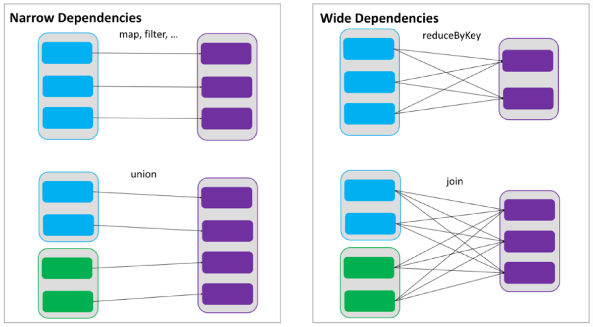

# 一、RDD概述
## 1.概念
Resilient Distributed Dataset弹性分布式数据集，是Spark中最基本的数据抽象
在代码中是一个抽象类，是一个弹性，可变，可分区，元素可并行计算的集合

## 2.特点
### 2.1 弹性
弹性存储:内存和磁盘的自动切换
弹性容错:丢失数据可以自动恢复
弹性计算:计算出错重试机制
弹性分片:可根据需要重新分片k

### 2.2 分区
对数据进行切片

### 2.3 只读
保证程序很少的bug
RDD是只读的，如果需要改变RDD中的数据，只能在现有RDD的基础上创建新的RDD
RDD的转换可以通过丰富的算子来实现，算子分为两类

>**transformation**
用来将RDD进行转化，构建RDD的血缘关系，如collect
collect是把数据拉到driver的内存

>**action**
用来触发RDD计算，得到RDD的相关计算结果后者保存RDD数据到文件系统中

 * transformation是懒执行，返回的是一个RDD
 * action是实际执行

### 2.4 依赖(血缘)
RDDs通过操作算子进行转换，转换得到的新RDD包含了从其他RDDs衍生所必须的信息，RDDs之间维护着这种血缘关系，也称为依赖


>**窄依赖**
RDDs 之间分区是一一对应的

>**宽依赖**
下游 RDD 的每个分区与上游 RDD(也称之为父RDD)的每个分区都有关，是多对多的关系

### 2.5 缓存
如果在应用程序中多次使用同一个RDD，

### 2.6 checkpoint
长时间的迭代会使血缘关系变得很复杂，在迭代过程出错时需要很负责的血缘关系重建，

## 3.属性

### 3.1 A list of partition

### 3.2 A function of computing each split

### 3.3 A list of dependences on RDDs

### 3.4 Optionally, a Patition for key-value RDDs(e.g. to say the RDDs  is hash-partitioned)

### 3.5 Optionally, a list of preferred locations to compute each split on(e.g. block locations for an HDFS file)

# 二、RDD编程
# 1.RDD编程模型
```scala
//获取sc
val conf = new SparkConf().setAppName("Practice").setMaster("local[2]")
val sc = new SparkContext(conf)
//转换
val rdd1 = sc.parallelize(Array("hello", "hello", "world", "scala"))
val rdd2 = rdd1.map(x => {
    println(x)
    (x, 1)
})
//行动
rdd2.collect.foreach(println)
//关闭上下文
sc.stop()
```
## 1.1 转换(transformation)
RDD编程的核心部分

## 1.2 行动(action)
action可以是向应用程序返回结果(count, collect等)，或者是向存储系统保存数据(saveAsTextFile等)

# 2.RDD创建
## 2.1 创建RDD的途径
1. 通过标准的scala集合来得到
2. 从外部存储得到
3. 从其他RDD转换得到

## 2.2 CreateRDD
```scala
object CreateRDD {
    def main(args: Array[String]): Unit = {
        val conf = new SparkConf().setAppName("CreateRDD").setMaster("local[2]")
        val sc = new SparkContext(conf)
        //1. 通过标准的scala集合得到RDD
        val list1 = List(20, 30, 40, 40, 50)
        val rdd = sc.parallelize(list1)
        val list2 = sc.makeRDD(list1) //效果同上，对有些集合会有优化
        rdd.collect().foreach(println)
        //2. 通过外部存储得到RDD
        val linesRDD = sc.textFile("e:/test.txt") //存放一行数据
        //3. 从其他RDD转换得到
        sc.stop()
    }
}
```

# 3.RDD转换算子
`RDD[value]` 单value
`RDD[key,value]` kv类型

## 3.1 单value类型
### 3.1.1 map(func)
 * 和集合的高阶算子map相同
 * `func:T => U`

```scala
val rdd2 = rdd1.map(x => x * x)
```

### 3.1.2 mapPartitions(func)
 * func的传参和返回值都是iterator
 * `func:Iterator<T> => Iterator<U>`

```scala
val rdd2 = rdd1.mapPartition(it => it.map(x => x * x))
```

**分区的确定**
start = i * length / numSlices
end = (i + 1) * length / numSlices
[start, end)
<!-- TODO 源码 -->
经过transformation后分区数不变

### 3.1.3 mapPartitionsWithIndex(func)
 * func的传参是index和iterator组成的tuple2，返回值仍为iterator
 * `func:(Int,Iterator<T>) => Iterator<U>`

```scala
val rdd2 = rdd1.mapPartitionWithIndex((index,it) => it.map((index,_)))
```

### 3.1.4 flatMap(func)
 * 和集合高阶算子的flatMap相同

```scala
val rdd2 = rdd1.flatMap(_.split("\\W+"))
```

### 3.1.5 glom()

```scala
//Return an RDD created by coalescing all elements within each partition into an array.
val rdd2 = rdd1.glom()
rdd2.collect.foreach(x => println(x.mkString(",")))
```

### 3.1.6 filter(func)

```scala
val rdd2 = rdd1.filter(_ % 2 == 0)
val rdd3 = rdd1.filter(x => (x & 1) == 1)
```

### 3.1.7 groupBy(func)

```scala
val rdd2 = rdd1
    .groupBy(_ % 2 == 1)
    .map {
        case (k, iterator) => (k, iterator.sum)
    }
```

### 3.1.8 sample(withReplacement, fraction, seed)
 * scala会自动生成seed值，如果传入则必须保证互不相同
 * seed为固定值会导致抽样的结果相同

```scala
val rdd2 = rdd1.sample(false, 0.5)
```

### 3.1.9 distinct([numTasks])
 * 自定义类需要提供Ordering类型隐式值

```scala
//def distinct(numPartitions: Int)(implicit ord: Ordering[T] = null)
val rdd2 = rdd1.distinct() //不传参时使用集合长度distinct(partitions.length)
val rdd3 = rdd1.distinct(4)
```

### 3.1.10 coalesce(numPartitions)
 * 改变分区数，只支持减少，默认不支持增加
 * 且这个减少分区，不会shuffle

```scala
val rdd1 = sc.parallelize(Array(20, 30, 40, 50, 20, 50), 4)
val rdd2 = rdd1.coalesce(2)
println(rdd1.getNumPartitions)
println(rdd2.getNumPartitions)
```

### 3.1.11 repartition(numPartitions)
```scala
//coalesce(numPartitions, shuffle = true)，本质上调用coalesce
val rdd2 = rdd1.repartition(10)
```

### 3.1.12 sortBy(func,[ascending], [numTasks])

```scala
object RDDSortBy {
    implicit val ord: Ordering[User] = new Ordering[User] {
        override def compare(x: User, y: User): Int = x.age - y.age
    }

    def main(args: Array[String]): Unit = {
        val conf: SparkConf = new SparkConf().setAppName("Practice").setMaster("local[2]")
        val sc = new SparkContext(conf)
        val rdd1 = sc.parallelize(Array(20, 30, 40, 50, 20, 50))
        //自定义类需要提供隐式值Ordering
        val rdd2 = rdd1.sortBy(x => x, true) //一定会shuffle
        val rdd3 = rdd1.sortBy(x => x, ascending = false) //降序
        rdd2.collect.foreach(println)
        val rddU1 = sc.parallelize(Array(User(20, "a"), User(20, "b"), User(50, "c")))
        val rddU2 = rddU1.sortBy(user => (user.age, user.name))
        val rddU3 = rddU1.sortBy(user => user) //需要提供隐式值ord: Ordering[User]
        println(rddU2.collect.mkString(","))
        sc.stop()
    }
}

case class User(age: Int, name: String)
```

### 3.1.13 pipe(command, [envVars])
 * 每个分区执行一次command

>**作用**
管道，针对每个分区，把 RDD 中的每个数据通过管道传递给shell命令或脚本，返回输出的RDD。一个分区执行一次这个命令. 如果只有一个分区, 则执行一次命令

>**注意**
脚本要放在 worker 节点可以访问到的位置


>**实现步骤**
```bash
# 编写脚本
vim pipe.sh
```
```sh
echo "hello"
while read line;do
    echo ">>>"$line
done
```
```scala
// 创建一个只有1个分区的RDD
scala> val rdd1 = sc.parallelize(Array(10,20,30,40), 1)
rdd1: org.apache.spark.rdd.RDD[Int] = ParallelCollectionRDD[0] at parallelize at <console>:24

scala> rdd1.pipe("./pipe.sh").collect
res1: Array[String] = Array(hello, >>>10, >>>20, >>>30, >>>40)

//创建有两个分区的RDD
scala> val rdd1 = sc.parallelize(Array(10,20,30,40), 2)
rdd1: org.apache.spark.rdd.RDD[Int] = ParallelCollectionRDD[3] at parallelize at <console>:24

scala> rdd1.pipe("./pipe.sh").collect
res2: Array[String] = Array(hello, >>>10, >>>20, hello, >>>30, >>>40)
```

>**总结**
每个分区执行一次脚本, 但是每个元素算是标准输入中的一行

## 3.2 双value交互
<!-- TODO 交互后分区数的变化 -->
### 3.2.1 union(otherDataset)
 * 并集

```scala
val rdd3 = rdd1.union(rdd2)
val rdd4 = rdd1 ++ rdd2 //同上
```

### 3.2.2 subtract (otherDataset)
 * 差集
 * 重新分区(hash分区)，有shuffle

```scala
val rdd5 = rdd1.subtract(rdd2)
```

### 3.2.3 intersection(otherDataset)
 * 交集

```scala
val rdd6 = rdd1.intersection(rdd2)
```

### 3.2.4 cartesian(otherDataset)
 * 笛卡尔积，结果是两配对的元组长度为两个集合长度乘积

```scala
val rdd7 = rdd1.cartesian(rdd2)
```

### 3.2.5 zip(otherDataset)
 * 拉链
 * 要求两个RDD的分区数相同，每个分区内的元素个数对应相同
 * 按照集合索引一一对应组成元组

```scala
val rdd8 = rdd1.zip(rdd2)
```

#### zip拓展
```scala
//和集合高级算子的zipWithIndex()相同
val rdd9 = rdd1.zipWithIndex() 
//只要求分区数相同
val rdd10 = rdd1.zipPartitions(rdd2)((it1, it2) => it1.zip(it2))
val rdd11 = rdd1.zipPartitions(rdd2)((it1, it2) => it1.zipAll(it2, 100, 200))
```

## 3.3 key-value

### 3.3.0 partitioner
 * 对于只存储value类型的RDD不需要分区器
 * 只有存储kv类型的才会需要分区器

#### 3.3.0.0 查看RDD的分区
```scala
// value RDD 的分区器
val rdd1 = sc.parallelize(Array(10))
rdd1.partitioner //查看分区器
// Option[org.apache.spark.Partitioner] = None
val rdd2 = sc.parallelize(Array(("hello", 1), ("world", 1)))
rdd2.partitioner
//Option[org.apache.spark.Partitioner] = None
val rdd3 = rdd1.partitionBy(new HashPartitioner(3))
rdd3.partitioner
//Option[org.apache.spark.Partitioner] = Some(org.apache.spark.HashPartitioner@3)
```
#### 3.3.0.1 HashPartitioner
 * 对于给定的key，计算其hashCode，并除以分区的个数取余，如果余数小于 0，则用余数+分区的个数（否则加0），最后返回的值就是这个key所属的分区ID。

<!-- TODO Code -->

#### 3.3.0.2 RangePartitioner
 * HashPartitioner可能导致数据倾斜，极端情况下某个分区拥有RDD的全部数据

>**RangePartitioner作用**
将一定范围内的数映射到某一个分区内，尽量保证每个分区中数据量的均匀，而且分区与分区之间是有序的，一个分区中的元素肯定都是比另一个分区内的元素小或者大，但是分区内的元素是不能保证顺序的。简单的说就是将一定范围内的数映射到某一个分区内

>**RangePartitioner实现过程**
先从整个 RDD 中抽取出样本数据，将样本数据排序，计算出每个分区的最大 key 值，形成一个Array[KEY]类型的数组变量 rangeBounds
判断key在rangeBounds中所处的范围，给出该key值在下一个RDD中的分区id下标；该分区器要求 RDD 中的 KEY 类型必须是可以排序的

水塘抽样
Partitioner
binarySearch

#### 3.3.0.3 自定义分区器
 * 继承`org.apache.spark.Partitioner`
 * 重写方法，`numPartitions` `getPartition(key)` `equals` `hashCode`

```scala
object MyPartitioner {
    def main(args: Array[String]): Unit = {
        val conf: SparkConf = new SparkConf().setAppName("Practice").setMaster("local[2]")
        val sc = new SparkContext(conf)
        val rdd1 = sc.parallelize(Array(20, 31, 40, 51, 20, 50))
        val rdd2 = rdd1.map((_, null)) //先转为kv形式，partitionBy只能用于kv形式的RDD，
        val rdd3 = rdd2.partitionBy(new MyPartitioner(2)).map(_._1)
        rdd3.glom().collect.foreach(x => println(x.mkString(",")))
    }
}
class MyPartitioner(var partitionNum: Int) extends Partitioner {
    override def numPartitions: Int = partitionNum
    override def getPartition(key: Any): Int = { //按照奇偶分区
        val k = key.asInstanceOf[Int]
        (k % 2).abs
    }
    override def hashCode(): Int = super.hashCode()
    override def equals(obj: Any): Boolean = super.equals(obj)
}
```

### 3.3.1 partitionBy
 * 对kv形式的RDD的重新分区
 * 只能用于kv形式的RDD

```scala
// 当之前的rdd没有分区器时，使用传入的分区器，分区器内传入分区数
val rdd2 = rdd1.partitionBy(new HashPartitioner(3))
```

### 3.3.2 groupByKey()
 * 只能用于kvRDD

```scala
val rdd1 = sc.parallelize(Array("hello", "hello", "world", "hello", "tian", "hello"))
val rdd2 = rdd1.map((_, 1)).groupByKey //变为kv形式
val rdd3 = rdd2.map {
    case (key, valueIt) => (key, valueIt.sum)
}
```


### 3.3.3 reduceByKey(func, [numTasks])
 * 把key相同的value放在一起进行reduce
 * 默认使用hash分区
 * 可以传入分区数
 * 在shuffle前进行预聚合，从而提升性能
 * 而groupBy只是分区，之后就shuffle
 * 业务允许时优先使用reduceByKey
 * 要求预聚合的逻辑和最终聚合逻辑一致

```scala
val rdd3 = rdd2.reduceByKey(_ + _) //wordCount
val rdd4 = rdd2.reduceByKey(_ + _, 3) //传入分区数，默认使用hash分区
```

### 3.3.4 aggregateByKey(zeroValue)(seqOp, combOp, [numTasks])
 * 零值类似foldLeft，
 * 第一个函数为预聚合逻辑(分区内聚合操作)，
 * 第二个函数为分区间聚合操作
 * 宽依赖

```scala
def aggregateByKey[U: ClassTag](zeroValue: U)(seqOp: (U, V) => U, combOp: (U, U) => U): RDD[(K, U)]
```
```scala
rdd1.aggregateByKey(0)(_ + _, _ + _) //两次聚合逻辑相同
rdd1.aggregateByKey(Int.MinValue)(math.max, _ + _) //分区内和分区间聚合逻辑不同
rdd1.aggregateByKey( //同时返回最大值和最小值
    (Int.MinValue, Int.MaxValue))((maxMin, v) => (maxMin._1.max(v), maxMin._2.min(v)),
    (maxMin1, maxMin2) => (maxMin1._1 + maxMin2._1, maxMin1._2 + maxMin2._2)
)
rdd1.aggregateByKey((Int.MinValue, Int.MaxValue))(//偏函数写法
    {
        case ((max, min), v) => (max.max(v), min.min(v))
    },
    {
        case ((max1, min1), (max2, min2)) => (max1 + max2, min1 + min2)
    }
)
```

### 3.3.5 foldByKey
 * 如果分区内和分区间聚合逻辑相同可使用foldByKey替换aggregateByKey
 * 如果又不需要零值，则可以使用reduceByKey替换foldByKey

```scala
rdd2.aggregateByKey(0)(_ + _, _ + _) //两次聚合逻辑相同
val rdd4 = rdd2.foldByKey(0)(_ + _) //效果同上
```

### 3.3.6 combineByKey[C]
 * combineByKey与aggregateByKey相比，零值不写明可经过第一次计算得到
 * 需要手动指明数据类型

```scala
rdd1.combineByKey( //累加
    v => v,
    //v => v + 10 //对每个分区都会加一下
    (last: Int, v: Int) => last + v,
    (v1: Int, v2: Int) => v1 + v2
)
rdd1.combineByKey( //求平均值
    v => (v, 1),
    (sumCount: (Int, Int), v: Int) => (sumCount._1 + v, sumCount._2 + v),
    (sumCount1: (Int, Int), sumCount2: (Int, Int)) => (sumCount1._1 + sumCount2._1, sumCount1._2 + sumCount2._2)
).mapValues(sumCount => sumCount._1.toDouble / sumCount._2)
```

### 3.3.7 sortByKey
 * sortByKey是整体排序，使用较少
 * 默认升序，排序后分区默认为原始分区
 * sortBy底层还是调用了sortByKey

```scala
rdd1.sortByKey()
rdd1.sortByKey(false, 4)
rdd1.sortBy(x => x)
```

### 3.3.8 mapValues
 * map过程中没有操作key，只操作了value，可使用mapValues

```scala
rdd1.aggregateByKey((0, 0))(
    {
        case ((sum, count), v) => (sum + v, count + 1)
    },
    {
        case ((sum1, count1), (sum2, count2)) => (sum1 + sum2, count1 + count2)
    }
).map({ //map过程中没有操作key，只操作了value，可使用mapValues
    case (k, (sum, count)) => (k, sum.toDouble / count)
}) //返回每个key对应的value平均值
rdd1.aggregateByKey((0, 0))(
    {
        case ((sum, count), v) => (sum + v, count + 1)
    },
    {
        case ((sum1, count1), (sum2, count2)) => (sum1 + sum2, count1 + count2)
    }
).mapValues { //只对value进行map
    case (sum, count) => sum.toDouble / count
} //同上
```

### 3.3.9 join(otherDataset, [numTasks])
```scala
val rdd1 = sc.parallelize(Array((1, "a"), (2, "b"), (3, "c")))
val rdd2 = sc.parallelize(Array((1, "A"), (2, "B"), (3, "C")))
val rdd3 = rdd1.join(rdd2) //内连接
rdd1.leftOuterJoin(rdd2) //左外连接，对于没有的值使用None补充
rdd1.rightOuterJoin(rdd2) //右外连接
```


### 3.3.10 cogroup(otherDataset, [numTasks])
<!-- TODO  -->
```scala
val rdd1 = sc.parallelize(Array((1, "a"), (2, "b"), (3, "c")))
val rdd2 = sc.parallelize(Array((1, "A"), (2, "B"), (3, "C")))
val rdd3 = rdd1.cogroup(rdd2)
```

## 3.4 案例

### 3.4.1 数据结构
时间戳，省份，城市，用户，广告，字段使用空格分割。
1516609143867 6 7 64 16
1516609143869 9 4 75 18
1516609143869 1 7 87 12下载数据

### 3.4.2 需求
 * 统计出每一个省份广告被点击次数的 TOP3

### 3.4.3 需求分析
```
...
=> RDD[((province, ads), 1)] reduceByKey
=> RDD[((province, ads), count)] map
=> RDD[(province, (ads, count))] groupByKey
=> RDD[(province, List[(ads, count)])]
```

### 3.4.4 具体实现

```scala
def main(args: Array[String]): Unit = {
    val conf = new SparkConf().setAppName("Practice").setMaster("local[2]")
    val sc = new SparkContext(conf)
    val line = sc.textFile("file://" + ClassLoader.getSystemResource("agent.log"))
    val rdd1 = line.map(line => {
        val words = line.split(" ")
        // RDD[((province, ads), 1)]
        ((words(1), words(4)), 1)
    })
    val rdd2 = rdd1.reduceByKey(_ + _).map({ // RDD[((province, ads), count)]
        // RDD[(province, (ads, count))]
        case ((province, ads), count) => (province, (ads, count))
    })
    val rdd3 = rdd2.groupByKey() // RDD[(province, Iterable[(ads, count)])]
        .map({ //RDD[(province, List[(ads, count)])]
            case (province, listIt) => (province, listIt.toList.sortBy(-_._2).take(3)) //排序，取前三
        }).sortByKey() //按照省份排序
    rdd3.collect.foreach(println)
    sc.stop()
}
```

# 4.RDD行动算子
 * 转换算子在行动算子之前不会被执行

## 4.1 countByKey
```scala
val rdd1 = sc.parallelize(Array("hello", "hello", "world", "scala"))
val rdd2 = rdd1.map(x => {
    println(x)
    (x, 1)
}) //转换算子在行动算子之前不会被执行
val rdd3 = rdd2.reduceByKey(_ + _)
val rdd4 = rdd2.countByKey() //计算每个key个数，和value值无关
val rdd5 = rdd2.countByValue() //计算每个value个数
```

## 4.2 foreach
 * 行动算子foreach是`org.apache.spark.rdd.RDD.foreach`
 * 和scala集合中的`scala.collection.IndexedSeqOptimized.foreach`不同
 * 集群模式下直接调用RDD.foreach不会显示输出
 * RDD.foreach可以把数据写入到外部存储(jdbc,hive,hdfs,hbase...)

```scala
val rdd1 = sc.parallelize(Array("hello", "hello", "world", "scala"))
rdd1.collect.foreach(println) //在driver输出
rdd1.foreach(println) //在executor输出
```

 * 使用RDD.foreach写数据，每次写入都会创建一个连接，所以很少使用
 * map操作也可以往外部写入，但是不安全，每次行动算子都会触发该map操作的执行
 * 所以map不能和外界有任何数据的写入写出
 * 使用foreachPartition与RDD.foreach相比可以减少连接，
 * 但是foreachPartition会把数据一次全部加载到内存导致OOM

```scala
rdd1.foreachPartition(it => { //每个分区连接一次
    it.foreach(???)
    it.toList //会把数据一次全部加载到内存导致OOM，缺点
})
```

## 4.3 reduce
 * zeroValue参与运算的次数是分区数+1

```scala
val result1 = rdd1.aggregate(0)(_ + _, _ + _)
val result2 = rdd1.aggregate(10)(_ + _, _ + _) //分区合并也会使用零值
println(result2 - result1) //30
```

## 4.4 sortByKey中的执行算子
 * sortByKey()会创建RangePartitioner，
 * 而创建RangePartitioner时会进行水塘抽样，
 * 在水塘抽样时有collect

```scala
val rdd1 = sc.parallelize(Array("hello", "world", "scala", "hello", "hello", "spark", "scala"))
val rdd2 = rdd1.map(x => {
    println(x)
    (x, 1)
}).reduceByKey(_ + _).sortByKey()
```