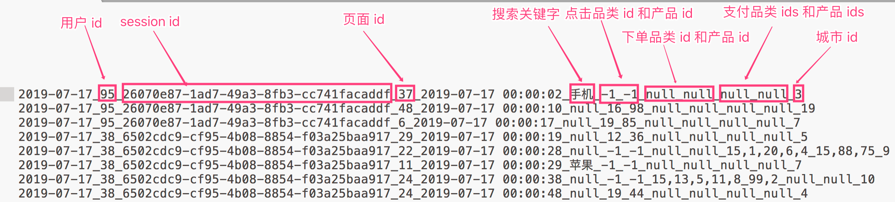

# Spark-Core 项目实战
[Maven工程](https://github.com/Tiankx1003/BigData-Spark/tree/master/spark/spark-core-proj)

## 一、数据准备

数据采集自电商的用户行为数据，不要包含四种行为: 搜索、点击、下单和支付
数据格式如下，不同的字段使用下划线分割

>**数据说明**
数据采用_分割字段
每一行表示用户的一个行为, 所以每一行只能是四种行为中的一种.
如果搜索关键字是 null, 表示这次不是搜索
如果点击的品类 id 和产品 id 是 -1 表示这次不是点击
下单行为来说一次可以下单多个产品, 所以品类 id 和产品 id 都是多个, id 之间使用逗号,分割. 如果本次不是下单行为, 则他们相关数据用null来表示
支付行为和下单行为类似.

## 二、需求

### 1.Top10热门品类
#### 1.1 需求简介
品类是指的产品的的分类, 一些电商品类分多级, 咱们的项目中品类类只有一级. 不同的公司可能对热门的定义不一样. 我们按照每个品类的 点击、下单、支付 的量来统计热门品类

#### 1.2 解决思路
>**思路一**
分别统计每个品类点击的次数, 下单的次数和支付的次数.
缺点: 统计 3 次, 需要启动 3 个 job, 每个 job 都有对原始数据遍历一次, 非常好使

>**思路二**
最好的办法应该是遍历一次能够计算出来上述的 3 个指标.
使用累加器可以达成我们的需求.
遍历全部日志数据, 根据品类 id 和操作类型分别累加. 需要用到累加器
定义累加器
当碰到订单和支付业务的时候注意拆分字段才能得到品类 id
遍历完成之后就得到每个每个品类 id 和操作类型的数量.
按照点击下单支付的顺序来排序
取出 Top10

#### 1.3 具体实现

### 2.Top10热门品类中每个品类的Top10活跃Session统计
#### 2.1 需求简介
对于排名前 10 的品类，分别获取每个品类点击次数排名前 10 的 sessionId。(注意: 这里我们只关注点击次数, 不关心下单和支付次数)
这个就是说，对于 top10 的品类，每一个都要获取对它点击次数排名前 10 的 sessionId。
这个功能，可以让我们看到，对某个用户群体最感兴趣的品类，各个品类最感兴趣最典型的用户的 session 的行为。

#### 2.2 解决思路
1.	过滤出来 category Top10的日志, 需要用到需求1的结果, 然后只需要得到categoryId就可以了
2.	转换结果为 `RDD[(categoryId, sessionId), 1]` 然后统计数量 `=> RDD[(categoryId, sessionId), count]`
3.	统计每个品类 top10. `=> RDD[categoryId, (sessionId, count)] => RDD[categoryId, Iterable[(sessionId, count)]]`
4.	对每个 `Iterable[(sessionId, count)]`进行排序, 并取每个Iterable的前10
5.	把数据封装到 CategorySession 中

#### 2.3 具体实现

### 3.页面单跳转化率统计
#### 3.1 需求简介

#### 3.2 解决思路

#### 3.3 具体实现

