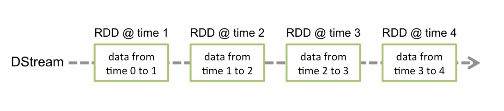
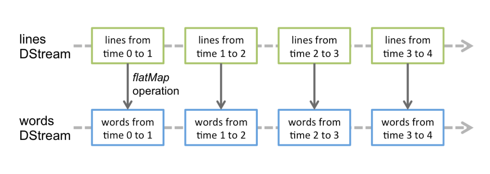
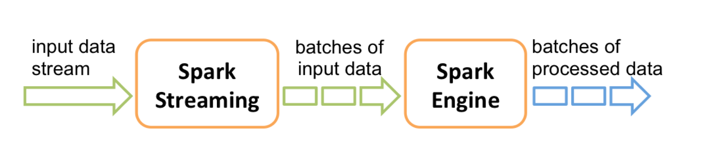
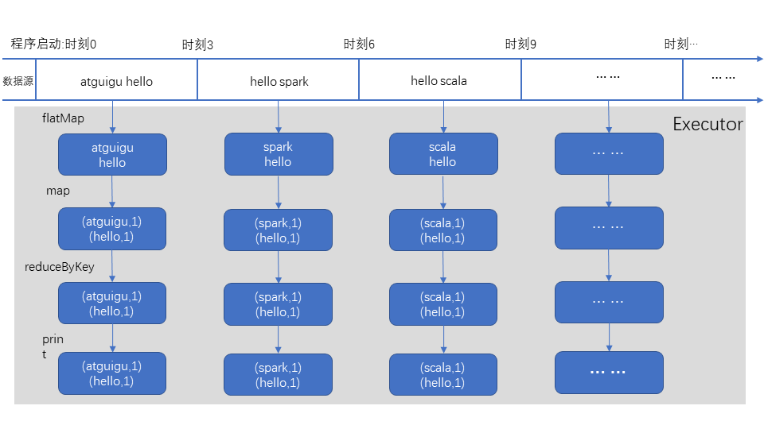
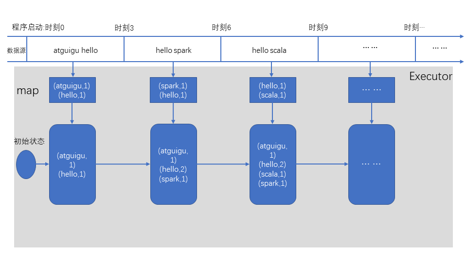

# 一、概述
## 1.概念
Spark Streaming 是 Spark 核心 API 的扩展, 用于构建弹性, 高吞吐量, 容错的在线数据流的流式处理程序. 总之一句话: Spark Streaming 用于流式数据的处理
数据可以来源于多种数据源: Kafka, Flume, Kinesis, 或者 TCP 套接字. 接收到的数据可以使用 Spark 的负责元语来处理, 尤其是那些高阶函数像: map, reduce, join, 和window.
最终, 被处理的数据可以发布到 FS, 数据库或者在线dashboards.
另外Spark Streaming也能和MLlib（机器学习）以及Graphx完美融合.
实时流处理
微批处理
固定时间间隔的数据计算
秒级

## 2.特点
### 2.1 易用(Ease Of Use)
通过高阶函数构建应用

### 2.2 容错(Fault TOlerance)
exactly once语义


### 2.3 易整合到Spark体系中(Spark Integration)
通过批处理和交互查询连接Streaming

### 2.4 缺点
Spark Streaming 是一种“微量批处理”架构, 和其他基于“一次处理一条记录”架构的系统相比, 它的延迟会相对高一些


# 二、WordCount
## 1.案例实现
```scala
//1. 创建StreamingContext
val conf = new SparkConf().setMaster("local[2]").setAppName("wordcount")
val ssc = new StreamingContext(conf, Seconds(5)) //传入时间间隔
//2. 核心数据集: DStream
val socketStream = ssc.socketTextStream("hadoop102", 9999) //Socket数据源
//3. 对DStreaming各种操作
val wordCountDStream = socketStream
    .flatMap(_.split(" "))
    .map((_, 1))
    .reduceByKey(_ + _)
//4. 最终数据的处理: 打印
wordCountDStream.print(100)
//5. 启动StreamingContext
ssc.start() //nc -lk 9999
//6. 阻止当前线程退出
ssc.awaitTermination() //等待ssc结束，主线程才结束
```
```bash
sudo yum install -y nc
nc -lk 9999
```
 * 程序运行之前需要服务器端启动了netcat，否则会报连接异常
 * 这种方式只能统计每四秒内的wordcount，且每个间隔没有关联

## 2.案例分析
Discretized Stream(DStream) 是 Spark Streaming 提供的基本抽象, 表示持续性的数据流, 可以来自输入数据, 也可以是其他的 DStream 转换得到. 在内部, 一个 DSteam 用连续的一系列的 RDD 来表示. 在 DStream 中的每个 RDD 包含一个确定时间段的数据.



对 DStream 的任何操作都会转换成对他里面的 RDD 的操作. 比如前面的 wordcount 案例, flatMap是应用在 line DStream 的每个 RDD 上, 然后生成了 words SStream 中的 RDD. 



对这些 RDD 的转换是有 Spark 引擎来计算的. DStream 的操作隐藏的大多数的细节, 然后给开发者提供了方便使用的高级 API.





# 三、DStream创建(数据源)
Spark Streaming原生支持一些不同的数据源，每个接收器都以Spark执行器程序中一个长期运行的任务的形式运行，因此会占据分配给应用的CPU核心。此外我们还需要有可用的CPU核心来处理数据，所以如果要运行多个接收器，就必须至少有和接收器相同数目的核心数，还要加上用来完成计算所需要的核心数。例如，如果我们想要在流计算应用中运行 10 个接收器，那么至少需要为应用分配 11 个 CPU 核心。
所以本地模式运行时，不要使用`local`或者`local[1]`
## 0.Socket
 * 见前述WordCount案例

## 1.RDD队列
 * 循环创建几个RDD，将RDD放入队列，通过Spark Streaming创建DStream，计算WordCount

```scala
val conf: SparkConf = new SparkConf().setMaster("local[*]").setAppName("QueueRDD")
val ssc: StreamingContext = new StreamingContext(conf, Seconds(3))
val rddQueue: mutable.Queue[RDD[Int]] = mutable.Queue[RDD[Int]]()
//val resultDStream: DStream[Int] = ssc.queueStream(rddQueue).reduce(_ + _) //每次处理一个RDD
// @param oneAtATime Whether only one RDD should be consumed from the queue in every interval
val resultDStream: DStream[Int] = ssc.queueStream(rddQueue, oneAtATime = false).reduce(_ + _)
resultDStream.print(100)
ssc.start()
while (true) { //每个循环创建一个RDD
    val sc: SparkContext = ssc.sparkContext
    rddQueue.enqueue(sc.parallelize(1 to 100))
    Thread.sleep(1000) //每个时间间隔内有三个RDD，
    // 不设置sleep可以给集群做压测，即每个时间间隔内可以创建和处理多少个RDD
}
ssc.awaitTermination()
```

## 2.自定义数据源
 * 本质上就是自定义接收器
 * 需要继承Receiver，并实现onStart、onStop方法来自定义数据采集

```scala
//需求，自定义数据源，实现监控某个端口号，获取该端口号内容
object CustomReceiver {
    def main(args: Array[String]): Unit = {
        val conf = new SparkConf().setMaster("local[2]").setAppName("wordcount")
        val ssc = new StreamingContext(conf, Seconds(4)) //传入时间间隔
        ssc.receiverStream(new MyReceiver("hadoop102", 9999))
            .flatMap(_.split(" ")).map((_, 1)).reduceByKey(_ + _).print(100)
        ssc.start()
        ssc.awaitTermination()
    }
}
/**
 * 自定义接收器从socket接受数据
 */
class MyReceiver(val host: String, val port: Int) extends Receiver[String](StorageLevel.MEMORY_ONLY) { //传入存储级别
    /**
     * 接收器启动时调用的方法
     * 启动子线程，循环不断的接收数据
     */
    override def onStart(): Unit = {
        new Thread() {
            override def run(): Unit = receiveData()
        }.start()
    }

    /**
     * 接收器停止时的回调方法
     */
    override def onStop(): Unit = ???

    /**
     * 封装接受数据的方法
     */
    def receiveData() = {
        try { //为了解决前面没数据报异常的问题
            //从socket接受数据
            val socket = new Socket(host, port)
            val reader = new BufferedReader(new InputStreamReader(socket.getInputStream, "utf-8")) //字节流转字符流
            var line = reader.readLine()
            while (line != null) {
                store(line)
                line = reader.readLine()
            }
            reader.close()
            socket.close()
        } catch {
            case e: Exception => e.printStackTrace
        } finally {
            //重启任务
            restart("restart............")
        }
    }
}
```
```bash
nc -lk 9999
```

## 3.Kafka数据源(重点)
### 3.1
```scala
val conf = new SparkConf().setMaster("local[2]").setAppName("wordcount")
val ssc = new StreamingContext(conf, Seconds(4)) //传入时间间隔
//kafka参数声明
val brokers = "hadoop102:9092,hadoop103:9092,hadoop104:9092"
val topic = "first"
val group = "bigdata"
val kafkaParams =
    Map(ConsumerConfig.GROUP_ID_CONFIG -> group, ConsumerConfig.BOOTSTRAP_SERVERS_CONFIG -> brokers)
// 使用泛型确定kv类型和kv解码器类型
KafkaUtils.createDirectStream[String, String, StringDecoder, StringDecoder](
    ssc, kafkaParams, Set(topic) //可以订阅多个topic
).print() //TODO 当前方法的缺点
ssc.start()
ssc.awaitTermination()
```

### 3.2 exactly once语义
```scala
def main(args: Array[String]): Unit = {
    val ssc: StreamingContext = StreamingContext.getActiveOrCreate("./ck1", createSsc)
    ssc.start()
    ssc.awaitTermination()
}

def createSsc(): StreamingContext = {
    println("Flag") //只在第一次时执行
    val conf: SparkConf = new SparkConf().setMaster("local[2]").setAppName("wordcount")
    val ssc: StreamingContext = new StreamingContext(conf, Seconds(4))
    ssc.checkpoint(".ck1") //一般checkpoint存放在HDFS，但是又会带来小文件问题
    val brokers: String = "hadoop102:9092,hadoop103:9092,hadoop104:9092"
    val topic: String = "first"
    val group: String = "bigdata"
    val kafkaParams: Map[String, String] =
        Map(ConsumerConfig.GROUP_ID_CONFIG -> group, ConsumerConfig.BOOTSTRAP_SERVERS_CONFIG -> brokers)
    KafkaUtils.createDirectStream[String, String, StringDecoder, StringDecoder](
        ssc, kafkaParams, Set(topic)).print() //TODO 没有打印输出会报错??????
    ssc
}
```


### 3.3
```scala
val brokers: String = "hadoop102:9092,hadoop103:9092,hadoop104:9092"
val topic: String = "first"
val group: String = "bigdata"
val kafkaParams: Map[String, String] =
    Map(ConsumerConfig.GROUP_ID_CONFIG -> group, ConsumerConfig.BOOTSTRAP_SERVERS_CONFIG -> brokers)
//手动提交offsets，读取offsets需要使用
val kafkaCluster: KafkaCluster = new KafkaCluster(kafkaParams)

//读取offsets
def readOffsets(): Map[TopicAndPartition, Long] = { //泛型为分区和偏移量
    var resultMap: Map[TopicAndPartition, Long] = Map[TopicAndPartition, Long]()
    //获取到所有分区
    val topicAndPartitionEither: Either[Err, Set[TopicAndPartition]] = kafkaCluster.getPartitions(Set(topic))
    topicAndPartitionEither match {
        case Right(topicAndPartitionSet) => //分区存在
            //获取分区和偏移量
            val topicAndPartitionOffsetEither: Either[Err, Map[TopicAndPartition, Long]] =
                kafkaCluster.getConsumerOffsets(group, topicAndPartitionSet)
            if (topicAndPartitionOffsetEither.isRight) //表示曾经消费过，已经有offset
                resultMap ++= topicAndPartitionOffsetEither.right.get
            else //分区存在，但是没有map，表示第一次消费分区，把每个分区的偏移量置零
                topicAndPartitionSet.foreach(tap => resultMap += tap -> 0L)
        case _ =>
    }
    resultMap
}

def writeOffsets(sourceDStream: InputDStream[String]): Unit = {
    sourceDStream.foreachRDD(rdd => { //每个时间间隔都会遍历一次
        var map: Map[TopicAndPartition, Long] = Map[TopicAndPartition, Long]()
        //强转成HasOffsetRanges，包含本次消费的offset其实范围
        val hasOffsetRanges: HasOffsetRanges = rdd.asInstanceOf[HasOffsetRanges]
        val ranges: Array[OffsetRange] = hasOffsetRanges.offsetRanges
        ranges.foreach(rang => { //每个分区都会遍历一次
            val offset: Long = rang.untilOffset
            map += rang.topicAndPartition() -> offset
        })
        kafkaCluster.setConsumerOffsets(group, map)
    })
}

def main(args: Array[String]): Unit = { // TODO: 视频
    val conf: SparkConf = new SparkConf().setMaster("local[*]").setAppName("HighKafka")
    val ssc: StreamingContext = new StreamingContext(conf, Seconds(3))
    val offsets: Map[TopicAndPartition, Long] = readOffsets()
    val sourceDStream: InputDStream[String] =
        KafkaUtils.createDirectStream[String, String, StringDecoder, StringDecoder, String](
            ssc,
            kafkaParams,
            offsets,
            (mm: MessageAndMetadata[String, String]) => mm.message()
        )
    sourceDStream.flatMap(_.split(" ")).map((_, 1)).reduceByKey(_ + _).print(100)
    writeOffsets(sourceDStream)
    ssc.start()
    ssc.awaitTermination()
}
```


# 四、DStream转换
DStream 上的原语与 RDD 的类似，分为Transformations（转换）和Output Operations（输出）两种，此外转换操作中还有一些比较特殊的原语，如：updateStateByKey()、transform()以及各种Window相关的原语。

## 1.无状态转换
 * 无状态转化操作就是把简单的RDD转化操作应用到每个批次上，也就是转化DStream中的每一个RDD
 * transform 原语允许 DStream上执行任意的RDD-to-RDD函数。
 * 可以用来执行一些 RDD 操作, 即使这些操作并没有在 SparkStreaming 中暴露出来.
 * 该函数每一批次调度一次。其实也就是对DStream中的RDD应用转换。
 * 只在当前窗口有效

```scala
val conf: SparkConf = new SparkConf().setMaster("local[*]").setAppName("TransformDemo")
val ssc: StreamingContext = new StreamingContext(conf, Seconds(3))
val socketStream: ReceiverInputDStream[String] = ssc.socketTextStream("hadoop102", 9999)
val resultDStream: DStream[(String, Int)] = socketStream.transform(rdd => {
    rdd.flatMap(_.split(" ")).map((_, 1)).reduceByKey(_ + _)
})
resultDStream.print
ssc.start()
ssc.awaitTermination()
```

| Transformation                           | Meaning                                                                                                                                                                                                                                                                                                                                                                                                                                                                |
| ---------------------------------------- | ---------------------------------------------------------------------------------------------------------------------------------------------------------------------------------------------------------------------------------------------------------------------------------------------------------------------------------------------------------------------------------------------------------------------------------------------------------------------- |
| **map**(*func*)                          | Return a new DStream by passing each   element of the source DStream through a function *func*.                                                                                                                                                                                                                                                                                                                                                                        |
| **flatMap**(*func*)                      | Similar to map, but each input item can be   mapped to 0 or more output items.                                                                                                                                                                                                                                                                                                                                                                                         |
| **filter**(*func*)                       | Return a new DStream by selecting only the   records of the source DStream on which *func*   returns true.                                                                                                                                                                                                                                                                                                                                                             |
| **repartition**(*numPartitions*)         | Changes the level of parallelism in this   DStream by creating more or fewer partitions.                                                                                                                                                                                                                                                                                                                                                                               |
| **union**(*otherStream*)                 | Return a new DStream that contains the   union of the elements in the source DStream and *otherDStream*.                                                                                                                                                                                                                                                                                                                                                               |
| **count**()                              | Return a new DStream of single-element RDDs   by counting the number of elements in each RDD of the source DStream.                                                                                                                                                                                                                                                                                                                                                    |
| **reduce**(*func*)                       | Return a new DStream of single-element RDDs   by aggregating the elements in each RDD of the source DStream using a   function *func* (which takes two   arguments and returns one). The function should be associative and   commutative so that it can be computed in parallel.                                                                                                                                                                                      |
| **countByValue**()                       | When called on a DStream of elements of   type K, return a new DStream of (K, Long) pairs where the value of each key   is its frequency in each RDD of the source DStream.                                                                                                                                                                                                                                                                                            |
| **reduceByKey**(*func*, [*numTasks*])    | When called on a DStream of (K, V) pairs,   return a new DStream of (K, V) pairs where the values for each key are   aggregated using the given reduce function. **Note:** By default, this uses Spark’s default number of parallel   tasks (2 for local mode, and in cluster mode the number is determined by the   config property spark.default.parallelism) to do   the grouping. You can pass an optional numTasks argument to   set a different number of tasks. |
| **join**(*otherStream*, [*numTasks*])    | When called on two DStreams of (K, V) and   (K, W) pairs, return a new DStream of (K, (V, W)) pairs with all pairs of   elements for each key.                                                                                                                                                                                                                                                                                                                         |
| **cogroup**(*otherStream*, [*numTasks*]) | When called on a DStream of (K, V) and (K,   W) pairs, return a new DStream of (K, Seq[V], Seq[W]) tuples.                                                                                                                                                                                                                                                                                                                                                             |
| **transform**(*func*)                    | Return a new DStream by applying a   RDD-to-RDD function to every RDD of the source DStream. This can be used to   do arbitrary RDD operations on the DStream.                                                                                                                                                                                                                                                                                                         |
| **updateStateByKey**(*func*)             | Return a new “state” DStream where the   state for each key is updated by applying the given function on the previous   state of the key and the new values for the key. This can be used to maintain   arbitrary state data for each key.                                                                                                                                                                                                                             |

需要记住的是，尽管这些函数看起来像作用在整个流上一样，但事实上每个DStream在内部是由许多RDD(批次)组成，且无状态转化操作是分别应用到每个RDD上的。例如，reduceByKey()会化简每个时间区间中的数据，但不会化简不同区间之间的数据。
举个例子，在之前的wordcount程序中，我们只会统计几秒内接收到的数据的单词个数，而不会累加。
无状态转化操作也能在多个DStream间整合数据，不过也是在各个时间区间内。例如，键值对DStream拥有和RDD一样的与连接相关的转化操作，也就是`cogroup()`、`join()`、`leftOuterJoin()` 等。我们可以在DStream上使用这些操作，这样就对每个批次分别执行了对应的RDD操作。
我们还可以像在常规的 Spark 中一样使用 DStream的`union()` 操作将它和另一个DStream 的内容合并起来，也可以使用`StreamingContext.union()`来合并多个流。

## 2.有状态转换
### 2.1 updateStateByKey
 * updateStateByKey操作允许在使用新信息不断更新状态的同时能够保留他的状态
 * 需要定义状态(可以是任意数据类型)和状态更新函数
 * 在每个阶段，Spark都会在所有已经存在的key上使用状态更新函数，而不管是否有新的数据在

```scala
val conf: SparkConf = new SparkConf().setMaster("local[*]").setAppName("TransformDemo")
val ssc: StreamingContext = new StreamingContext(conf, Seconds(3))
ssc.checkpoint(".ck1")
//ssc.sparkContext.setCheckpointDir(".ck1") //效果同上
val socketStream: ReceiverInputDStream[String] = ssc.socketTextStream("hadoop102", 9999)
val resultDStream: DStream[(String, Int)] = socketStream
    .flatMap(_.split(" "))
    .map((_, 1))
    .updateStateByKey(
        (seq: Seq[Int], opt: Option[Int]) => Some(seq.sum + opt.getOrElse(0))
    )
resultDStream.print
ssc.start()
ssc.awaitTermination()
```



### 2.2 window操作
#### 2.2.1 reduceByKeyAndWindow(reduceFunc: (V, V) => V, windowDuration: Duration)
 * 传参分别为计算规则，窗口长度
 * 滑动步长默认为DStream周期
 * 窗口长度必须是周期的整数倍

```scala
ssc.socketTextStream("hadoop102", 9999) // ReceiverInputDStream
    .flatMap(_.split(" "))
    .map((_, 1))
    //传入计算规则，窗口长度和滑动步长，不设置滑动步长时默认为周期
    .reduceByKeyAndWindow(_ + _, Seconds(12)) //添加滑动步长需要指定泛型
    .print(100)
```

 * 滑动步k长和窗口长度都必须是周期的整数倍
 * 添加滑动步长需要指定计算规则中变量的泛型

```scala
.reduceByKeyAndWindow((_: Int) + (_: Int), Seconds(12), Seconds(8))
```

#### 2.2.2 reduceByKeyAndWindow(reduceFunc: (V, V) => V, invReduceFunc: (V, V) => V, windowDuration: Duration, slideDuration: Duration)
 * `invReduceFunc: (V, V) => V`
 * 窗口移动了, 上一个窗口和新的窗口会有重叠部分, 重叠部分的值可以不用重复计算了
 * 第一个参数就是新的值, 第二个参数是旧的值
 * 滑动步长大于等于窗口长度时这种方式失效，大于时会丢失数据

```scala
ssc.sparkContext.setCheckpointDir("hdfs://hadoop102:9000/checkpoint")
val count: DStream[(String, Int)] =
    wordAndOne.reduceByKeyAndWindow((x: Int, y: Int) => x + y,(x: Int, y: Int) => x - y,Seconds(15), Seconds(10))
```

#### 2.2.3 window(windowLength, slideInterval)
 * 基于对源 DStream 窗化的批次进行计算返回一个新的 Dstream

```scala
val sourceDStream: ReceiverInputDStream[String] = ssc.socketTextStream("hadoop102", 9999)
val sourceDStream2 = sourceDStream.window(Seconds(12), Seconds(8)) //直接返回一个新DStream
sourceDStream2
    .flatMap(_.split(" "))
    .map((_, 1))
    .reduceByKey(_ + _)
    .print(100)
```

#### 2.2.4 countByWindow(windowLength, slideInterval)
 * 返回一个滑动窗口计数流中的元素的个数

#### 2.2.5 countByValueAndWindow(windowLength, slideInterval, [numTasks])
 * 对(K,V)对的DStream调用，返回(K,Long)对的新DStream，
 * 其中每个key的的对象的v是其在滑动窗口中频率。如上，可配置reduce任务数量


# 五、DStream输出
`print()` 可传入参数
`saveAsTextFile(prefix,[Suffix])` 保存到文件，文件名可添加时间戳
`saveAsObjectFile(prefix,[Suffix])` 保存为对象文件
`saveAsHadoopFile(prefix,[Suffix])` 保存到HDFS
`foreachRDD()` 

```scala
val sourceDStream: ReceiverInputDStream[String] = ssc.socketTextStream("hadoop102", 9999)
val sourceDStream2 = sourceDStream.window(Seconds(12), Seconds(8)) //直接返回一个新DStream
sourceDStream
    .flatMap(_.split(" "))
    .map((_, 1))
    .reduceByKey(_ + _)
    .foreachRDD(rdd => rdd.collect.foreach(print)) //输出算子，直接遍历RDD
```
>**注意**

 * 连接不能写在driver里面(序列化)
 * 如果写在foreach则每个RDD中的每一条数据都创建，得不偿失
 * 增加foreachPartition，在分区创建(获取)

# 六、编程进阶
## 1.累加器

## 2.广播变量

## 3.DataFrame ans SQL Operations

## 4.Caching / Persistence
对于像reduceByWindow和reduceByKeyAndWindow以及基于状态的(updateStateByKey)这种操作，保存是隐含默认的