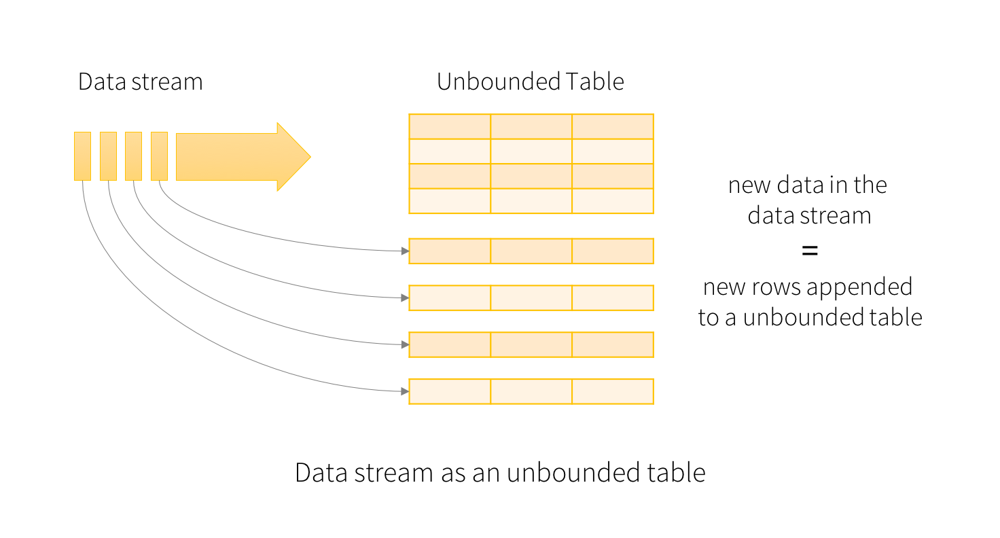
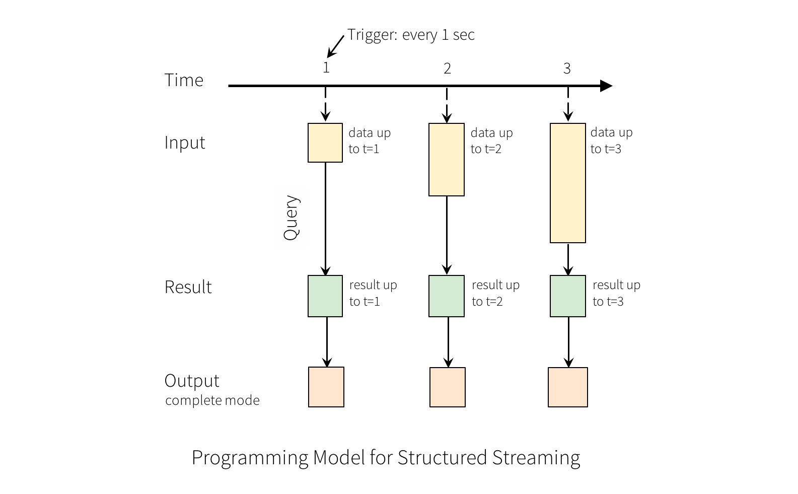
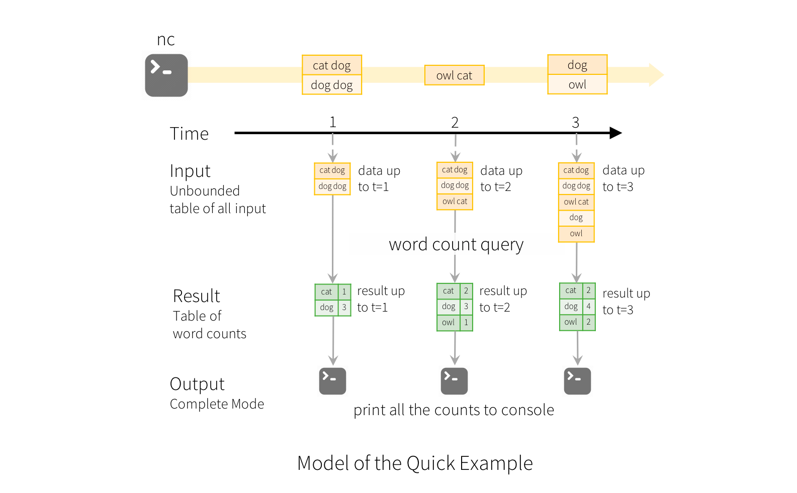
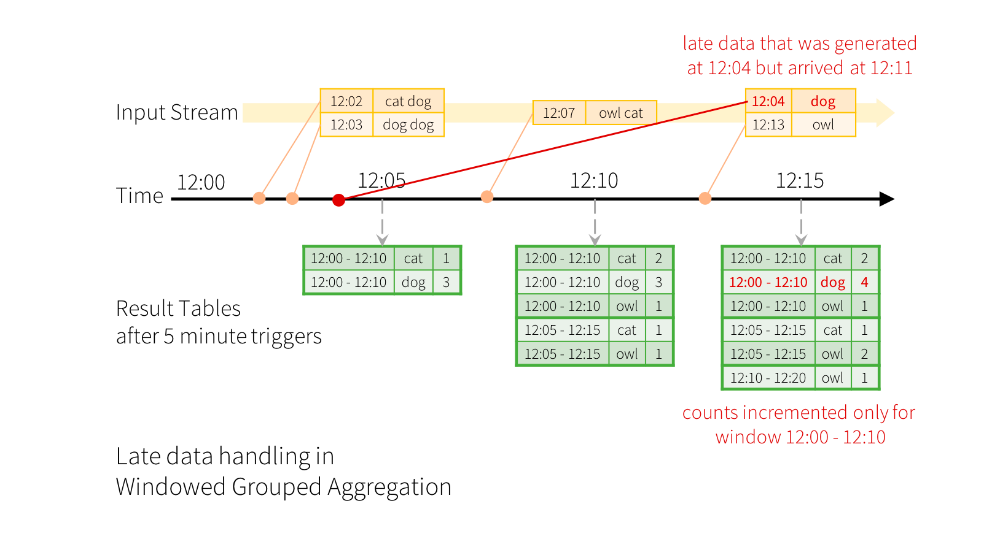
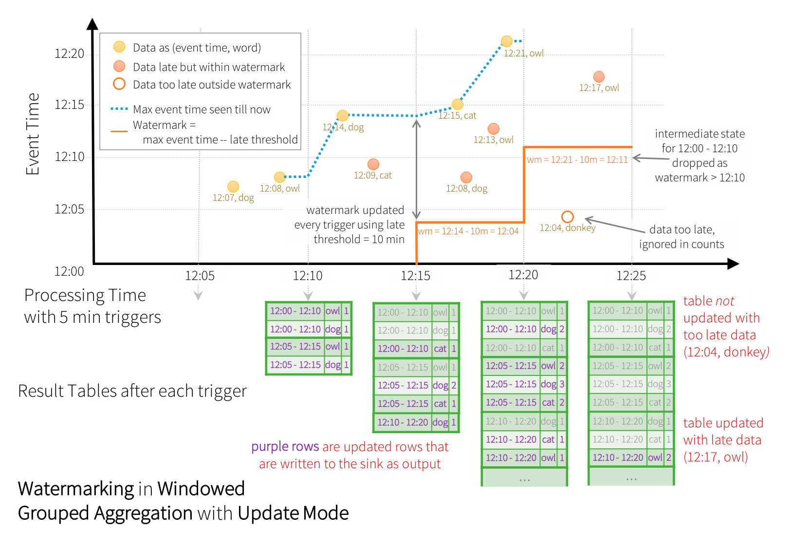
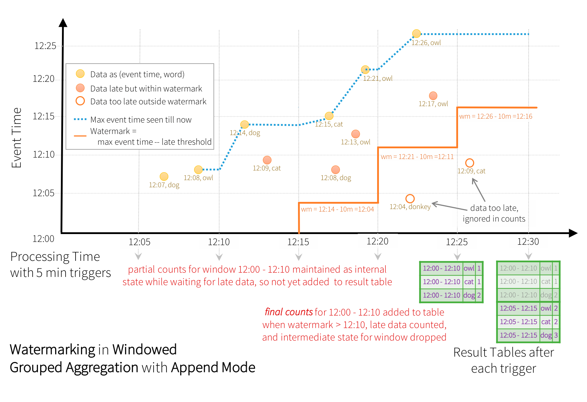

# 一、概述

从spark2.0开始，spark引入了一套新出六十计算模型，Structured Streaming。该组件进一步降低了处理数据的延迟时间，实现了exactly once语义，可以保证数据被精准消费。
Structured Streaming基于Spark SQL引擎，是一个具有弹性和容错的流式处理引擎，使用Structured Streaming处理流式计算的方式和使用批处理计算静态数据(表中的数据)的方式是一样的。
随着流数据的持续到大，SparkSQL引擎持续不断的运行并最终得到结果，我们可以使用Dataset/DataFrame API来表达流的聚合，事件-时间窗口(event-time windows)，流-批处理连接(stream-to-batch joins)等等，这些计算都是运行在被优化过得Spark SQL引擎上，最终通过checkpoint的WALs(Write-Ahead Logs)，系统保证end-to-end exactly-once。
总之，Structured Streaming提供了快速、弹性、容错，end-to-end exactly-once的流处理，而用户不需要对流进行推理(如spark streaming中流的转换操作)
默认情况下，在内部Structured Streaming查询使用微批处理引擎(miro-batch processing engine)处理，微批处理引擎把流数据当作一系列的小批job(small batch job)来处理，所以，延迟低至100毫秒。从Spark2.3开始，引入了一个新的，低延迟处理模型，Continuous Processing，延迟低至1毫秒。

# 二、案例
 * 从一个网络端口中读取数据，并统计每个单词出现的数量

```xml
<dependency>
    <groupId>org.apache.spark</groupId>
    <artifactId>spark-sql_2.11</artifactId>
    <version>2.4.3</version>
</dependency>
```
```scala
val spark: SparkSession = SparkSession
   .builder()
   .master("local[2]")
   .appName("SocketSource")
   .getOrCreate()
val lines: DataFrame = spark //输入表
   .readStream
   .format("socket") //source类型
   .option("host", "hadoop102")
   .option("port", "9999")
   .load
import spark.implicits._
val df: DataFrame = lines
   .as[String]
   .flatMap(_.split("\\W+"))
   .groupBy("value")
   .count
lines
   .as[String]
   .flatMap(_.split((" ")))
   .createOrReplaceTempView("w")
//sql的写法
val wordcount: DataFrame = spark.sql(
   """
      |select value word, count(1) count
      |from w
      |group by value
      |""".stripMargin)
//wordcount
df
   .writeStream //输出表
   .format("console") //输出目的地
   .outputMode("complete") //输出模式
   .trigger(Trigger.ProcessingTime("2 seconds"))
   .start
   .awaitTermination()
spark.stop()
```
```bash
nc -lk 9999
```

1. DF lines表示一个无界表(unbounded table)，存储着流中所有的文本数据，这个无界包含刘明为value的一列数据，数据的类型为String，而且流式文本数据中的每一行line就变成了无界表中的一行row，注意，这时我们仅仅设置了转换操作，还没有启动它，所以现在还没有收到任何数据。
2. 通过`DF.as[String]`创建DS，然后切割每行为多个单词，得到word ds包含所有的单词
3. 最后我们通过value(每个唯一的单词)进行分组得到wordCounts DF并统计每个单词的个数。wordCounts是一个流式DF，表示流中正在运行的单词数
4. 在流式数据上启动查询(接收数据和计算个数)，当数据更新时，通过`outputMode("complete")`来打印完整的计数到控制台，然后通过`.start`来启动流式计算。
5. 代码执行后，流式计算会在后台启动，查询对象`(query:StreamingQuery)`可以激活流式查询`(Streaming query)`然后通过`awaitTermination()`等待查询的终止，防止查询激活后进程退出。

# 三、编程模型
Structured Streaming核心思想:把持续不断的流式数据当做一个不断追加的表
这使得新的流式处理模型同批处理模型非常相像
我们可以表示我们的流式计算类似于作用在静态数表上的标准批处理查询
spark 在一个无界表上以增量查询的方式来运行

无界表的概念
输入表(原始数据，会丢弃))
结果表(数据是否丢弃参照输出模式)
事件事件和延迟数据
structured streaming模型中当有新的数据时，spark负责更新结果表完成exactly once
event-time在数据格式中有所体现
event-time用途广泛
超时时间和水印，引擎清楚相应的数据

容错语义
exactly once是structured streaming的主要设计目标
结构化流数据源

## 1.基本概念
### 1.1 输入表
把输入数据流当做输入表(Input Table). 到达流中的每个数据项(data item)类似于被追加到输入表中的一行



### 1.2 结果表
作用在输入表上的查询将会产生“结果表(Result Table)”. 每个触发间隔(trigger interval, 例如 1s), 新行被追加到输入表, 最终会更新结果表. 无论何时更新结果表, 我们都希望将更改的结果行写入到外部接收器(external sink)



### 1.3 输出
输出(output)即把数据写到外部存储，输出模式有3种:
1.	**Complete Mode** 整个更新的结果表会被写入到外部存储. 存储连接器负责决定如何处理整个表的写出(类似于 spark streaming 中的有转态的转换).
2.	**Append Mode** 从上次触发结束开始算起, 仅仅把那些新追加到结果表中的行写到外部存储(类似于无状态的转换). 该模式仅适用于不会更改结果表中行的那些查询. (如果有聚合操作, 则必须添加 wartemark, 否则不支持此种模式)
3.	**Update Mode** 从上次触发结束开始算起, 仅仅在结果表中更新的行会写入到外部存储. 此模式从 2.1.1 可用. 注意, Update Mode 与 Complete Mode 的不同在于 Update Mode 仅仅输出改变的那些行. 如果查询不包括聚合操作, 则等同于 

### 1.4 再说明
在案例中，lines DataFrame是“输入表”, wordCounts DataFrame 是“结果表”, 从输入表到结果表中间的查询同静态的 DataFrame 是一样的. 查询一旦启动, Spark 会持续不断的在 socket 连接中检测新的数据, 如果其中有了新的数据, Spark 会运行一个增量(incremental)查询, 这个查询会把前面的运行的 count 与新的数据组合在一起去计算更新后的 count.

)

注意, Structured Streaming 不会实现整个表. 它从流式数据源读取最新的可用数据, 持续不断的处理这些数据, 然后更新结果, 并且会丢弃原始数据. 它仅保持最小的中间状态的数据, 以用于更新结果(例如前面例子中的中间counts)

## 2.处理事件事件和延迟数据
Structured streaming 与其他的流式引擎有很大的不同. 许多系统要求用户自己维护运行的聚合, 所以用户自己必须推理数据的一致性(at-least-once, or at-most-once, or exactly-once). 在Structured streaming模型中, 当有新数据的时候, spark 负责更新结果表, 从而减轻了用户的推理工作.
Event-time 是指嵌入到数据本身的时间, 或者指数据产生的时间. 对大多数应用程序来说, 我们想基于这个时间去操作数据. 例如, 如果我们获取 IoT(Internet of Things) 设备每分钟产生的事件数, 我们更愿意使用数据产生时的时间(event-time in the data), 而不是 spark 接收到这些数据时的时间.
在这个模型中, event-time 是非常自然的表达. 来自设备的每个时间都是表中的一行, event-time 是行中的一列. 允许基于窗口的聚合(例如, 每分钟的事件数)仅仅是 event-time 列上的特殊类型的分组（grouping）和聚合（aggregation）: 每个时间窗口是一个组，并且每一行可以属于多个窗口/组。因此，可以在静态数据集和数据流上进行基于事件时间窗口（ event-time-window-based）的聚合查询，从而使用户操作更加方便。
此外, 该模型也可以自然的处理晚于 event-time 的数据, 因为spark 一直在更新结果表, 所以它可以完全控制更新旧的聚合数据，或清除旧的聚合以限制中间状态数据的大小。
自 Spark 2.1 起，开始支持 watermark 来允许用于指定数据的超时时间（即接收时间比 event-time 晚多少），并允许引擎相应的清理旧状态。

## 3.容错语义
提供端到端的exactly-once语义是 Structured Streaming 设计的主要目标. 为了达成这一目的, spark 设计了结构化流数据源, 接收器和执行引擎(Structured Streaming sources, the sinks and the execution engine)以可靠的跟踪处理的进度, 以便能够对任何失败能够重新启动或者重新处理.
每种流数据源假定都有 offsets(类似于 Kafka offsets) 用于追踪在流中的读取位置. 引擎使用 checkpoint 和 WALs 来记录在每个触发器中正在处理的数据的 offset 范围. 结合可重用的数据源(replayable source)和幂等接收器(idempotent sink), Structured Streaming 可以确保在任何失败的情况下端到端的 exactly-once 语义.

# 四、Structured Streaming数据源
Structured Streaming的使用最主要的是操作流式DF或DS
DF和DS既可以是静态有界的表也可以是流式无界表
与静态 Datasets/DataFrames 类似，我们可以使用公共入口点 SparkSession 从流数据源创建流式 Datasets/DataFrames，并对它们应用与静态 Datasets/DataFrames 相同的操作。
通过spark.readStream()得到一个DataStreamReader对象, 然后通过这个对象加载流式数据源, 就得到一个流式的 DataFrame.

spark内置的流式数据源:
1.	File source 读取文件夹中的文件作为流式数据. 支持的文件格式: text, csv, josn, orc, parquet. 注意, 文件必须放置的给定的目录中, 在大多数文件系统中, 可以通过移动操作来完成.
2.	kafka source 从 kafka 读取数据. 目前兼容 kafka 0.10.0+ 版本
3.	socket source 用于测试. 可以从 socket 连接中读取 UTF8 的文本数据. 侦听的 socket 位于驱动中. 注意, 这个数据源仅仅用于测试.
4.	rate source 用于测试. 以每秒指定的行数生成数据，每个输出行包含一个 timestamp 和 value。其中 timestamp 是一个 Timestamp类型(信息产生的时间)，并且 value 是 Long 包含消息的数量. 用于测试和基准测试.

## 1.socket source
 * 见WordCount案例

## 2.file source
```scala
val spark: SparkSession = SparkSession
   .builder()
   .master("local[2]")
   .appName("FileSource")
   .getOrCreate()
val userSchema = StructType(
   StructField("name", StringType)
         :: StructField("age", IntegerType)
         :: StructField("sex", StringType)
         :: Nil
)
val df1: DataFrame = spark
   .readStream
   .schema(userSchema)
   .csv("file/file1") //只能是目录名
val df2: DataFrame = spark
   .readStream
   .format("csv")
   .schema(userSchema)
   .load("file/file2")
df2
   //        df1
   .writeStream
   .format("console")
   .outputMode("update") //没有聚合不能使用complete
   .trigger(Trigger.ProcessingTime(0)) //立即处理
   .start
   .awaitTermination
spark.stop()
```

当文件夹被命名为 “key=value” 形式时, Structured Streaming 会自动递归遍历当前文件夹下的所有子文件夹, 并根据文件名实现自动分区.
如果文件夹的命名规则不是“key=value”形式, 则不会触发自动分区. 另外, 同级目录下的文件夹的命名规则必须一致.


```csv
tom,19,female
jack,20,male
alice,20,female
fine,22,male
```
```
+-----+---+------+----+-----+
| name|age|   sex|year|month|
+-----+---+------+----+-----+
|  tom| 19|female|2020|   11|
| jack| 20|  male|2020|   11|
| fine| 22|  male|2019|    9|
+-----+---+------+----+-----+
```
## 3.Kafka Source
### 3.1 Streaming Queries
```scala
val spark: SparkSession = SparkSession
   .builder()
   .master("local[2]")
   .appName("KafkaSource1")
   .getOrCreate()
import spark.implicits._
spark.readStream
   .format("kafka")
   .option("kafka.bootstrap.servers", "hadoop102:9092,hadoop103:9092,hadoop104:9092")
   .option("subscribe", "topic1")
   .load()
   .selectExpr("cast(value as string)")
   .as[String]
   .flatMap(_.split(" "))
   .groupBy("value")
   .count()
   .writeStream
   .format("console")
   .outputMode("update")
   .start
   .awaitTermination()
```
```bash
# 查看topic
kafka-topics.sh --zookeeper hadoop102:2181 --list
# 创建topic
kafka-topics.sh --zookeeper hadoop102:2181 --create --replication-factor 3 --partitions 1 --topic topic1
# 生产消息
kafka-console-producer.sh --broker-list hadoop102:9092 --topic topic1
# 消费消息
kafka-console-consumer.sh --bootstrap-server hadoop102:9092 --from-beginning --topic topic1
kafka-console-consumer.sh --bootstrap-server hadoop202:9092 --topic topic1 # 从最新的消费
```

### 3.2 Batch Queries
```scala
val spark: SparkSession = SparkSession
   .builder()
   .master("local[2]")
   .appName("KafkaSource2")
   .getOrCreate()
import spark.implicits._
spark
   .read
   .format("kafka")
   .option("kafka.bootstrap.servers", "hadoop102:9092,hadoop103:9092,hadoop104:9092")
   .option("subscribe", "topic1")
   //.option("startOffsets","earliest") //默认的开始offset位置为最早
   .option("startingOffsets", """{"topic1":{"0":3}}""") //json格式设置偏移位置
   .option("endingOffsets", "latest") //结束的offset位置
   .load
   //.select("value","key") //TODO 有问题???
   .selectExpr("cast(value as string)")
   .as[String]
   .flatMap(_.split(" "))
   .groupBy("value")
   .count()
   .write
   .format("console")
   .save
spark.stop()
```


## 4.Rate Source
 * 以固定的速率生成固定格式的数据, 用来测试 Structured Streaming 的性能.

```scala
val spark: SparkSession = SparkSession
   .builder()
   .master("local[2]")
   .appName("RateSource")
   .getOrCreate()
val df = spark.readStream.format("rate")
   .option("rowPerSecond", 10)
   .option("rampUpTime", 1)
   .option("numPartitions", 3)
   .load()
df.writeStream
   .format("console")
   .outputMode("update")
   .option("truncate", value = false) //默认为true，显示不全，使用省略号代替
   .start()
   .awaitTermination()
```


# 五、Streaming DF/Streaming DS 操作
我们可以在streaming DataFrames/Datasets上应用各种操作.
主要分两种: 1. 直接执行 sql 2. 特定类型的 api(DSL)

## 1.基本操作
### 1.1 弱类型API
```scala
val spark: SparkSession = SparkSession
   .builder()
   .master("local[2]")
   .appName("UnTypeOpt")
   .getOrCreate()
val peopleSchema = new StructType()
   .add("name", StringType)
   .add("age", LongType)
   .add("sex", StringType)
val peopleDF = spark.readStream
   .schema(peopleSchema)
   .json("file/json")
val df = peopleDF.select("name", "age", "sex")
   .where("age>20").groupBy("sex").sum("age")
df
   .writeStream
   .outputMode("update")
   .format("console")
   .start
   .awaitTermination()
```

### 1.2 强类型API
```scala
val spark: SparkSession = SparkSession
   .builder()
   .master("local[2]")
   .appName("TypeOpt")
   .getOrCreate()
val peopleSchema = StructType(
   StructField("name", StringType)
         :: StructField("age", LongType)
         :: StructField("sex", StringType)
         :: Nil
)
val peopleDF = spark.readStream
   .schema(peopleSchema)
   .json("file/json")
import spark.implicits._
val ds = peopleDF
   .as[People]
   .filter(_.age > 20)
   .map(_.name)
ds.writeStream
   .outputMode("update")
   .format("console")
   .start
   .awaitTermination()
case class People(val name: String, val age: Long, val sex: String)
```

### 1.3 直接执行SQL
```scala
val spark: SparkSession = SparkSession
   .builder()
   .master("local[2]")
   .appName("SqlOpt")
   .getOrCreate()
val peopleSchema = StructType(
   StructField("name", StringType)
         :: StructField("age", LongType)
         :: StructField("sex", StringType)
         :: Nil
)
val peopleDF = spark.readStream
   .schema(peopleSchema)
   .json("file/json")
peopleDF.createOrReplaceTempView("people")
val df = spark.sql(
   """
      |select sum(age)
      |from people
      |where age > 15
      |""".stripMargin)
df.writeStream
   .outputMode("update")
   .format("console")
   .start
   .awaitTermination()
spark.stop()
```

## 2.event-time窗口操作
### 2.1 window理解
在 Structured Streaming 中, 可以按照事件发生时的时间对数据进行聚合操作, 即基于 event-time 进行操作.
在这种机制下, 即不必考虑 Spark 陆续接收事件的顺序是否与事件发生的顺序一致, 也不必考虑事件到达 Spark 的时间与事件发生时间的关系.
因此, 它在提高数据处理精度的同时, 大大减少了开发者的工作量.
我们现在想计算 10 分钟内的单词, 每 5 分钟更新一次, 也就是说在 10 分钟窗口 12:00 - 12:10, 12:05 - 12:15, 12:10 - 12:20等之间收到的单词量. 注意, 12:00 - 12:10 表示数据在 12:00 之后 12:10 之前到达.
现在，考虑一下在 12:07 收到的单词。单词应该增加对应于两个窗口12:00 - 12:10和12:05 - 12:15的计数。因此，计数将由分组键（即单词）和窗口（可以从事件时间计算）索引。


```scala
val spark: SparkSession = SparkSession
   .builder()
   .master("local[*]")
   .appName("WordCount1")
   .getOrCreate()

import spark.implicits._
val lines: DataFrame = spark.readStream
   .format("socket") // 设置数据源
   .option("host", "localhost")
   .option("port", 10000)
   .option("includeTimestamp", true) // 给产生的数据自动添加时间戳
   .load

// 把行切割成单词, 保留时间戳
val words: DataFrame = lines.as[(String, Timestamp)].flatMap(line => {
   line._1.split(" ").map((_, line._2))
}).toDF("word", "timestamp")

import org.apache.spark.sql.functions._

// 按照窗口和单词分组, 并且计算每组的单词的个数
val wordCounts = words.groupBy(
   // 调用 window 函数, 返回的是一个 Column 参数 1: df 中表示时间戳的列 参数 2: 窗口长度 参数 3: 滑动步长
   window($"timestamp", "10 minutes", "5 minutes"),
   $"word"
).count()//.orderBy($"window") // 计数, 并按照窗口排序

val query: StreamingQuery = wordCounts.writeStream
   .outputMode("complete")
   .format("console")
   .option("truncate", "false") // 不截断.为了在控制台能看到完整信息, 最好设置为 false
   .start
query.awaitTermination()
```

### 2.2 window生成规则

`org.apache.spark.sql.catalyst.analysis.TimeWindowing`
```scala
// 窗口个数
maxNumOverlapping = ceil(windowDuration / slideDuration)
for (i <- 0 until maxNumOverlapping)
   windowId <- ceil((timestamp - startTime) / slideDuration)
   windowStart <- windowId * slideDuration + (i - maxNumOverlapping) * slideDuration + startTime
   windowEnd <- windowStart + windowDuration
   return windowStart, windowEnd
```
将event-time 作为“初始窗口”的结束时间, 然后按照窗口滑动宽度逐渐向时间轴前方推进, 直到某个窗口不再包含该 event-time 为止. 最终以“初始窗口”与“结束窗口”之间的若干个窗口作为最终生成的 event-time 的时间窗口.


每个窗口的起始时间与结束时间都是前必后开的区间, 因此初始窗口和结束窗口都不会包含 event-time, 最终不会被使用.

```scala
val spark: SparkSession = SparkSession
   .builder()
   .master("local[2]")
   .appName("Window1")
   .getOrCreate()
val socketDF = spark
   .readStream
   .format("socket")
   .option("host", "hadoop102")
   .option("port", 9999)
   .load
import spark.implicits._
import org.apache.spark.sql.functions._
val df: DataFrame = socketDF
   .as[String]
   .map(line => {
         val split: Array[String] = line.split(",")
         (split(0), split(1))
   })
   .toDF("ts", "word") //手动传入时间戳和word，2019-09-25 19:03:27,good
val result: Dataset[Row] = df.groupBy( //根据窗口和word分组
   window($"ts", "10 minutes", "3 minutes"), //设计窗口
   $"word"
)
   .count()
   //.groupBy($"window") //同上
   .sort("window") //只有在输出模式为complete时才可以使用排序
result
   .writeStream
   .outputMode("complete") //只在有聚合时才可以是哟个complete
   .format("console")
   .trigger(Trigger.ProcessingTime(2000)) //两秒触发一次
   .start()
   .awaitTermination()
```
```scala
val spark: SparkSession = SparkSession
   .builder()
   .master("local[2]")
   .appName("Window2")
   .getOrCreate()
import spark.implicits._
val socketDF: DataFrame = spark
   .readStream
   .format("socket")
   .option("host", "hadoop102")
   .option("port", 9999)
   .option("includeTimestamp", value = true) //自动添加时间戳
   .load
val df: DataFrame = socketDF
   .as[(String, Timestamp)]
   .flatMap(line => {
         line._1.split(",").map((_, line._2))
   }).toDF("word", "ts")
import org.apache.spark.sql.functions._
val result = df
   .groupBy(
         window($"ts", "10 minutes", "3 minutes"),
         $"word"
   )
   .count()
   .orderBy($"window")
result
   .writeStream
   .outputMode("complete")
   .format("console")
   .trigger(Trigger.ProcessingTime(2000))
   .option("truncate", false)
   .start()
   .awaitTermination()
```

## 3.watermark延时数据处理
在数据分析系统中, Structured Streaming 可以持续的按照 event-time 聚合数据, 然而在此过程中并不能保证数据按照时间的先后依次到达. 例如: 当前接收的某一条数据的 event-time 可能远远早于之前已经处理过的 event-time. 在发生这种情况时, 往往需要结合业务需求对延迟数据进行过滤.
现在考虑如果事件延迟到达会有哪些影响. 假如, 一个单词在 12:04(event-time) 产生, 在 12:11 到达应用. 应用应该使用 12:04 来在窗口(12:00 - 12:10)中更新计数, 而不是使用 12:11. 这些情况在我们基于窗口的聚合中是自然发生的, 因为结构化流可以长时间维持部分聚合的中间状态
 
但是, 如果这个查询运行数天, 系统很有必要限制内存中累积的中间状态的数量. 这意味着系统需要知道何时从内存状态中删除旧聚合, 因为应用不再接受该聚合的后期数据.
为了实现这个需求, 从 spark2.1, 引入了 watermark(水印), 使用引擎可以自动的跟踪当前的事件时间, 并据此尝试删除旧状态.
通过指定 event-time 列和预估事件的延迟时间上限来定义一个查询的 watermark. 针对一个以时间 T 结束的窗口, 引擎会保留状态和允许延迟时间直到(max event time seen by the engine - late threshold > T). 换句话说, 延迟时间在上限内的被聚合, 延迟时间超出上限的开始被丢弃.
可以通过withWatermark() 来定义watermark
watermark 计算: watermark = MaxEventTime - Threshhod
而且, watermark只能逐渐增加, 不能减少
总结:
Structured Streaming 引入 Watermark 机制, 主要是为了解决以下两个问题:
1.	处理聚合中的延迟数据
2.	减少内存中维护的聚合状态.
在不同输出模式(complete, append, update)中, Watermark 会产生不同的影响.



### 3.1 update模式
 * 在 update 模式下, 仅输出与之前批次的结果相比, 涉及更新或新增的数据
 *  初始化wartmark 是 0

```scala
val spark: SparkSession = SparkSession
   .builder()
   .master("local[*]")
   .appName("WordCountWatermark1")
   .getOrCreate()

import spark.implicits._
val lines: DataFrame = spark.readStream
   .format("socket")
   .option("host", "hadoop102")
   .option("port", 9999)
   .load

// 输入的数据中包含时间戳, 而不是自动添加的时间戳
val words: DataFrame = lines.as[String].flatMap(line => {
   val split: Array[String] = line.split(", ")
   split(1).split(" ").map((_, Timestamp.valueOf(split(0))))
}).toDF("word", "timestamp")

import org.apache.spark.sql.functions._


val wordCounts: Dataset[Row] = words
   // 添加watermark, 参数 1: event-time 所在列的列名 参数 2: 延迟时间的上限.
   .withWatermark("timestamp", "2 minutes")
   .groupBy(window($"timestamp", "10 minutes", "2 minutes"), $"word")
   .count()

val query: StreamingQuery = wordCounts.writeStream
   .outputMode("update") // complete模式下加水印没有意义
   .trigger(Trigger.ProcessingTime(1000))
   .format("console")
   .option("truncate", "false")
   .start
query.awaitTermination()
```



### 3.2 append模式
 * 在 append 模式中, 仅输出新增的数据, 且输出后的数据无法变更.
 * 只需要设置`.outputMode("append")`



### 3.3 机制总结
1.	watermark 在用于基于时间的状态聚合操作时, 该时间可以基于窗口, 也可以基于 event-timeb本身.
2.	输出模式必须是append或update. 在输出模式是complete的时候(必须有聚合), 要求每次输出所有的聚合结果. 我们使用 watermark 的目的是丢弃一些过时聚合数据, 所以complete模式使用wartermark无效也无意义.
3.	在输出模式是append时, 必须设置 watermask 才能使用聚合操作. 其实, watermask 定义了 append 模式中何时输出聚合聚合结果(状态), 并清理过期状态.
4.	在输出模式是update时, watermask 主要用于过滤过期数据并及时清理过期状态.
5.	watermask 会在处理当前批次数据时更新, 并且会在处理下一个批次数据时生效使用. 但如果节点发送故障, 则可能延迟若干批次生效.
6.	withWatermark 必须使用与聚合操作中的时间戳列是同一列.
`df.withWatermark("time", "1 min").groupBy("time2").count()` 无效
7.	withWatermark 必须在聚合之前调用.
`df.groupBy("time").count().withWatermark("time", "1 min") `无效


## 4.流数据去重
```scala
val spark: SparkSession = SparkSession
   .builder()
   .master("local[2]")
   .appName("Duplicate")
   .getOrCreate()
import spark.implicits._
//确定数据源并加载数据
val lines: DataFrame = spark
   .readStream
   .format("socket")
   .option("host", "hadoop102")
   .option("port", 9999)
   .load
//对加载的数据转成DS并处理(切割并返回信息)，
val words: DataFrame = lines.as[String].map(lines => {
   val arr: Array[String] = lines.split(",")
   (arr(0), Timestamp.valueOf(arr(1)), arr(2))
}).toDF("uid", "ts", "word") //转成DF
val wordCounts: Dataset[Row] = words
   .withWatermark("ts", "2 minutes")
   .dropDuplicates("uid") //去除重复数据，可以传递多个字段
wordCounts
   .writeStream
   .outputMode("append")
   .format("console")
   .trigger(Trigger.ProcessingTime(0))
   .start()
   .awaitTermination()
```

## 5.join操作
### 5.1 Streaming-Static join
#### 5.1.1 inner
```scala
val spark: SparkSession = SparkSession
   .builder()
   .master("local[2]")
   .appName("StreamingStatic")
   .getOrCreate()
import spark.implicits._
val arr: Array[(String, Int)] = Array(("ls", 20), ("ww", 10), ("zs", 15))
//静态df
val staticDF: DataFrame = spark.sparkContext.parallelize(arr).toDF("name", "age")
//动态df
val streamingDF: DataFrame = spark.readStream
   .format("socket")
   .option("host", "hadoop102")
   .option("port", 9999)
   .load
   .as[String]
   .map(line => {
         val splits = line.split(",")
         (splits(0), splits(1))
   })
   .toDF("name", "sex")
//内连接
val joinedDF: DataFrame = streamingDF.join(staticDF, Seq("name")) //两者的字段名不同会报异常
val rightJoinedDF = streamingDF.join(staticDF, Seq("name")) //内连接
joinedDF.writeStream //静态和流连接后为流数据
   .format("console")
   .outputMode("update")
   .start()
   .awaitTermination()
```

#### 5.1.2 outer
```scala
 val spark: SparkSession = SparkSession
   .builder()
   .master("local[2]")
   .appName("StreamingStaticOuter")
   .getOrCreate()
import spark.implicits._
val arr: Array[(String, Int)] = Array(("lis", 20), ("zs", 21), ("ww", 15))
val staticDF = spark.sparkContext.parallelize(arr).toDF("name", "age")
val streamingDF = spark
   .readStream
   .format("socket")
   .option("host", "hadoop102")
   .option("port", 9999)
   .load
   .as[String]
   .map(line => {
         val splits = line.split(",")
         (splits(0), splits(1))
   })
   .toDF("name", "sex")
//外连接，可传入连接类型，流式数据必须在左侧
val joinedDF = streamingDF.join(staticDF, Seq("name"), "left")
joinedDF
   .writeStream
   .outputMode("update")
   .format("console")
   .trigger(Trigger.ProcessingTime(0))
   .start()
   .awaitTermination()
```

### 5.2 Streaming-Streaming join
```scala
def main(args: Array[String]): Unit = {
val spark: SparkSession = SparkSession
   .builder()
   .master("local[2]")
   .appName("StreamStreamJoin")
   .getOrCreate()
import spark.implicits._
val ageDF = spark.readStream
   .format("socket")
   .option("host", "hadoop102")
   .option("port", 8888)
   .load
   .as[String]
   .map(line => {
         val splits = line.split(",")
         (splits(0), splits(1))
   })
   .toDF("name", "age")
val sexDF = spark.readStream
   .format("socket")
   .option("host", "hadoop102")
   .option("port", 9999)
   .load
   .as[String]
   .map(line => {
         val splits = line.split(",")
         (splits(0), splits(1))
   })
   .toDF("name", "sex")
val joinedDF: DataFrame = ageDF.join(sexDF, "name")
joinedDF
   .writeStream
   .outputMode("append")
   .format("console")
   .trigger(Trigger.ProcessingTime(0))
   .start()
   .awaitTermination()
```

## 6.Streaming DF/DS不支持的操作
到目前, DF/DS 的有些操作 Streaming DF/DS 还不支持.
1.	多个Streaming 聚合(例如在 DF 上的聚合链)目前还不支持
2.	limit 和取前 N 行还不支持
3.	distinct 也不支持
4.	仅仅支持对 complete 模式下的聚合操作进行排序操作
5.	仅支持有限的外连接
6.	有些方法不能直接用于查询和返回结果, 因为他们用在流式数据上没有意义.

count() 不能返回单行数据, 必须是s.groupBy().count()
foreach() 不能直接使用, 而是使用: ds.writeStream.foreach(...)
show() 不能直接使用, 而是使用 console sink
如果执行上面操作会看到这样的异常: operation XYZ is not supported with streaming DataFrames/Datasets.

<!-- TODO 验证 -->

# 六、输出结果分析
一旦定义了最终结果DataFrame / Dataset，剩下的就是开始流式计算。为此，必须使用返回的 DataStreamWriter Dataset.writeStream()。
需要指定一下选项:
1.	输出接收器的详细信息：数据格式，位置等。
2.	输出模式：指定写入输出接收器的内容。
3.	查询名称：可选，指定查询的唯一名称以进行标识。
4.	触发间隔：可选择指定触发间隔。如果未指定，则系统将在前一处理完成后立即检查新数据的可用性。如果由于先前的处理尚未完成而错过了触发时间，则系统将立即触发处理。
5.	检查点位置：对于可以保证端到端容错的某些输出接收器，请指定系统写入所有检查点信息的位置。这应该是与HDFS兼容的容错文件系统中的目录。

## 1.输出模式(output mode)
### 1.1 append模式(默认)
默认输出模式, 仅仅添加到结果表的新行才会输出.
采用这种输出模式, 可以保证每行数据仅输出一次.
在查询过程中, 如果没有使用 watermask 机制, 则不能使用聚合操作. 如果使用了 watermask 机制, 则只能使用基于 event-time 的聚合操作.
watermask 用于高速 append 模式如何输出不会再发生变动的数据. 即只有过期的聚合结果才会在 Append 模式中被“有且仅有一次”的输出.

### 1.2 complete模式
每次触发, 整个结果表的数据都会被输出. 仅仅聚合操作才支持.
同时该模式使用 watermask 无效.

### 1.3 update模式
该模式在 从 spark 2.1.1 可用. 在处理完数据之后, 该模式只输出相比上个批次变动的内容(新增或修改).
如果没有聚合操作, 则该模式与 append 模式一直. 如果有聚合操作, 则可以基于 watermast 清理过期的状态.

### 输出模式总结
 * 略

## 2.输出接收器(output sink)
### 2.1 file sink
 * 存储输出到目录中 仅仅支持 append 模式

```scala
//把单词和单词的反转组成 json 格式写入到目录中.
val spark: SparkSession = SparkSession
   .builder()
   .master("local[1]")
   .appName("Test")
   .getOrCreate()
import spark.implicits._

val lines: DataFrame = spark.readStream
   .format("socket") // 设置数据源
   .option("host", "localhost")
   .option("port", 10000)
   .load

val words: DataFrame = lines.as[String].flatMap(line => {
   line.split("\\W+").map(word => {
         (word, word.reverse)
   })
}).toDF("原单词", "反转单词")

words.writeStream
   .outputMode("append")
   .format("json") //  // 支持 "orc", "json", "csv"
   .option("path", "./filesink") // 输出目录
   .option("checkpointLocation", "./ck1")  // 必须指定 checkpoint 目录
   .start
   .awaitTermination()
```
### 2.2 kafka sink
写入到 kafka 的时候应该包含如下列:
| Column           | Type             |
| ---------------- | ---------------- |
| key (optional)   | string or binary |
| value (required) | string or binary |
| topic (optional) | string           |

注意:
1.	如果没有添加 topic option 则 topic 列必须有.
2.	kafka sink 三种输出模式都支持

#### 2.2.1 Stream方式输出数据
```scala
def main(args: Array[String]): Unit = {
val spark: SparkSession = SparkSession
   .builder()
   .master("local[1]")
   .appName("Test")
   .getOrCreate()
import spark.implicits._

val lines: DataFrame = spark.readStream
   .format("socket") // 设置数据源
   .option("host", "localhost")
   .option("port", 10000)
   .load

val words = lines.as[String]
         .flatMap(_.split("\\W+"))
         .groupBy("value")
         .count()
         .map(row => row.getString(0) + "," + row.getLong(1))
         .toDF("value")  // 写入数据时候, 必须有一列 "value"

words.writeStream
   .outputMode("update")
   .format("kafka")
   .trigger(Trigger.ProcessingTime(0))
   .option("kafka.bootstrap.servers", "hadoop102:9092,hadoop103:9092,hadoop104:9092") // kafka 配置
   .option("topic", "topic1") // kafka 主题
   .option("checkpointLocation", "./ck1")  // 必须指定 checkpoint 目录
   .start
   .awaitTermination()
```
```bash
kafka-console-consumer.sh --bootstrap-server hadoop102:9092 --topic topic1
```
#### 2.2.2 以batch方式输出数据
```scala
val spark: SparkSession = SparkSession
   .builder()
   .master("local[1]")
   .appName("Test")
   .getOrCreate()
import spark.implicits._
val arr: Array[String] = Array("hello,hello,tian", "tian,hello")
val wordCount: DataFrame = spark
            .sparkContext
            .parallelize(arr.flatMap(_.split("\\W+")))
            .toDF("word")
   .toDF("word")
   .groupBy("word")
   .count()
   .map(row => row.getString(0) + "," + row.getLong(1))
   .toDF("value")  // 写入数据时候, 必须有一列 "value"

wordCount.write  // batch 方式
   .format("kafka")
   .option("kafka.bootstrap.servers", "hadoop102:9092,hadoop103:9092,hadoop104:9092") // kafka 配置
   .option("topic", "update") // kafka 主题
   .save()
```

### 2.3 console sink
 * 主要用于输出到控制台测试，略

### 2.4 memory sink
该 sink 也是用于测试, 将其统计结果全部输入内中指定的表中, 然后可以通过 sql 与从表中查询数据.
如果数据量非常大, 可能会发生内存溢出.

```scala
val spark: SparkSession = SparkSession
   .builder()
   .master("local[2]")
   .appName("MemorySink")
   .getOrCreate()
import spark.implicits._

val lines: DataFrame = spark.readStream
   .format("socket") // 设置数据源
   .option("host", "localhost")
   .option("port", 10000)
   .load

val words: DataFrame = lines.as[String]
   .flatMap(_.split("\\W+"))
   .groupBy("value")
   .count()

val query: StreamingQuery = words.writeStream
   .outputMode("complete")
   .format("memory") // memory sink
   .queryName("word_count") // 内存临时表名
   .start

// 测试使用定时器执行查询表
val timer = new Timer(true)
val task: TimerTask = new TimerTask {
   override def run(): Unit = spark.sql("select * from word_count").show
}
timer.scheduleAtFixedRate(task, 0, 2000)

query.awaitTermination()
```

### 2.5 foreach sink
foreach sink 会遍历表中的每一行, 允许将流查询结果按开发者指定的逻辑输出

```xml
<dependency>
    <groupId>mysql</groupId>
    <artifactId>mysql-connector-java</artifactId>
    <version>5.1.27</version>
</dependency>
```
```sql
create database ss;
use ss;
create table word_count(word varchar(255) primary key not null, count bigint not null);
```
```scala
val spark: SparkSession = SparkSession
   .builder()
   .master("local[2]")
   .appName("ForeachSink")
   .getOrCreate()
import spark.implicits._

val lines: DataFrame = spark.readStream
   .format("socket") // 设置数据源
   .option("host", "hadoop102")
   .option("port", 9999)
   .load

val wordCount: DataFrame = lines.as[String]
   .flatMap(_.split("\\W+"))
   .groupBy("value")
   .count()

val query: StreamingQuery = wordCount.writeStream
   .outputMode("update")
   // 使用 foreach 的时候, 需要传递ForeachWriter实例, 三个抽象方法需要实现. 每个批次的所有分区都会创建 ForeeachWriter 实例
   .foreach(new ForeachWriter[Row] {
         var conn: Connection = _
         var ps: PreparedStatement = _
         var batchCount = 0
         
         // 一般用于 打开链接. 返回 false 表示跳过该分区的数据,
         override def open(partitionId: Long, epochId: Long): Boolean = {
            println("open ..." + partitionId + "  " + epochId)
            Class.forName("com.mysql.jdbc.Driver")
            conn = DriverManager.getConnection("jdbc:mysql://hadoop201:3306/ss", "root", "aaa")
            // 插入数据, 当有重复的 key 的时候更新
            val sql = "insert into word_count values(?, ?) on duplicate key update word=?, count=?"
            ps = conn.prepareStatement(sql)
            
            conn != null && !conn.isClosed && ps != null
         }
         
         // 把数据写入到连接
         override def process(value: Row): Unit = {
            println("process ...." + value)
            val word: String = value.getString(0)
            val count: Long = value.getLong(1)
            ps.setString(1, word)
            ps.setLong(2, count)
            ps.setString(3, word)
            ps.setLong(4, count)
            ps.execute()
         }
         
         // 用户关闭连接
         override def close(errorOrNull: Throwable): Unit = {
            println("close...")
            ps.close()
            conn.close()
         }
   })
   .start

query.awaitTermination()
```

### 2.6 ForeachBatch sink
ForeachBatch Sink 是 spark 2.4 才新增的功能, 该功能只能用于输出批处理的数据.

```scala
val spark: SparkSession = SparkSession
   .builder()
   .master("local[2]")
   .appName("ForeachBatchSink")
   .getOrCreate()
import spark.implicits._

val lines: DataFrame = spark.readStream
   .format("socket") // 设置数据源
   .option("host", "hadoop201")
   .option("port", 10000)
   .load

val wordCount: DataFrame = lines.as[String]
   .flatMap(_.split("\\W+"))
   .groupBy("value")
   .count()

val props = new Properties()
props.setProperty("user", "root")
props.setProperty("password", "aaa")
val query: StreamingQuery = wordCount.writeStream
   .outputMode("complete")
   .foreachBatch((df, batchId) => {  // 当前分区id, 当前批次id
         if (df.count() != 0) {
            df.cache()
            df.write.json(s"./$batchId")
            df.write.mode("overwrite").jdbc("jdbc:mysql://hadoop201:3306/ss", "word_count", props)
         }
   })
   .start()
query.awaitTermination()
```

# 七、Trigger(触发器)
流式查询的触发器定义了流式数据处理的时间, 流式查询根据触发器的不同, 可以是根据固定的批处理间隔进行微批处理查询, 也可以是连续的查询.

```scala
// 1. 默认触发器
val query: StreamingQuery = df.writeStream
    .outputMode("append")
    .format("console")
    .start()
// 2. 微批处理模式
val query: StreamingQuery = df.writeStream
        .outputMode("append")
        .format("console")
        .trigger(Trigger.ProcessingTime("2 seconds"))
        .start

// 3. 只处理一次. 处理完毕之后会自动退出
val query: StreamingQuery = df.writeStream
        .outputMode("append")
        .format("console")
        .trigger(Trigger.Once())
        .start()
        
// 4. 持续处理
val query: StreamingQuery = df.writeStream
    .outputMode("append")
    .format("console")
    .trigger(Trigger.Continuous("1 seconds"))
    .start
```

## 连续处理模式(Continuous processing)
连续处理是2.3 引入, 它可以实现低至 1ms 的处理延迟. 并实现了至少一次(at-least-once)的语义.
微批处理模式虽然实现了严格一次(exactly-once)的语义, 但是最低有 100ms 的延迟.
对有些类型的查询, 可以切换到这个模式, 而不需要修改应用的逻辑.(不用更改 df/ds 操作)
若要切换到连续处理模式, 只需要更改触发器即可.

```scala
spark
  .readStream
  .format("rate")
  .option("rowsPerSecond", "10")
  .option("")

spark
  .readStream
  .format("kafka")
  .option("kafka.bootstrap.servers", "host1:port1,host2:port2")
  .option("subscribe", "topic1")
  .load()
  .selectExpr("CAST(key AS STRING)", "CAST(value AS STRING)")
  .writeStream
  .format("kafka")
  .option("kafka.bootstrap.servers", "host1:port1,host2:port2")
  .option("topic", "topic1")
  .trigger(Trigger.Continuous("1 second"))  // only change in query
  .start()
```

### 连续处理模式支持的查询
>**操作**
支持 select, map, flatMap, mapPartitions, etc. 和 selections (where, filter, etc.)不支持聚合操作

>**数据源**
kafka 所有选项都支持
rate source

>**sink**
所有的 kafka 参数都支持
memory sink
console sink
