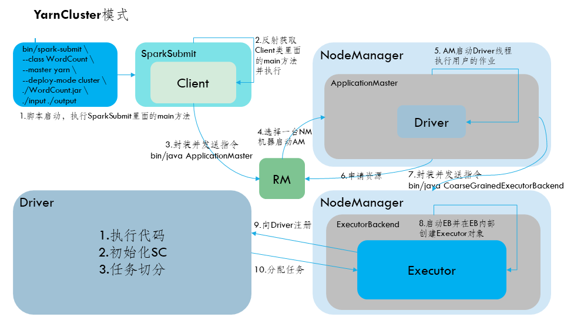

#### 1.简述Spark任务切分流程
由于 Spark 的懒执行, 在驱动程序调用一个action之前, Spark 应用不会做任何事情.
**针对每个 action, Spark 调度器就创建一个执行图(execution graph)和启动一个 Spark job**
每个 job 由多个stages 组成, 这些 stages 就是实现最终的 RDD 所需的数据转换的步骤. 一个宽依赖划分一个 stage.
每个 stage 由多个 tasks 来组成, 这些 tasks 就表示每个并行计算, 并且会在多个执行器上执行.

RDD任务切分中间分为Application、Job、Stage和Task
1. Application: 初始化一个SparkContext即生成一个Application
2. Job: 一个Action算子就会生成一个Job
3. Stage: 根据RDD之间的依赖关系的不同将Job划分成不同的Stage，遇到一个宽依赖划分一个Stage
4. Task: Stage是一个TaskSet，将Stage划分的结果发送到不同的Executor执行即为一个Task
 * 注意: Application -> Job -> Stage -> Task 每一层都是1对n的关系


#### 2.请列举Spark的transformation算子(不少于8个)，简述功能
 * `map(func)` 按照func对RDD中的每个元素进行转换得到新的RDD，用于改变RDD的数据结构类型
 * `mapPartitions(func)` 类似于map，但独立地在RDD的每一个分片上运行，`Iterator[T] => Iterator[U]`，每个分区执行一次func操作
 * `mapPartitionsWithIndex(func)` 和mapPartitions(func)类似. 但是会给func多提供一个Int值来表示分区的索引
 * `flatMap(fun)` 类似于map，但是每一个输入元素可以被映射为0或多个输出元素，func返回一个序列
 * `glom()` 将每一个分区的元素合并成一个数组，形成新的 RDD 类型是`RDD[Array[T]`
 * `groupBy(func)` 按照func的返回值进行分组
 * `filter(func)` 过滤，返回func返回值为true的元素组成的RDD
 * `coalesce(numPartitions)` 缩减分区数到指定数量
 * `repartition(numPartitions)` 根据新的分区数重新shuffle数据，分区数可以增多或减少
 * `reduceByKey(func, [numTask])` 在一个(K, V)的RDD上调用，返回一个(K, V)的RDD，使用reduce函数，将相同key的值聚合到一起，reduce任务的个数可以通过第二个可选的参数来设置
 * `aggregateByKey(zeroValue:U,[partition:Partitioner])(seqOp:(U,V)=>U,combOp:(U,U)=>U)` 在kv对的RDD中，按key将value进行分组合并，合并时，将每个value和初始值作为seq函数的参数，进行计算，返回的结果作为一个新的kv对，然后再将结果按照key进行合并，最后将每个分组的value传递给combine函数进行计算(先将前两个value进行计算)，将返回结果和下一个value传给combine函数，以此类推)，将key与计算结果作为一个新的kv输出。
 * `combineByKey(createCombiner:V=>C, mergeValue:(C,V)=>C,mergeCombiners:(C,C)=>C)` 对相同K，把V合并成一个集合

#### 3.请列举Spark的action算子(不少于6个)，简述功能
 * `reduce(func)` 通过func函数聚集RDD中的所有元素，先聚合分区内数据，再聚合分区间数据
 * `collect` 以数组的形式返回RDD中的所有元素，所有的的数据都会被拉到driver端，慎用(OOM)
 * `first` 返回RDD中前n个元素组成的数组
 * `take(n)` 返回RDD中前n个元素组成的数组
 * `count` 返回RDD中元素的个数
 * `foreach(func)` 对每个RDD执行一次func
 * `aggregate[U: ClassTag](zeroValue: U)(seqOp: (U, T) => U, combOp: (U, U) => U)` aggregate函数将每个分区里面的元素通过seqOp和初始值进行聚合，然后用combine函数将每个分区的结果和初始值(zeroValue)进行combine操作。这个函数最终返回的类型不需要和RDD中元素类型一致，zeroValue会在分区内聚合和分区间聚合各使用一次
 * `fold` 折叠操作，aggregate的简化操作，seqop和combop一样的时候，可使用fold
 * `countByKey()`针对(K,V)类型的 RDD，返回一个(K,Int)的map，表示每一个key对应的元素个数，用于查看数据是否倾斜
 * `saveAsTextFile(path)` 将数据集的元素以textfile的形式保存到指定文件系统
 * `saveAsSequenceFile(path)` 将数据集的元素以Hadoop sequenceFile的形式保存到Hadoop支持的文件系统

#### 4.Spark常用算子reduceByKey与groupByKey的比较，哪种更有优势
 * reduceByKey 按照key进行聚合，在shuffle之前有预聚合操作返回结果为`RDD[k,v]`
 * groupByKey 按照key进行分组，直接shuffle
 * 在不影响业务逻辑的前提下，reduceByKey更具有优势


#### 5.当Spark涉及到数据库的操作时如何减少连接次数
 * 使用foreachPartition算子代替foreach，每个分区获取一次连接

#### 6.SparkStreaming窗口操作的原理
 * 窗口函数就是在原来定义的SparkStreaming计算批次大小的基础上再次进行封装，每次计算多个批次的数据，同时还需要传递一个滑动步长的参数，用来设置当次计算任务完成之后下一次从什么地方开始计算
<!-- TODO 绘图表示窗口长度和滑动步长 -->


#### 7.Spark中的共享变量(广播变量和累加器)的基本原理和用途
 * 累加器(accumulator)是spark中提供的一种分布式的变量机制，其原理类似于mapreduce，即分布式的改变，然后聚合这些改变
 * 累加器主要用于累加计数性质，广播变量主要用于高效的分发较大的对象
 * Spark中在做map或者filter时，executor都会用到driver中的变量，而每个节点上操作这些变量不会真正改变driver中的值
 * 累加器和广播变量主要用于结果聚合和广播这两种通信模式

    **累加器**
 * 分布式运行，driver发给executor的是变量的值，在executor运算和driver的值无关
 * 累加器实现了共享变量的修改
 * 累加器只在行动算子中使用，不在转换算子中使用

    **广播变量**
 * 当driver传递给executor变量只用于读取时
 * 同一个进程的每一个task线程都有一个变量，数据冗余，占用内存
 * 广播变量不直接发给每个task线程，而是直接发到executor，task线程共享变量
 * 极大的优化了内存的占用

#### 8.简述Spark的架构与作业提交流程(以yarn-cluster为例)，画图并注明各部分作用

1. 执行脚本提交任务，实际是启动一个SparkSubmit的JVM进程
2. SparkSubmit类中的main方法反射调用Client的main方法
3. Client创建Yarn客户端，然后Yarn发送执行指令`bin/java ApplicationMaster`
4. Yarn框架收到指令后会在指定的NM中启动ApplicationMaster
5. ApplicationMaster启动Driver线程，执行用户的作业
6. AM向RM注册，申请资源
7. 获取资源后AM向NM发送指令，`bin/java CoarseGrainedExecutorBackend`
8. ExecutorBackend进程会接受消息，启动计算对象Executor并跟Driver通信，注册已经启动的Executor
9. Driver分配任务并监控任务的执行

 * *SparkSubmit、ApplicationMaster和CoarseGrainedExecutorBacken是独立的进程，Client和Driver是独立的线程，Executor是一个对象*

#### 9.手写Wordcount的Spark代码实现(scala)
```scala
val conf:SparkConf=new SparkConf().setMaster("local[*]").setAppName("WordCount")
val sc=new SparkContext(conf)
sc.textFile("/input")
  .flatMap(_.split"\\W+")
  .map((_,1))
  .reduceByKey(_+_)
  .saveAsTextFile("/output")
sc.stop()
```

#### 10.Spark优化
**常规性能优化**
 * 最优资源配置，尽量将任务分配的资源调节到可以使用的资源的最大限度
 * RDD优化，使用RDD复用，持久化以及尽早使用filter增加效率
 * 并行度调节，调节各个Stage的task数量(并行度)和资源相匹配，task数量应为Spark作业总core数量的2~3倍
 * 广播大变量，对于每个executor都要使用的大变量使用广播变量，减少内存消耗
 * Kryo序列化，性能比Java序列化的性能高出十倍左右
 * 调节本地化等待时长，`val conf=new SparkConf().set("spark.locality.wait","6")`

**算子调优**
 * mapPartitions，在每个分区数据量不是特别大时(不会发生OOM)，使用mapPartitions()能够增大效率
 * foreachPartition优化数据库操作，一分区为单位进行操作能够减少连接次数
 * filter和coalesce的配合使用，压缩partition数量，而且让每个Partition的数据量均匀紧凑
 * repartition解决SparkSQL低并行度问题
 * reduceByKey预聚合，在map端使用预聚合能够减小reduce端的压力，提升性能

**Shuffle调优**
 * 调节map端缓冲区大小，避免频繁的磁盘IO
 * 调节reduce端拉取数据缓冲区大小，适当增加可以减少拉取数据次数，从而减少网络传输次数，提升性能
 * 调节reduce端拉取数据重试次数，对于包含特别耗时的shuffle操作的job，增加重试次数可以防止full gc和网络不稳定导致的数据拉取失败问题
 * 调节reduce端拉取数据等待间隔，适当增大间隔可以增加shuffle的稳定性
 * 调节SortShuffle排序操作阈值，使用SortShuffleManager时，且不需要排序操作可调大`spark.shuffle.sort.bypassMergeThreshold` 减少排序的性能开销

**JVM调优**
 * 降低cache操作的内存占比，为task执行算子腾出更多的内存
 * 调节Executor堆外内存，防止OOM
 * 调节连接等待时长，防止文件拉取失败和文件lost等问题
